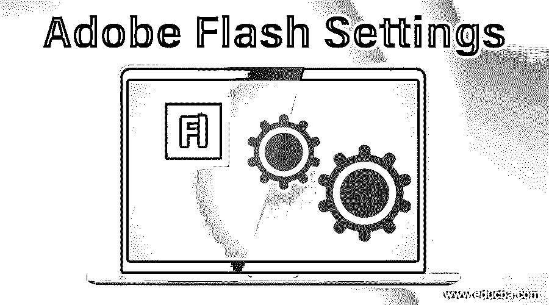
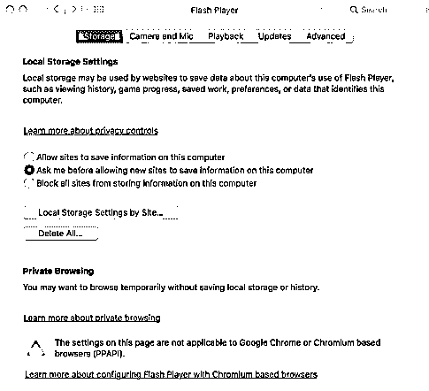
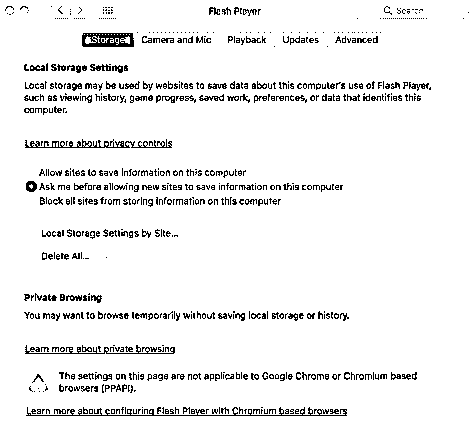
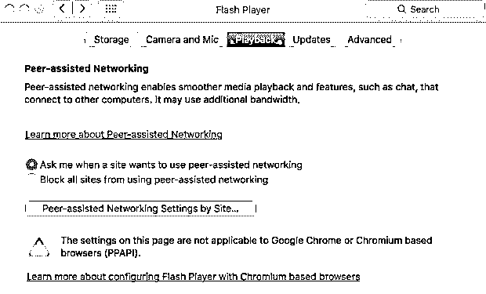
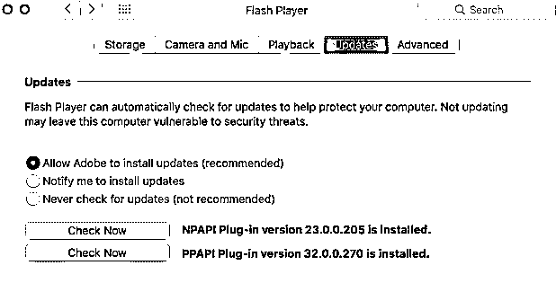
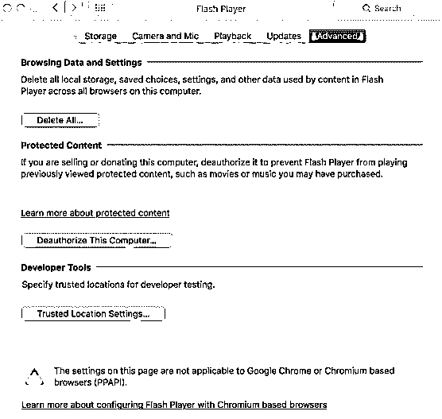

# Adobe Flash 设置

> 原文：<https://www.educba.com/adobe-flash-settings/>

## Adobe Flash 设置简介

可以在 Mac 的“系统偏好设置”和 Windows 的“控制面板”中读取 Adobe Flash 设置。本机 Flash Player 设置管理器，位于您的操作系统本地。

*   **对于 Mac:** 系统偏好>点击 Flash Player。
*   **对于 Windows:** 点击开始>设置>控制面板> Flash Player。

Adobe 致力于为您提供在 Adobe Flash Player 中管理 FLV 或 SWF 内容和软件的替代方案。Flash Player 设置管理器允许您控制全局隐私设置、安全设置和存储设置。

<small>3D 动画、建模、仿真、游戏开发&其他</small>

### 各种 Adobe Flash 设置

设置管理器是一个重要的管理面板，它可以在您的本地计算机上运行，但需要在 Adobe 网站中注册和读取[。Adobe 无法访问您在设置管理器中观察到的设置或您系统上的任何个人数据。](https://www.educba.com/adobe-speedgrade/)

以下是 Adobe Flash 设置面板中可用的设置:

#### 1.隐私设置

在 Flash Player 中运行的软件可能需要访问您计算机上的麦克风和/或摄像头。隐私设置允许您定义是否需要特定网站的软件才能访问。请记住，是制作了您用来寻求此类访问的软件的个人或组织，而不是 Adobe(除非 Adobe 制作了需要访问您的麦克风或摄像头的软件)。

要求访问的人或组织有责任让你明白他们为什么要求访问，以及他们打算如何利用视频或音频。你应该注意任何要求视频或音频访问的人的隐私政策。

有两个选项可供您选择，您可以让网站询问您是否可以使用摄像头或麦克风，或者阻止所有网站使用摄像头和麦克风。重要的是要认识到，即使这个设置面板是 Flash Player 的一部分，视频和音频也会被第三方制作的软件使用。

#### 2.存储设置

在 Flash Player 中工作的软件可能需要在您的计算机上保留一些数据，但是它们可以保留的负载被限制为 100 千字节，除非您同意授予额外的空间。本地存储设置允许您定义特定网站的软件可以用来在您的电脑上保存数据的磁盘空间量(如果有)。请记住，是制作了您用来寻求此类访问的软件的个人或组织，而不是 Adobe(除非 Adobe 制作了需要访问您的麦克风或摄像头的软件)。

在“存储设置”中，您可以选择允许站点在您的电脑上存储信息，或者您可以让站点在允许它们在您的电脑上存储信息之前询问您。第三个选择是阻止所有网站在你的电脑上存储信息。

#### 3.安全设置

Adobe 已经创建了 Flash Player 来传递安全设置，在大多数情况下不需要您单独允许或拒绝访问。随着时间的推移，随着 FLV 和 SWF 内容变得越来越先进，Flash Player 也变得越来越先进，为消费者提供了额外的隐私和安全保护。但是，您有时可能会遇到利用旧的安全规则生成的旧的 FLV 或 SWF 内容。在这些情况下，Flash Player 会要求您做出选择:您可以允许内容按照制作者计算的那样工作，利用旧的安全规则，或者您可以选择实施新的、严格的规则。最后一种方法有助于确保您只观看或播放满足最新安全标准的内容，但它有时可能会使较旧的 FLV 或 SWF 内容无法正常工作。

#### 4.回放设置

互联网上的一些信息由信息提供者利用 Adobe Flash Access 进行保护。为了保存这些受保护的信息，消费者必须首先从信息提供者那里获得信息许可证。例如，当您租赁或购买受保护的信息时，这些信息许可证会自动下载到您的系统中。Flash Player 会在您的系统上保留这些许可证。

#### 5.对等辅助网络设置

如果播放类似信息的消费者分割他们的带宽，则向您的系统提供视频和音频的网站可以更好地分发信息。分割带宽允许视频或音频更均匀地播放，没有暂停或跳过缓冲。这被定义为对等辅助网络，因为网络上的对等体相互帮助以提供更好的体验。Flash Player 仅在您同意的情况下使用对等网络来分割带宽。

如果您认可这种选择，您就不同意在软件要求您使用带宽时分割带宽。你只允许软件询问你是否需要分割你的带宽。在大多数情况下，只有在使用最高速度的互联网连接时，您才希望分割带宽。

这里你还有两个选择，让站点询问你是否使用对等网络，或者阻止所有站点使用对等网络。

#### 6.更新设置

您可以允许 Adobe 安装更新或通知您安装更新或从不检查更新。

#### 7.高级设置

在这里，您可以更改您的浏览数据和设置、受保护的内容和开发工具。您可以删除计算机上所有浏览器中 flash player 内容使用的所有本地存储、保存的设置、选项和其他信息。您可以为开发人员测试指定可信位置。

### 结论

通过这种方式，我们可以定义网站在使用您的麦克风或摄像头之前是否必须请求您的同意，定义您尚未浏览的网站可以用来保存系统上的数据的磁盘空间负载，观察或更改您的安全设置，定义 Flash Player 是否应该检查更新版本以及检查更新版本的频率，观察或更改您先前浏览的网站的隐私设置，观察或更改您先前浏览的网站的存储设置，观察或更改受保护的媒体设置，以及观察或更改对等辅助网络设置。

### 推荐文章

这是 Adobe Flash 设置指南。在这里，我们将详细讨论 adobe flash 中的简介和各种设置。您也可以阅读以下文章，了解更多信息——

1.  [什么是 Adobe InDesign](https://www.educba.com/what-is-adobe-indesign/)
2.  [Flash 工具](https://www.educba.com/flash-tools/)
3.  [安装 Flash](https://www.educba.com/install-flash/)
4.  [Adobe After Effects 插件](https://www.educba.com/adobe-after-effects-plugins/)

