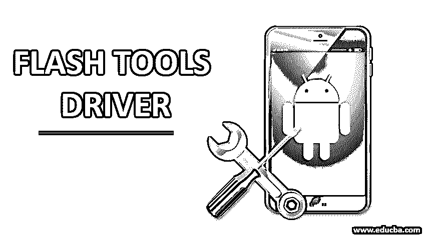

# Flash 工具驱动程序

> 原文：<https://www.educba.com/flash-tools-driver/>

## Flash 工具驱动程序简介

在本文中，我们将学习 Flash Tools 驱动程序。SP Flash Tool 可以认为是智能手机 Flash Tool 的缩写形式，是一款基于 Windows 的软件。这个应用程序有助于在你的电脑和安卓设备之间架起一座桥梁。这是一个跨平台的软件，可以用来快速定制恢复，纠正硬砖小工具，和股票 ROM。SP flash tool 可以说是一款非常人性化的应用，它可以对酷派、Tecno、金立、Micromax 等股票小工具进行 flash 处理。需要考虑的重要事实是，SP 闪存工具只能闪存基于 MTK(联发科)的智能手机。

可以肯定的是，SP flash 工具是[计算机软件](https://www.educba.com/types-of-computer-software/)，借助它你可以获得你的 Android 设备的全部权限。你有管理和调整内部文件的命令，如果你的[安卓操作系统](https://www.educba.com/android-operating-system/)出现问题，你可以保留完整的安卓系统。除此之外，SP [flash 工具](https://www.educba.com/flash-tools/)为你提供了如此多的有利事实，无论你何时使用你的 android 设备都可以利用。

<small>网页开发、编程语言、软件测试&其他</small>

### 驱动中有哪些 Flash 工具？

SP 闪存工具是最珍贵的设备中的一个特殊的工具，它授权你标记你的股票只读存储器，自定义恢复，一些时间还可以用来执行无数其他重要的功能，如激活你的手机的工作结构和解锁你的手机。这款智能手机或 SP 闪存设备只能在基于联发科技的 Android 设备上运行，因此在下载和尝试使用这款产品之前，请确保您已经了解了这种工作结构。

### Flash 工具的功能

Sp Flash 工具等 Flash 工具可帮助您实现以下功能:

*   它允许你刷新分散在基于 MTK 的 Android 设备上的固件。它还允许您在短时间内升级或降级您的设备固件，几乎没有任何点击。
*   它允许您将自定义恢复刷新到基于 MTK 的设备上。只需在 SP 闪存工具中添加散布文件，并发现 recovery.img 文件，然后对其进行闪存。
*   它允许消费者检查和确认外部存储器上的随机存取存储器(RAM)和小工具上的 NAND 闪存。
*   它允许消费者在小工具上读写参数。例如，消费者可以简单地读写一次性编程区域的功能信息。
*   它允许消费者格式化运行联发科芯片组的安卓手机。只需把分散的文件堆起来，把你的手机和电脑连接起来，点击格式化按钮。
*   有一个绝对的备份总是需要的，以防你的 android 系统出现任何问题。所以 SP flash 工具为你提供了对你的小工具进行绝对备份的能力，然后你可以随时重新安装它们，让你的手机像以前一样工作。
*   市场上有许多非官方发布的最新版本的 android 系统，你如何能在你的小工具上获得更新？简单的答案是，只要在你的小工具上安装一个 SP flash 工具，你就可以为你的 a
*   当你正在接受你的小工具上的所有东西时，有可能一个不正确的动作就把你的小工具弄坏了。因此，为了避免 SP flash 工具帮助你，你将能够通过下载和安装授权的固件来解除你的 android 设备的锁定。
*   它使用起来非常简单、快捷和直接。
*   要使用它，你不需要任何额外的硬件。
*   它在 Linux 和 Windows 上受支持。
*   它需要很少的资源

### 如何使用 SP Flash 工具？

SP flash tool 被认为是一个非常用户友好的应用程序，使其易于使用。它通常不会专注于非常合格的部分，因此您不必成为专家来了解工具和过程。您可以通过对该工具的简单了解来开始这一过程，下面是使用 SP 闪存工具的指导原则:

*   首先要做的是以 zip 格式下载所有需要的文件。
*   下载文件后，打开。exe 文件的 SP 闪存工具，堆栈分散文件，并确保所有的框都没有选中。
*   接下来，您必须从列表中单击恢复框，并将恢复映像堆叠在您的小工具上。
*   一旦你这样做，你会得到一个通知，检查恢复框正确。在这之后，恢复图像的位置也将被感知。
*   下一步是关闭你的小工具，链接你的小工具，点击下载按钮。完成后，SP 闪存工具将开始其程序，并为您继续完成剩余的任务。

### 使用 Flash 工具需要的东西

以下是使用 flash 工具的要求:

*   你需要一台笔记本电脑或个人电脑，这是基本要求。
*   另一个要求是小工具的 USB 数据线。
*   你需要 USB-VCOM，联发科这样的驱动。
*   您将需要刷新分散文件和其他文件。
*   需要做的一件非常重要的事情是备份小工具。
*   最后就是从可靠的资源下载 SP flash 工具。

### 结论

SP flash 工具非常适合 android CDC 驱动程序。如果 android CDC 驱动程序不适合你，那么你可以使用 android VCOM 驱动程序，它也可以帮助所有联发科设备。SP MDT 工具是 SP flash 工具的最佳替代品。两者都由联发科公司正式交付，并辅助所有联发科平板电脑和智能手机。SP FlashTool 是联发科 android flash 的最佳建议，可辅助所有联发科 ROM 修订版。因此，这是一个完全免费的工具，可以百分之百安全地下载和处理。

### 推荐文章

这是一个 Flash 工具驱动程序的指南。在这里，我们讨论什么是驱动程序中的 Flash 工具，功能以及使用它的要求。您也可以浏览我们的其他相关文章，了解更多信息——

1.  [Android 中的 OpenGL](https://www.educba.com/opengl-in-android/)
2.  [Flash 中的动画](https://www.educba.com/animation-in-flash/)
3.  [Flash 工具](https://www.educba.com/flash-tools/)
4.  [Adobe Flash 中的动画](https://www.educba.com/animation-in-adobe-flash/)

