# Adobe Flash 中的动画

> 原文：<https://www.educba.com/animation-in-adobe-flash/>

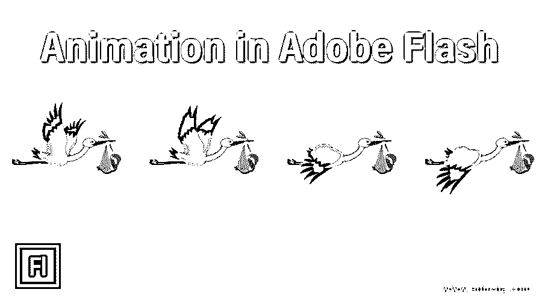

## Adobe Flash 中的动画简介

Adobe Flash 是 Adobe 的软件之一，通过使用其令人兴奋的功能来制作不同类型的动画作品。这个软件的工作和工具有点类似于 Adobe Illustrator 和 Adobe Photoshop 软件。根据我们的说法，动画可以定义为给物体添加运动，以移动或改变其属性。这里在这个软件中，我们将通过一个 2d 形状的例子来理解动画，并理解这个软件的不同部分的参数，包括这个主题。用这个软件制作动画很容易。所以让我们开始学习吧。

### 如何在 Adobe Flash 中制作动画？

我们可以通过使用该软件的一些功能和关键帧，在该软件中制作任何物体或任何设计形状的动画。但是在讨论这个话题之前，让我们先看看这个软件的工作界面，这样我们在整篇文章中都不会有问题。

<small>3D 动画、建模、仿真、游戏开发&其他</small>

**步骤 1:** 一旦您启动该软件，该屏幕将在您的个人电脑上打开，并显示弹出窗口。从该窗口中选择 Flash 文件(ActionScript 3.0)选项。

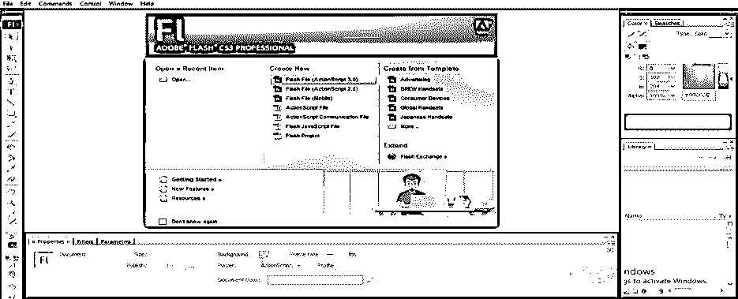

**第二步:**一旦你点击了这个选项，你的工作窗口就会像这样被激活。

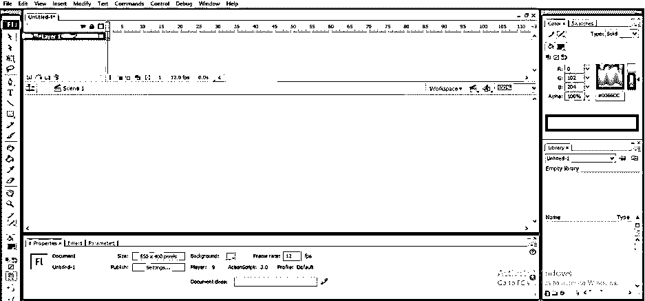

该工作屏幕有许多部分，例如在顶部的菜单栏中有不同的子菜单，用于在该软件中进行不同的调整。在它的下面，我们有一个时间线部分来处理动画的参数，还有一个层部分在左边，显示你当前工作中使用的层数；在这个部分下面，我们有工作窗口，我们称之为场景，在这个窗口中你可以绘制你的对象，在这个窗口的左边，我们有一个工具面板，它有许多工具，可以让我们在这个软件中进行设计，在这个下面，我们有一个部分，它向你显示所选对象的属性和参数。你可以根据你的情况对它进行修改；在工作窗口的右侧，我们有所选对象的颜色面板。

**第三步:**您可以根据自己的需要在工作屏幕中进行更改，方法是更改每个部分的位置或添加其他已使用部分的新标签。

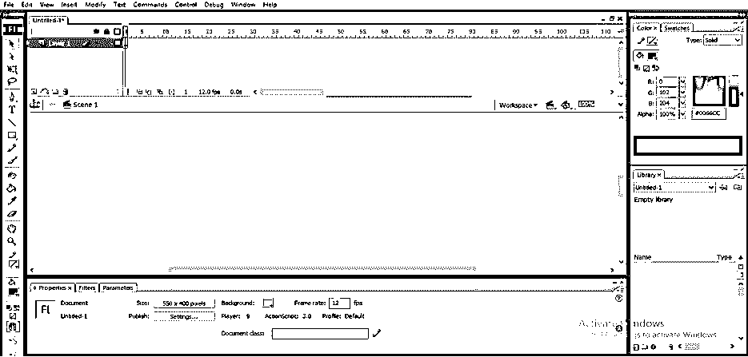

**第四步:**您可以从菜单栏的窗口菜单中添加任何部分，菜单栏位于工作屏幕的顶部。要添加任何新部分，只需点击该选项，所选部分的选项卡将在工作屏幕上激活。根据您的要求，您可以将该选项卡放在工作屏幕上的任何位置。

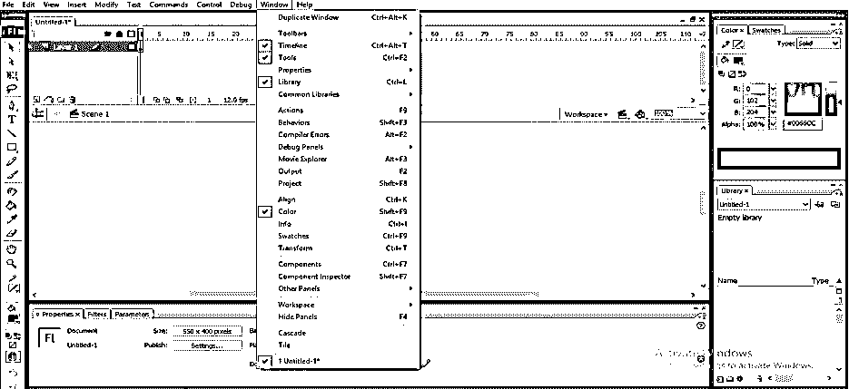

**第五步:**现在转到这个软件的工具面板，它在场景窗口的左侧，从这里通过点击椭圆图元工具的图标来选择椭圆图元工具，或者你可以简单地按下键盘上的 O 按钮来选择它。

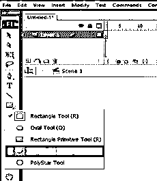

**第六步:**现在按住键盘的 shift 键画一个椭圆形，像这样画一个圆形。

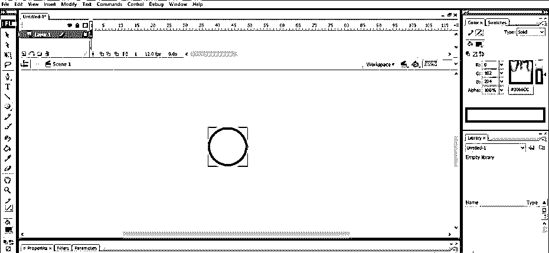

**第七步:**我们可以通过点击填充选项来改变这个圆的颜色，这个选项在底部的属性栏，或者你可以到场景窗口的右边去找填充选项。现在通过点击填充选项的小颜色框来选择你想要的颜色。

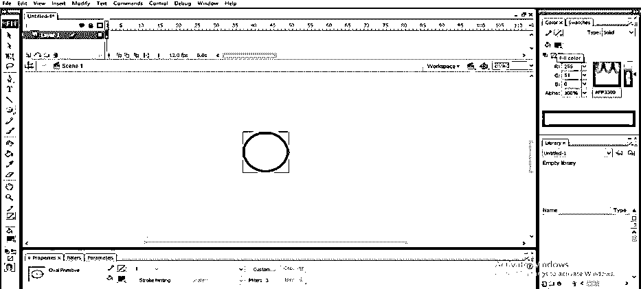

**步骤 8:** 现在点击笔画颜色选项来改变笔画颜色。转到右侧部分选项或转到此对象的属性栏的笔画颜色，并从这里选择您想要的笔画颜色。

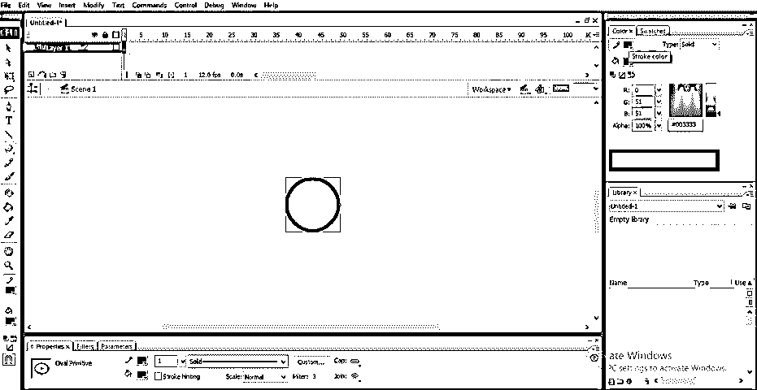

**第九步:**现在，从工具面板中取出选区工具，用选区工具移动这个点，这个点在这个圆的圆周上。

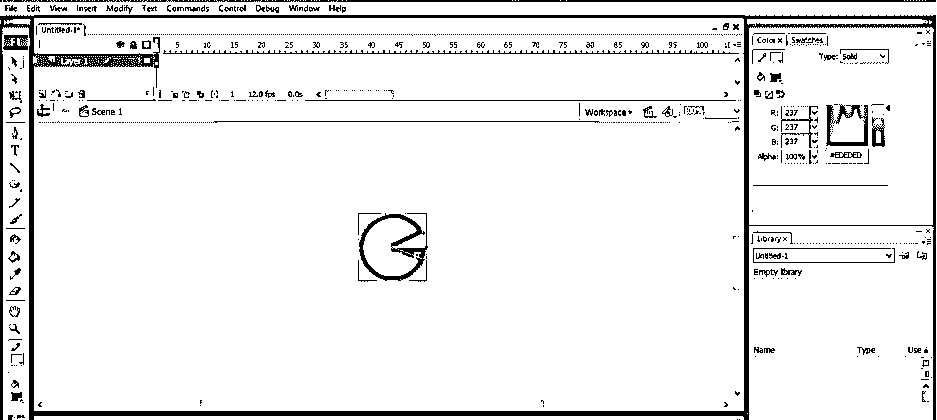

**第十步:**您可以从该对象属性栏的该选项中增加笔画粗细。

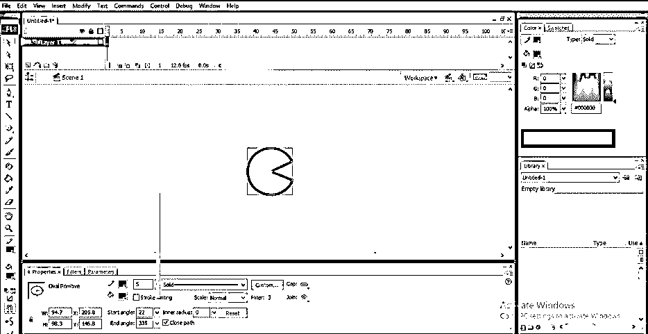

**步骤 11:** 您可以从该对象属性栏的起始角度选项和结束角度选项中设置该椭圆形的开口角度。

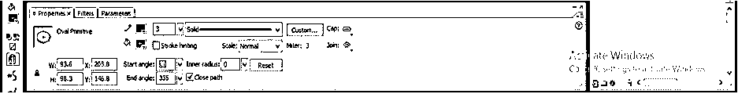

步骤 12: 现在，让我们看看这个物体的图层面板，这样我们可以很容易地制作它的动画。在顶部，我们有一个时间线部分左图层部分。

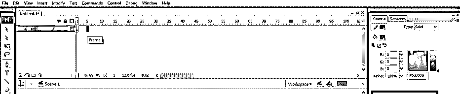

**第十三步:**我们可以通过点击这个图层的锁图标来锁定这个对象的图层，再次按下这个锁图标，就可以解锁了。

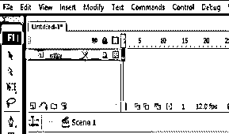

**步骤 14:** 我们可以通过点击这个对象层的十字图标来隐藏这个对象，再次按下这个图标，就可以取消隐藏了。

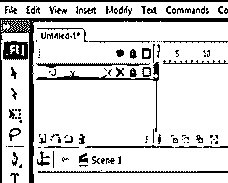

**第 15 步:**我们可以通过点击这个图层的钢笔图标来重命名这个图层。

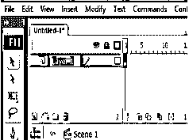

第 16 步:现在，让我们开始这个窗口中的动画。在时间轴部分的关键帧部分点击 5 帧，然后用鼠标右键点击。将打开一个下拉列表；从这里选择“插入关键帧”选项，在此帧上添加关键帧。

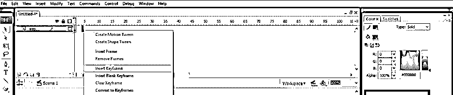

**步骤 17:** 现在，用这个圆做这种形状，把起始角和终止角的值设为 0。

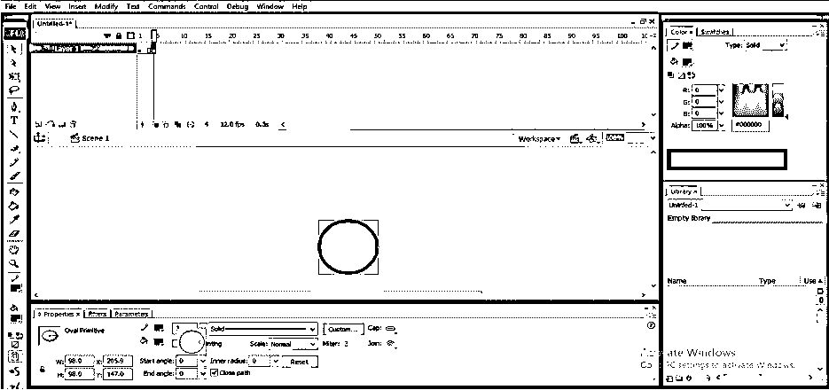

第 18 步:现在我们的 5 秒动画准备好了。我们可以在这个关键帧部分添加更多的关键点来制作更多的动画。我们可以在动画中使用多个对象。

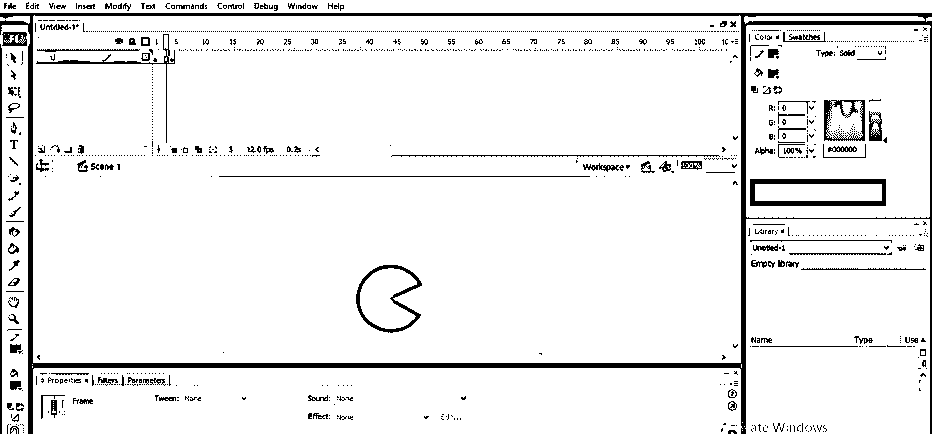

**第 19 步:**现在，按下键盘上的 Ctrl + Enter 键来观看你的动画。一个动画播放窗口会这样打开，你可以看到圆形会根据我们的动画开合它的嘴。

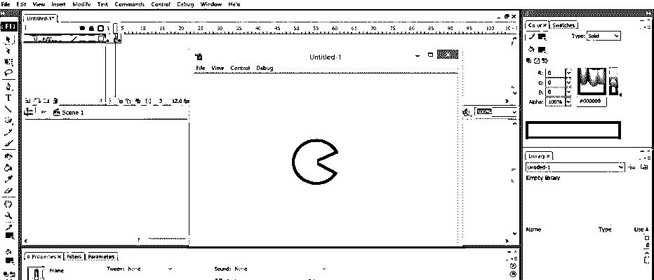

这样，你就可以利用这个软件的一些工具和技巧，在 Adobe Flash 中制作动画了。您可以在一个动画中使用多个对象或对象设计，并为不同层上的每个对象设置一个关键帧，以获得最佳动画。

### 结论

现在，在这篇“adobe flash 中的动画”文章之后，您可以通过使用该软件的一些简单工具和功能，了解“什么是 adobe flash 中的动画”以及如何在 Adobe Flash 中制作动画。通过掌握该软件的不同功能，你可以在该软件中制作高度专业的动画。我必须告诉你，掌握这些特性并不困难，你可以很容易地掌握它们。

### 推荐文章

这是一个 Adobe Flash 动画指南。在这里，我们讨论的介绍，如何做动画的 Adobe Flash 在一步一步的方式。您也可以浏览我们的其他相关文章，了解更多信息——

1.  [Flash 工具](https://www.educba.com/flash-tools/?source=leftnav)
2.  [Adobe Flash 设置](https://www.educba.com/adobe-flash-settings/?source=leftnav)
3.  [Flash 中的动画](https://www.educba.com/animation-in-flash/?source=leftnav)
4.  [Flash 工具驱动](https://www.educba.com/flash-tools-driver/?source=leftnav)

