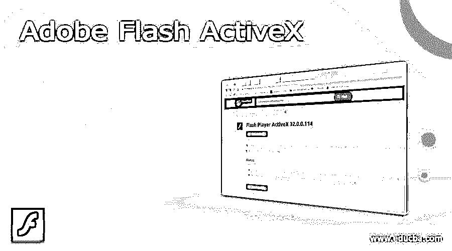
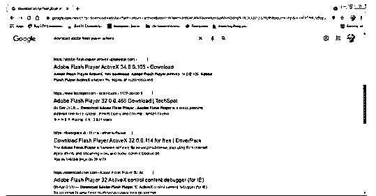
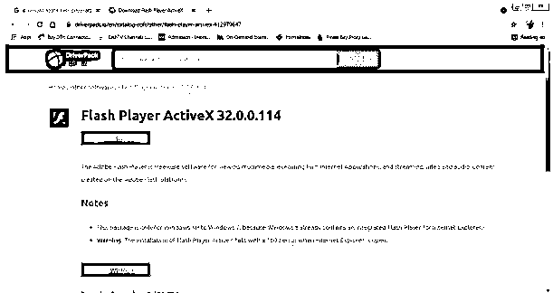
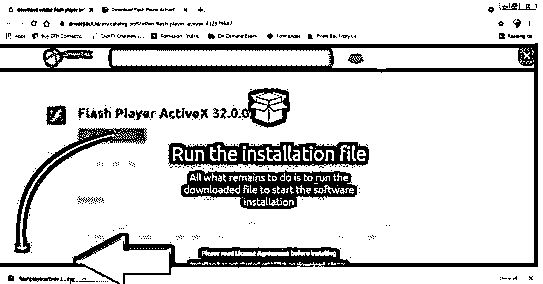
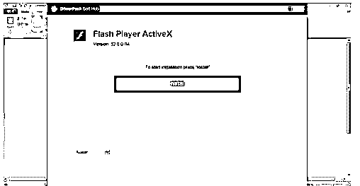

# Adobe Flash ActiveX

> 原文：<https://www.educba.com/adobe-flash-activex/>

## Adobe Flash ActiveX 简介

Adobe Flash ActiveX 是 Adobe flash player 的变体，用于在 web 浏览器上查看动画视频、图形和作品。Adobe flash player ActiveX 与 Internet Explorer 11 及其早期版本兼容。该插件基本上是一个软件组件，用于从互联网上下载特定的内容，并从网络浏览器中感知图形数据。ActiveX 是微软在 1996 年开发和创建的，是一个普遍下载和使用的插件，用于扫描万维网上的事实和数据。

### 如何下载安装 Adobe Flash ActiveX？

Adobe Flash Player ActiveX 是用于 Internet Explorer 的最常见的 Flash Player 插件。该插件需要实现并为用户提供高质量和高清晰度的网络内容。如果没有这个 ActiveX 插件，用户在 Internet Explorer 上浏览或观看带有音频和动画的视频、多媒体内容和设计时可能会遇到麻烦和问题。

<small>3D 动画、建模、仿真、游戏开发&其他</small>

虽然 Adobe flash player ActiveX 是 Internet Explorer 和在 Windows 下运行的其他平台的变体，但其他插件(如 PPAPI- Plugin)与 Linux OS 兼容，NPAPI 用于 MAC OS 和 Linux。尽管 Internet Explorer 并不总是需要 Adobe Flash Player ActiveX，但 ActiveX 的一些早期版本与 Mozilla Firefox 兼容。用户也可以通过下载其他插件来使用谷歌浏览器的 ActiveX。

基本上，开发人员需要并创建 Adobe Flash Player ActiveX 来在 Internet Explorer 上播放和查看 SWF 文件。因此，当在 Adobe Flash 上设计网站和网页时，需要一个插件来满足需求，并同时与 Internet Explorer 和 Flash 文件一起工作。

要在桌面上下载并安装插件:

1.我们需要在桌面上下载 Adobe Flash 播放器。

2.之后在 google 上搜索 Adobe Flash Player ActiveX 插件，如下图。

3.接下来，点击搜索中的链接，下载适用于 windows 操作系统的插件。

4.下载完成后，双击下载的文件夹。

5.将出现一个对话框。

6.点击确定。

7.接下来，将会打开一个窗口来安装插件。

8.单击“安装”安装插件。

这是一个非常简单的过程来下载和安装桌面和 Internet Explorer 的插件。在这个插件的帮助下，用户将能够在他们的计算机和浏览器上配置和演示丰富的 web 图形内容。

尽管这个插件有很多好处，但是它的一些缺点是它与 Android 用户不兼容。某些设备无法显示或读取 Flash 文件或 SWF 文件。这些设备甚至不能在互联网上显示 Flash 内容。此外，与目前基于 HTML 的网页和图形网站相比，Flash 网页的加载和下载更重。

### 利益

一些最有益的优势如下所述:

*   使用和安装 ActiveX 插件最常见的回报是提高从互联网下载任何网页、图像、视频或任何图形内容的速度。
*   该插件是几个小型应用程序的组合，创建这些应用程序是为了在互联网上顺利传输源内容。这个插件可以帮助用户下载一个文件，方法是将它附加到文件上，将文件分解成几个小文件，然后同时单独下载。该过程有助于重新获得下载文件的丢失部分，而无需再次下载整个文件。
*   由于 Adobe Flash Player ActiveX 是由微软创建的组件，该插件也可以由其他微软程序使用，如 Microsoft Office 或 Microsoft Windows Media Player。这有助于用户瞄准越来越大的客户群体。
*   ActiveX 插件也可以用其他计算机编程语言编写，例如 C++、PHP、JAVA、ASP 和 Visual Basic。这有利于对编码和脚本领域感兴趣的用户。Adobe Flash Player ActiveX 插件可以为这些用户提供一个平台来创建非凡而丰富的虚拟内容。

### 结论

总结这篇文章，有理由说 Adobe Flash Player ActiveX 插件对 Flash 用户和目标动画师和多媒体内容创作者是一个巨大的好处。

### 推荐文章

这是 Adobe Flash ActiveX 的指南。在这里，我们讨论介绍，如何下载和安装，以及更好地理解的好处。您也可以看看以下文章，了解更多信息–

1.  [Adobe Flash 版本](https://www.educba.com/adobe-flash-versions/)
2.  [Adobe 试听备选方案](https://www.educba.com/adobe-audition-alternative/)
3.  [Adobe Acrobat 替代品](https://www.educba.com/adobe-acrobat-alternative/)
4.  [Adobe Flash 中的动画](https://www.educba.com/animation-in-adobe-flash/)

