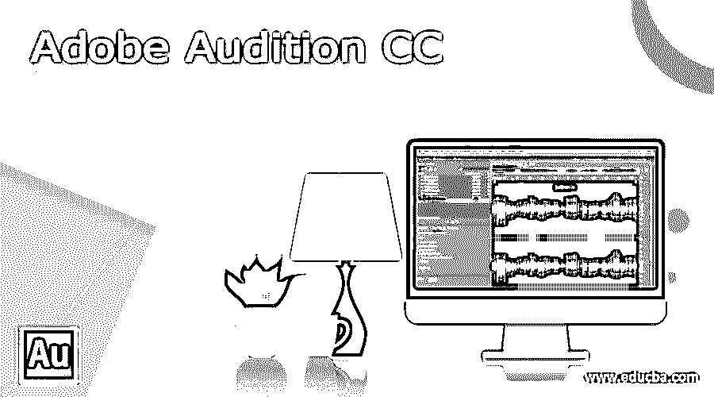

# Adobe Audition CC

> 原文：<https://www.educba.com/adobe-audition-cc/>

## Adobe Audition CC 简介

Adobe Audition CC 致力于数字音频的编辑，我们可以将其视为一个数字音频工作站。它是由 Adobe 公司于 2003 年 8 月 18 日开发的。这个软件有许多高级功能，在它们的帮助下，我们可以对音频文件进行修改，并在工作中获得最佳输出。今天，我将告诉你如何开始使用这个软件，以及它的最新版本的一些功能。我也给你一个它的步骤和定价的概述。让我们开始讨论吧。

### Adobe Audition CC 概述

在我们讨论这个软件的其他重要方面之前，让我给你一个关于 adobe audition 的一些其他事实的概述。这是一个数字音频工作站，可在 9 种语言，所以很容易使用它。它与多种操作系统兼容，如 Windows 10 或其更高版本、Mac OS 或其更高版本、x86-64、ARM64。其最新版本是 2021 年 10 月发布的 Adobe Audition 2022。你可以访问它的官方网站，了解它的其他细节。

<small>3D 动画、建模、仿真、游戏开发&其他</small>

### 如何使用 adobe audition cc？

我相信现在你对如何使用这个软件来录音和编辑你的音频文件很好奇。所以让我们开始讨论吧。

安装后第一次启动时，它会像这样打开。这是它的欢迎屏幕。

这是这个软件的用户界面。在它的最顶端，有一个菜单栏部分，它有许多菜单，如文件菜单、编辑菜单、多轨菜单等等。在这些菜单选项卡中，我们有几个选项可以帮助我们进行编辑和录制工作。

在这个菜单栏下面，我们有三个部分，在左侧我们有一个详细信息面板，可以看到我们的文件和其他一些东西，在中心我们有一个显示窗口，可以看到我们的编辑或录制工作，在右侧我们有一个面板，用于一些其他参数设置，在这个部分的下面，在左下角有一个历史面板，可以看到我们对当前打开的音频进行了哪些更改，在它旁边的中心，我们有录制音频的级别。

要创建任何新的音频文件用于录制，您可以使用文件菜单下拉列表中的新选项。对于不同的目的，有三种选择。这次我将选择音频文件。

选择后，您将看到此对话框。您可以从中设置音频的基本参数。

单击“确定”按钮后，您将启用中心部分参数。现在您可以开始录制音频了。

如果你想打开任何音频文件，然后再次进入文件菜单，并从下拉列表中选择打开选项。

选择此选项后，您将看到此对话框，用于选择您想要的文件。

一旦你选择它就会像这样打开。

现在，您可以对导入的文件应用效果或开始编辑。要在导入的文件中做任何更改，你必须选择它，因此要在音频波区域选择双像，就像这样。一旦你选择它，它会将整个区域转换成白色。你也可以按 Ctrl + A 键选择整个区域作为全部选择快捷键。

如果你想选择它的任何特定部分，那么你可以用鼠标光标。只需点击您想要选择的区域的起点，然后按住鼠标光标，向您想要选择的区域方向拖动光标。

现在你可以在导入的文件中做很多编辑设置，比如你可以从效果菜单中应用效果等等。

要想对这个软件有好的了解，你还需要学习更多的东西。在这里，我只是给你一个使用这个软件的基本介绍。

### 新功能 Adobe Audition cc

现在，让我们来看看该软件增加了哪些新功能来增强其 it 属性。

*   苹果 M1 ARM 的 Audition:现在 Audition 可以在苹果 M1 上以改进的录音和混音方式运行，并为我们提供高质量的音频。这个类别中非常有趣的功能是更快的音频效果渲染和混音，在光谱显示编辑器中几乎实时更新。
*   剥离静音:使用此功能，我们不仅可以识别，还可以移除已识别的录制音频的选定区域的静音或不活跃区域，最棒的是，在移除静音区域的过程中，选定的多轨道音频不会失去同步。这一功能有助于我们清理语音记录，采访，编辑多轨道，如音频纪录片或播客。使用 Strip Silence，我们可以针对独特的场景调整参数，这些场景可能包括嘈杂的背景、候选人之间不同的音量级别等等。

### adobe audition cc 的设置和定价

访问 adobe 的官方网站，这是 www.adobe.com 有这个软件。你可以通过每月支付 31.49 美元来设置它。如果你想要一个年度订阅，那么你可以每月支付 20.99 美元，或者你可以一次性支付 239.88 美元进行年度订阅。这个软件的最新版本会有一些新功能。如果你想在一个软件包中包含一些其他软件，那么你可以使用 adobe 的 Creative Cloud 应用程序。

### 结论

现在我想你已经了解了这个软件的所有重要方面，这些信息足以理解 adobe audition 并开始使用它。现在我会建议你使用这个软件的 7 天试用版，并开始使用它来了解它。

### 推荐文章

这是一个 Adobe Audition CC 的指南。在这里，我们将讨论简介、概述、如何使用 adobe audition cc、安装以及 adobe audition cc 的定价。您也可以看看以下文章，了解更多信息–

1.  [Adobe 试听备选方案](https://www.educba.com/adobe-audition-alternative/)
2.  [Adobe Flash 使用](https://www.educba.com/adobe-flash-uses/)
3.  [Adobe Flash Player 替代品](https://www.educba.com/adobe-flash-player-alternative/)
4.  [Adobe Flash 中的动画](https://www.educba.com/animation-in-adobe-flash/)

