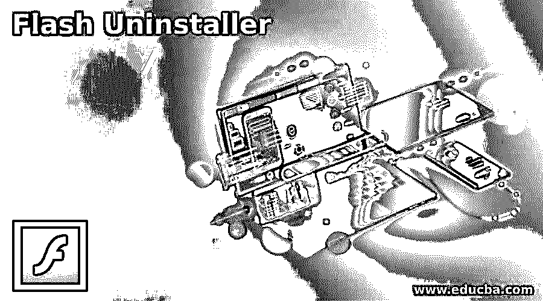

# 闪存卸载程序

> 原文：<https://www.educba.com/flash-uninstaller/>

## Flash 卸载程序简介

Flash Uninstaller 可以理解为 Adobe 提供的一个软件程序，用于从我们的计算机系统中完全卸载 Flash player。原因是从 2020 年 12 月 31 日起，adobe 不再支持这款软件，这是 2017 年 7 月宣布的。因此，与卸载程序，我们可以很容易地删除每一个文件相关的 Flash player 从我们的计算机系统非常快。在这篇文章中，我们将浏览 Flash player 卸载程序的一些相关术语，如卸载它的需要，如何下载和运行卸载程序，等等。因此，让我一个一个地浏览所有这些信息。

变得过时后，需要卸载 Adobe Flash Play。为了完全卸载它，我们使用一个名为 Adobe Flash Uninstaller 的安装程序。那么让我们看看为什么我们需要它？

<small>3D 动画、建模、仿真、游戏开发&其他</small>

### 卸载 adobe flash

你心里一定会有一个问题，为什么我们需要从我们的计算机系统中卸载该软件，原因是 Flash player 的生命周期结束后意味着 adobe 停止支持该软件，那么 adobe 将不会提供任何更新和安全补丁，因此为了使你的计算机系统安全，你需要完全卸载它。

一些仍在使用 Adobe Flash 的用户会收到 Adobe 的提醒，要求他们从计算机系统中卸载 Flash Player，原因是 HTML5、WebAssembly 和 WebGL 类型的开放标准经过多年的不断成熟，成为 Flash 内容的最佳替代方案。不仅是这个原因，各大浏览器厂商也不赞成使用 Flash Player 这样的插件来使他们的用户界面越来越好。所以我认为这就是为什么我们必须从电脑上卸载 adobe flash。

在讨论了卸载的必要性之后，有必要告诉您我们如何为我们的计算机系统卸载 adobe Flash。现在让我们来看一下下载 Adobe Flash 的步骤以及卸载程序的运行过程。

### 下载并运行卸载程序

要在您的计算机系统中安装卸载程序，您需要完成以下步骤:

首先，打开网络浏览器。你可以使用你电脑系统的任何网络浏览器。例如，我的电脑上有 Chrome 作为互联网浏览器，所以我会打开它并导航到 adobe.com，或者你可以简单地在任何浏览器的搜索框中键入“Flash player uninstaller”。我正在使用 Chrome 浏览器，所以这是它的搜索框，我在这里输入相同的文本。导航后，它会显示这些结果，我会点击第一个链接，这是 adobe.com 的页面。

一旦我们点击这个链接，adobe.com 上将会打开 Flash Player 的卸载说明页面，在这里我们可以找到卸载程序的链接；当我们向下滚动这一页时，点击它。

点击卸载程序的安装/运行文件需要几秒钟的时间，下载完成后，你可以在 chrome 浏览器的下载页面找到它。你可以简单地按下键盘上的 Ctrl + J 键来打开这个页面。如果您在其他浏览器上，您可以搜索该浏览器的下载页面。如果你知道它保存的位置，那么直接进入你计算机的那个文件夹，或者你可以点击这个下载页面上的“显示文件夹”按钮。

一旦你点击这个按钮，chrome 浏览器的保存位置对话框就会像这样打开。我在这个位置运行了一个 adobe 卸载程序文件。这样你就可以进入你电脑系统中保存它的文件夹。

在我们开始运行此应用程序之前，我们必须再经历一个步骤，这是非常必要的，这一步是关闭计算机系统中所有打开的浏览器，因为如果有任何浏览器打开，adobe uninstaller 将无法工作。因此，请转到浏览器并关闭所有标签。如果你想在关闭浏览器标签之前保存一些东西，你可以先保存，然后关闭所有浏览器的标签。

不仅是浏览器，我们还必须关闭其他使用 Flash 的程序，如果它们在运行卸载程序之前打开的话。所以去任务栏检查整个打开的程序，然后关闭它(如果有的话)。

现在，再次转到卸载程序文件在您的计算机系统中的保存位置，我只需双击它，一旦我双击它，它将通过弹出消息请求允许在我的计算机上运行它。因此，我将单击弹出消息中的“是”按钮。

在我确认后，它会直接打开一个对话框，问我是否要卸载已经安装的 Adobe Flash Player。因此，如果您要开始卸载过程，只需单击此对话框中的“卸载”按钮，或者您想以后再卸载，则可以单击“退出”按钮。现在，我将点击卸载按钮。

它将像这样开始处理卸载过程。

几秒钟后，它会要求您重新启动计算机系统以完成卸载过程。

重新启动计算机系统后，您可以打开浏览器来检查 Flash Player 的状态。

### 结论–闪存卸载程序

我相信现在你知道为什么有必要从你的计算机系统中卸载 adobe flash player，以及卸载的步骤。按照 adobe 说明尽快卸载 Flash player 以保护您的计算机系统是很好的，阅读完本文后，您会知道使用 Adobe Flash Uninstaller 很容易做到这一点。

### 推荐文章

这是一个闪存卸载程序的指南。在这里，我们讨论了一些相关的条款卸载的 Flash 播放器，如需要卸载它。您也可以看看以下文章，了解更多信息–

1.  [Flash 工具驱动](https://www.educba.com/flash-tools-driver/)
2.  [Adobe Flash 设置](https://www.educba.com/adobe-flash-settings/)
3.  [Flash 工具](https://www.educba.com/flash-tools/)
4.  [Flash 中的动画](https://www.educba.com/animation-in-flash/)

