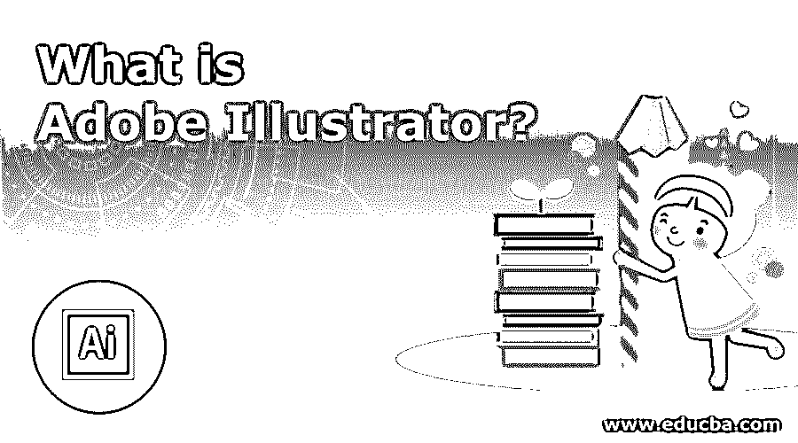
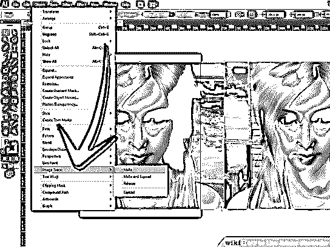

# 什么是 Adobe Illustrator？

> 原文：<https://www.educba.com/what-is-adobe-illustrator/>

## 什么是 Adobe Illustrator？

Adobe Illustrator 是一个应用程序，用于按顺序制作徽标、文本样式、演示文稿、数字图片、海报和 flex，因为这是一个基于矢量的程序，所以图片可以制作成任何大小，Illustrator 是第一个调度此元素的软件，并在图形设计业务中广为人知，Adobe Illustrator 可以被描述为已经是为图形设计师制作的主要应用程序的产品，它于 1987 年首次推出。

Adobe Illustrator 可以定义为以前唯一为平面设计师制作的软件。它最初是在 1987 年开发的，带有一个全功能的 windows 程序。最初，它还提供了复杂的跟踪和文本处理命令以及分色功能。

<small>3D 动画、建模、仿真、游戏开发&其他</small>

### 谅解

Adobe Illustrator 对于新生来说是一个很好的开始，因为他们可以更容易地学习这个软件。购买 Adobe 时，他们会提供说明和指南，向我们简要介绍所有功能。以下是一些需要理解的技巧:-

1.  最初，当你开始使用它时，只是继续涂鸦，这使你与这个软件互动，这是一个非常容易的任务，使你学习。
2.  当你深入到制作字体和一些基础设计的时候，那就不要用颜色；相反，使用“填充白色”和黑色阴影。这让你专注于你的艺术。
3.  一旦你开始使用钢笔工具，你需要控制你的鼠标，以完美地绘制形状，如圆形，椭圆形，矩形等。
4.  稍后，开始填充颜色以提高你的技能并掌握新的命令。

### Adobe Illustrator 如何让工作变得如此简单？

这是一个由钢笔工具、样本、[网格工具](https://www.educba.com/mesh-tool-in-illustrator/)和图像跟踪等多功能命令组成的工具。这些命令使我们的绘图更快更容易。

### 顶级公司

有很多公司需要一名平面设计师，因为这是为每一件产品设计标识的基本需求。尽管如此，一些著名的品牌有成千上万的产品，并不断更新他们的产品，这是一个平面设计师的要求。

1.  惠普
2.  辉瑞
3.  airbnb
4.  图钉
5.  netapp
6.  Zendesk
7.  人类制药

### 你能用 Adobe Illustrator 做什么？

我们可以设计大部分横幅，因为这些是矢量图像，并具有控制像素的质量。Adobe Illustrator 设计小型数字和字母图像，不受特定尺寸的限制。婚礼和请柬都是用这个软件设计的。各种网站上不断使用的图片，尤其是电子商务网站上的图片，完全是用这个软件设计的。

### 工作

这个软件为你提供了一个完美友好的用户界面。如果你在团队中工作，那么如果你想培训一名新员工，你的工作会更容易。一旦你成为专家，你就会意识到工作的轻松和完成工作的方式。

### 优势

使用这个软件会让你更舒服，因为它有很多优点。

1.  它有一些现成的工具，给你各种形状。
2.  你可以制作任何大小的横幅，从小圆点到大条纹。
3.  图像的导入、编辑和修改可以在一个平台内完成。
4.  如果与 Adobe 的其他产品同时使用，会很舒服。

### 所需技能

要成为专家，你不需要有任何特殊技能，因为经验会在更短的时间内教会你。尽管如此，如果你有一些摄影技巧将是一个额外的优势。还有，如果你擅长绘画和素描，那么你很快就会变得专业。

### 为什么要用？

Adobe Illustrator 是一个运行了 30 多年的软件，已经覆盖了 100%的命令。Adobe 是这个领域的专家，几乎所有的专业人士都使用这个软件，这使得我们向他们学习变得更加容易。如果您购买 Illustrator 和其他 Adobe 产品的许可证，这可以为您节省资金。

### 范围

所有不同的公司都需要这种软件的专家，因为它是市场营销的一个关键部分。每个人都想让他们的标志和产品看起来更有吸引力，然后就需要一个平面设计师，在像 Flipkart，Amazon，Myntra 这样的大型电子商务项目中，他们每天都在更新他们的产品，所以他们需要一个平面设计师，因为他们必须上传单个产品的多个图像。

### 我们为什么需要它？

这个软件包括所有的命令，因为它节省了你同时使用多个软件的时间。您可以转换成任何格式的图像，因为几乎所有格式都包含在最新版本中。Adobe Illustrator 帮助你更快地找到工作，因为它在任何地方都被广泛使用，对于公司来说，他们在任何地方都有专家候选人。

### 谁是学习 Adobe Illustrator 技术的合适受众？

制作大型 flex 徽标和横幅、网站图形图像以及有时用于摄影活动的人。那些处理所有这些活动的考生是最适合学习的。

### 这项技术将如何帮助你的职业发展？

你需要有处理这个软件的良好经验，然后你可能会得到一份好的有薪工作。基本上这是个技术活，你得展示你的才华。此外，你发展技能的速度和你做出的图形有多吸引人取决于你决定你成功之路的因素。

### 结论

Adobe 是市场上唯一一个非常古老的软件，在每个行业都很常见。这是一个通用的工具，如果你只参与一个特定的活动，可以节省你购买其他软件的费用。如上所述，如果你学会了这个，你会有很好的职业发展，而且你会有广阔的机会申请几乎每一家公司。这通过提供新的和先进的工具使你更加专业和多才多艺。

### 推荐文章

这是一个什么是 Adobe Illustrator 的指南。这里我们讨论了 Adobe Illustrator 的基本概念、优势、所需技能和范围。您也可以浏览我们推荐的其他文章，了解更多信息——

1.  [如何在 Illustrator 中扭曲文本？](https://www.educba.com/how-to-warp-text-in-illustrator/)
2.  [Illustrator 中的图章效果](https://www.educba.com/stamp-effect-in-illustrator/)
3.  [安装 Adobe Illustrator 的步骤](https://www.educba.com/install-adobe-illustrator/)
4.  [Illustrator 中的金属效果](https://www.educba.com/metal-effect-in-illustrator/)

