# 安装 Adobe Illustrator

> 原文：<https://www.educba.com/install-adobe-illustrator/>

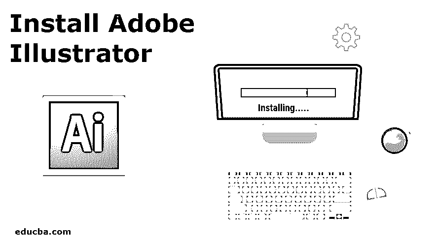

## 安装 Adobe Illustrator 简介

Adobe 公司销售和开发的最著名和最流行的矢量图形程序之一是 Adobe Illustrator。该程序带有一个创意云，也可以作为一个单独的程序从 Adobe 网站下载。该公司提供 7 天的免费试用版，之后用户必须购买每月或每年的订阅才能继续使用该程序。该程序与 Windows 和 Mac 操作系统兼容。以下是在 Windows 操作系统上安装 Adobe Illustrator 的最低系统要求。

*   32 位系统的 RAM 至少需要 2GB，64 位系统的 RAM 至少需要 4GB
*   推荐的处理器是支持 32 位或 64 位的多核英特尔处理器。AMD Athlon 64 处理器也可以安装 Adobe Illustrator。
*   安装了 Service pack 1 的 Windows 7 操作系统。
*   显示器的分辨率必须至少为 1024 X 768。
*   程序安装需要至少 2GB 的硬盘空间。在安装之前，建议使用显卡
*   为了程序的顺利运行，建议使用 OpenGL 4.x。

以下是在 MAC 操作系统上安装 Adobe Illustrator 的最低要求

<small>3D 动画、建模、仿真、游戏开发&其他</small>

*   需要 4GB 的内存
*   MAC OS 版本 10.13，10.12。1014 是软件顺利运行的最低要求
*   64 位多核英特尔处理器也是 Adobe Illustrator 在 Mac OS 上工作的最低要求。
*   安装该产品需要 2GB 的 RAM，安装后还需要额外的空间。
*   需要 OpenGL 4.0 或更高版本，同时也建议至少有 1GB VRAM 空间来积极使用 GPU。
*   还需要 1024 X 768 的分辨率。
*   还建议使用运行中的互联网连接进行许可和注册。

### 如何安装 Adobe Illustrator

以下是在您的系统中安装 Adobe Illustrator 的步骤。请在下载软件前检查最低要求，如果系统不符合最低要求，产品将不会被下载。

*   要下载并安装 Adobe Illustrator，请访问 Adobe 的官方网站，即[https://www.adobe.com/in/](https://www.adobe.com/in/)；我们需要去创意&设计部分，并点击“查看所有计划和定价”

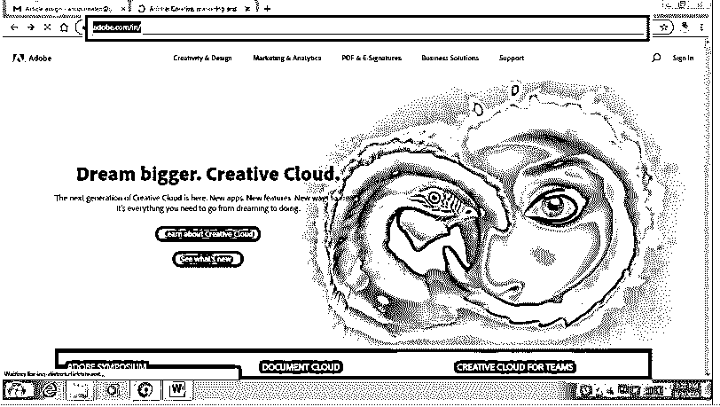

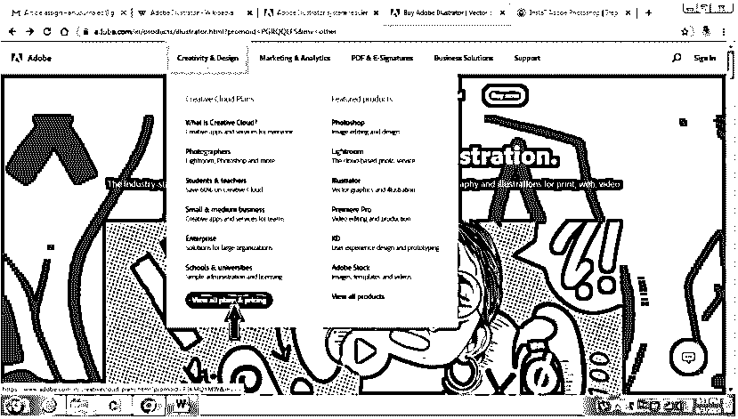

*   将打开一个页面，显示个人、企业、学生和教师以及学生和大学可用的各种类别。该页面对每个类别都有不同的订阅计划。对于个人而言，该公司提供摄影计划、单个应用计划和不同定价的所有应用计划。同样，出于商业目的，它给出了所有应用程序计划和单个应用程序计划。对于学生和教师，他们提供了摄影计划和所有应用程序计划。对于大学，Adobe 提供所有应用程序计划和单个应用程序计划。用户可以通过任何媒体选择任何程序，并购买相应的许可证。

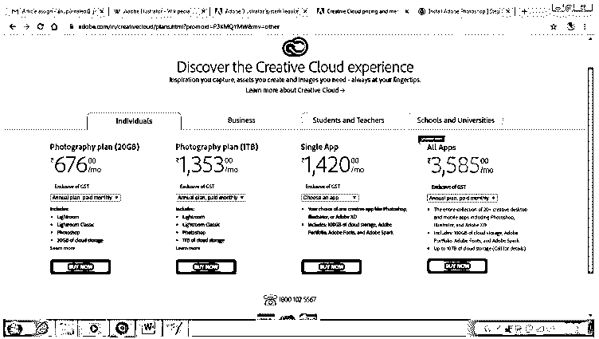

*   要下载 Adobe Illustrator，请单击单个应用程序，然后使用 Illustrator 选项进行月度计划，并单击立即购买。

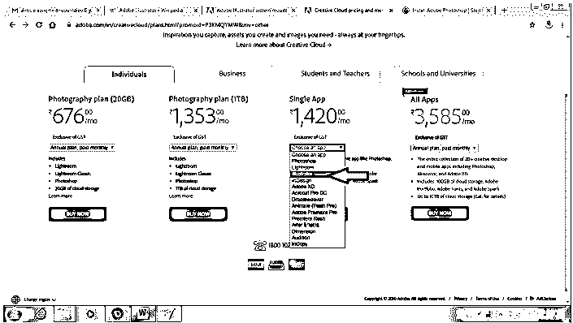

*   一旦用户点击立即购买选项，你将被询问电子邮件 Id，你必须“继续付款”

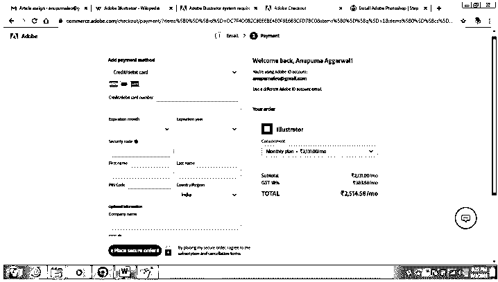

*   当支付成功后，浏览器会下载一个设置，如下图所示。

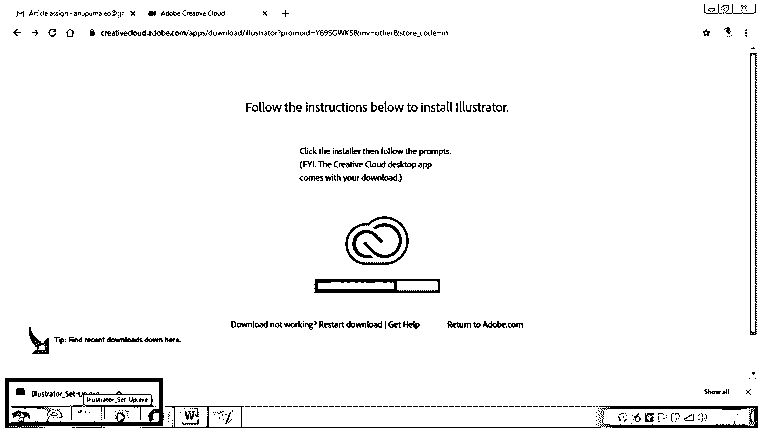

*   下载完设置后，双击设置，会出现一个对话框。单击对话框中的运行命令。

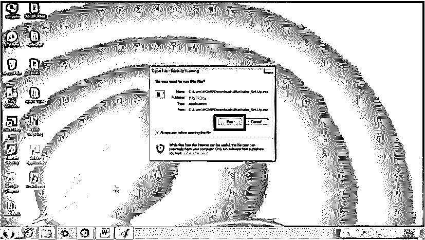

*   这将启动安装 Adobe Illustrator 的安装过程

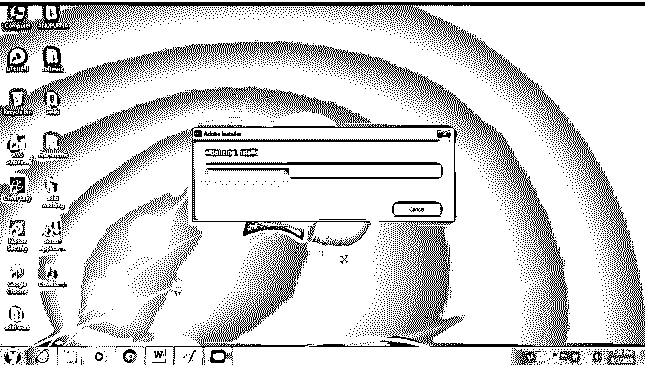

*   安装完成后，会出现一个对话框。该对话框显示两个命令 Install 和 Try。如果用户已经购买了该程序，他需要点击安装选项，而如果用户还没有购买该程序，则点击尝试选项。

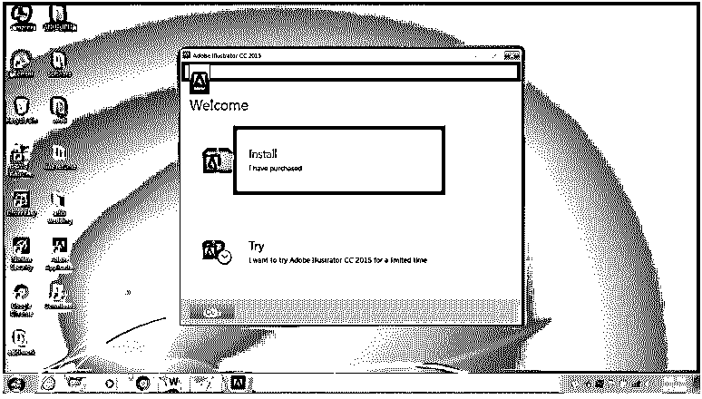

*   当您单击安装选项时，会出现一个对话框，要求用户输入所需的电子邮件 Id。单击“登录”进行安装

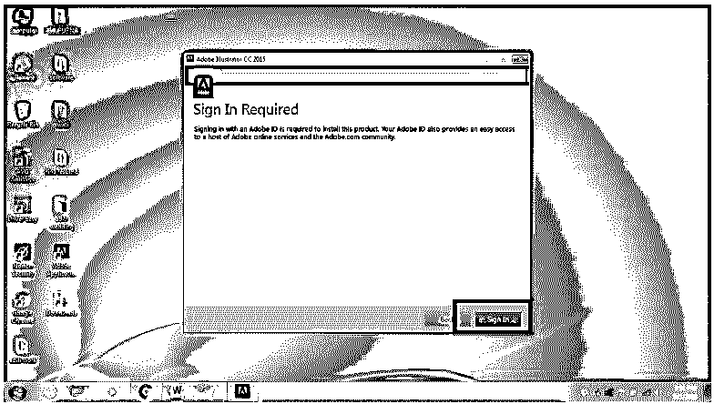

*   现在，单击接受选项进行程序处理。

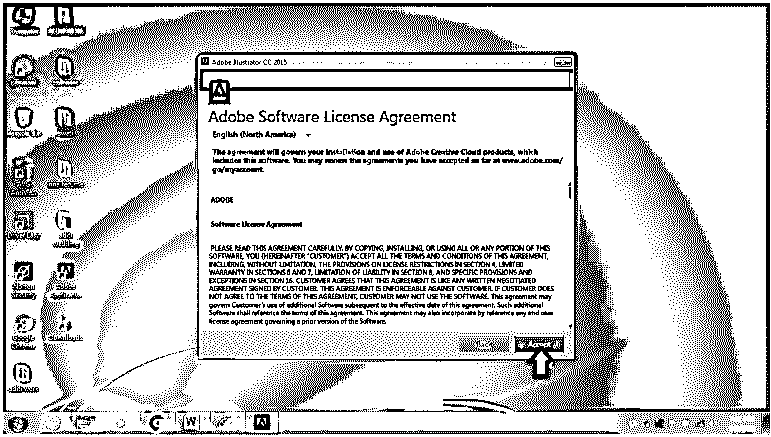

*   之后，会出现一个对话框，询问您所需的存储位置和安装前的语言。Adobe Illustrator 有德语、意大利语、波兰语、荷兰语、英语和许多其他语言版本可供修改。要修改默认位置，您可以单击并更改它。之后，点击 Install，安装将开始。

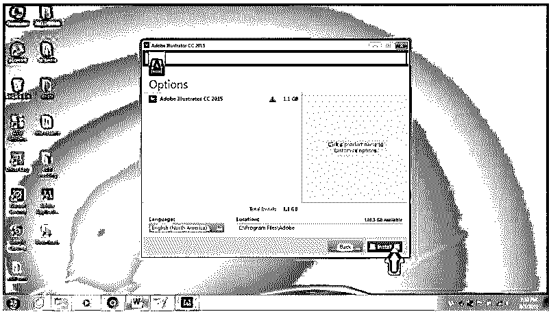

*   系统将检查最低要求并处理安装。

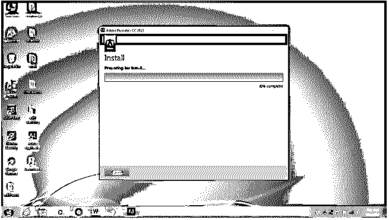

*   安装完成后，程序将开始运行，如下图所示。

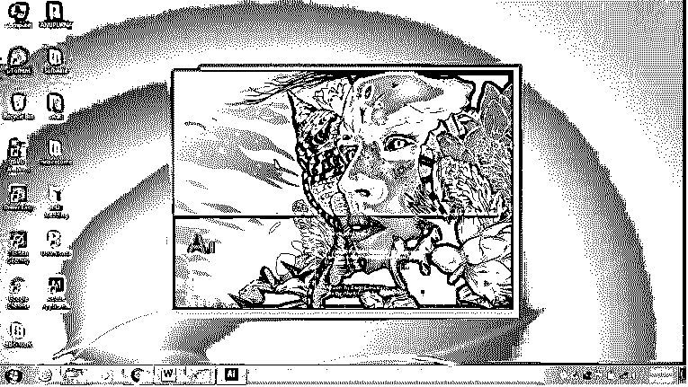

*   最后， [Adobe Illustrator 将](https://www.educba.com/adobe-illustrator-for-windows-8/)安装到您的系统中，如图所示。使用该程序来绘制和创建矢量图形和艺术品。

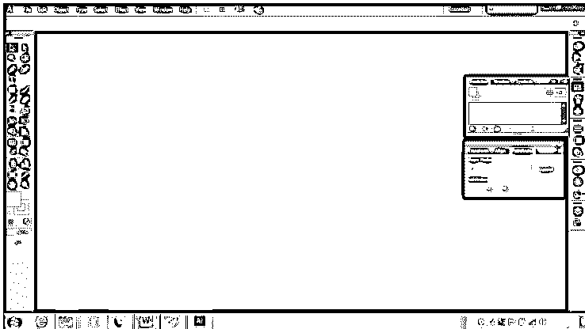

### 结论

这些是下载和安装 Adobe Illustrator 程序的分步指南。以上步骤显示了如何从网站下载单个应用程序，同时用户也可以根据自己的要求下载完整的 Creative Cloud Pack。这些包可以按月或按年订购。

### 推荐文章

这是安装 Adobe Illustrator 的指南。在这里，我们讨论的步骤安装 Adobe Illustrator 到您的系统与给定的截图。您也可以阅读以下文章，了解更多信息——

1.  [Adobe Illustrator 工具](https://www.educba.com/adobe-illustrator-tool/)
2.  [Adobe Photoshop 工具](https://www.educba.com/adobe-photoshop-tools/)
3.  [Adobe 特快专递](https://www.educba.com/adobe-speedgrade/)
4.  [安装 Adobe Creative Cloud](https://www.educba.com/install-adobe-creative-cloud/)

