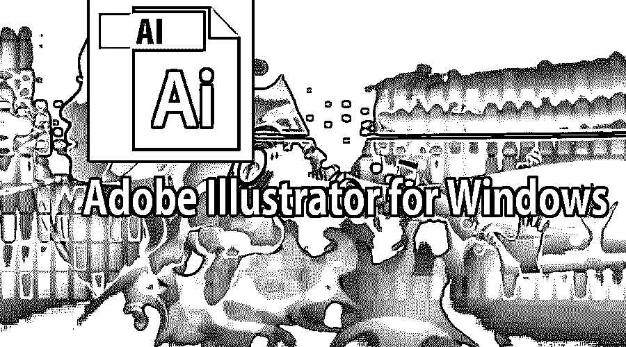
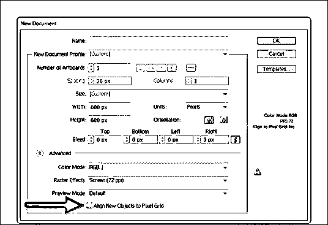
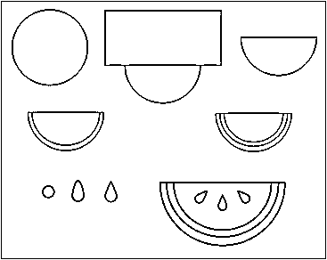
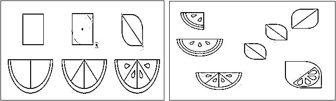
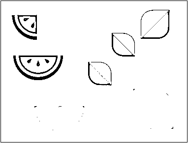
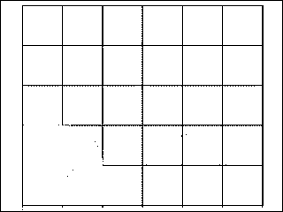
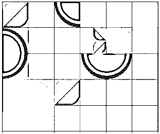

# Adobe Illustrator For Windows

> 原文：<https://www.educba.com/adobe-illustrator-for-windows/>

## 关于 Adobe Illustrator for Windows

在本主题中，我们将了解 Adobe Illustrator For Windows。Adobe Systems 于 1985 年开发的矢量图形软件是 Adobe Illustrator。Illustrator 最初是为苹果 Mac 开发的，随后在 1989 年发明了微软 Windows。Illustrator 是为易于使用的绘图目的而开发的。

### Adobe Illustrator For Windows 的特点

*   这是一个向量程序，它通过数学公式在线定义。这是一个与基于像素和单个比特的程序相反的创造。
*   Adobe Illustrator For Windows 已经过广泛更新，目前它是 Adobe Creative Cloud 的一部分。
*   Adobe Illustrator 被世界各地的平面设计师、网页设计师、视觉艺术家和经验丰富的插画师广泛用于制作高质量的作品。
*   Illustrator 是最好的矢量软件，拥有最先进的绘图工具，可以缩短创建插图所需的时间。
*   Adobe Illustrator For Windows 的最高级功能是其神奇的钢笔工具，可帮助绘制平滑的曲线和创建高分辨率的形状和插图。
*   它还支持 3D 图形和图层功能，为用户带来非凡的工作体验。
*   Illustrator 在曲线周围放置文字的能力对于从事标志设计的艺术家来说是最有用的功能。
*   从绘制信息图到地图到徽标等等，Illustrator 可以设计任何东西，而不会出现像素化和牺牲图像质量。
*   另一方面，Adobe Photoshop 是一个基于像素的程序，依赖于图像的质量，Illustrator 是一个独立于分辨率的软件，对用户来说非常有用和创新。
*   Adobe Illustrator 可以保存 PDF、EPS、WMF、VML、SVG 文件格式的文件。
*   Adobe Illustrator 的主要优势之一是能够打印分色文件。
*   它用于创建各种数字和印刷图像。这包括卡通、图表、图解和图形。
*   Illustrator 还可以以多种方式控制文本，这使得创建明信片、海报和其他由图像和文本组合而成的视觉设计更加容易。
*   用户还可以选择将 illustrator 绘图和插图导入和导出到 Adobe After Effects、InDesign、Photoshop 和 Premiere Pro。例如，用户可以将 illustrator 图像导出到 After Effects，然后创建该图像的动画。
*   它也用于设计演示，在图标的帮助下，展示网站建成后的样子。
*   该界面也不难理解和使用。工作流程对用户很有帮助。
*   Illustrator 用于所有需要图像开发和输出适应性过程的活动。对于包装、布局和任何类型的构图和插图设计来说，它都是很好的图形交流工具。这在 2D 环境中非常有用。

### 如何安装 Adobe Illustrator for Windows

以下是安装 Adobe Illustrator CC 版本的步骤:-

<small>3D 动画、建模、仿真、游戏开发&其他</small>

1.  打开网络浏览器，访问网站:[adobe.com](https://www.adobe.com/)
2.  在网页上，用户可以看到所有产品选项。
3.  单击选项，然后单击 Adobe Illustrator
4.  用户可以下载 7 天的试用版，也可以从选项中选择合适的计划来购买。
5.  下载完成后，单击设置选项。
6.  设置完成后，软件就成功安装并可以使用了。

**安装 Adobe Illustrator For Windows 的最低系统要求**

*   RAM-32 位建议使用 4gb RAM，64 位建议使用 16gb RAM。
*   硬盘-用于安装的 2 GB 可用硬盘。
*   操作系统-带 Service pack 1 的 Microsoft Windows 7
*   处理器-多核英特尔处理器(32 位或 64 位)
*   GPU- Open GL 4.x

#### Adobe Illustrator For Windows 的基本示例

Adobe Illustrator For Windows 中的钢笔工具已经进行了修改，设计人员可以创建像素完美的艺术作品。他们可以放大到最小像素位置，并调整其颜色和其他属性。Adobe Illustrator For Windows 的更多优势在于用户可以使用触摸设备，帮助他们通过指尖的触摸来创建美丽的作品。

#### 以下是创建一个简单的形状水果矢量设计的步骤。

1.打开 Illustrator，点击新建文档。选择对话框中的选项。选择 RGB，并确保在单击“确定”之前取消选中“将新对象与像素网格对齐”框。

2.接下来，使用椭圆工具，画一个圆。使用矩形工具将其与矩形重叠。然后，使用“路径查找器”面板中的“正面减”选项，也选择这两个形状。为了形成西瓜的每一层，对较小的形状重复同样的步骤。然后，画一个圆，并使用种子的直接选择工具向上拉最上面的锚点。之后，将锚点转换为尖点，在西瓜片上放三个。

3.其他物品包括树叶、柠檬。要画一片简单的叶子，画一个正方形，向内拉它的两个角，使角变圆。柠檬也是一样，只是叶子更大，有一个半圆和大种子。而西瓜和橘子片是四分之一圆形设计。每片叶子都应该有一条线将它们一分为二。

4.接下来，填写每个形状。给每片叶子和橘子片涂上一层颜色。调色板应该有八种左右的颜色。

5.使用线条网格工具，在画板上创建一个简单的线条网格。每个单元格都需要是一个完美的正方形。然后，从图层面板锁定网格，然后开始放置元素。

6.在网格周围组合元素的不同大小和方向。每个物体应该占据一个或多个单位。为较小的对象添加多个部分。

7.尽量避免相似的物体相互接触和融合。对每个对象的方向使用相同的标准。最后，从图层面板中删除网格。输出是完美和真实的组成，随时可以打印。

### 推荐文章

这是 Adobe Illustrator For Windows 的指南。这里我们讨论了 adobe Illustrator For Windows 的基本概念，它是如何工作的，谁可以使用它，等等。Adobe Illustrator for Windows 是一个图形艺术的专业平台。Adobe Illustrator for Windows 是一个多样化的应用程序，从启动打印到 web 图形以及用于我们的海报目的。学习 Adobe Illustrator for Windows 并创建具有专业外观的作品是非常容易的，尽管这很复杂，需要大量的时间才能真正掌握。您也可以阅读以下文章，了解更多信息——

1.  [Adobe Photoshop 命令](https://www.educba.com/photoshop-commands/)
2.  [Adobe Illustrator](https://www.educba.com/adobe-illustrator-for-beginners/)
3.  [Adobe Illustrator vs Adobe Photoshop](https://www.educba.com/adobe-illustrator-vs-adobe-photoshop/)
4.  [Adobe Photoshop 的十大功能](https://www.educba.com/top-10-features-in-adobe-photoshop/)

