# 适用于 Windows 8 的 Adobe Illustrator

> 原文：<https://www.educba.com/adobe-illustrator-for-windows-8/>

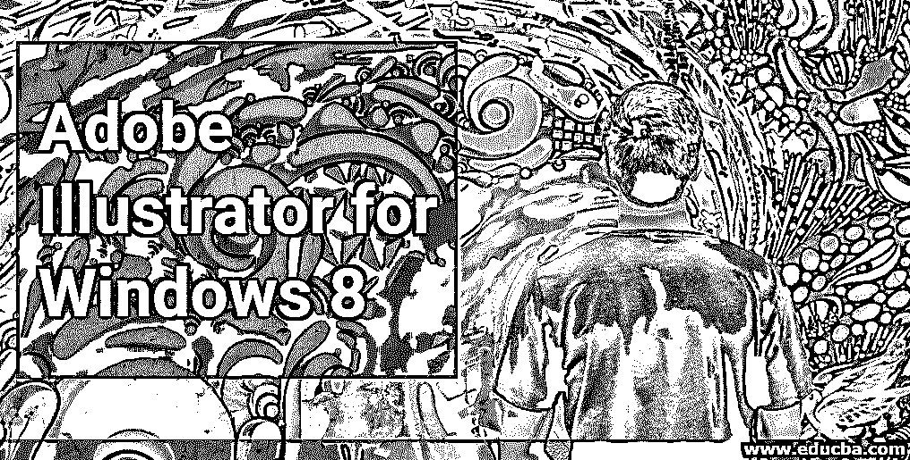

## Windows 8 版 Adobe Illustrator 简介

Adobe Illustrator 是一款用于绘图、创作艺术品、插图等的软件。是最好的矢量图形程序软件。它由 Adobe Systems 维护，现在是 Adobe Creative Cloud 的一部分。Adobe Illustrator 软件的最新版本是 CC 2019，于 2018 年 10 月发布。它与 Windows 7 操作软件、Windows 10 操作软件和 macOS 兼容，但你也可以在 Windows 8 中使用它，并具有相同的功能，没有任何大问题。在 windows 8 中使用 illustrator 可以为您提供流畅的工作界面，您可以轻松地在 windows 8 中安装 illustrator。

### 在 Windows 8 中安装 Adobe Illustrator

以下步骤将向您展示如何在 Windows 8 操作系统中安装 Adobe Illustrator 软件。安装时，你只需遵循以下步骤。让我们以一种非常有趣的方式开始我们的文章。

<small>3D 动画、建模、仿真、游戏开发&其他</small>

**第一步**:在你的网址上搜索创意云或者进入链接——[<u>【https://www.adobe.com/in/creativecloud.htm】</u>](https://www.adobe.com/in/creativecloud.html)<u>l .</u>

Creative Cloud 的主页将会打开。创意云是 adobe 系统的打包 app。

**第二步**:现在，对于免费试用，点击网页屏幕顶部的**免费试用**标签。

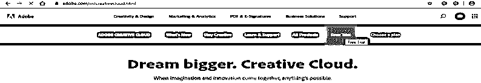

或者点击网页顶部的**所有产品**标签，查看创意云的产品。

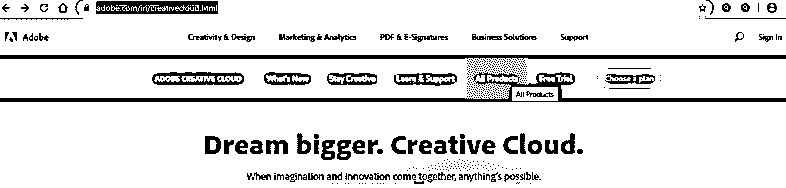

**步骤 3** :现在向下滚动搜索**Ai****Illustrator**(Adobe Illustrator)如果在网页屏幕上看不到的话。

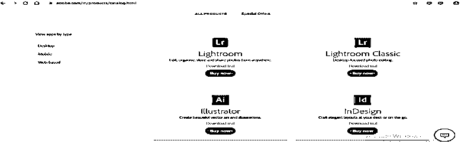

**第四步**:这里有两种安装方法。您可以下载试用版用于学习，也可以购买完整版用于商业用途。你可以根据自己的舒适度选择其中任何一个。

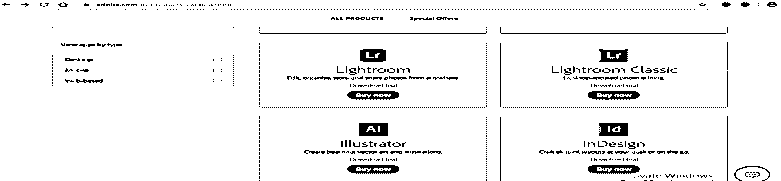

**第五步**:我会点击**下载试用**选项，这样我就可以分析这个软件是否对我有好处，然后在试用版之后，我会购买完整版。

**第六步**:现在，它会要求你**创建一个账户**或者**登录**，如果你已经有一个 illustrator 账户，或者你可以将它与你的脸书账户或谷歌账户连接。无论你想要什么，你都可以用它来注册一套创意云服。

**步骤 7** :要创建账户，用鼠标左键点击创建账户按钮。将会打开一个创建帐户的对话框；填写您的详细信息，然后点击此对话框的**创建帐户**选项卡，创建一个 creative cloud 帐户。

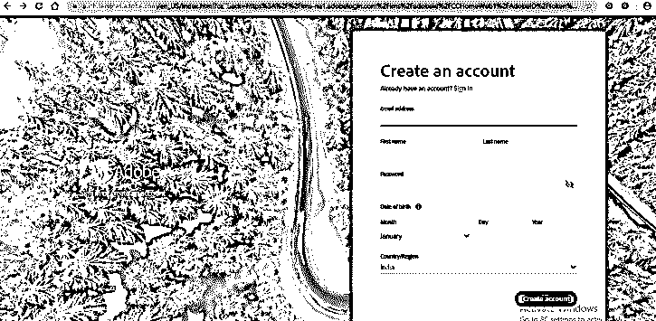

第八步:现在，当你在这里登录时，它会要求你输入一个可选的电话号码。如果您不想分享您的手机号码，请点击**现在不要**。

**第九步**:现在，它会问你插画的技巧，是初级、中级还是高级。根据自己的技能水平来选择吧。单击继续选项卡进行下一步。

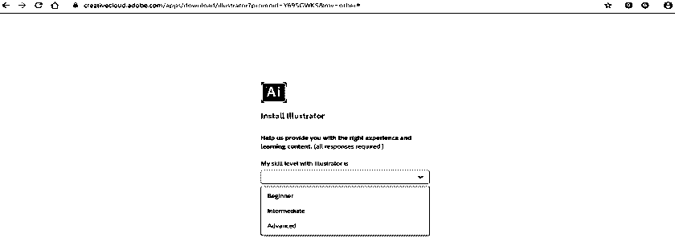

**步骤 10** :会显示一些信息，要求你**打开创意云桌面 App** 安装插画。单击该选项卡上的确定。

或者单击“取消”选项卡取消，然后单击网页屏幕左上角的“Creative Cloud”选项卡。

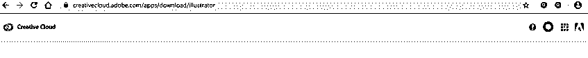

**步骤 11** :现在，Creative Cloud app 的主屏幕将在 web 上打开。点击 illustrator 软件的**尝试 illustrator** 选项。

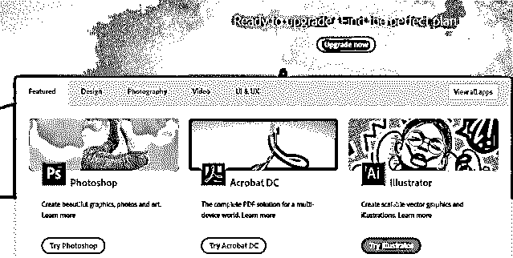

**步骤 12** :现在，它会显示两个选项，分别是**试用旧版**或**购买**。你可以选择其中任何一个。我将点击尝试旧版本免费试用。

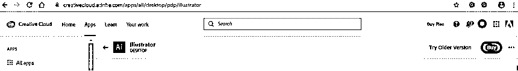

**步骤 13** :会再次要求**打开创意云桌面 App** 。

**步骤 14** :现在会打开一个安装对话框。在这里，您可以看到 creative cloud 应用程序中提供了所有版本的 illustrator。你可以根据自己选择其中任何一个。我会安装一个 Illustrator CC 版本。

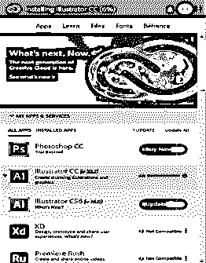

**第 15 步**:illustrator 软件的下载速度会取决于你的网速，它会时不时的给你显示下载完成的百分比。完成下载需要一些时间。

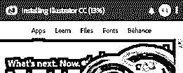

**步骤 16** :现在，下载完成后，会显示一个对话框。这里会显示试用天数，这意味着您可以在有限的时间内使用这个免费版本。现在点击这个对话框的**继续试用**按钮，在你的 pc 或笔记本电脑上安装免费版本。

**第 17 步**:现在开始安装 adobe illustrator 软件。

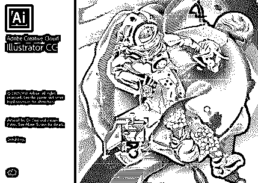

安装完成后，将会打开您的试用版。

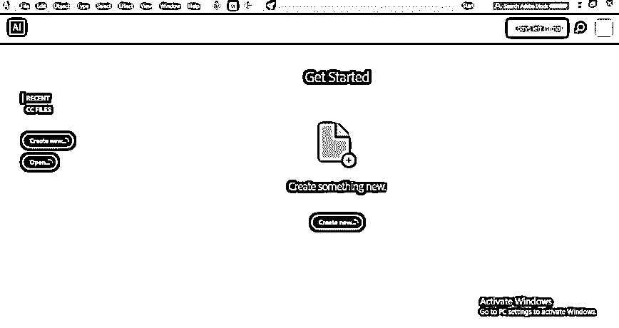

**第 18 步**:但是当你已经使用了试用版，它会显示**‘你的试用已经过期’**。然后用**许可这个软件**选项。

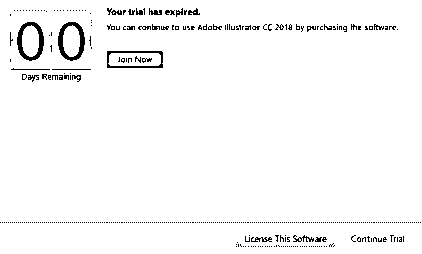

**第 19 步**:如果您退出 creative cloud suit，它会要求您重新登录。

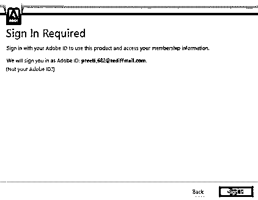

现在，如果你想买一台新的。单击打开对话框的新建订阅选项。

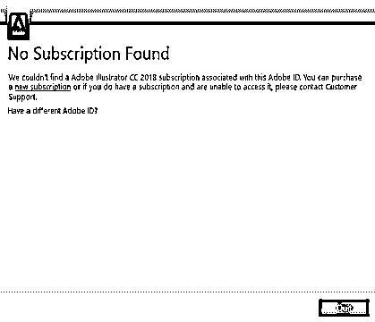

第 21 步:显示不同用途的支付套餐。您可以选择其中的任何一个，并在一些支付过程后获得完整版的 adobe illustrator。

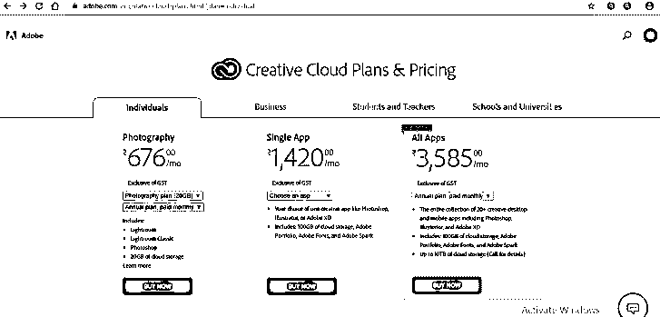

### 安装 Adobe Illustrator 的先决条件

*   我们需要英特尔奔腾 4 或 AMD 速龙 64 处理器。
*   我们需要 1 GB 和 2 GB 的 RAM 分别用于 32 位和 64 位。
*   要在 HiDPI 模式下使用 Illustrator，显示器必须支持 1920 x 1080 或更高的分辨率。
*   要使用 illustrator 的新触控工作区功能，您应该拥有支持触摸屏的平板电脑或操作系统为 Windows 8 或 Windows 10 的显示器。
*   NVIDIA Quadro K 系列、NVIDIA Quadro 6xxx、NVIDIA Quadro 5xxx、NVIDIA Quadro 4xxx、NVIDIA Quadro 2xxx 等。是一些与 illustrator 兼容的视频适配器。

illustrator 中还提供了其他一些先决条件和功能；掌握了之后，你就会熟悉它们了。

### 结论

在本文中，您可以看到 adobe illustrator 软件版本也与 windows 8 操作软件兼容。按照本文中给出的步骤，它可以很容易地安装在 windows 8 操作系统中。安装该版本后，您可以在 windows 8 操作软件中享受 illustrator 的任何版本。

### 推荐文章

这是适用于 Windows 8 的 Adobe Illustrator 指南。在这里，我们讨论了在 windows 8 中安装 adobe illustrator 的介绍和步骤。您也可以阅读以下文章，了解更多信息——

1.  [在 Illustrator 中栅格化对象](https://www.educba.com/rasterize-in-illustrator/)
2.  [在 Illustrator 中创建新图层](https://www.educba.com/layers-in-illustrator/)
3.  [如何在 Illustrator 中制作 3D 效果？](https://www.educba.com/3d-effects-in-illustrator/)
4.  [如何使用 Adobe Illustrator](https://www.educba.com/how-to-use-adobe-illustrator/)
5.  [后期效果中的 3D 效果](https://www.educba.com/3d-effects-in-after-effects/)
6.  [Adobe 特快专递](https://www.educba.com/adobe-speedgrade/)
7.  [安装 Adobe Creative Cloud](https://www.educba.com/install-adobe-creative-cloud/)

