# 如何使用 Adobe Illustrator

> 原文：<https://www.educba.com/how-to-use-adobe-illustrator/>

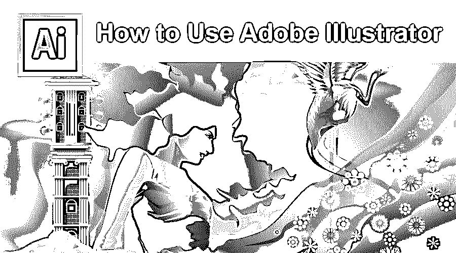

## Adobe Illustrator 简介

Adobe Illustrator 是业界标准的软件，用于高效、快速地创建矢量艺术和编辑图形，因为它提供了许多工具和效果，用户可以使用这些工具和效果来做一些事情，如涂鸦效果、创建小册子、使用钢笔工具、使用色板和颜色、享受图案的乐趣、使用网格工具、创建徽标等，但是，通过在 Illustrator 中不断练习和动手，人们可以很容易地触发他们脑海中的技能。

### Adobe Illustrator 中使用的各种工具

现在，我们将看看各种可用的工具，以及一些可以投入使用的实际例子。

<small>3D 动画、建模、仿真、游戏开发&其他</small>

#### 1.涂鸦效果

在这个软件中开始使用工具的最好方法是涂鸦效果。这意味着我们可以通过写一些文字来创造，在这些文字中我们可以使用基本的工具。当我们遇到不同的着色工具和不同的书写选项时，我们很容易习惯这些工具。

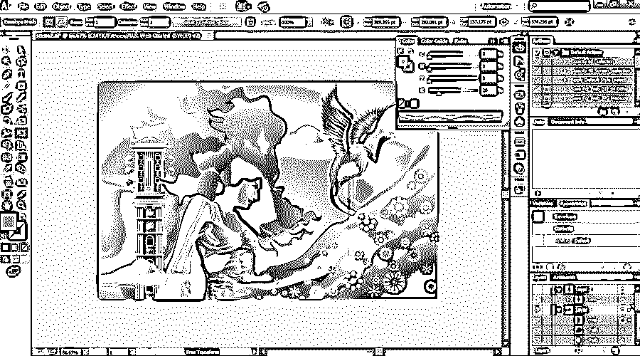

#### 2.制作小册子

这种先写文字后入门的方式是有关系的。带上任何一本小册子，开始设计，也就是说，试着将里面的文字融入其中。通过用不同的风格和字体写更多的文本，这给了更多的练习。通过这样做，我们可以制作不同的格式，如树形格式、曲线格式等。，提供学习高度、宽度、尺寸和布局的练习。

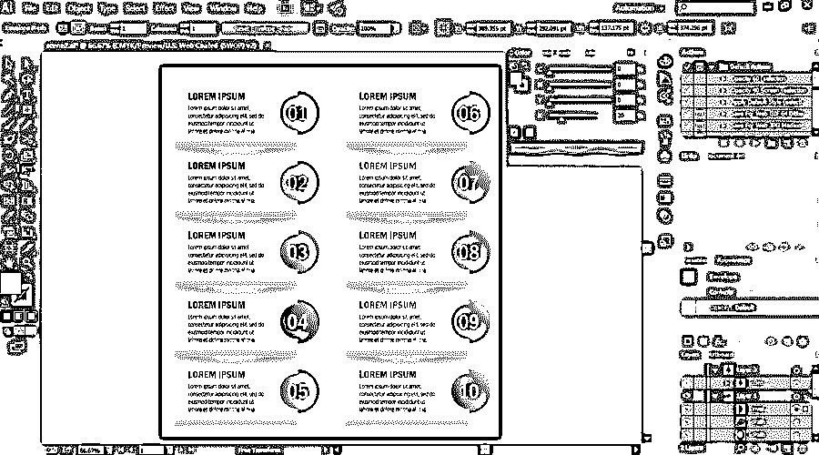

#### 3.使用钢笔工具

如果你想学习并想创建可以传输到 Photoshop 的图形，那么我们应该开始使用钢笔工具。这是这个软件中的另一个重要工具。通过使用钢笔工具，可以绘制简单的形状，从而创建复杂的徽标。最初，不要使用颜色制作图形；使用白色填充和黑色描边。这让你有更多的时间专注于你的图形。有一点值得注意，对于新生来说，最初的钢笔工具可能会很吓人，因为它与我们在笔记本上使用的钢笔是一样的。但是这支笔需要用鼠标访问，不是所有人都能兼容的；一旦你掌握了它，这就不是问题了。

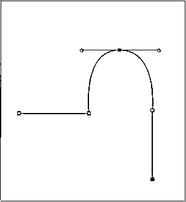

#### 4.使用钢笔工具增强技能

一旦我们知道如何使用钢笔工具，我们就可以从头到尾创建一个稍微复杂一点的设计。通过这样做，保持背景的黑白，直到我们提高我们的技能。

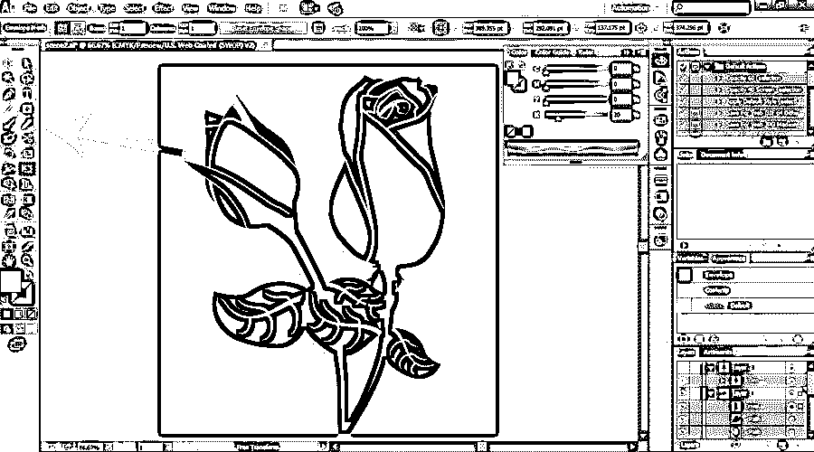

#### 5.学习形状和路径查找工具

当我们使用钢笔工具绘制图形时，很难完美地绘制一些形状，如圆形、椭圆形、矩形、三角形和星形。这是给你现成的形状，我们可以包括在我们的图形工具。如果我们在图形中使用这些形状，它会变得更漂亮，看起来更有吸引力。此外，对于复杂的物体，探路者工具可以帮助我们制作形状。

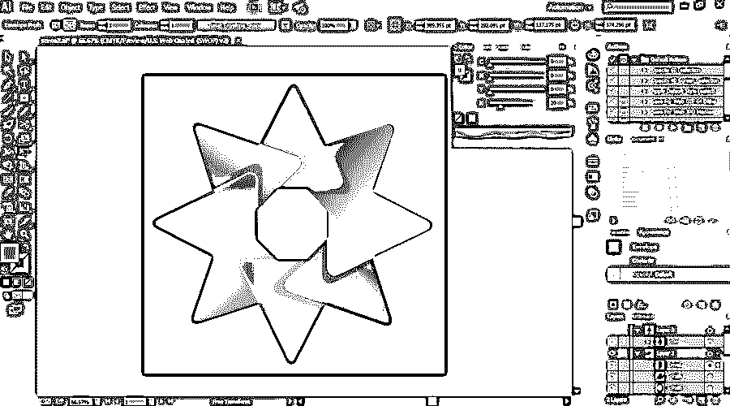

#### 6.使用色板和颜色

当我们能够使用形状和钢笔工具正确地画画时，那么可以说我们已经擅长画画了。现在我们可以使用不同的颜色来获得彩色图形。当我们进入“色板”面板中的下钻菜单时，我们会看到一个颜色指南工具栏，从中我们可以选择大量的颜色。最可爱的是肤色调色盘和基础图案纹理；我们可以用颜色来玩它们。

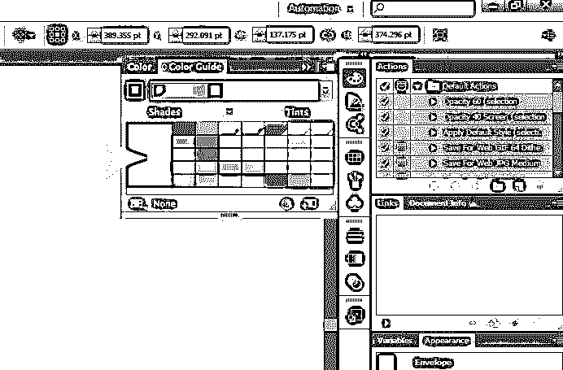

#### 7.享受图案带来的乐趣

嗯，这是一门艺术，你越玩越开心。使用更多颜色进行无缝游戏为您提供了更多创建新图形的方式。这里是模式选项，你可以想出无数的方法来创建纹理。这是我最喜欢玩的东西之一。

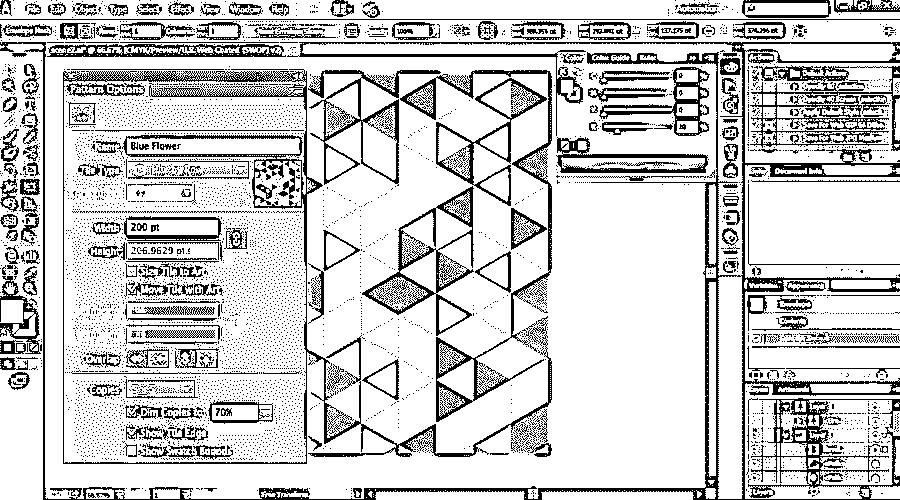

#### 8.网格工具的使用

这是这个软件中的另一个重要工具，用来使你的图形看起来更加真实和三维。当我们在图形中使用颜色时，它看起来像一幅画，所以这个网格工具用颜色更深地填充图形，并增强纹理。

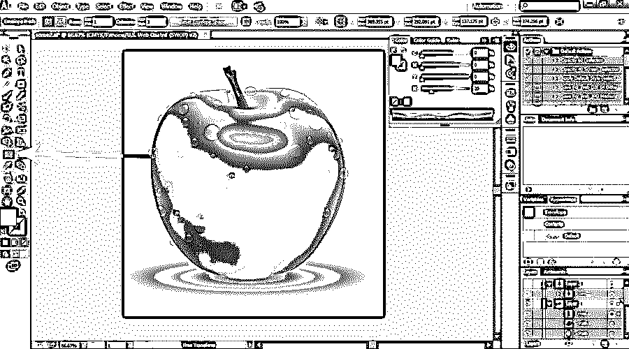

#### 9.测试你的技能

在 Adobe Illustrator 中学习完以上所有工具后，给自己时间检查一下自己学到了什么。画一个汉堡、篮子、球、瓶子或任何鸟的图形。

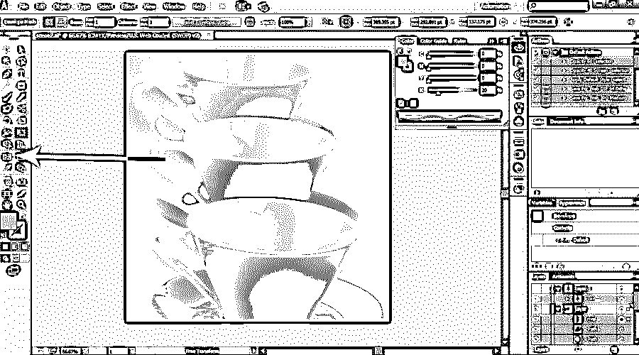

#### 10.创建您的个人标志

Adobe Illustrator 中的这些工具对于您的学习来说绰绰有余，因为您可以通过创建简单的布局来开始制作自己的徽标。如果你在某个地方卡住了，那么你也可以重复教程。

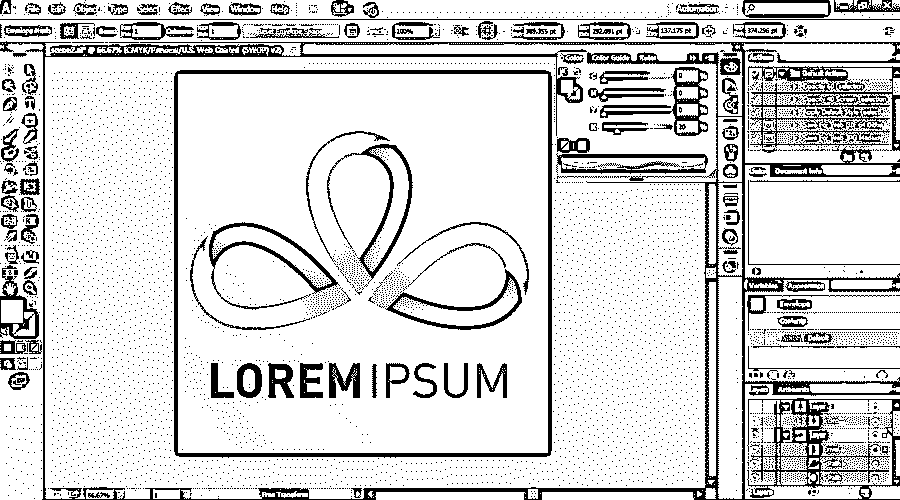

#### 11.制作结婚卡片

Adobe Illustrator 软件还为您提供了创建结婚卡、请柬或任何活动的任何卡片的可变选项。我们可以导入设计，也可以创建我们自己的设计，它给出了枚举来创建更无与伦比的设计。因此，如果你开始制作这些卡片和标识，你可能会选择你的新业务，给你一个无缝的机会。

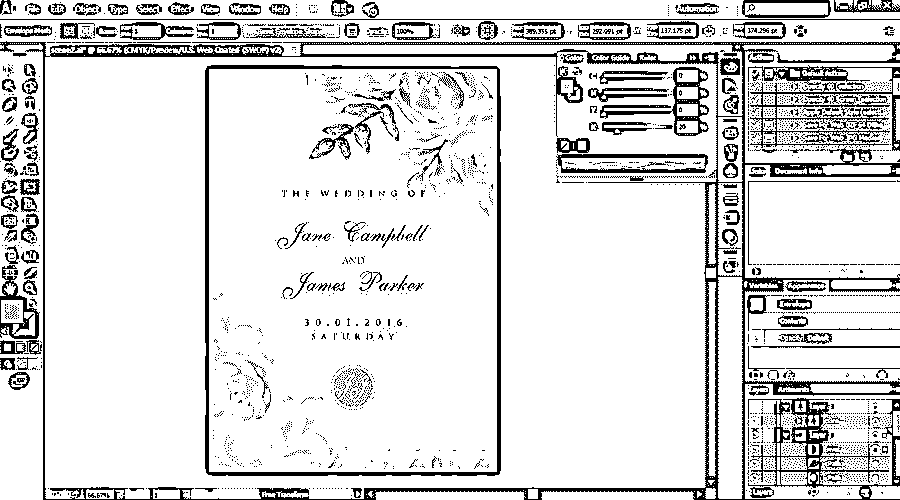

#### 12.图像跟踪

如果你想了解更多，那么有一个选项叫做图像跟踪。此选项允许您将 jpeg 图像导入软件。当图像加载到应用程序中时，我们可以跟踪图像。使用此选项，任何人都可以绘制三维图像，而无需任何绘图技能。

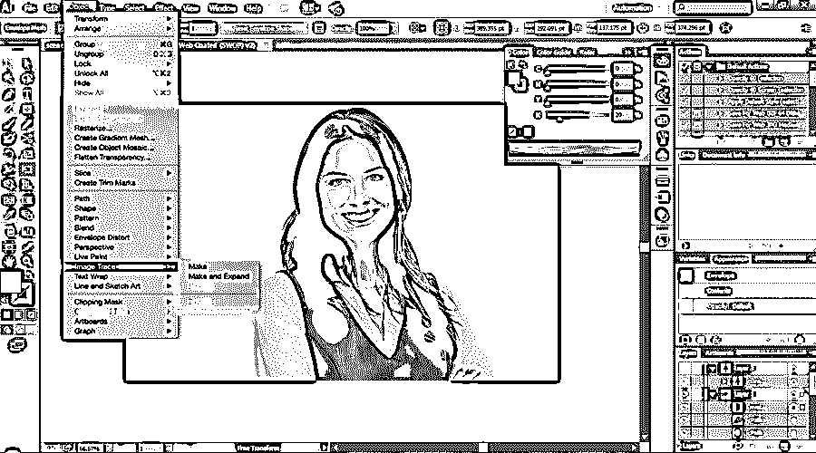

#### 练习图层面板

每个初学者都希望有现成的东西。上述工具对那些人来说更有益，因为他们已经准备好了一些图形。因为从长远来看，这是一种有组织的行为。

### 结论

由于 Adobe Illustrator 中的学习工具不是一件大事或一项艰苦的工作，它只是你所利用的实践和绘图技能的一部分。这就是使用 Adobe Illustrator 软件的优势，你不必投资金钱和花费大量时间。使用这些 Adobe Illustrator 工具也可以通过不断的练习和实践触发你脑海中的技能。

### 推荐文章

这是一个如何使用 Adobe Illustrator 的指南。在这里，我们讨论了 Adobe Illustrator 的介绍，使用了不同的工具和技术。您也可以阅读以下文章，了解更多信息——

1.  [给 Adobe InDesign 用户的提示](https://www.educba.com/ten-quick-tips-adobe-indesign-users/)
2.  [Adobe Photoshop 中的功能](https://www.educba.com/top-10-features-in-adobe-photoshop/)
3.  [面向初学者的 Adobe Illustrator】](https://www.educba.com/adobe-illustrator-for-beginners/)
4.  [适用于 Windows 8 的 Adobe Illustrator】](https://www.educba.com/adobe-illustrator-for-windows-8/)

