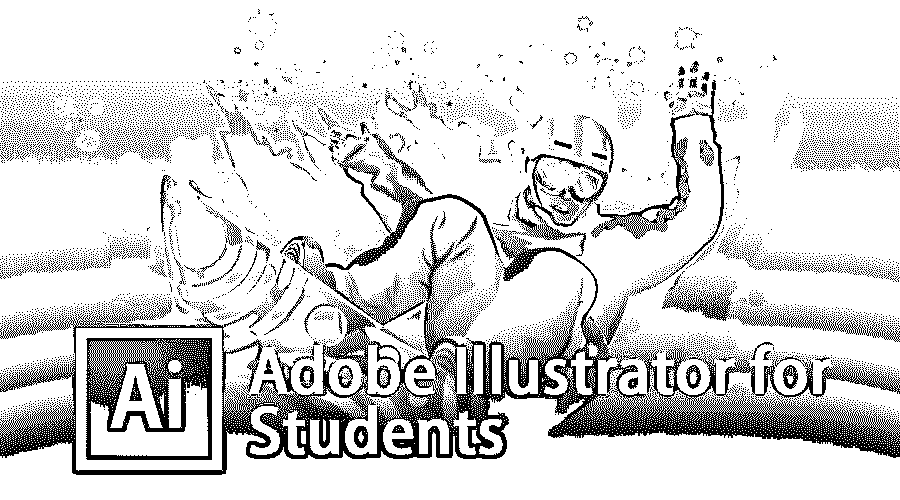
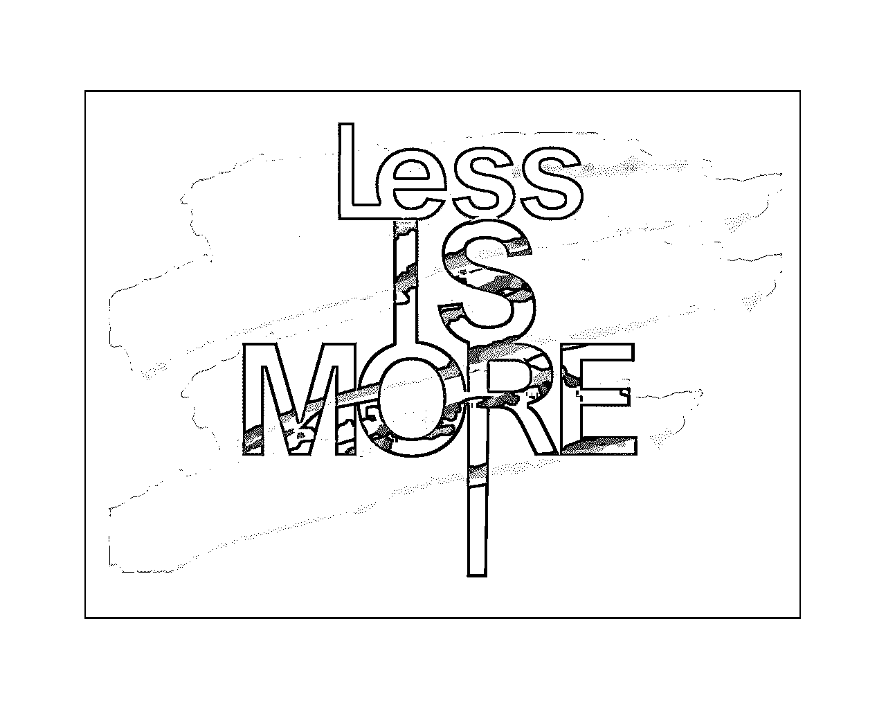
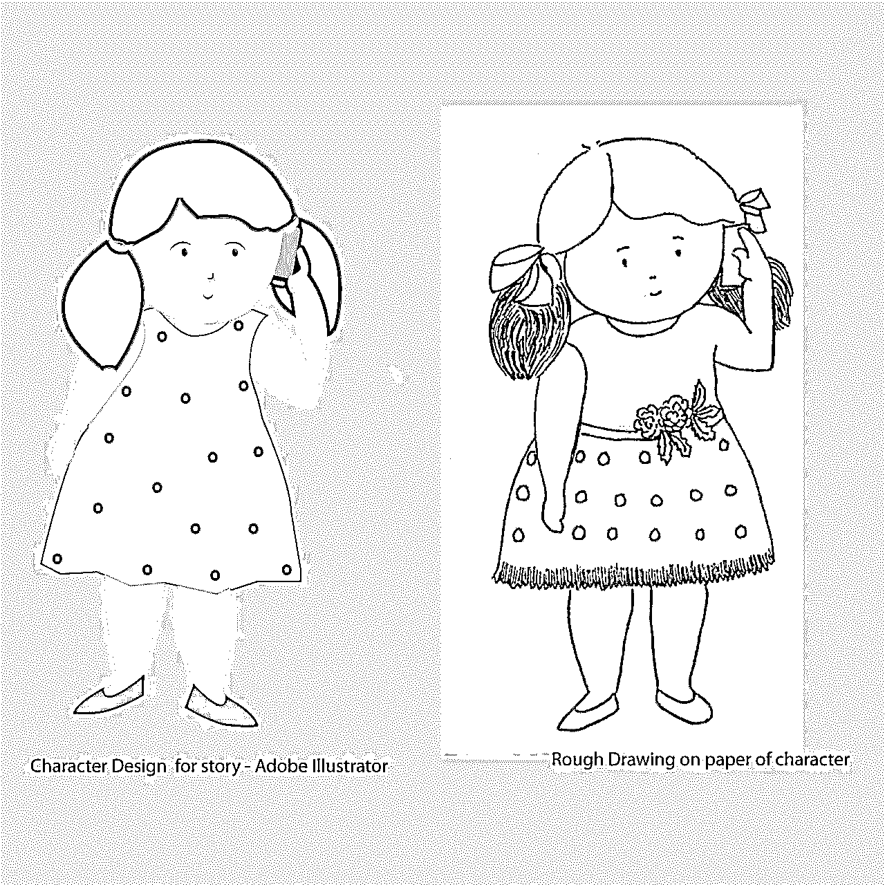
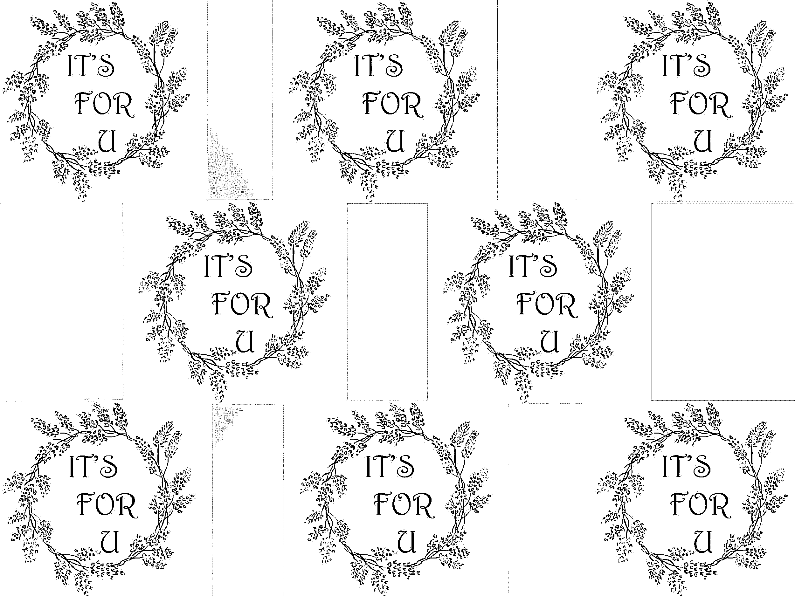

# 面向学生的 Adobe Illustrator

> 原文：<https://www.educba.com/adobe-illustrator-for-students/>

## 学生用 Adobe Illustrator 简介

Adobe Illustrator 是 Adobe System 于 1985 年设计的基于矢量的程序。面向学生的 Adobe Illustrator 更适合从头开始创建图形。Illustrator 对于设计图标、徽标、排版、数字艺术、等轴设计等非常有用。

Adobe Illustrator for students 是一个非常简单的程序，所以即使你是初学者，你也可以设计任何你想设计的东西。矢量编辑程序是基于数学测量的，而基于像素的编辑程序，如 Photoshop。位图编辑器在照片修饰、照片处理方面更有用。

<small>3D 动画、建模、仿真、游戏开发&其他</small>

在过去的几年中，图形产业有了巨大的发展。我们虚拟世界中的图形已经以各种方式展开了它们的翅膀。Adobe Illustrator 是使用的主要软件之一，在这个的帮助下，我们可以设计任何东西。

### 面向熟练学生的 Adobe Illustrator

我们之前已经讨论过这些矢量编辑器程序是如何有益于创建设计的。现在，让我们进一步讨论 Adobe Illustrator 学生应用程序，以超越我们的设计知识，提高我们的技能水平。都说学习是一个永无止境的过程，所以即使你从事的是设计行业。

这里有一些我个人喜欢的特定工具/主题。它们是印刷术，平面插图，字符设计，制图学，纺织工业的图案设计。

### 印刷术——写作的艺术

它实际上无处不在，例如书籍/报纸、网站，甚至日常生活中的路牌、广告牌、产品包装、海报、贴纸。

让我们来看看可以使用的不同字体。

*   **衬线**:这是一种非常常用的字体，因为它看起来很经典。在杂志和报纸上这是一个不错的选择。
*   San Serif- 在法语中，“San”的意思是没有，因此这些字体没有 Serif **中的小笔画。**这种字体在电脑、智能手机、平板电脑中使用较多。
*   显示字体有很多种，如 Script、BlackLetters、All Caps 和一个简单漂亮的外观。

这些字体在海报、标题或图形设计中很有用。

所以现在，希望你对字体有一点了解。在进行字体选择时，最好遵循简单的策略，“少即是多”。

### 字体设计

### 字体设计

对于任何创意项目，你都需要角色/物体/形状来向观众传达你的想法、想法和感受。只有这样，每个人才能轻松地与它建立联系。不幸的是，我们每天在电视、电脑、网站上看到如此多的卡通人物。

**我在 Adobe Illustrator 中的设计过程**

### 制图学

地图插图在决定不同国家的领土方面起着至关重要的作用。制图学是一门研究与天气、森林、河流、城市等所有相关方面的地图的学科。有不同类型的地图。其中一些是政治的、物理的和主题的。

### 模型设计

无缝图案对于在纺织工业中创建设计是有用的。Adobe Illustrator for students 可以非常轻松高效地完成这项任务，因为矢量编辑器程序加快了设计工作流程。此外，使用 Illustrator 中的工具可以轻松制作和创建几何形状或对象。

**图案设计水彩手绘在 Adobe Illustrator 中编辑**

### 面向学生的 Adobe Illustrator 五大工具

以下是 5 种工具:

#### 1.钢笔工具

钢笔工具是 Photoshop 中非常强大的工具之一。这个工具是我最喜欢的工具之一。然而，使用起来相当棘手，尤其是如果你是第一次使用它。你可以用这个工具制作任何形状或物体；钢笔工具可用于选择边缘非常尖锐的对象。

#### 2.魔杖

魔棒也是 Photoshop 中一个非常强大的工具。因此，在进行选择时，它具有非常重要的作用。一般来说，在全景照片中，如果一张照片的质量没有你想要的好，只需按下魔棒工具并点击删除按钮。

#### 3.愈合刷

这个工具在修饰照片时非常有用，尤其是旧的或损坏的照片。如果您想要移除任何对象，只需在内容感知选项打开的情况下按下修复画笔按钮。

#### 4.优化边缘/快速选择工具

快速选择工具可以非常快速地进行选择，而优化边缘对于创建对象的详细遮罩非常有用，尤其是在有羽毛状区域(如头发)的情况下。

#### 5.克隆图章工具

克隆工具就像一个真正的邮票。它创建了一个区域的副本，您可以选择并将这些像素复制或克隆到另一个区域。Photoshop 的这一功能在修图或照片处理中很有用。

### 面向学生的 Adobe Illustrator 概述提示

Adobe Illustrator for students 是一款为专业设计师和艺术家设计的矢量图形软件。它有各种各样的过滤器，渐变效果，形状生成器，钢笔工具-这些都是有效的设计工具。

它尤其用于设计网站图形、徽标、等轴设计、3D 设计、海报和印刷媒体的广告材料。

这个编辑器程序非常适合插图、草图、排版和时尚行业。Adobe Illustrator for students 还帮助设计师和艺术家快速高效地创作作品。

### Adobe Illustrator 的功能

它有许多强大的设计工具，可以创建优秀的图形。然而，我在这里，只解释其中的几个。

*   **形状构建工具**让您自由地将简单复杂的形状/对象组合成一个单一的对象。它节省了大量的时间来制作图标或标志，甚至任何几何形状。
*   **图像追踪**–图像追踪是插画师制作任何图案的最佳功能之一。您可以在 illustrator 中进行任何光栅图像描摹。
*   **在内部绘制**–如果你在项目中做了大量的遮罩工作，你完全可以依赖这个在内部绘制模式的特性。即使你画的东西超出了边界框，如果你在这个模式下，它也会自动纠正。
*   **透视工具**–如果你经常在建筑行业甚至是设计行业工作，它是 Adobe Illustrator 中非常重要的工具之一。

### 结论

Adobe Illustrator for students 是设计创意作品的完美程序。它给你无像素的精确结果与脆边。此外，借助 Illustrator 的多窗口功能，绘图工具的灵活性可确保您在项目中获得更好的细节。Adobe Illustrator for students 也有一些新的功能和改进，使其更容易用于绘图和编辑。

我希望这篇 Adobe Illustrator for Students 文章已经给了你足够的指导和信息来开始矢量设计，这将有助于你在职业生涯中取得成功。

### 推荐文章

这是给学生的 Adobe Illustrator 指南。这里我们已经讨论了面向学生的 Adobe Illustrator 的概念、类型、功能等。您也可以阅读以下文章，了解更多信息——

1.  [面向初学者的 Adobe Illustrator】](https://www.educba.com/adobe-illustrator-for-beginners/)
2.  [适用于 Windows 8 的 Adobe Illustrator】](https://www.educba.com/adobe-illustrator-for-windows-8/)
3.  [Adobe Illustrator 工具](https://www.educba.com/adobe-illustrator-tool/)
4.  [适用于 Windows 的 Adobe Illustrator】](https://www.educba.com/adobe-illustrator-for-windows/)

