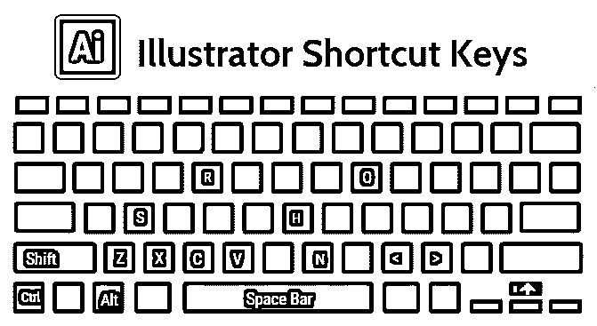

# Illustrator 快捷键

> 原文：<https://www.educba.com/illustrator-shortcut-keys/>

## Illustrator 快捷键介绍

Adobe Illustrator 的界面很人性化，只要一点点练习就能很快学会。为了让你的工作更容易，我们收集了各种有用和方便的 Illustrator 快捷键。您可以使用它们来控制一些事情，如创建文档、快速选择、更改文本大小、为您的设计选择工具、保存您的工作等等。

试着将下面列出的 Illustrator 快捷方式逐渐应用到你的实践中，改变你的 Illustrator 体验。

<small>3D 动画、建模、仿真、游戏开发&其他</small>

### Illustrator 的 18 个快捷键

让我们来看看前 18 个快捷键:

#### 1.创建新文档

对于 Mac 使用快捷键+ N，对于 Windows 使用快捷键 Ctrl + N。这在尝试创建新文档时很有帮助。它将引导您进入页面布局，您可以根据自己的喜好选择合适的文档。

#### 2.拾取图层上的所有对象

在 Mac 中快捷键是 Option + Click layer，在 Windows 中是 Alt+Click a layer。如果您需要选择该层中的所有组件，您只需点击 option 键并选择所需的层。这使您可以选择所有锁定和不可见的层。

#### 3.手工工具

对于 Mac 和 Windows 用户，快捷键是空格键。在 Mac 和 Windows 中，按住空格键可以激活抓手工具。您可以轻松地在画板上悬停，而不会影响内容。但是，当您编辑文本时，此选项无效。

#### 4.放大和缩小工具

在 Mac 中，缩放的快捷键是 CMD +空格键，在 Windows 中是 Ctrl +空格键(出现一个带+符号的放大镜)。对于 Mac，它是 CMD + Option +空格键；对于 Windows，它是 Ctrl + Alt +空格键(出现一个带–符号的放大镜)，用于缩小。

当您在编辑模式下需要使用手形工具时，请根据您的设备分别使用上述键盘。您可以使用鼠标左键在放大和缩小场景之间切换。

#### 5.交换选择或方向选择工具

Mac 快捷键是 CMD，Windows 快捷键是 Ctrl。这是一个非常有用的快捷方式和实时节省时间，允许选择和[直接选择工具](https://www.educba.com/direct-selection-tool-illustrator/)之间的交换。

#### 6.精确移动选定的对象

Mac 中的快捷键是 Shift +箭头键，Windows 中是 Shift +箭头键。使用此快捷方式以固定且均匀的距离精确移动任何 Illustrator 元素。

#### 7.选择多个对象

Mac 和 Windows 中可用的快捷键是 Shift + click。您可以选择多个对象，四处移动它们，并将其添加到一个组中，以进行进一步的设计修改。

#### 8.锁定层中的对象

Mac 中的快捷键是 CMD+2，Windows 中是 Ctrl+2。在处理具有多个图层的复杂项目时，这是避免妨碍您工作的艺术品的有效方法。

#### 9.解锁所有图层项目

Mac 快捷键是 CMD+Option+2，Windows 是 Ctrl+Alt+2。使用此快捷方式，您可以一次释放所有锁定的图层。否则，您将不得不逐个滚动图层面板来完成此操作。

#### 10.克隆对象

Mac 中的快捷键是 Option +拖动，Windows 中是 Alt +拖动。如果您需要复制任何对象，只需使用上面的快捷方式，并创建所选对象的副本。您可以选择多个对象，并使用此方法克隆它们。

#### 11.使用选择工具按比例缩放

对于 Mac 和 Windows 设备，快捷键 Shift+拖动边界框是相同的。均匀缩放所选图稿，同时保留缩放比例。

#### 12.吸管工具

在 Mac 和 Windows 中，按 I 键作为快捷键。这使你能够通过激活[吸管工具](https://www.educba.com/eyedropper-tool-in-illustrator/)从形状、图像或渐变中挑选颜色。

#### 13.显示/隐藏画板

Mac 中的快捷键是 CMD + Shift + H，对于 Windows，是 Ctrl+Shift+H。Illustrator 中最大可能的可打印区域由包围画布区域的实线限定。您可以使用上述快捷命令显示/隐藏它们。

#### 14.显示/隐藏画板标尺

在 Mac 中的快捷键是 Cmd + R，在 Windows 中是 Ctrl+R。根据您对齐图稿的需要来打开和关闭标尺。

#### 15.查看所有画板

Mac 快捷键是 CMD + Option+ O，Windows 快捷键是 Ctrl+Alt+O。这允许您同时查看所有画板。

#### 16.放大/缩小字体大小

Mac 快捷键是 CMD+Shift+ ，Windows 快捷键是 Ctrl+Shift+ 。这是一个快速简单的方法来改变你的工作区的字体大小。

#### 17.在屏幕之间跳转

F 键在 Mac 和 Windows 系统中都是快捷键。它使用户能够在多种屏幕模式下查看他们的作品，如正常、全屏、菜单栏和全屏。

#### 18.为 Web 和设备保存

Mac 用户的快捷方式是 CMD + Shift + Opt + S，Windows 用户的快捷方式是 Ctrl + Shift +Alt + S，这种快捷方式使设计人员不必为了保存文件而在多个选项中拖动鼠标光标。

### 奖励快捷键一览

| **快捷键** | **Mac** | **窗户** |
| 取消 | Command + Z | Ctrl + Z 组合键 |
| 重做 | Shift + Command + Z | Shift + Ctrl + Z |
| 切口 | Command + X | Ctrl + X |
| 复制 | Command + C | Ctrl + C |
| 粘贴 | Ctrl + V | Command + V |

### 结论

Illustrator 提供了无数的选项和工具来创建令人惊叹的专业艺术品。因此，直接从菜单栏中选择这些选项和工具将会非常耗时和费力。因此，不要走长路，利用上面列出的 illustrator 快捷键，这将有助于提高您的工作效率。开始在你的项目中使用这些快捷方式，优化你的工作时间。

### 推荐文章

这是 Illustrator 快捷键指南。这里我们讨论 Illustrator 的 18 个最顶端的快捷键及其功能。您也可以看看以下文章——

1.  [CorelDRAW 快捷键](https://www.educba.com/coreldraw-shortcut-keys/)
2.  [Illustrator 自由变换工具](https://www.educba.com/illustrator-free-transform-tool/)
3.  [在 Illustrator 中移除背景](https://www.educba.com/remove-background-in-illustrator/)
4.  [Illustrator 中的图章效果](https://www.educba.com/stamp-effect-in-illustrator/)

