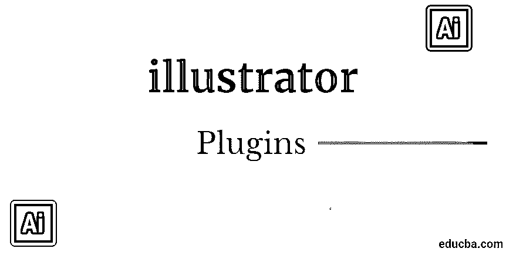
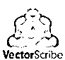
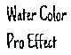
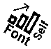
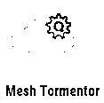

# Illustrator 插件

> 原文：<https://www.educba.com/illustrator-plugins/>

## Illustrator 插件简介

Illustrator 插件是 Adobe 矢量工具的有益补充。在每个最新版本中，Adobe Illustrator 都试图扩展其强大的矢量编辑功能。此外，市场上有各种各样的第三方 Illustrator 插件，可以节省您的时间，并为您的绘画增添一点光彩。

在图形行业， [Adobe Illustrator 被认为是最强大的矢量软件。它主要用于绘制草图、图表、卡通、标志和图表。与将数据缓存在点网格中的位图图像相比，Illustrator 利用数学计算来勾画形状。这使得矢量图形变得可缩放，因为这不会导致分辨率的损失。](https://www.educba.com/what-is-adobe-illustrator/)

<small>3D 动画、建模、仿真、游戏开发&其他</small>

### Illustrator 的顶级插件

以下是 Illustrator 的顶级插件，如下:

#### 1.电影器皿

如果你想使用 3D，Cineware 是 MAXON 与 TurboSquid 合作开发的插件，是免费的。这个程序是入门级的，非常适合那些对 3D 工具感到畏惧，但仍然想用媒体进行测试的平面设计师。该插件允许消费者导入任何可用的 4D 影院文件，并平衡照明、纹理和视图，以将 3D 元素与 2D 设计相结合。

#### 2.矢量脚本 v3

你可以用 VectorScribe 控制向量，它的发明者把它定义为一把基于向量的瑞士军刀。您可以利用此工具来控制路径、控制柄和点，从而在您想要编辑和减小文件大小时使您的工作变得简单。

您可以制作和编辑您想要的任何形状，并将各种风格的边缘应用到您的设计中，在 VectorScribe 有效测量的帮助下，您可以快速准确地估计从直线长度到路径面积和角度的一切，当您需要精确正确的尺寸时，消除任何假设。

#### 3.淘金热

为了给你的设计提供一个优雅的外观，你可以使用 Gold Rush，这是一个插件，它提供了你所需要的所有金属箔、金属和闪光效果。它包含 218 个光栅格式的样本和 35 个笔画元素。

这套包括皱巴巴的箔，热箔效果，金属漆，金叶，等等。它不仅有金色可选，还有玫瑰金、银色、铜色和黑色可选。

#### 4\. VectorFirstAid V2

这是由 Astute Graphics 开发的 VectorFirstAid 的最新版本，在它的帮助下，只需单击一下按钮，就可以清理矢量文件。这个插件是概述，以便它有助于删除多余的信息和膨胀，可以与进口艺术品。

《VectorFirstAid》的最新特点 V2 注重文本的把握。随着合并文本行引擎的重建，它现在支持转换和/或旋转，并保持跟踪、字距调整、下标和上标、缩进等。其中一个功能工具是对齐点文本，它可以将文本对齐到一边，并消除文本转换。

#### 5.吸收

在 Illustrator 中使用斑点画笔工具时，将多个路径桥接为一个恒定路径的插件过滤器，该过滤器可以找到与“合并路径”命令的相似性。

Concatenate 包括一些附加特征，其中包括同化功能，该功能检查被选择的区域或未被选择的路径层，并合并它们。

#### 6.Everdrifter 水彩专业效果

这个插件提供了水彩风格的笔刷来为你的设计提供一个实用的绘画效果。

一个巨大的工具包是目前，你可以访问 12 水彩人工智能画笔和 49 水彩背景瓷砖。它还拥有超过 42 种即时水彩效果图形风格和 50 种实用颜料。

#### 7.字体制造商

这个插件对设计师来说非常重要。它允许您从自己的雕刻中生成标准和彩色矢量字体。这将使你的设计独一无二，并提供一个创造性的优势。

使用这个插件非常简单，只需将你的雕刻拖放到 Fontself Maker 面板中，剩下的事情就由它来完成了。完成字体后，您可以将其导出为. otf 字体文件格式，并在设计中随时使用。

#### 8.幻影 v3

这个插件以简单著称。它有效地充当了 photoshop 和 illustrator 之间的中介，为矢量平面图添加了位图编辑功能和替代方案。它包括色调，饱和度和曲线，自动化功能，级别等。

它提供半色调和双色调的替代品，非破坏性的影响。它还提供了叠印预览和分色选择，为 Illustrator 的军械库增加了一些重要的印前重量。

#### 9.魔法出口商

由 Jeremy Marchand 开发的 Magic Exporter 揭示了从人工智能文档导出对象项到网络可用的 PNG 文件的过程。使用 Magic Exporter，您只需标记您需要的对象，然后在专用菜单的帮助下将其导出。您不必手动隐藏或切割层来导出对象。

#### 10.耶姆兹网折磨者

艺术家们对 Illustrator 中的渐变网格有不同的看法。有些人认为它们提供了灵活性和实用性，但有些人认为它们只是试图模仿图像，但无论你站在哪一边，mesh tormentor 都使这个过程变得简单快捷。

20 个新的按钮是可访问的，这为您提供了将结转化为顶点，反射，旋转和移动颜色，将网格转化为路径段等能力。

### 结论

Adobe Illustrator 可用的插件可以在标准和时间方面增强艺术性。Illustrator 插件扩展了 Adobe Illustrator 的明确目的，允许消费者改进其设计的特定功能。它们允许消费者在 Illustrator 无法提供的高端功能的帮助下，提供外观出众的最终结果。插件具有成本效益，节省时间，支持清晰度，在一个文档中包含多个版本，并提供额外的特性，如 CAD 功能和 3D 预览。

### 推荐文章

这是一个插画插件指南。在这里，我们讨论了当前行业中使用的 10 大插画插件的概念。您也可以浏览我们推荐的其他文章，了解更多信息——

1.  [玛雅工具](https://www.educba.com/maya-tools/)
2.  [Adobe Photoshop 工具](https://www.educba.com/adobe-photoshop-tools/)
3.  [自动化测试工具](https://www.educba.com/automation-testing-tools/)
4.  [Illustrator 中的标志设计](https://www.educba.com/logo-design-in-illustrator/)

