# Illustrator 自动跟踪

> 原文：<https://www.educba.com/illustrator-auto-trace/>

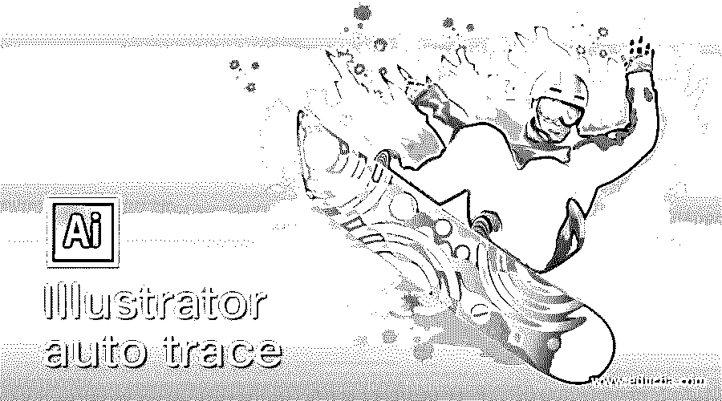

## Illustrator 自动描摹简介

自动跟踪作为它的名字显示了它的工作作为一个跟踪功能的东西。是的，这是一个功能，通过它您可以跟踪任何光栅图像，并将其转换为矢量形状。使用此功能，您可以根据需要跟踪有轮廓或无轮廓的图像。自动描摹允许您以灰色模式、不同范围的颜色组合、黑白模式等进行描摹。这取决于你的选择，你可以用任何一种追踪方法。本文将通过一个例子讨论自动跟踪，并了解该特性的重要参数。在本主题中，我们将学习 Illustrator 自动描摹。

### 如何使用 illustrator 中的自动描摹功能？

自动跟踪是这个软件的一个非常令人兴奋的功能，它有助于快速跟踪你从任何地方选取的任何图像，并将其转换为矢量图像。现在让我们有一个新的文档来开始我们的文章，所以在 illustrator 软件的欢迎屏幕上单击 Create New document 按钮。

<small>3D 动画、建模、仿真、游戏开发&其他</small>

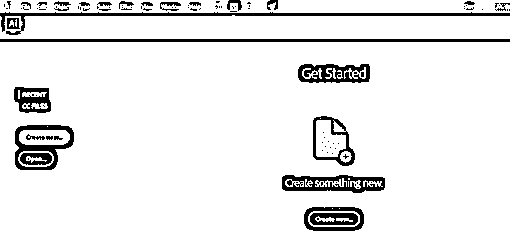

从“新建”文档对话框中选择所需的文档尺寸，然后点击“创建”按钮。

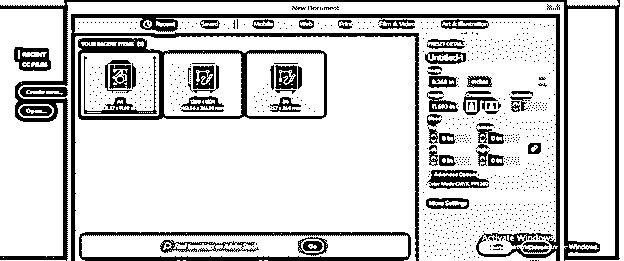

现在，让我们拍摄一张想要追踪或转换成矢量形状的图像。为此，请转到所需图像的保存位置，从那里选取它，然后将其放入 illustrator 的文档区域。

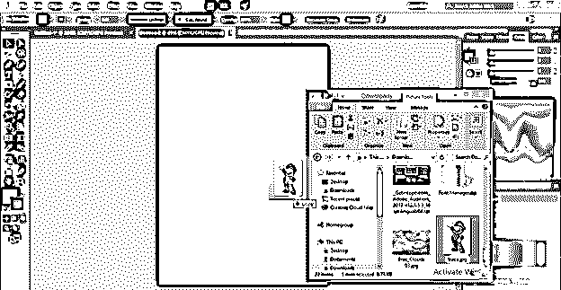

根据您的选择设置其大小。我们有两个选择去图像跟踪功能。第一个当您选择任何图像时，您将在该软件的参数栏中激活一些参数和属性。您将在此栏中看到“图像跟踪”选项卡，它位于“编辑原稿”选项卡旁边。

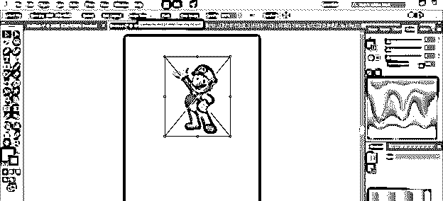

下一个选项是转到菜单栏的对象菜单并点击它。您将在下拉列表的底部找到图像追踪选项及其其他子选项。

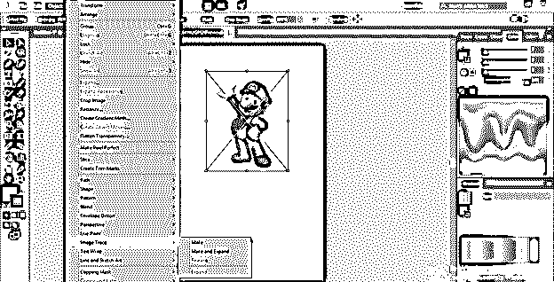

现在，让我们通过这个特性来了解它。因此，到图像跟踪选项，并点击制作选项跟踪您选择的图像。

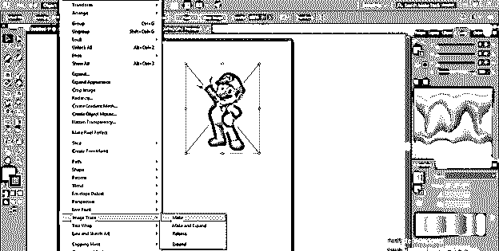

现在，在跟踪您的图像后，它会将其转换为默认的跟踪格式，即黑白彩色跟踪。描摹完成后，您将在“参数”选项卡中看到图像描摹选项参数。

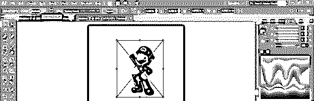

如果您想要单独的图像跟踪选项参数面板，则单击图像跟踪选项参数栏的“图像跟踪面板”选项卡。

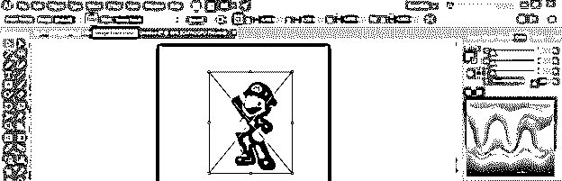

这是图像跟踪面板盒。在更改此框中的参数之前，请勾选此框底部的预览按钮。

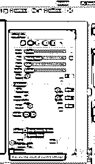

我们在这个框中有不同的跟踪预设，包括彩色跟踪、灰色跟踪、素描艺术跟踪和许多其他预设。你可以和任何人一起去，我建议你在学习期间分析每一个预设，以便更好地理解描摹。

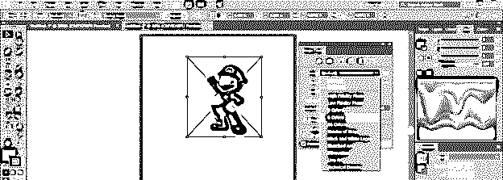

如果您选择 6 色选项，那么它将在跟踪过程中跟踪图像的最大颜色。

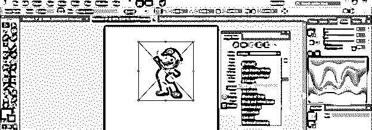

为了更好地跟踪这个图像，我将使用 3 色跟踪预设，我会得到这个结果。

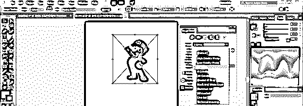

使用此选项，您可以用轮廓描绘此图像。

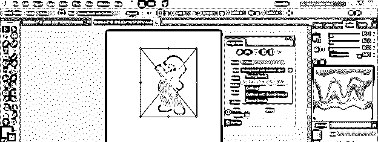

如果你想跟踪你选择的图像的轮廓，那么使用视图选项中的轮廓选项。

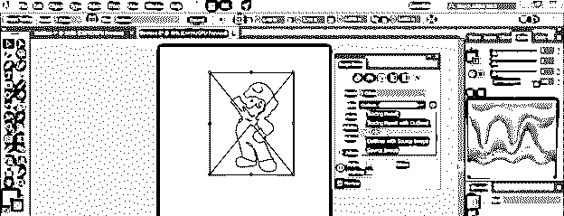

现在来看看这个盒子的模式选项。这里如果你选择灰度选项，那么你将得到这种类型的灰色结果。

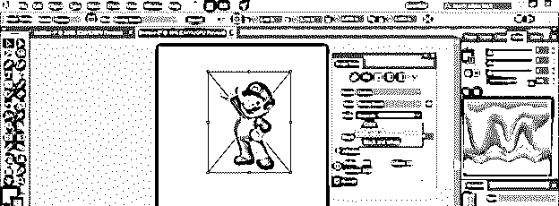

对于这种类型的结果，您也可以使用黑白选项。

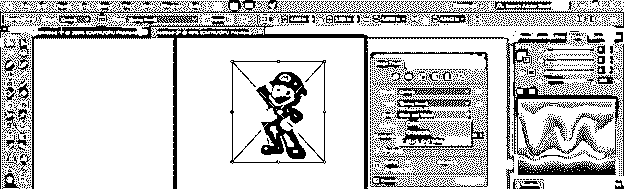

这里来定制预置选项。使用色阶选项，您可以定义图像中使用的颜色范围。我建议你使用最少的颜色以获得更好的效果。

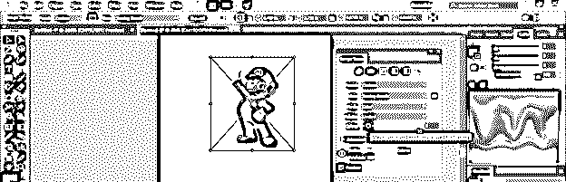

现在来看高级选项。单击此选项的下拉箭头，获取高级选项的所有高级参数。

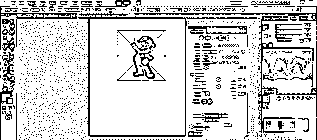

路径比例定义了图像中使用的路径。如果你选择的路径值比你描摹的图像中的要小，那么路径就会少，但是它可能会扰乱你的图像的形状，所以在设置路径值的时候要选择最小的值，不要扰乱你的图像的形状。最小路径会给你更少的矢量形状的锚点，这将很容易处理。

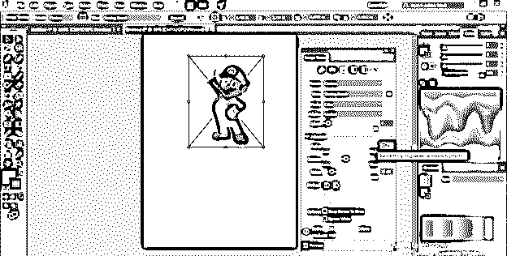

角的值与路径选项的作用相同。更少的角意味着更少的节点，这将很容易处理向量形状，但要确保你选择的角不会破坏向量形状。

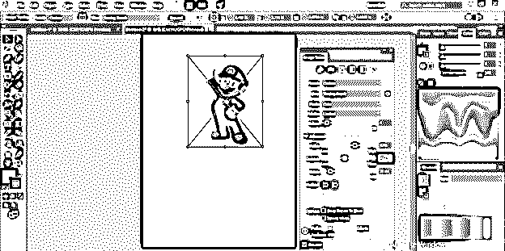

噪波值将定义您的矢量形状中使用的像素，因此根据您的要求，取噪波值，但值越小越好。您可以通过更改噪波比例上的噪波值来检查最佳结果。

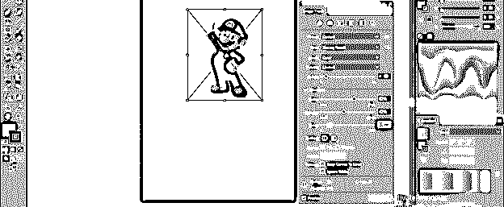

一旦你在图像跟踪框中设置了所有的参数，打开参数栏中的选项选项卡，点击它，通过跟踪将你的图像转换成路径…

你会得到这种矢量形状。

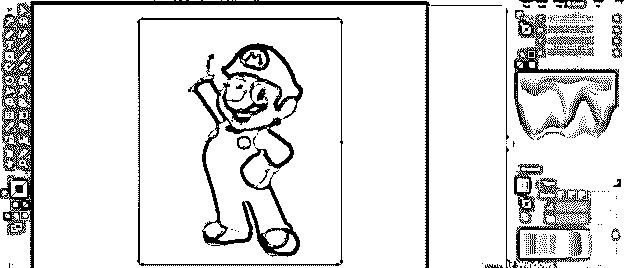

要单独使用所有路径，右键单击此图像，然后单击列表中的解组选项。

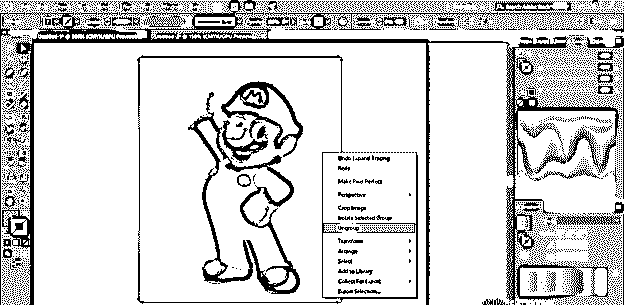

我将通过选择并按下删除按钮来删除此图像的背景。

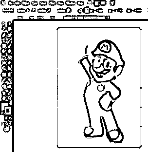

现在改变它的颜色，用直接选择工具选择它，然后点击参数栏的重新上色选项。

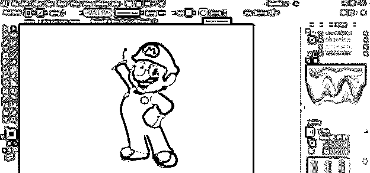

在这个框中，您将会看到此图像中使用的所有色阶。在这个图像中，使用了 4 种颜色。通过单击要更改的色标来选择色标，然后单击色标框，色标框位于色标框对话框的底部。

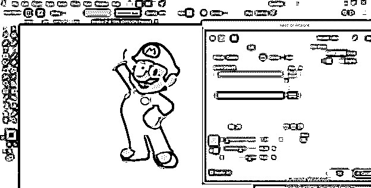

选择你想要的颜色来替换之前的颜色，然后点击 Ok 按钮。

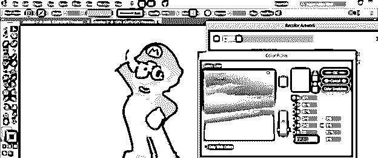

如果您想要更改所有颜色，请对所有颜色执行相同的操作。

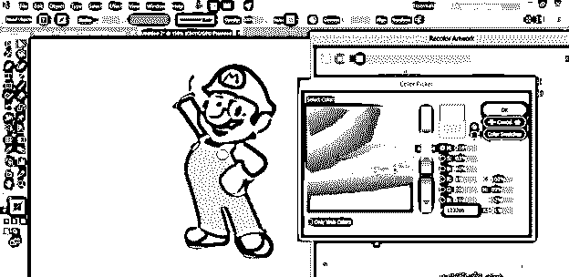

这样，您可以在 illustrator 中使用自动描摹。

### 结论

你觉得怎么样？从这篇文章了解到自动描摹功能是不是 illustrator 的一个非常好的功能。我想你的答案是肯定的；这是一个非常令人兴奋和有用的功能，通过它您可以快速跟踪任何图像并将其转换为矢量形状。

### 推荐文章

这是 Illustrator 自动描摹指南。在这里，我们通过一个例子来讨论如何使用 illustrator 中的自动描摹功能，并了解该功能的重要参数。您也可以看看以下文章，了解更多信息–

1.  [Illustrator 中的动作](https://www.educba.com/action-in-illustrator/)
2.  [在 Illustrator 中创建表格](https://www.educba.com/create-table-in-illustrator/)
3.  [Illustrator 中的画笔](https://www.educba.com/brushes-in-illustrator/)
4.  [Illustrator 中的金属效果](https://www.educba.com/metal-effect-in-illustrator/)

