# Illustrator 中的月亮

> 原文：<https://www.educba.com/moon-in-illustrator/>

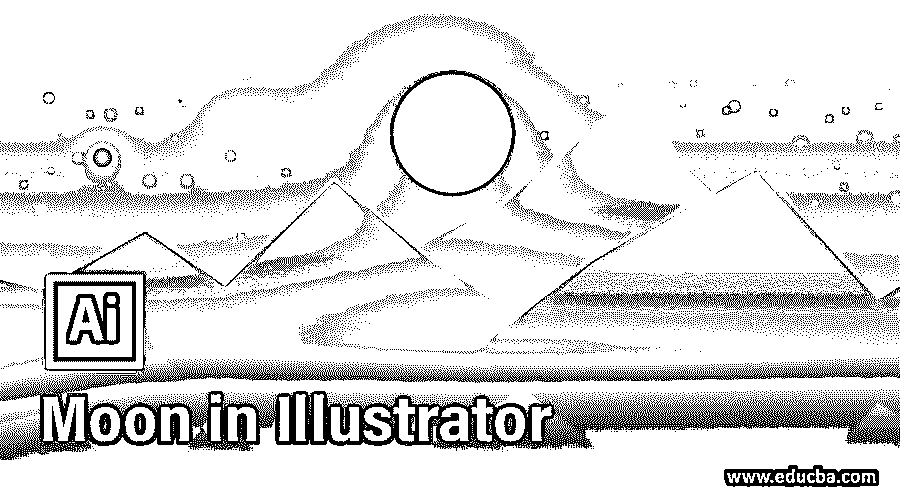

## Illustrator 中的月亮介绍

Adobe Illustrator 是一款矢量绘图软件，是专业人士最喜欢的矢量艺术图形设计软件包。在本文中，我们将在 adobe illustrator 2020 中创建一个月亮的图形设计，它将强调形状和渐变填充的使用。我们也将使用形状生成器工具，探路者工具，和笔刷工具来获得额外的效果，并且使用一个小火箭来获得透视效果。月亮的背景是夜空，上面有一些星星，一些星星会从夜空中落下来。

### 如何在 Illustrator 中创建一个月亮？

**步骤 1:** 我们将使用所有标准设置创建一个新文档，并将宽度设置为 2560px，高度设置为 1440px。将方向设置为横向，将画板设置为 1，出血也是 0 像素，颜色模式为 RGB 颜色，还有另一个 CMYK 选项，如果我们使用它来打印，这很有用。但是因为我们不打印，我们把它留在 RGB 模式。此外，设置光栅效果为屏幕，因为我们没有使用任何光栅效果，如投影等。

<small>3D 动画、建模、仿真、游戏开发&其他</small>

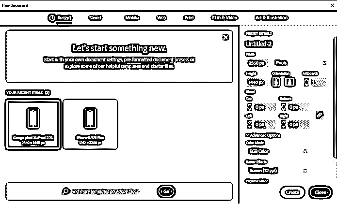

**步骤 2:** 选择矩形工具或按 M 键创建一个矩形，然后在空白画布上单击，并设置与画板相同的尺寸。

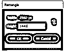

**第三步:**使用选择工具抓取矩形并与画板对齐，然后选择渐变工具或按 G 键创建背景。将线性渐变的角度设置为 90 度，将白色设置为深蓝色。此外，将描边更改为“无”。

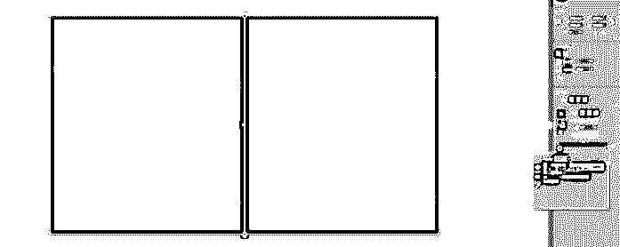

步骤 4: 将当前图层的名称改为“背景”，这样我们就不会意外地更改它，然后创建一个新图层，命名为“主艺术”，我们将在上面添加其他对象。

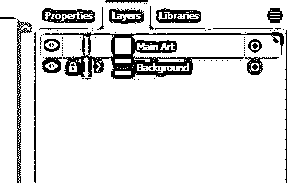

**步骤 5:** 如下图并排创建两个圆，设置宽度和高度为 540px。

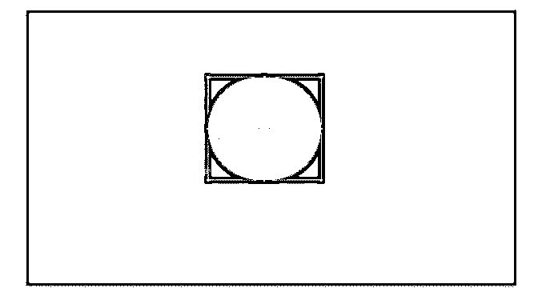

**步骤 6:** 使用形状生成器工具或点击 shift + M 激活并移除右边部分，这样我们可以在左边部分创建一个显示。若要移除，请按住 alt 并左键单击，然后填充第一个圆以创建一个阴影。

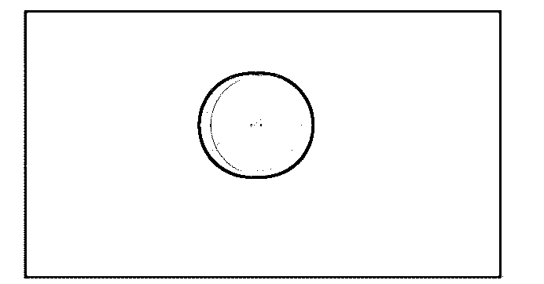

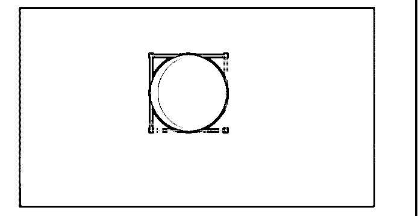

第七步:然后使用椭圆工具在月球表面创建斑点。

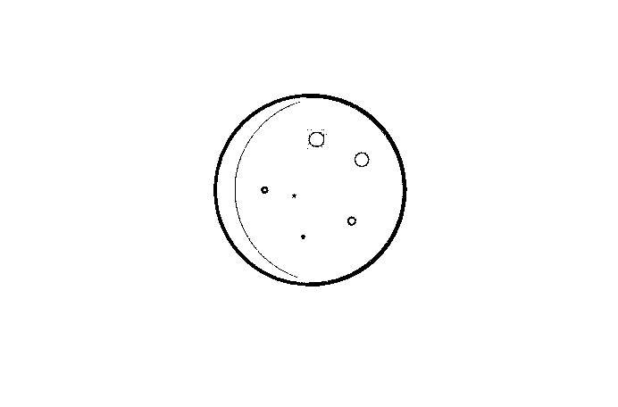

**步骤 8:** 选择圆形的同时在快速动作部分选择偏移路径，然后设置填充为白色，不透明度为 20%。重复这个步骤 2 次以上，透明度为 15%和 5%。这会让月亮发光。创建月亮后，选择所有，然后组。

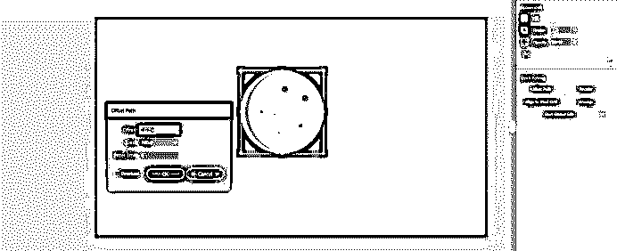

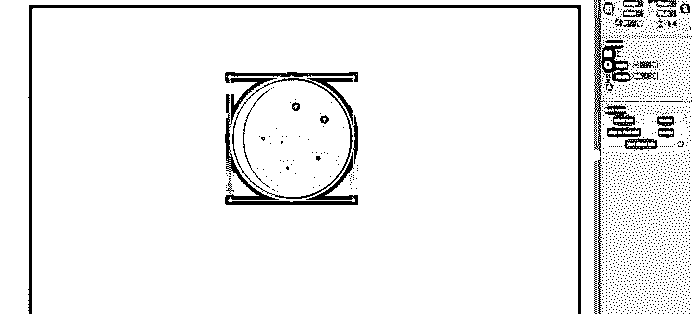

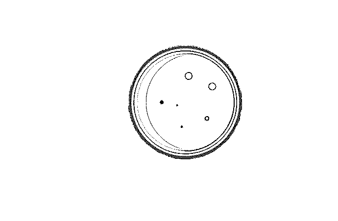

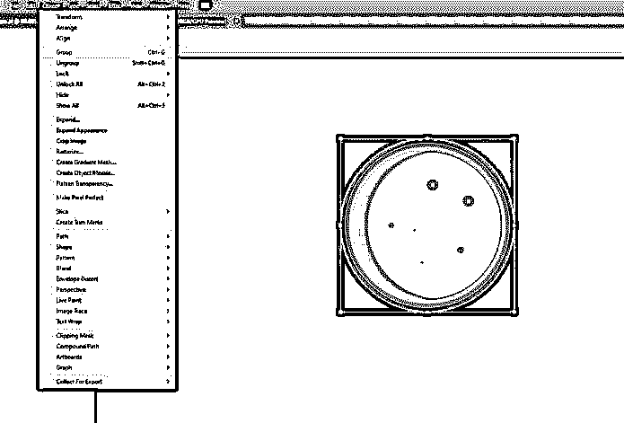

第九步:现在我们将创建一个小火箭来设置视角。为此，我们首先在引导部分启用网格，然后创建一个宽度为 260 像素、高度为 570 像素的椭圆。

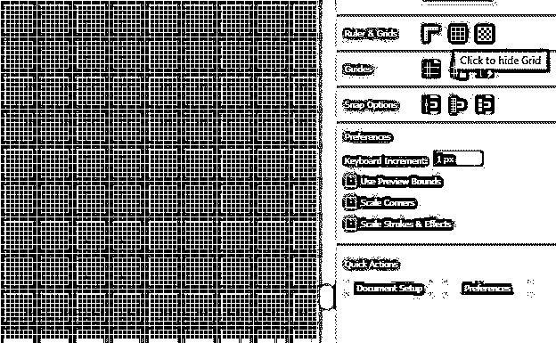

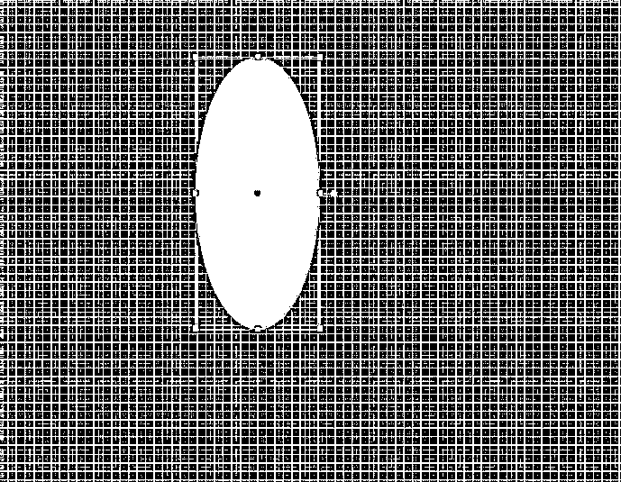

**步骤 10:** 我们将使用直接选择工具选择顶部和底部锚点，并将其转换为角锚点。然后选择控制手柄，在顶部和底部绘制一条曲线。

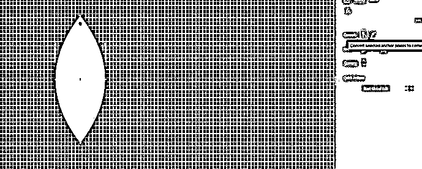

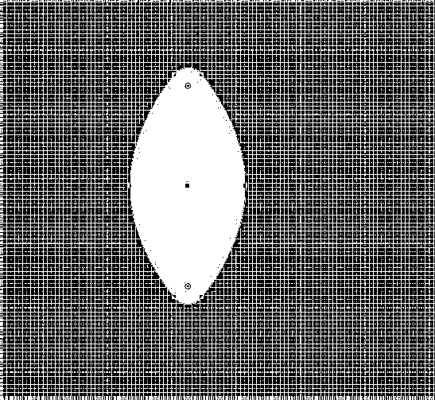

步骤 11: 使用钢笔工具，我们将创建一个三角形，然后使用路径查找工具合并形状。

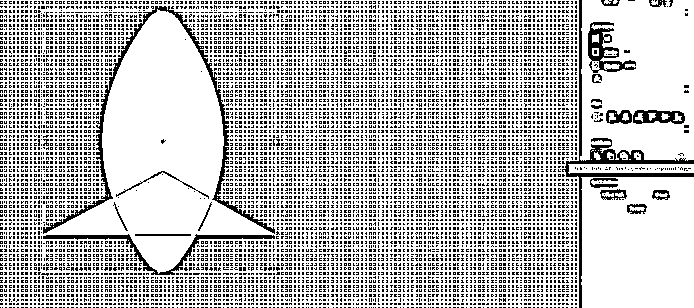

第 12 步:然后创建一个矩形，使用形状生成器工具，按住 alt 键并点击来移除高亮区域，这样我们就可以创建一个阴影了。

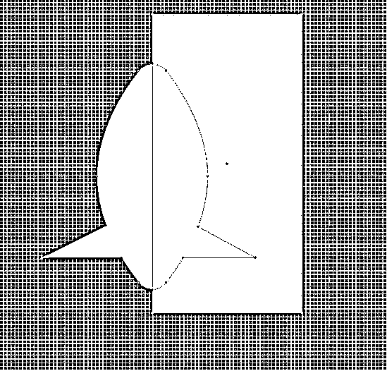

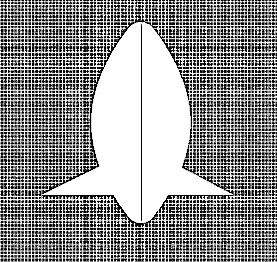

步骤 13: 然后我们将创建火箭的窗口，我们将为其制作两个圆圈，如图所示，并将填充设置为火箭的阴影颜色，将笔画设置为白色。

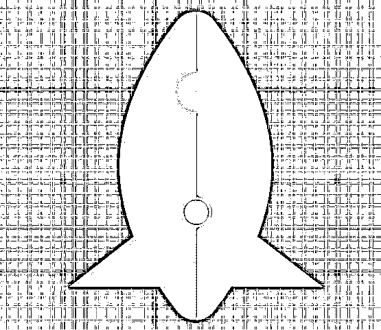

第 14 步:使用椭圆我们将制作火箭的烟雾，然后使用探路者工具进行组合。

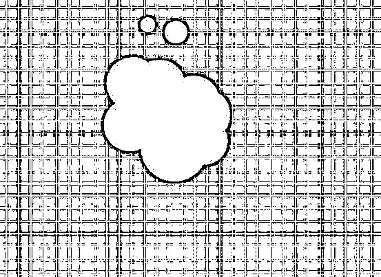

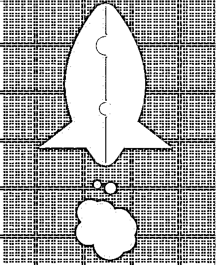

**第十五步:**接下来全选，做一个组(Ctrl + G)然后展开。

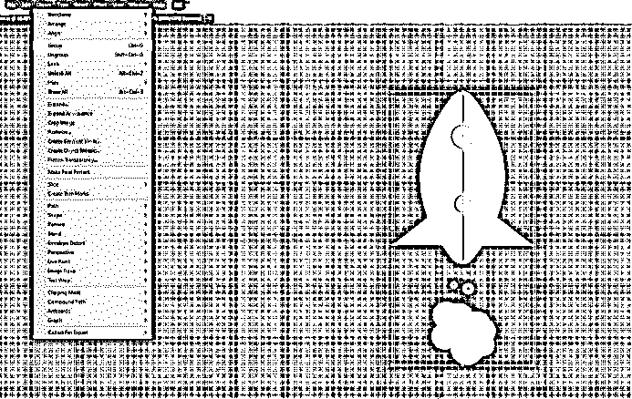

步骤 16: 现在调整火箭的大小并旋转它，把它放到主场景中

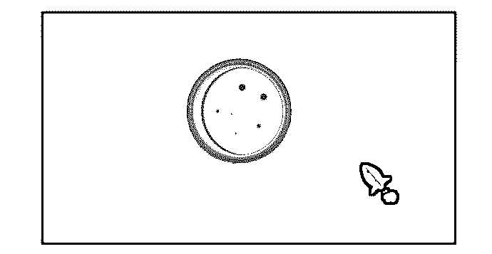

接下来我们创建星星，为此，我们使用笔刷工具。设置填充为无，描边为白色，不透明度 100%。通过改变画笔的大小从 1 到 5 点来创建星星。

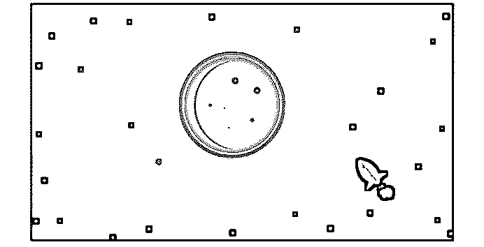

步骤 18: 现在将创建一些从天空落下的星星，为此我们将首先创建一个矩形带。使用直接选择工具圆角，并设置填充渐变。

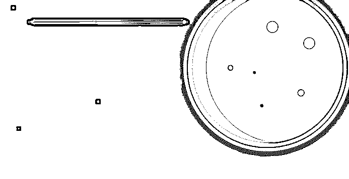

**步骤 19:** 将黑色部分改为白色，不透明度改为 0

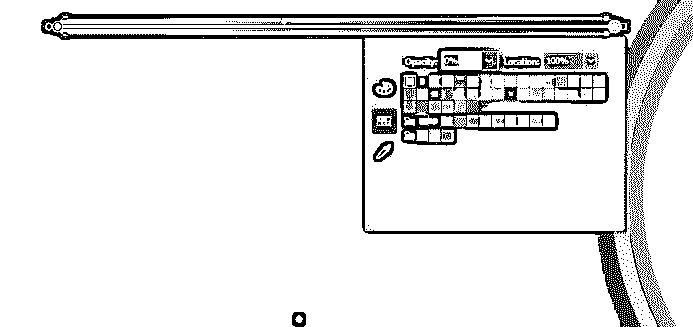

**步骤 20:** 适当旋转，让它看起来像是从天上掉下来的

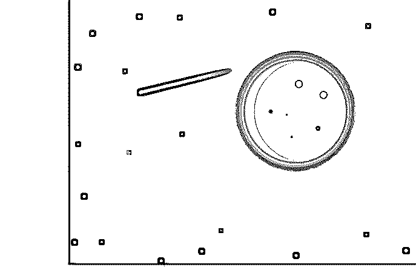

第 21 步:添加更多的星星，改变大小和旋转

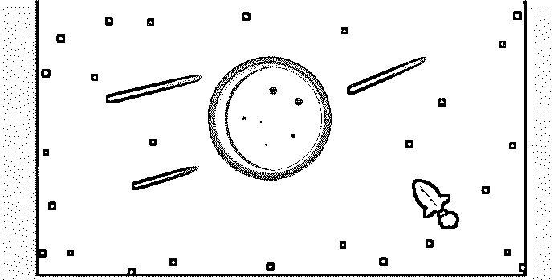

第 22 步:再次使用渐变工具，我们改变星星的颜色。

**步骤 23:** 这样，我们完成了艺术品，下面是成品。

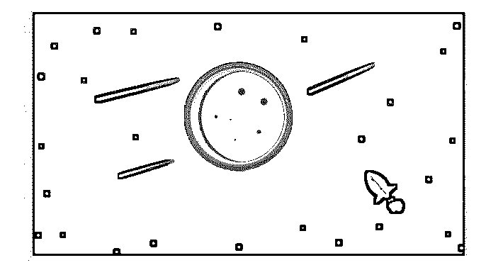

**步骤 24:** 现在是导出的时候了，如下图所示，我们可以选择画板和位置。此外，我们可以选择要导出的格式。我们已经选择了 png 和 jpg 100 以及 1x 和 2x 的比例，这将是两倍的大小，并单击导出。

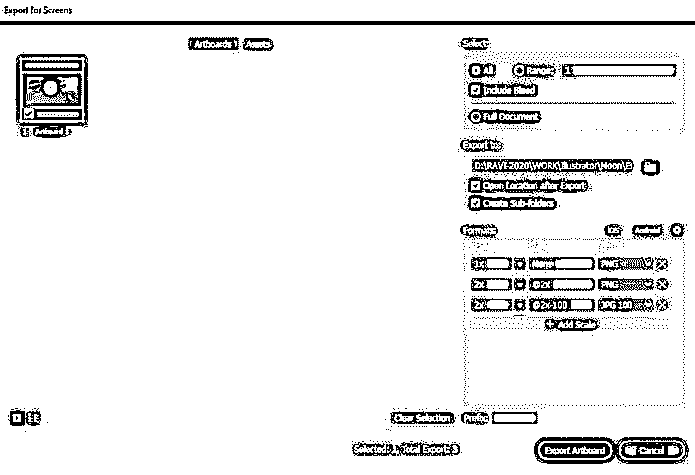

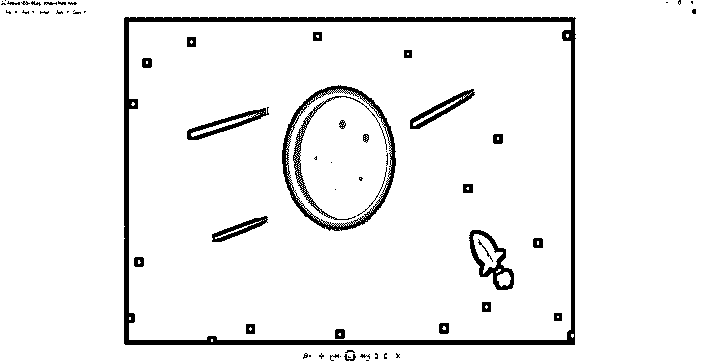

### 有用的提示和快捷方式

*   要更改填充和颜色，请按“X”。要更改为默认的白色填充和黑色描边，请按“D”
*   如果你想填充一种颜色，按下“”，最重要的是设置一种无填充或无描边，按下“/”，因为大多数时候我们想删除它，我们进入菜单，按下无描边或填充。
*   探路者工具也是一个有用的工具，因为我们可以合并形状和减去。在最近的版本中，添加了非常强大的形状生成器工具，可以用来代替路径查找工具。

### 结论

在这篇文章中，我们不仅学习了如何在 Adobe illustrator 中创建一个月亮，还学习了使用各种工具(如形状和渐变)以及形状生成器工具和钢笔工具来创建一个惊人的艺术作品的技巧，这将丰富您的知识和作品集。

### 推荐文章

这是 Illustrator 中的月球指南。这里我们讨论一个介绍，如何一步一步地在 illustrator 中创建一个月亮。您也可以浏览我们的其他相关文章，了解更多信息——

1.  [Illustrator 中的图章效果](https://www.educba.com/stamp-effect-in-illustrator/?source=leftnav)
2.  [Illustrator 中的探路者工具](https://www.educba.com/pathfinder-tool-in-illustrator/)
3.  [Illustrator 中的混合模式](https://www.educba.com/blending-modes-in-illustrator/?source=leftnav)
4.  [在 Illustrator 中更改画板尺寸](https://www.educba.com/how-to-change-artboard-size-in-illustrator/?source=leftnav)

