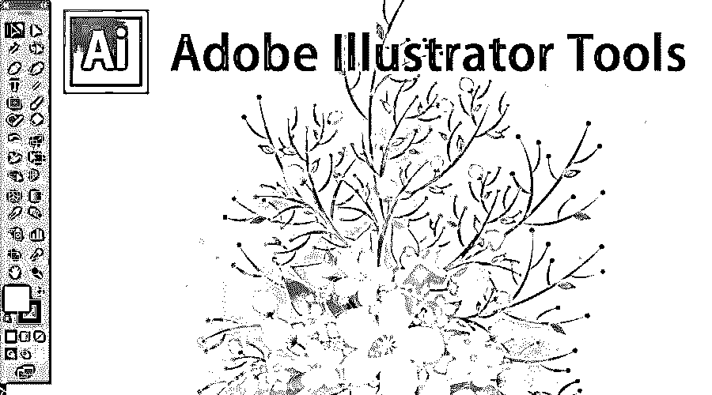
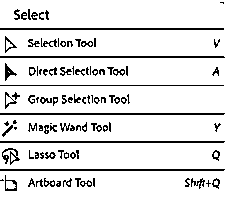
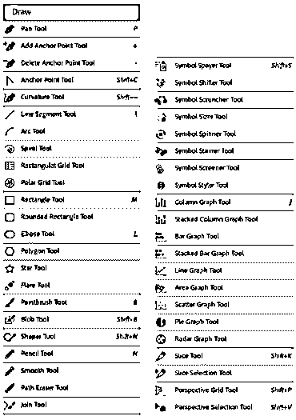
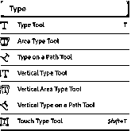
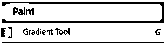
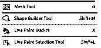
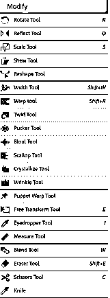
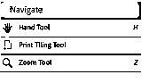
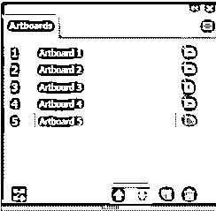
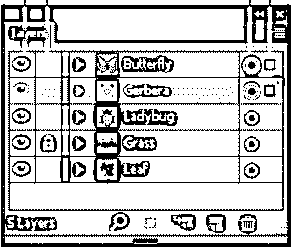

# Adobe Illustrator 工具

> 原文：<https://www.educba.com/adobe-illustrator-tool/>

## Adobe Illustrator 工具简介

Adobe Illustrator 融合了各种各样的工具，当 Adobe Illustrator 启动时，我们会检查某些工具，以应用这些变化；此处使用的各种工具在下面用表示法进行了说明，这个 Adobe Illustrator 工具是关于从图片中选择项目的，由各种子工具组成，如绘制工具、文字工具、绘画工具、魔术工具、修改工具、导航工具、画板工具、图层面板，最重要的一点是我们可以利用快捷方式来启动这些工具。

### Adobe Illustrator 工具

其中最重要的一点是，我们可以使用快捷方式来激活这些工具。

<small>3D 动画、建模、仿真、游戏开发&其他</small>

#### 1.选择工具

<ahref>https://helpx.adobe.com/in/illustrator/using/tools.html</ahref>

通过按下 *Shift + Q 激活“画板”工具；在*这一项中，我们可以在选择范围内进行选择和修改。

#### 2.画

当需要在 Illustrator 中展示才华和绘制图像时，所有需要的工具都在这个工具中绑定在一起。从钢笔工具到饼图，我们可以通过使用所有这些工具来启动。在绘图时，我们需要一些简单的混合工具，如多边形、开始工具、椭圆工具、圆角矩形工具和矩形。我们只需要点击这个工具，我们就可以利用这些现成的形状。

还有其他一些制作和编辑符号和图形的工具；上面用的工具我们就不用玩了。在这里，我们可以放置一个符号，并通过 8 种不同类型的工具进行编辑。为了显示一些数学值，我们需要放置一个饼图或条形图，然后我们得到现成的工具，我们只需输入值，图形就准备好了。我们可以按照我们想要的方式修改它，并根据调整值。

[https://helpx.adobe.com/in/illustrator/using/tools.html](https://helpx.adobe.com/in/illustrator/using/tools.html)

#### 3.文字工具

[https://helpx.adobe.com/in/illustrator/using/tools.html](https://helpx.adobe.com/in/illustrator/using/tools.html)

这个 [Adobe Illustrator 工具用于在插图之间的任意位置输入文本](https://www.educba.com/adobe-illustrator-for-students/)。我们有机会在任何地方写任何东西，主要是，我们可以在任何我们想要的位置写，因为我们有*垂直文字工具*、*垂直文字路径工具*、*垂直文字路径工具、*和*垂直区域文字工具*。其中一个可爱的工具是*触摸式工具；通过使用这个，我们可以点击屏幕上的任何地方并在那里写文本；此外，我们可以通过按下 *Shift + T.* 来访问该工具*

#### 4.绘画工具

[https://helpx.adobe.com/in/illustrator/using/tools.html](https://helpx.adobe.com/in/illustrator/using/tools.html)

绘画工具由渐变工具、[网格工具](https://www.educba.com/mesh-tool-in-illustrator/)、[形状生成器工具](https://www.educba.com/shape-builder-tool-in-illustrator/)、实时油漆桶和实时绘画选择工具组成。渐变工具用于显示颜色的阴影，并可以通过混合两种或更多种颜色来制作新的阴影。同样，为了帮助这个工具，它有一个实时油漆桶，甚至由各种颜色组合而成。

#### 5.修改工具

修改是软件的关键部分，因为它必须在不影响原始对象的情况下对现有对象进行更改。在这里，我们可以做很多改变，如旋转，制作原始图像的镜像，缩放图像，重塑现有的形状，调整宽度和高度，并扭曲它。

我喜欢的工具是一个旋转工具；在这个工具中，只要我们按住鼠标，我们就会看到更多的旋转。这种旋转通过一次又一次的重复来创造更复杂的形状。我们也可以在圆的边缘使用它；我们可以通过双击工具来更改选项。

甚至还有一个扭曲工具，通过控制点来缩小物体。进一步折叠工具可以用来挤压一切向中心。

[https://helpx.adobe.com/in/illustrator/using/tools.html](https://helpx.adobe.com/in/illustrator/using/tools.html)

#### 6.导航工具

在这里，我们使用导航工具，我们可以说它扮演了一个永恒的角色，因为它每分钟都在使用。如果我们在设计中做了一些[更改，那么我们需要放大和缩小插图，看看更改会产生什么影响。当应用效果或应用颜色时，我们需要一个手动工具来平移对象。由于我们需要这些工具来持续指挥，我们可以通过按“H”和“Z”来访问这些工具。](https://www.educba.com/design-pattern-interview-questions/)

[https://helpx.adobe.com/in/illustrator/using/tools.html](https://helpx.adobe.com/in/illustrator/using/tools.html)

#### 7.画板工具

该工具是可打印部分的平台或导出对象的平台。在创建画板之前，我们可以选择不同的预设大小或定义我们自己的自定义画板。我们可以为单个文档创建一个无缝的画板，可以修改其大小、宽度和长度，并可以将其放在屏幕上的任何位置。

要访问该工具，我们需要打开该工具，通过拖放直接添加对象。每个画板都以粗实线为界，并显示最大可打印区域。画布是画板外部的区域，可以扩展到 220 英寸的正方形窗口。

[https://helpx.adobe.com/in/illustrator/using/tools.html](https://helpx.adobe.com/in/illustrator/using/tools.html)

#### 8.图层面板

通常，任何照片编辑软件的图层都是用来复制图像或插图的常用工具。通过使用这个工具，我们可以保持原始副本不受更改的影响。就好像我们不喜欢所做的任何改变，我们不必一直做撤销；我们可以直接去掉图层，开始新的工作。

图层的另一个用途是我们可以隐藏、锁定和保存外观。我们甚至可以创建图层模板，用于跟踪艺术作品，并与 Photoshop 等其他[软件交换图层。](https://www.educba.com/uses-of-photoshop/)

通常，在图层中， [Adobe Illustrator 会为每一层分配一种特殊的颜色，因为它最多可以有 9 种不同的颜色。同样的颜色已经反映在窗口的框、路径、锚点和对象的中心。](https://www.educba.com/adobe-illustrator-for-windows-8/)

我们可以在下图中看到不同的层是如何创建的，以及它们是如何命名的。我们可以看到页面左侧的四列也命名为 1。能见度栏 2。编辑第 3 列。目标列 4。选择列。我们可以通过点击来控制特征。

[https://helpx.adobe.com/in/illustrator/using/tools.html](https://helpx.adobe.com/in/illustrator/using/tools.html)

### 推荐文章

这是一个知道什么是 Adobe Illustrator 工具的指南。这里我们讨论了基本概念和特征。你也可以看看下面的文章:

1.  [什么是 Adobe InDesign](https://www.educba.com/what-is-adobe-indesign/)
2.  [面向初学者的 Adobe Illustrator】](https://www.educba.com/adobe-illustrator-for-beginners/)
3.  [Adobe Photoshop](https://www.educba.com/adobe-photoshop/)
4.  [给 Adobe InDesign 用户的 10 条建议](https://www.educba.com/ten-quick-tips-adobe-indesign-users/)

