# Illustrator 中的宽度工具

> 原文：<https://www.educba.com/width-tool-in-illustrator/>

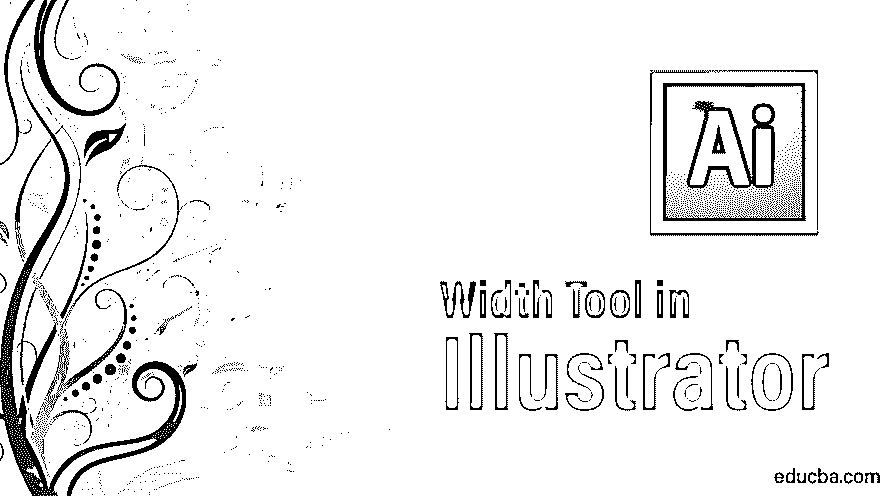

## Illustrator 中的宽度工具简介

Adobe Illustrator 是图形编辑和设计人员使用和开发的最著名和最强大的程序之一。大多数 2D 编辑通常使用 Adobe Illustrator，因为它有各种各样的工具和功能，可以手动创建或默认在软件中创建许多效果。Adobe Illustrator 主要用于创建 2D 艺术品和图形。有了这个程序，Illustrator 中的宽度工具变得非常容易，可以创建任何[标志设计](https://www.educba.com/logo-design-in-illustrator/)，网页，广告材料，甚至 3D 效果。程序中的每个工具都有其独特的功能，而且每个工具都一样重要。有些工具可能看起来不是每次都在使用，但是它们对软件来说仍然具有重要性和优势。

Adobe Illustrator 中的一个这样的[工具是 Illustrator 中的宽度工具。这个工具可以有多种用途，有时可能会被任何用户忽略，因为它在](https://www.educba.com/adobe-illustrator-for-windows-8/)[图形设计师](https://www.educba.com/graphic-design-interview-questions/)中的受欢迎程度很低。使用宽度工具，只需创建一个笔画，就可以塑造和修改任何设计。宽度工具让用户更聪明地工作，而不是更辛苦地手工操作。

<small>3D 动画、建模、仿真、游戏开发&其他</small>

### 如何使用宽度工具？

在下面的例子中，我们将了解如何创建一个可变宽度的笔画配置文件，并在其他对象上使用它，使手动工作更加容易和简单。

**第一步:**在 Illustrator 中打开一个**新文件**。

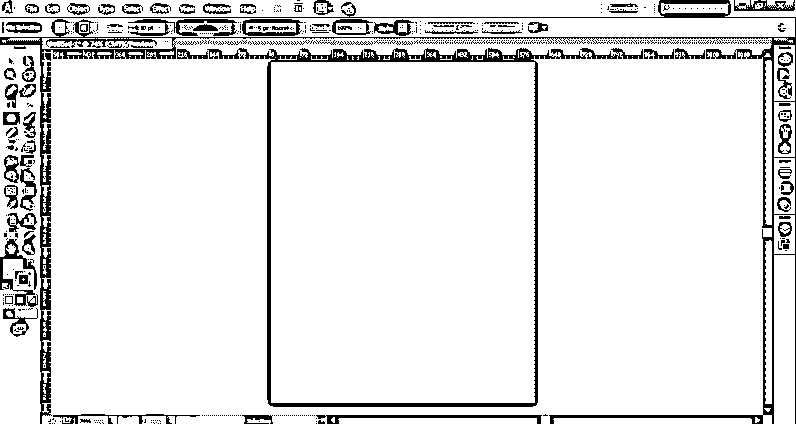

**第二步:**使用线段工具绘制一个**笔画**。增加笔画的宽度。

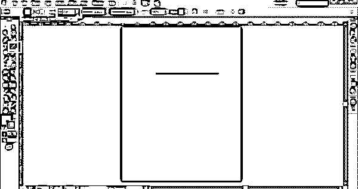

**第三步:**使用**宽度工具**或按下 **SHIFT + W** 命令激活宽度工具。

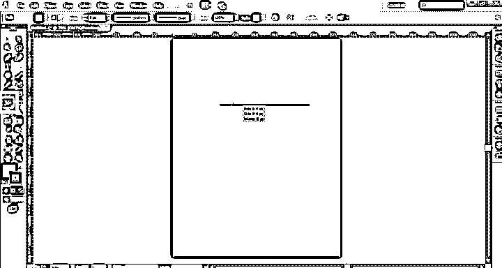

**第四步:**点击，按住鼠标拖动笔画到**根据你想要创建的设计创建锚点**。

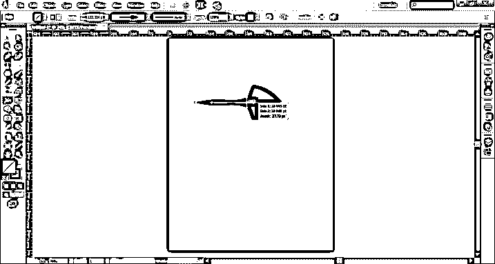

**第五步:**这些锚点有助于通过使用宽度工具创建特定的形状或对象。

**步骤 6:** 我们也可以通过使用 ALT + click 命令复制锚点，并通过选择任意点并使用**删除**命令删除这些锚点。

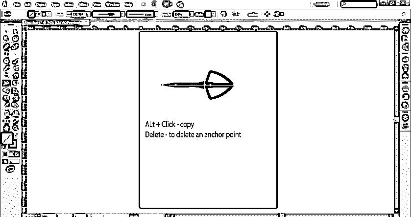

**步骤 7:** 当形状创建完成后，进入选项栏，点击**可变宽度轮廓**。

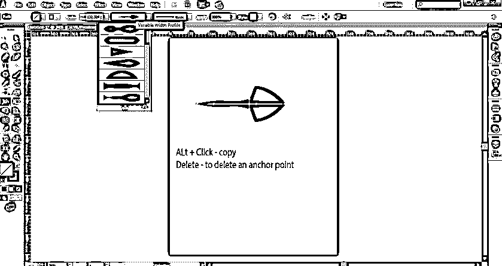

**第 8 步:**选择如图所示的添加到个人资料；这将把创建的形状添加到可变宽度轮廓中。这些变量非常有用，因为只要点击它们，就可以在任何时间点使用它们。

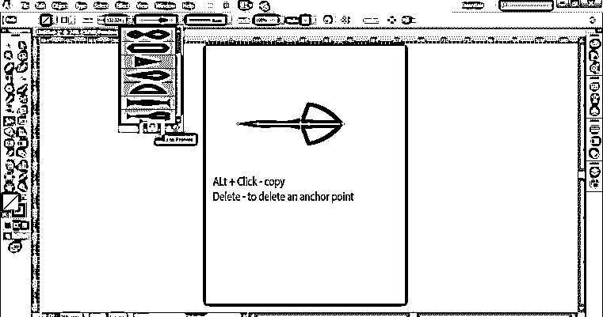

### 对我们的对象或形状使用变量

**第一步:**在 Illustrator 中新建一个**文件**。

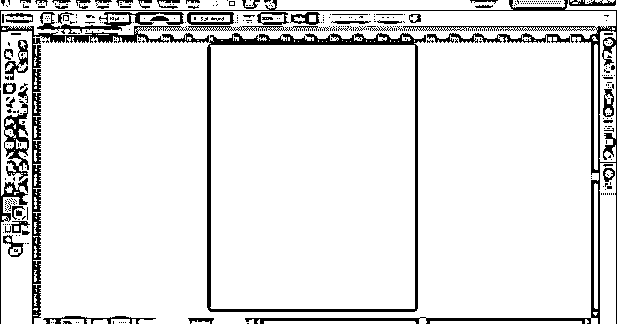

**第二步:**用椭圆工具画一个**圆**。

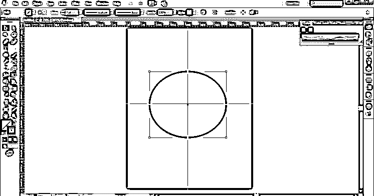

**第三步:**使用**剪刀工具**，剪下如图所示的圆。

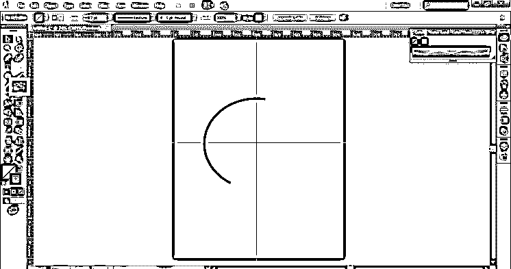

**第四步:**现在，将笔画的颜色改为粉色，使用之前从变量轮廓菜单中保存的笔画。此外，增加形状的笔画粗细。

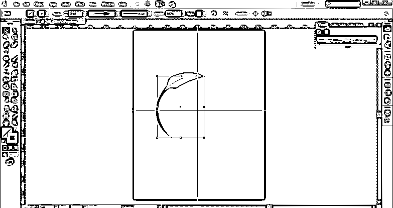

第五步:现在，复制一个**形状**，如图所示。

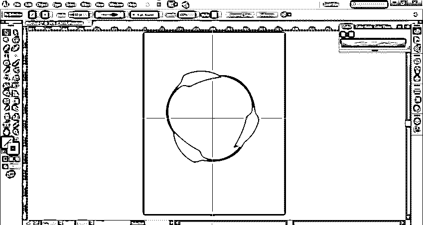

第六步:这就是我们如何以任何方式在任何对象上使用宽度变量。

*   这些可变的轮廓取决于宽度尺寸，因此用户必须增加或减少宽度重量以达到所需的效果。这些变量配置文件可以随时修改，次数不限。
*   我们可以改变笔画粗细，颜色梯度或不透明度。更深入地说，我们可以说这些宽度轮廓不仅仅是实例，而且是包含笔画路径内宽度点细节的矢量数据的存储。此外，这些宽度轮廓可以应用于任何路径或曲线或形状，而不管其尺寸和大小。宽度工具是一个非常有效和有用的工具，用于紧急项目和演示，因为它可以快速创建一个对象或形状，而不需要太多的细节和过程。
*   当我们使用宽度工具时，我们应该始终使用形状工具或钢笔工具，以避免获得过多的锚点或波浪路径。钢笔工具帮助用户给出一个更好的前景和显示一个更好的工作流程。而大多数喜欢手绘并使用[钢笔工具](https://www.educba.com/pen-tool-in-illustrator/)完成大部分工作的设计师应该使用宽度工具来创建快速效果。也有必要了解宽度工具一般不与笔刷工具一起使用[。由于“宽度”工具是基于在描边上创建路径，因此它不适用于画笔，并且在使用“宽度”工具时，画笔工具会自动禁用。](https://www.educba.com/photoshop-mixer-brush-tool/)

### 结论

宽度工具是一个重要且功能强大的工具，可以快速轻松地获得效果和结果。使用形状和钢笔工具的用户可以在使用该工具时处于优势，并利用这一伟大但隐藏的工具的好处。用户应该记住，他们不能同时使用画笔工具和宽度工具。工作变得简单高效，而笔画可以随时更改，这是宽度工具最重要的部分。

### 推荐文章

这是 Illustrator 中宽度工具的指南。在这里，我们讨论如何使用宽度工具，以及如何使用对象或形状的变量。你也可以浏览我们的文章来了解更多-

1.  [后效工具](https://www.educba.com/after-effects-tools/)
2.  [面向学生的 Adobe Illustrator】](https://www.educba.com/adobe-illustrator-for-students/)
3.  [Illustrator 中的效果](https://www.educba.com/effects-in-illustrator/)
4.  [Illustrator 中的平滑工具](https://www.educba.com/smooth-tool-in-illustrator/)

