# Illustrator 网格工具

> 原文：<https://www.educba.com/illustrator-grid-tool/>

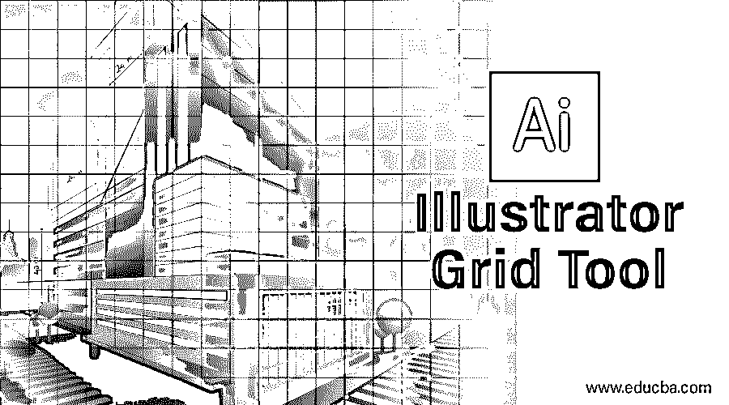

## Illustrator 网格工具简介

Illustrator 网格工具帮助用户创建矩形网格。这些矩形网格由透明、可移动和可控制的列和行组成。在这些网格的帮助下，用户可以准确无误地绘制艺术品和物体。大多数情况下，网格工具与标尺工具一起使用，有助于打开基准线，以便精确测量设计。用户还可以根据需要编辑网格中的列数和行数。

### 如何在 Adobe Illustrator 中使用网格工具？

在 adobe illustrator 中使用网格工具是一项有趣的工作。让我们一步步来看看 adobe illustrator 中的网格工具。在开始之前，我们将了解 adobe illustrator 的一些基础知识。

<small>3D 动画、建模、仿真、游戏开发&其他</small>

这是 adobe illustrator 的用户界面。

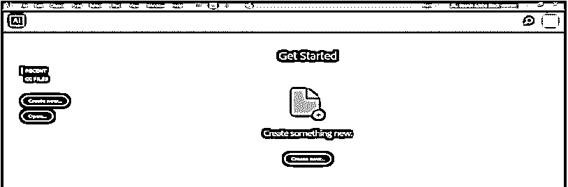

在这里，您可以创建一个新文档或通过单击此界面的“打开”选项卡打开您的预绘图对象；当你点击创建时，会打开一个对话框，在这里你可以设置页面的高度、宽度、方向和其他参数，点击创建这个对话框的标签…

这里，我们在 adobe illustrator 工作区的左侧有一个工具面板。

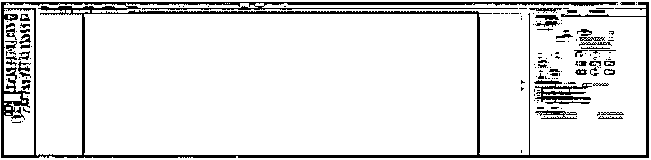

在右侧，我们在“属性”中有“属性”和“层”选项卡。我们可以看到所选对象的属性。在层中，我们可以看到我们在项目中使用的层数；你可以从我们不同的教程中学到所有这些东西。

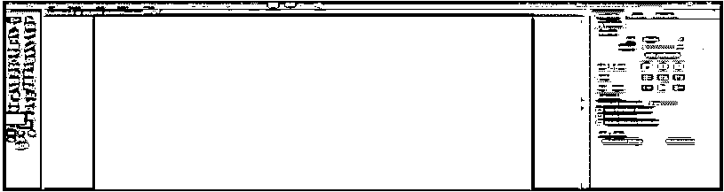

让我们开始介绍网格工具。我们在 adobe illustrator 的工具面板的线段工具选项中有这个图标的网格工具；单击它以选择它。

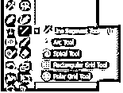

点击工作区的明信片。将会打开一个对话框。此处默认大小显示网格的大小-水平分隔线显示网格中的列数垂直分隔线显示网格中的行数根据您的要求填写此对话框中的数据。

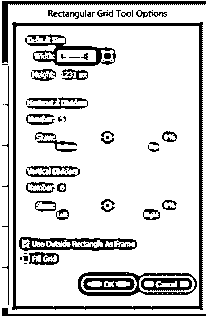

按“确定”选项卡按钮，在明信片上应用网格。

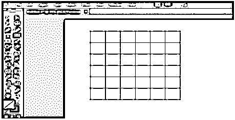

或者你可以通过简单地拖动鼠标按钮来绘制网格，点击明信片，不要离开点击和拖动它，根据你给网格的高度和宽度。

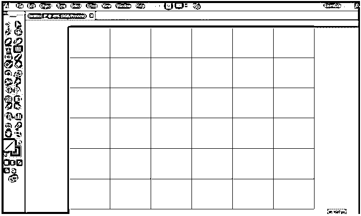

可以随时更改绘制的网格的数据，选中网格，按键盘上的 shift 键，按住 shift 键再次点击网格；将会打开一个参数更改对话框。在这里你可以改变网格的大小，行数和列数。

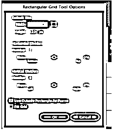

您可以在绘制网格时增加或减少网格中的列数和行数，使用网格工具，单击明信片中的任意位置并拖动它。不要离开。单击并按键盘上的上箭头键增加行数，按键盘上的下箭头键减少行数，按右箭头键增加列数，按左箭头键减少列数。

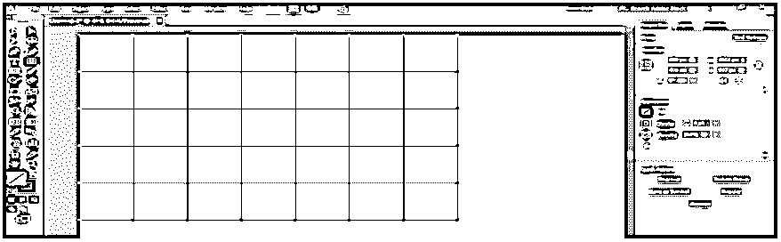

您可以通过选中填充框复选框来填充网格中的颜色。

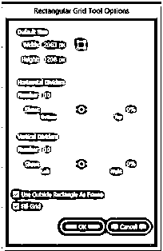

现在从填充颜色选项中选择填充颜色。

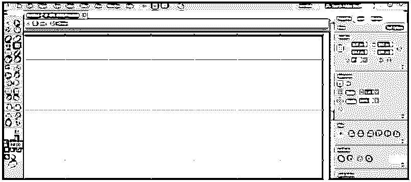

您也可以从工作区顶部的控制面板中更改填充颜色。

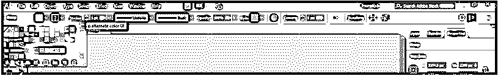

您可以从样本库菜单中添加样本，单击样本库，将打开一个对话框，从这里选择您想要在网格中给出的样本。

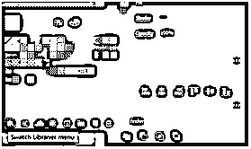

您可以从这里通过根据您的需要更改数据来更改笔画的粗细和颜色。

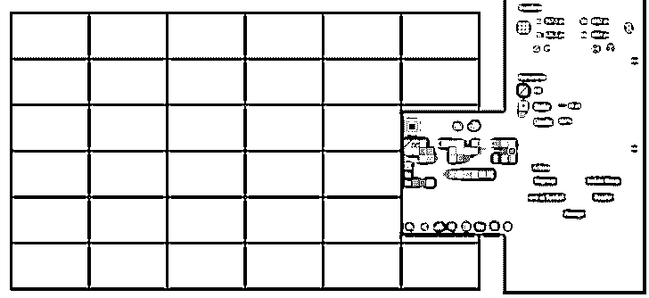

或者，您也可以从工作区顶部的控制面板更改冲程。

通过更改“不透明度”参数，可以使描边线变暗或变亮。

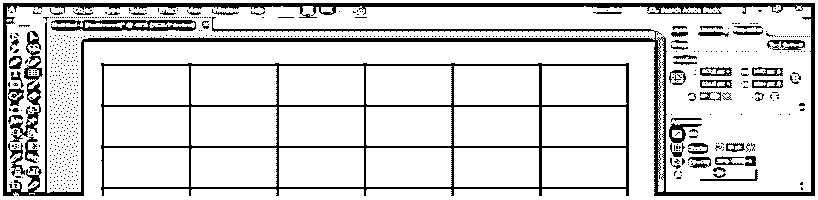

如果您希望明信片的不同部分有不同的网格类型，请用线段将明信片分成不同的部分，然后单击网格工具。单击要在其中绘制网格部分；现在将打开一个对话框；根据你在这里设置的参数，按 OK 即可应用。

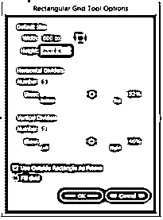

你可以看到网格只在这一部分；您可以根据小节，通过按住键盘上的 shift 键拖动网格来调整网格的大小。

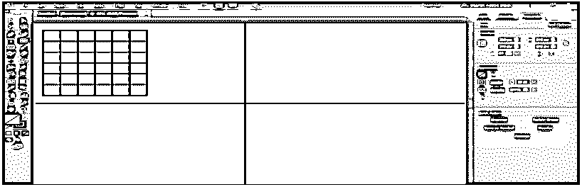

现在你可以单独改变所有网格的样式。

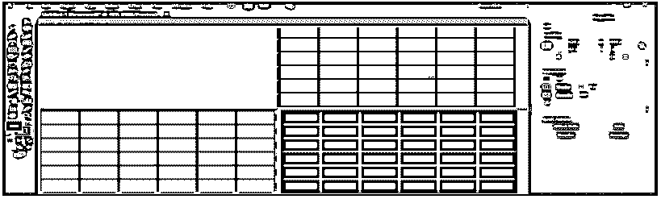

现在我们将使用网格制作图案；转到工作区顶部的窗口选项卡，单击样本。

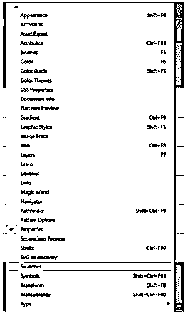

样本对话框将是一个选项，现在选择网格，从工具面板中选择实时油漆桶工具，确保网格填充是打开的。

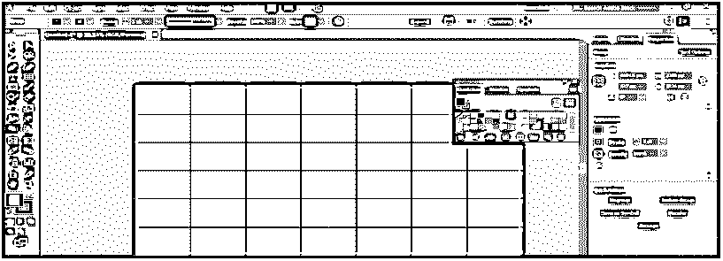

现在，单击网格的单元格，使用实时颜料桶工具在该单元格中填充颜色。

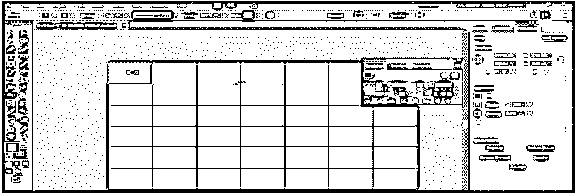

您可以通过按键盘上的左箭头键来更改实时上色的颜色；当您按下键盘上的左箭头键并再次单击以在单元格中应用颜色时，您可以看到“色板”面板中的颜色会发生变化。

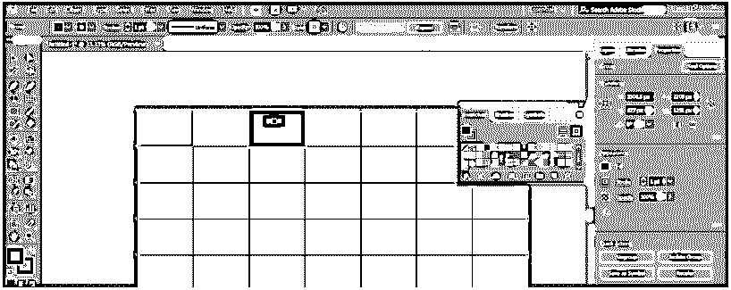

通过使用实时油漆桶工具，您可以用网格制作出漂亮的图案。

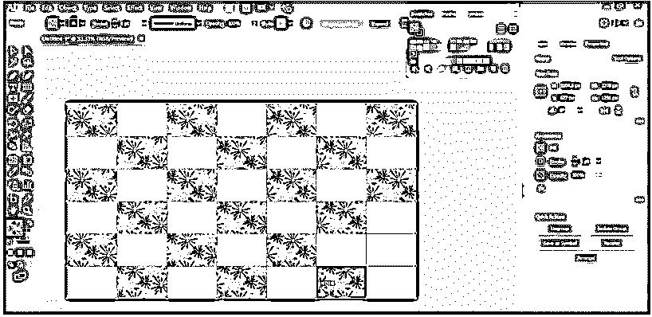

您可以将网格转换为参考线。要将网格更改为参考线，请选择网格，转到工作区顶部的视图选项卡，转到参考线选项，然后单击制作参考线。

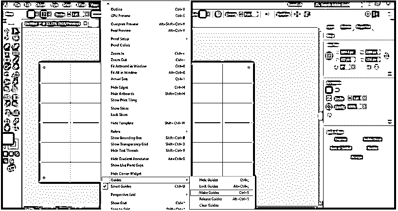

这样，您就可以在绘图中使用网格工具，并用它制作出有效的图案。

### 结论

在这里你可以看到我们如何使用 adobe illustrator 中的网格工具。学习如何使用 adobe illustrator 中的网格工具后，您可以轻松地为您的作品绘制有趣的图形，并使其对观众更有效。在处理大型项目时，它可以节省您的时间。

### 推荐文章

这是一个 Illustrator 网格工具指南。在这里，我们讨论如何使用 Adobe Illustrator 中的网格工具在我们的作品中进行更有效的绘制。您也可以看看以下文章，了解更多信息–

1.  [安装 Adobe Illustrator](https://www.educba.com/install-adobe-illustrator/)
2.  [Illustrator 插件](https://www.educba.com/illustrator-plugins/)
3.  [Illustrator 中的效果](https://www.educba.com/effects-in-illustrator/)
4.  [在 Illustrator 中移除背景](https://www.educba.com/remove-background-in-illustrator/)

