# Illustrator 中的测量工具

> 原文：<https://www.educba.com/measure-tool-in-illustrator/>

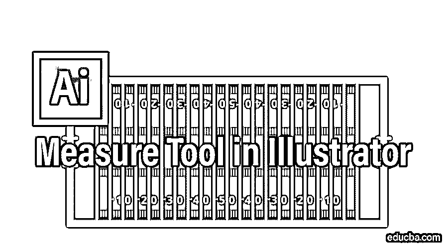

## 什么是测量工具？

测量工具，顾名思义，是用来测量两点之间的距离的。在本主题中，我们将学习 Illustrator 中的测量工具。

**刀具的位置**

<small>3D 动画、建模、仿真、游戏开发&其他</small>

首先让我们看看测量工具在 illustrator 工具栏中的位置。测量工具如下所示。

**同基本工具栏**

如果您使用的是基本工具栏，则测量工具不在可见工具之列。

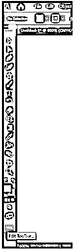

如果你点击底部的三个点，你可以编辑工具栏。您可以看到灰色的已经是工具栏的一部分，白色的目前不可用，可以添加到现有的工具栏中。如果您向下滚动工具列表，您将找到测量工具。

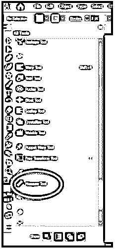

现在可以将它拖放到现有的工具栏上。它可以放在面板底部蓝线出现的地方，如屏幕截图所示。

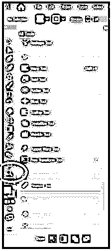

或者，如果它被拖到一个现有的工具上(以蓝色突出显示)，它将与该工具一起被分组，如屏幕截图所示。

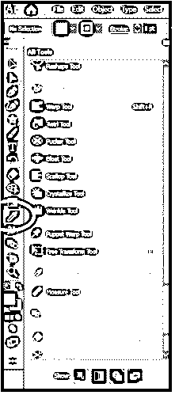

**高级工具栏**

高级工具栏可以通过点击窗口菜单->工具栏->高级来选择。

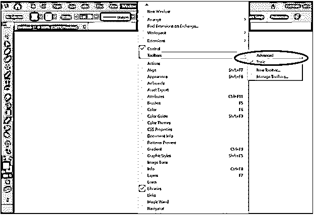

默认情况下，这有测量工具。它已经与吸管工具组合在一起。

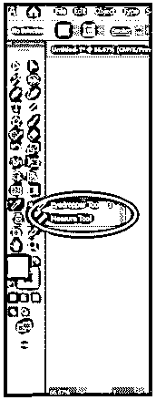

**各种测量**

现在我们知道了如何使用测量工具，让我们了解所有我们能理解的信息。信息面板中提供了这些信息。

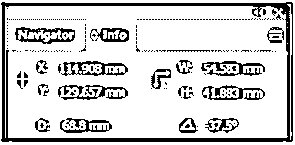

测量工具沿需要测量的路径画一条线。如果使用测量工具单击并绘制一条线，您将获得:

1.  线条起点距 X 轴的水平距离(X)
2.  线条起点与 Y 轴的垂直距离(Y)
3.  线(D)的对角线长度
4.  线条宽度–它是沿水平或 X 轴的距离(W)
5.  线的高度–它是沿垂直或 Y 轴的距离和(H)
6.  线的角度–相对于水平线或 X 轴形成的角度。( )

### 测量符号

如果测量是在向右上方进行的，

*   宽度为正。
*   高度为负。
*   角度是正的。

在向左上方，

*   宽度为负。
*   高度为负。
*   这个角度是正的

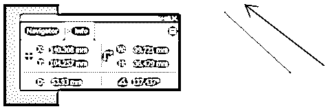

在向左下方，

*   宽度为负。
*   高度为正。
*   角度为负。

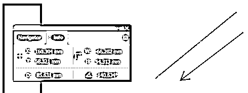

在向右下方，

*   宽度为正。
*   高度为正。
*   角度为负。

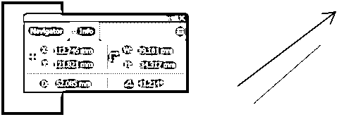

如附图中的绿色箭头所示。

### 测量工具的使用

它可以用来测量任意两点之间的距离。这可能是:

*   两个物体之间。

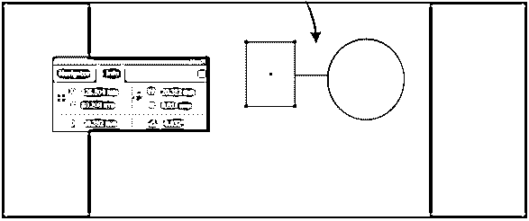

*   任何对象和[画板边缘之间。](https://www.educba.com/artboard-in-photoshop/)

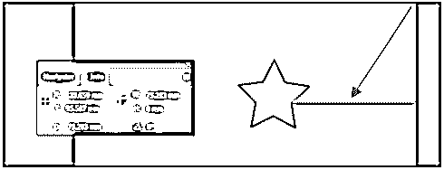

### 实际应用

这些信息对于建筑师或室内设计师了解房间、门和窗户的宽度以及特定空间适合的家具非常有用。裁缝和时装设计师可以用它来精确地测量他们的设计。图形和网页设计师可以使用它来创建布局。

可以总结为，测量工具是 Adobe 为 Illustrator 用户提供的用于精确测量的辅助工具。

### 推荐文章

这是 Illustrator 中的测量工具指南。在这里，我们讨论如何使用 Illustrator 中的测量工具，测量的标志以及测量工具的使用。您也可以看看以下文章，了解更多信息–

1.  [Illustrator 中的 3D 效果](https://www.educba.com/3d-effects-in-illustrator/)
2.  [Illustrator 中的钢笔工具](https://www.educba.com/pen-tool-in-illustrator/)
3.  [Illustrator 自由变换工具](https://www.educba.com/illustrator-free-transform-tool/)
4.  [Illustrator 中的平滑工具](https://www.educba.com/smooth-tool-in-illustrator/)

