# Illustrator 中的网格工具

> 原文：<https://www.educba.com/mesh-tool-in-illustrator/>

## Illustrator 中的网格工具简介

Illustrator 中的渐变网格(Gradient Mesh)是一个工具，允许用户创建所有形式的渐变，包括矢量格式的 3D 插图，可以基于点进一步修改并控制网格；网格对象只是一个彩色的实体，颜色可以以多种方式在其上滑动，并且变化可以从一端到另一端均匀地发生；然而，网格工具对于初学者来说并不是那么容易掌握，因为它需要定期练习和学习才能完全掌握该工具。

网格是由一个以上的网格点组成的网格，其反应非常类似于甚至锚点。您可以修改这些点来管理网格的形状。在 Illustrator 中，它确实是一种特殊类型的对象或构造，它不像常规路径那样工作。网格对象是一种彩色对象，颜色可以在其上向各个方向滑动，并且从一端到另一端的变换可以均匀发生。

<small>3D 动画、建模、仿真、游戏开发&其他</small>

### 如何在 Illustrator 中使用网格工具？

渐变网格可以非常灵活和全面地将颜色应用到物体上。它会在对象内部生成一个网格，该网格将遵循轮廓。然后，可以将颜色注册到网格点，网格点之间的各种颜色相互融合。

**工具栏中的网格工具**

在 Illustrator 中，有两种主要的方法可以生成渐变网格对象，在这两种情况下，都是先绘制一个法线矢量对象。在 Illustrator 中，您不会从头开始绘制渐变网格对象；将现有的矢量形式转换为网格对象。

**选择一个矢量对象:**

*   从菜单栏中选择“对象>创建渐变网格”。这将打开创建渐变网格对话框，使您能够定义网格中的行数和列数。如果您的原始对象已经注册了一种颜色，您可以利用高光和外观选项用白色给对象添加阴影。选择行数和列数定义了网格中的网格点数。您可以随时在以后追加或删除网格点。
*   从工具栏中选择网格工具，并单击矢量路径中的任意位置。每次单击网格工具都会将网格点附加到网格对象上。您还会发现，当您将网格点附加到对象时，连接网格点的路径会补充对象的轮廓。
*   一旦你定义完网格点，你可以移动到[直接选择工具](https://www.educba.com/direct-selection-tool-illustrator/)并选择每个网格点来改变它的位置和方向手柄。选择网格点后，可以从“颜色”面板/色板/吸管工具中选择一种颜色来确定该点的颜色。根据需要，可以移回网格工具并单击以附加网格点。要从网格对象中删除网格点，可以在按住 alt 的同时用网格工具单击一个点。

### 网格工具示例

我们将以香蕉为例，使用网格工具。

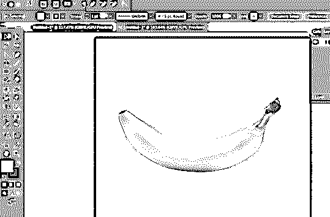

**步骤 1:** 将香蕉图像放到画板上后，新建一个图层，命名为 banana，并锁定当前图像图层，这样就不会误删任何内容。

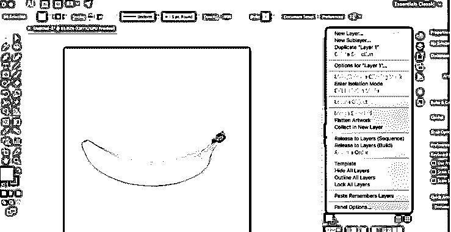

**创建新层**

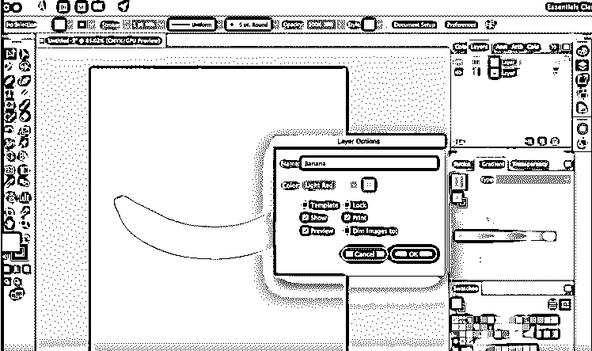

**锁定原始图像**

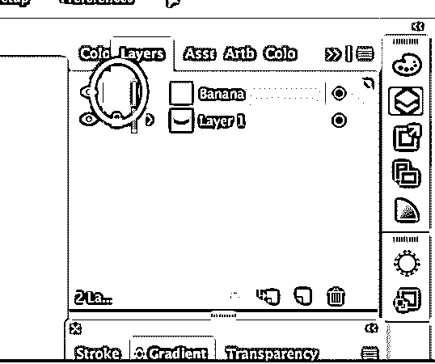

**第二步:**现在，我们将使用钢笔工具描摹[轮廓来绘制香蕉。选择香蕉的底部尖端作为第一个锚点，并开始绘制香蕉。](https://www.educba.com/pen-tool-in-illustrator/)

**钢笔工具**

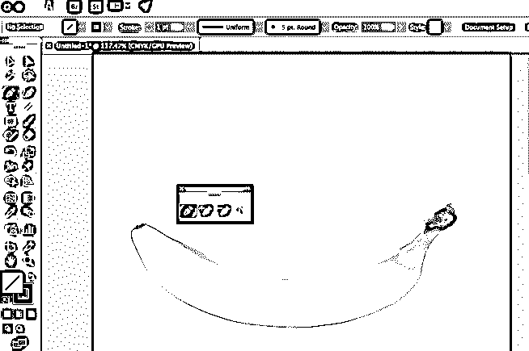

要绘制香蕉的曲线轮廓，可以使用锚点工具。确保填充物是空的。

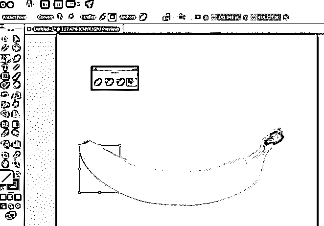

**曲线锚点工具**

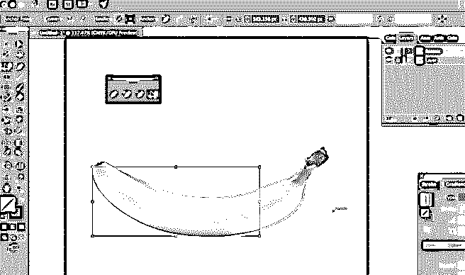

**最终轮廓图像**

**第三步:**香蕉轮廓画好之后；你需要给它一个基色。您可以使用吸管工具来完成。使用吸管工具，您可以从图像中提取所需的颜色，并将其应用到您绘制的香蕉对象。这里的基色是黄色，所以我们将从香蕉图像中选择黄色。

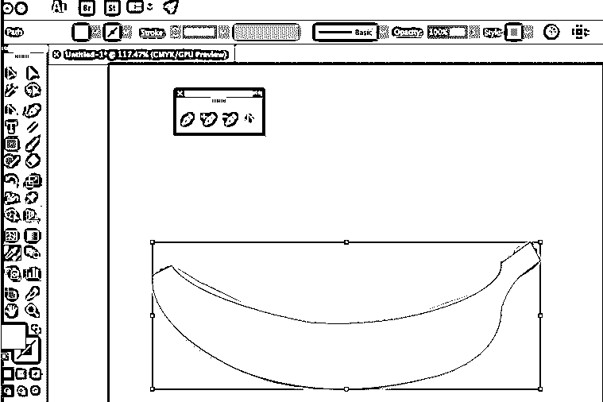

使用吸管工具将对象填充为黄色

现在，您可以将对象从图像上移开。

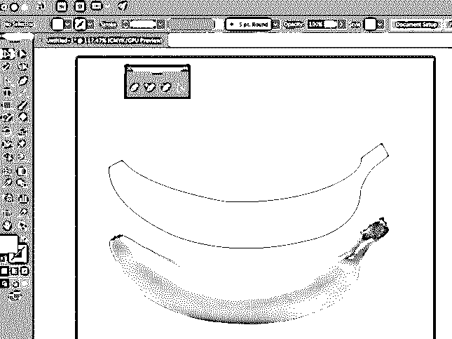

**完成黄色填充的香蕉轮廓**

**第四步:**现在用[选择工具](https://www.educba.com/selection-tool-in-illustrator/)选择对象，然后转到对象>创建渐变网格。根据需要选择列数和行数。

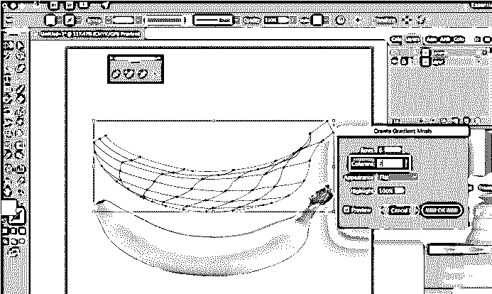

**创建渐变网格**

第五步:我们现在将开始给香蕉一些深度，并像原始图像一样突出香蕉的顶部。使用渐变网格工具，我们可以给香蕉更多的层。创建网格后，选择直接选择工具，然后选择要高亮显示的锚点。这里我们将选择顶部，如下图所示。您可以按住 shift 键并选择要高亮显示的锚点数量。

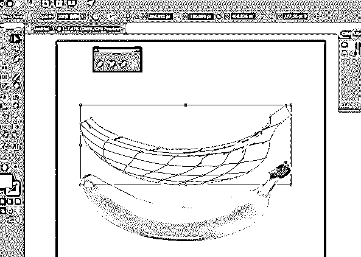

使用直接选择工具高亮显示的顶部锚点

选择锚点后，使用吸管工具选择原始图像的最上面部分，单击该部分后，您将在对象上获得所需的高亮颜色，如下图所示。

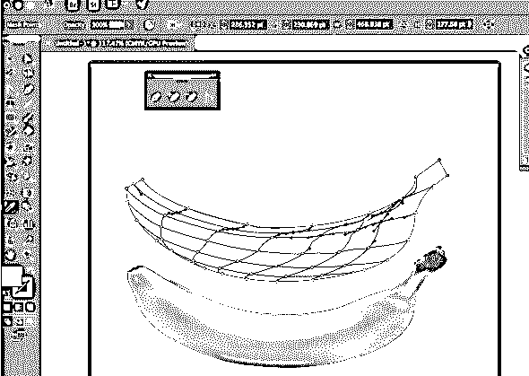

**顶部突出显示的部分**

类似地，选择要高亮显示的锚点，或者像在原始图像中一样给对象添加较暗的阴影。在下面的截图中，你可以看到使用渐变网格工具你可以给你的物体多少深度。

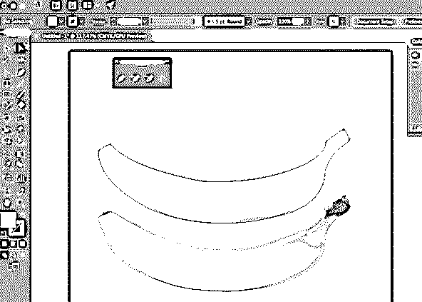

**中心部分锚点的选择**

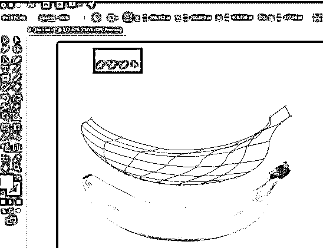

**中心部分**

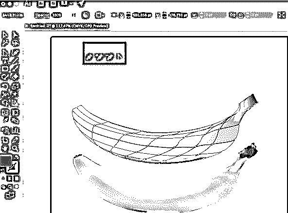

**提示**

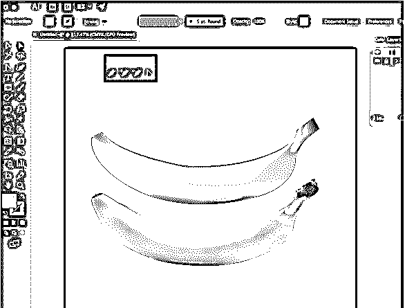

**顶部和底部(最终图像)**

### 结论

在 Illustrator 中，当需要非径向或非线性渐变时，渐变网格和网格工具会很有帮助，应该加以考虑。梯度网格用于描述纹理和表面阴影。其中一个优势是文件大小的减少；另一个是可以修改梯度的简单性。在渐变网格工具的帮助下，你可以得到更实际的接近三维效果的插图。不利的一面是，你可以说渐变网格工具不容易理解。许多人想利用这个特性，但是他们不能决定用什么合适的方式来描述它的行为。

### 推荐文章

这是 Illustrator 中网格工具的指南。在这里，我们讨论如何使用 Illustrator 中的网格工具的概念和一步一步的解释。您也可以浏览我们推荐的其他文章，了解更多信息——

1.  [Photoshop 中的锐化工具](https://www.educba.com/sharpen-tool-in-photoshop/)
2.  [Photoshop 中的自定义形状工具](https://www.educba.com/custom-shape-tool-in-photoshop/)
3.  [Adobe Photoshop 工具](https://www.educba.com/adobe-photoshop-tools/)
4.  [搅拌机工具](https://www.educba.com/blender-tools/)

