# Illustrator 中的混合工具

> 原文：<https://www.educba.com/blend-tool-in-illustrator/>

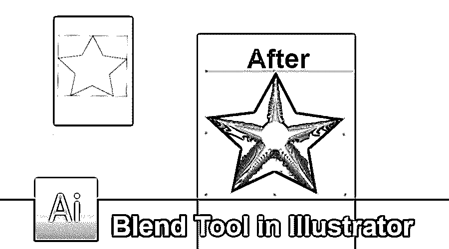

## adobe illustrator 中的混合工具简介

混合工具是 Adobe Illustrator 最重要的工具之一，因为它用于利用颜色、路径或距离从各种形状和线条中制作效果，混合工具可以轻松有效地混合任何两个项目，用户可以混合开放的路径，在项目之间创建一个无污点的条目，或者利用混合工具收集一部分均匀分布的颜色，在设计者使用混合的任何时候，被混合的东西都被视为单个项目，可以在以后根据需要进行更改。

### 如何使用 Adobe Illustrator 中的混合工具？

我们可以用两种不同的方式使用混合工具。第一种方法是使用工具箱菜单中的工具。在这种方法中,“混合”工具使用默认属性，并计算对象之间的步数，以创建干净的通道。我们选择两个不同的创建对象，并点击混合工具。

<small>3D 动画、建模、仿真、游戏开发&其他</small>

第二种和方法包括使用选项菜单中的混合工具。我们点击混合工具，并选择制作命令。接下来，我们有选项菜单中的混合选项。这些借出选项需要不同的设置来在对象之间创建适当的效果。当我们从选项菜单中选择混合，我们有**混合选项。**在混合选项中，我们有以下设置-

*   **平滑颜色**–该功能帮助用户创建混合对象之间的默认步骤。基本上，当我们使用两个带有图案或渐变填充的填充对象并混合这些对象时，就会用到该功能。在这种情况下，该工具会计算步骤数，并创建平滑干净的混合。
*   **指定步骤-** 该功能在混合物体时非常有用，非常智能。用户可以很容易地指出在两个对象之间创建混合所需的步骤数。
*   **间距**–该功能告诉用户用于混合对象的总步骤数。
*   **方向**–该功能用于告诉用户混合形状的属性。
*   **替换样条线**–该功能帮助用户修改混合对象的路径。默认情况下，当用户使用混合工具时，创建的路径是一条直线。但是用户可以将其路径更改为任何绘制矢量路径，混合对象将使用“替换样条线”选项与新路径对齐。此外，可以使用“反转样条线”选项反转该样条线。
*   **从前到后反转**–当用户创建一个混合并想要反转其排列时，他可以使用该选项并反转整个混合形状。
*   **扩展**–该功能有助于为新混合的形状创建锚点，每个混合的形状都可以使用直接选择工具进行修改。
*   **释放**–该工具与扩展工具正好相反，它帮助用户移除混合对象并将原始对象带到屏幕上。

### 在 Adobe Illustrator 中使用混合工具的步骤

以下是在 adobe illustrator 中使用 blender 工具的不同步骤:

**第一步:**新建一个文件。

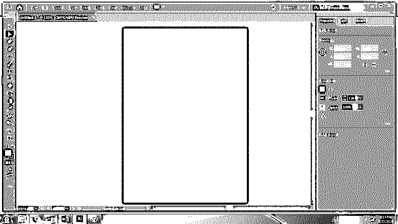

**第二步:**创建一个星形和一个小椭圆。

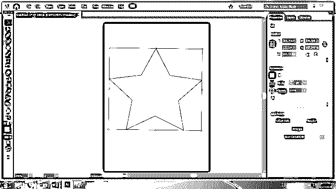

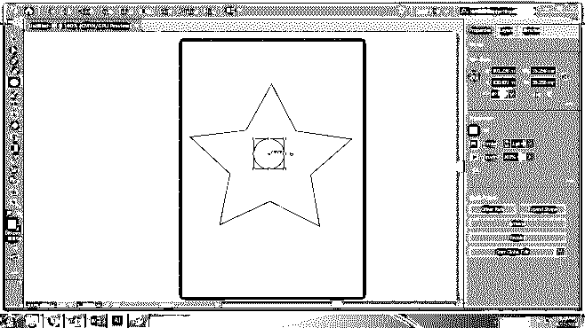

第三步:选择两个形状，使用工具箱中的混合工具。这是默认的混合工具。

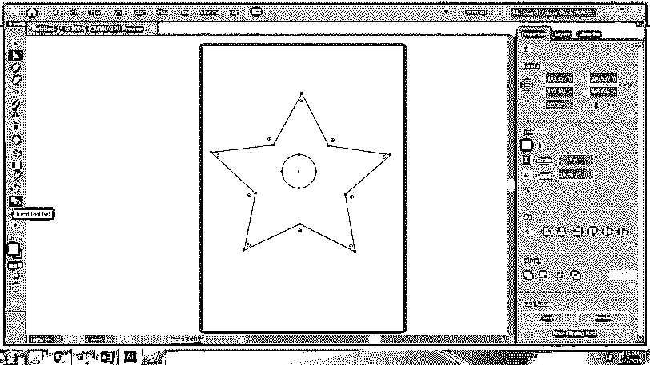

**第四步:**混合后的物体会是这样的。

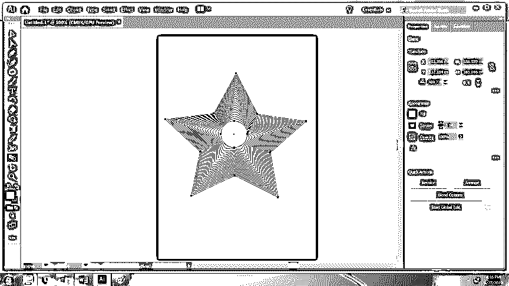

步骤 5: 现在，使用粉红色的星星和黄色的圆圈，并再次使用混合工具。我们可以使用混合选项来更改混合对象的设置。

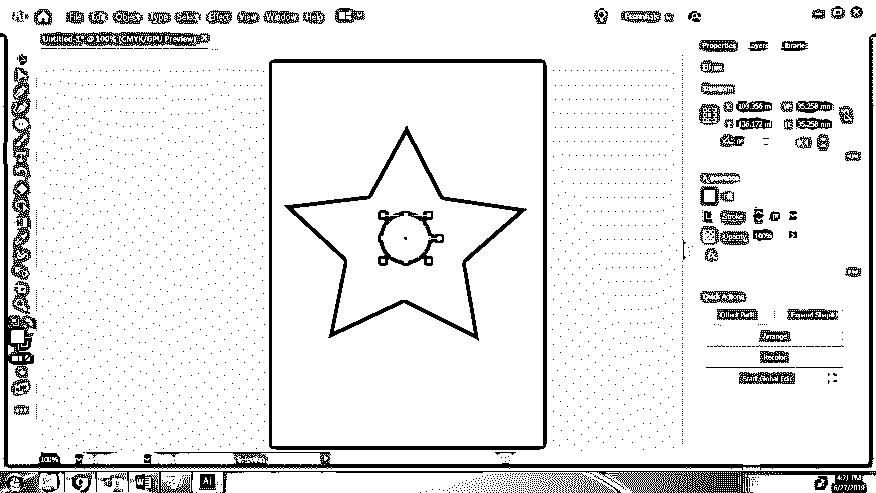

第六步:之后，选择两个物体，使用混合工具。使用混合选项使用，平滑颜色功能。

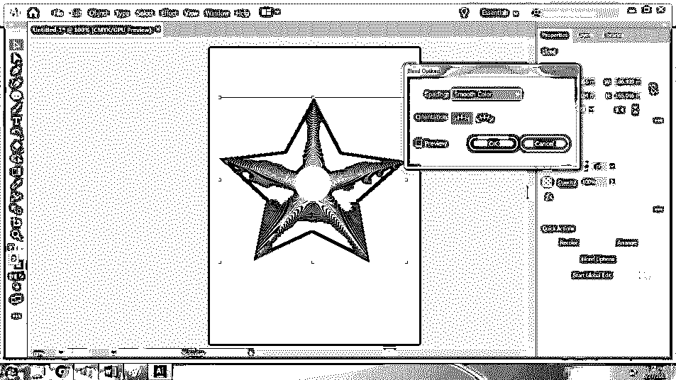

步骤 7: 现在，创建一个新文件。用任意颜色画三个椭圆。

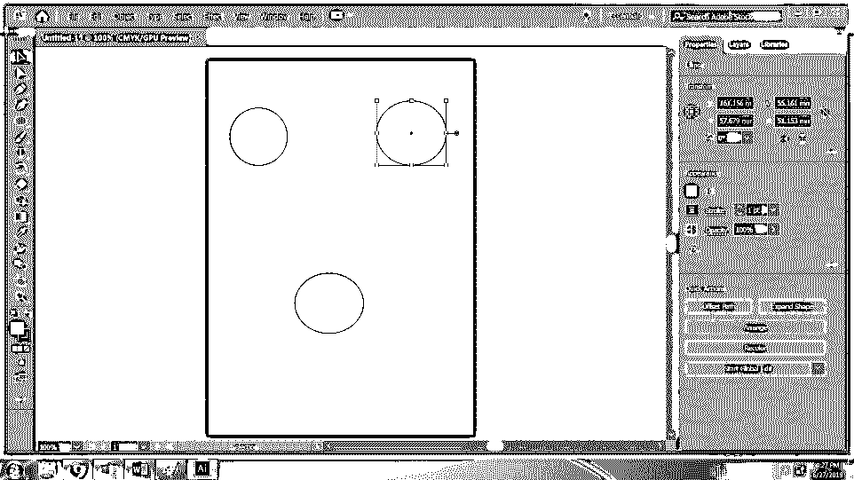

步骤 8: 选择所有三个圆，使用混合工具。

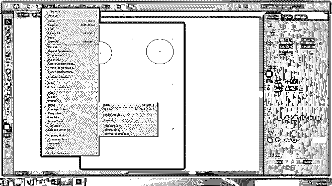

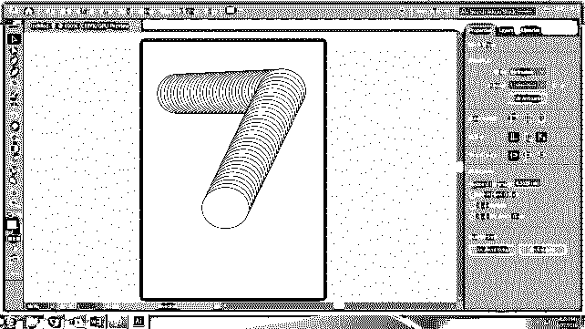

**第九步:**使用钢笔工具绘制路径。

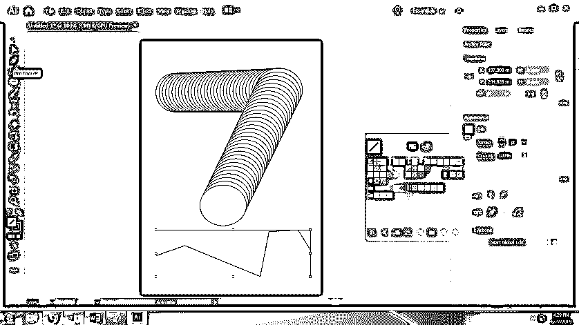

**步骤 10:** 使用选项>混合>替换样条线中的替换样条线工具。

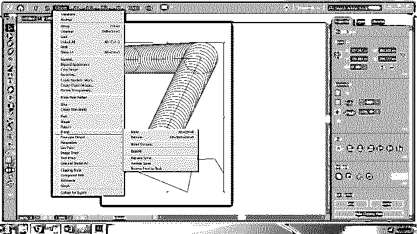

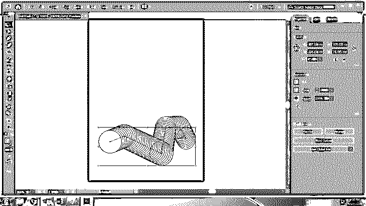

**步骤 11:** 使用释放选项获取原始对象。

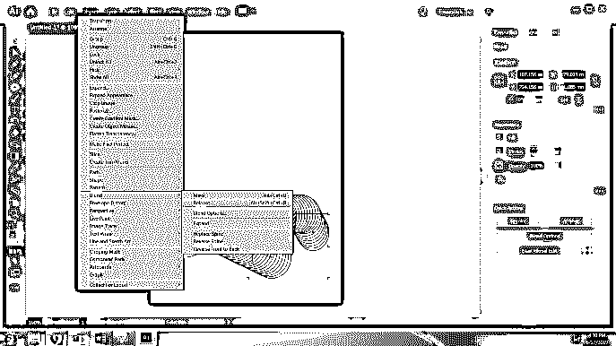

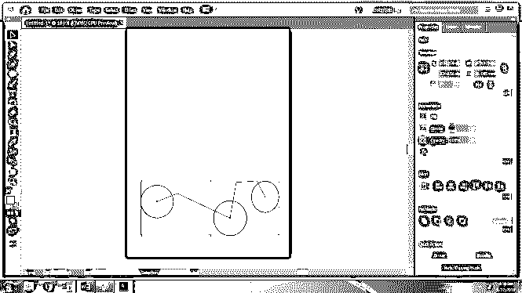

**步骤 12:** 同样，要得到每个混合对象的锚点，使用扩展选项。

**T2】**

 **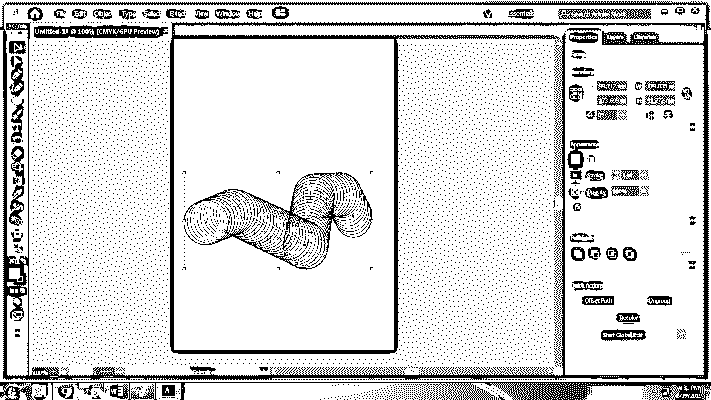

### 结论

混合工具是用形状创建不同效果的简单方法。它有许多选项和子功能。在上面的例子中，我们已经看到了混合工具工作的不同选项，它给出了所需的结果。

### 推荐文章

这是 Illustrator 中混合工具的指南。在这里，我们讨论的概念和如何在 Illustrator 中使用混合工具。您也可以浏览我们推荐的其他文章，了解更多信息——

1.  [Adobe Photoshop 工具](https://www.educba.com/adobe-photoshop-tools/)
2.  [Photoshop 中的线条工具](https://www.educba.com/line-tool-in-photoshop/)
3.  [CorelDRAW 工具](https://www.educba.com/coreldraw-tools/)
4.  [搅拌机工具](https://www.educba.com/blender-tools/)

**