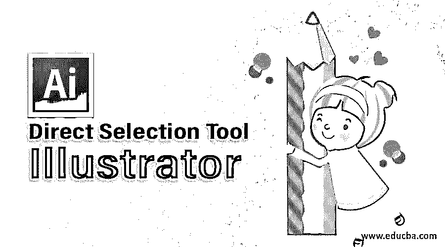
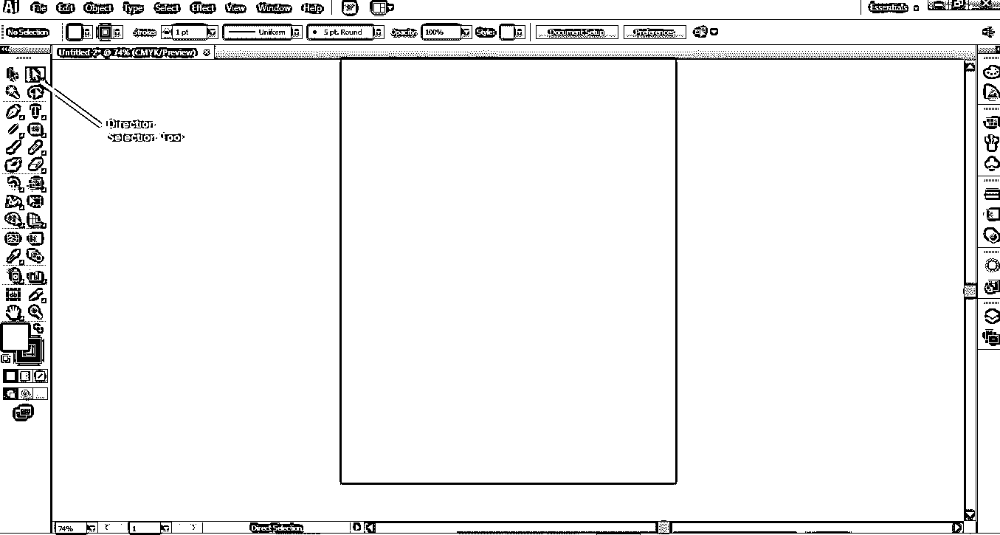
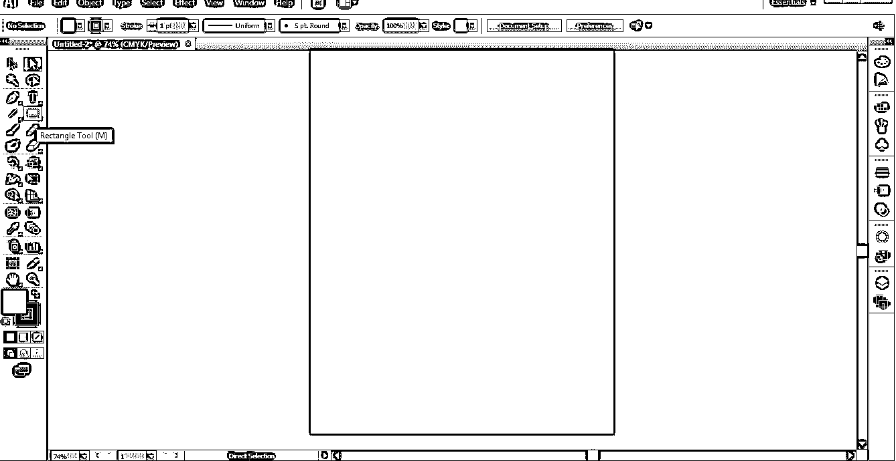
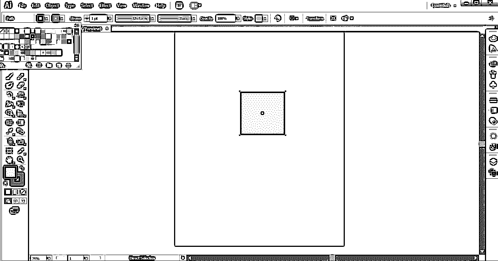
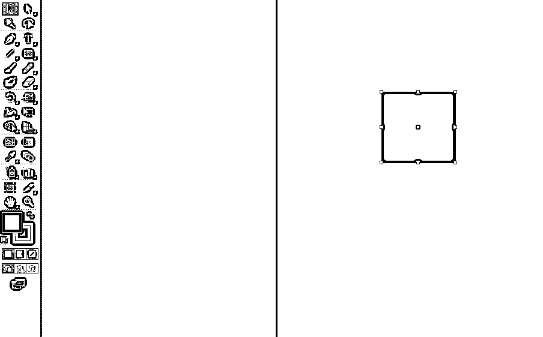
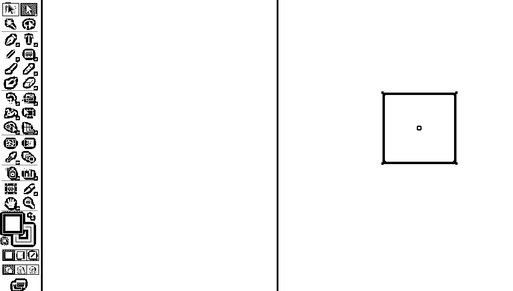
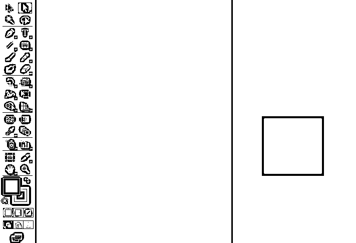
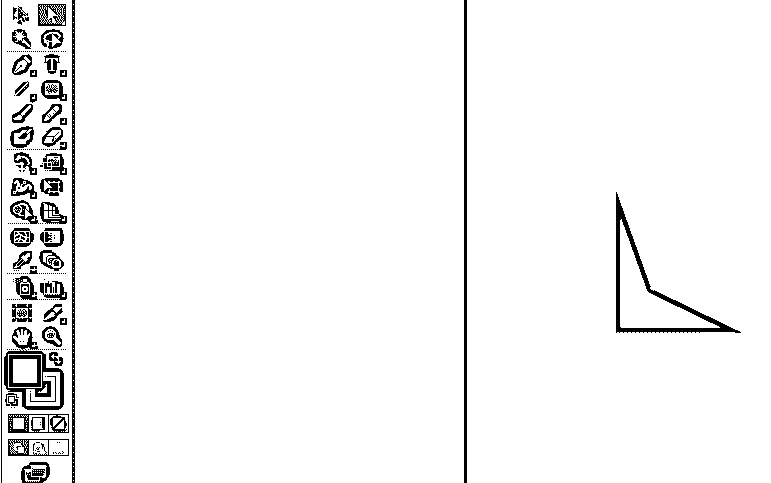
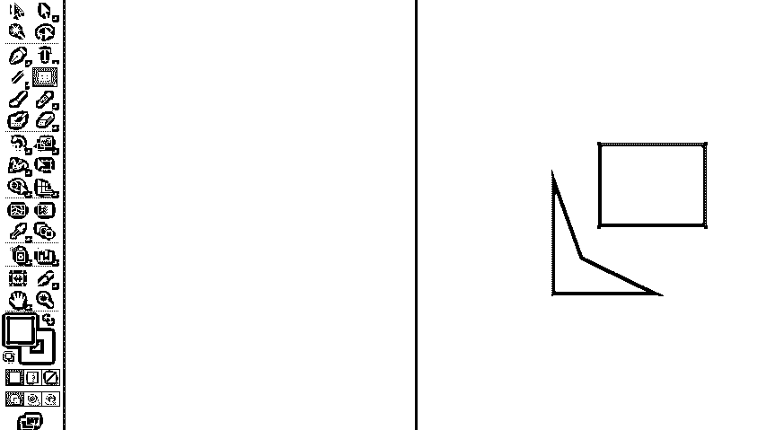
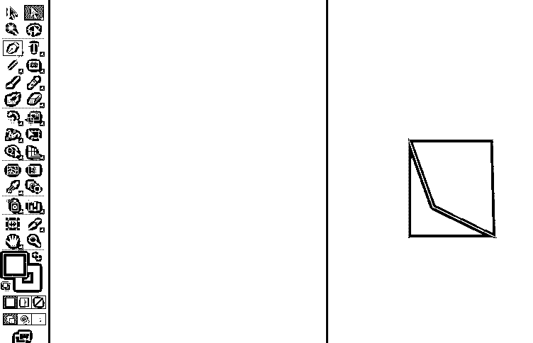

# 直接选择工具

> 原文：<https://www.educba.com/direct-selection-tool-illustrator/>

## Illustrator 直接选择工具简介

直接选择工具 illustrator 是选择工具中最重要的部分之一。直接选择工具帮助用户选择包括锚点或片段的对象的一部分。我们还可以选择多个锚点，并使用 illustrator 中的直接选择工具对其进行编辑。通过 illustrator 中可用的属性，用户可以使用此工具在对象中添加或减去锚点。使用该工具，我们还可以根据用户的要求添加曲线或使曲线变直。

### 什么是直接选择工具 Illustrator？

直接选择工具允许用户选择任何对象的单个点。我们也可以选择任何对象的片段，并根据需要拖动它们。使用直接选择工具，您可以选择单个路径点和段；您还可以在选择中添加或减去项目。此外，您还可以使用直接选择方法并拖动选取框来选取路径的一部分，然后拖动它的一部分来创建一个选择矩形。

<small>3D 动画、建模、仿真、游戏开发&其他</small>

我们可以在对象中删除或添加更多的点或段。这是 Adobe Illustration 最有用的工具。该工具与所有其他工具一起用于创建最终对象。

### 使用直接选择工具 Illustrator

现在，我们将绘制对象，并告诉我们如何以建设性的方式使用该工具。

**第一步:**使用该工具；首先，我们需要创建一个形状。关键字 A 是用于激活系统上的直接选择工具的键盘按键。为了在这里构造一个形状，我们将从屏幕左侧的工具箱中构造一个矩形。在我们选择了矩形命令后，屏幕顶部会出现一个工具箱，显示矩形内部/填充颜色、轮廓颜色、线条粗细、线条轮廓、不透明度、图形样式面板、重新着色图稿、对齐工具(如果我们需要对齐 2 个或更多矩形)、变换工具(更改矩形的位置)、隔离所选对象工具(将矩形与任何其他形状隔离)。

**第二步:**我们将根据我们的需求使用一个矩形形状的属性，构造一个矩形形状。

**步骤 3:** 如果我们使用直接选择旁边的选择工具，我们可以看到 9 个点，其中 4 个点在线的中心，4 个点在矩形的角上，1 个点在矩形的中心，如下所示。

**第四步:**但是如果我们将选择直接选择工具，我们只能看到 5 个点，4 个在矩形的角上，1 个在矩形的中心，如下图所示。

**第五步:**我们可以在使用直接选择工具的同时，按住并移动鼠标右键来改变矩形的位置。

**步骤 6:** 现在，我们可以按下矩形的任何一个角，并通过按下鼠标右键来移动它，以改变角相对于矩形中心的位置。

**步骤 7:** 现在，我们将再次使用 rectangle 命令构建另一个矩形。

**第八步:**我们再次使用直接选择工具，根据用户的意愿，改变 4 个角相对于第一个矩形的位置，形成一个几何形状。我们将匹配第一个矩形的角。

### 结论

上面，已经解释了我们如何使用直接选择工具来获得所需的形状。同样，我们可以使用任何其他命令，如直线、圆弧、圆和[样条线，并使用直接选择工具形成](https://www.educba.com/spline-in-3ds-max/)一个合适的几何图形。这个工具在设计商标时非常有用。我们可以构造任何合适的几何图形，构造奇妙的标识。由于这个软件是一个矢量库，我们可以放大或缩小对象，而不会降低其质量。

### 推荐文章

这是一个指南，直接选择工具插画。这里我们讨论什么是直接选择工具，以及如何使用这个工具来获得所需的形状。您也可以阅读以下文章，了解更多信息——

1.  [如何在 Adobe Illustrator 中使用网格工具？](https://www.educba.com/illustrator-grid-tool/)
2.  [Illustrator 中宽度工具介绍](https://www.educba.com/width-tool-in-illustrator/)
3.  [在 Illustrator 中插入图像的步骤](https://www.educba.com/insert-image-in-illustrator/)
4.  [如何在 Illustrator 中创建图层？](https://www.educba.com/layers-in-illustrator/)
5.  [Illustrator 中的选择工具](https://www.educba.com/selection-tool-in-illustrator/)

