# Illustrator 中的切片工具

> 原文：<https://www.educba.com/slice-tool-in-illustrator/>

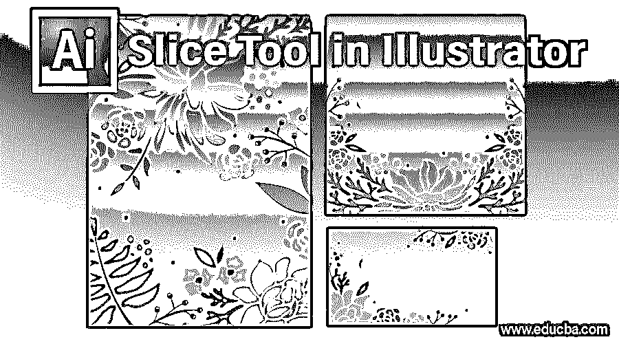

## Illustrator 切片工具简介

Illustrator 中的切片工具也称为切片选择工具。切片工具用于创建网页，网页设计作品。切片工具帮助用户创建对象的不同切片或片段，并根据他们的要求和需要放置它们。从对象中制作切片后，它们可以根据用途进行选择、锁定或隐藏。在切片工具选项的帮助下，用户还可以选择多个切片并将其全部锁定。

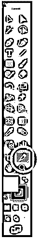

<small>3D 动画、建模、仿真、游戏开发&其他</small>

### 如何使用 Illustrator 中的切片工具？

在 Adobe Illustrator 中创建网页时，有大量不同的相互关联的切片。这些可能包括矢量图形、光栅图像和 HTML 代码，所有这些结合起来产生一个流畅的网络体验。要在同一个程序中分离和编辑这些不同的元素，Illustrator 允许您在它们之间生成称为切片或片段的端点。切片过程告诉 Illustrator 您要将网页的哪一部分从其余部分中分离出来，并将它们分别保存为 JPEG、GIF 或 PNG。

我们将以 EDUCBA 网站模板为例进行说明:

*   将 EDUCBA 模板拖到画布上。

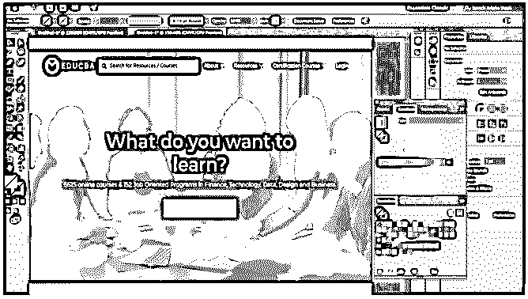

*   按照您的要求将[对象放在画板](https://www.educba.com/artboard-in-photoshop/)上后，将任何元素或对象转换成切片就很简单了。首先，选择切片工具，它看起来像工具栏面板中的手术刀，然后在您希望添加到切片的元素周围形成一个框。你也可以用[选择工具](https://www.educba.com/selection-tool-in-illustrator/)选择元素，然后点击对象>切片>制作。在本例中，我们将切割 EDUCBA 徽标、关于下拉菜单、认证课程按钮；你可以切任何你想要的东西。以下截图解释了使用切片工具进行切片的过程。

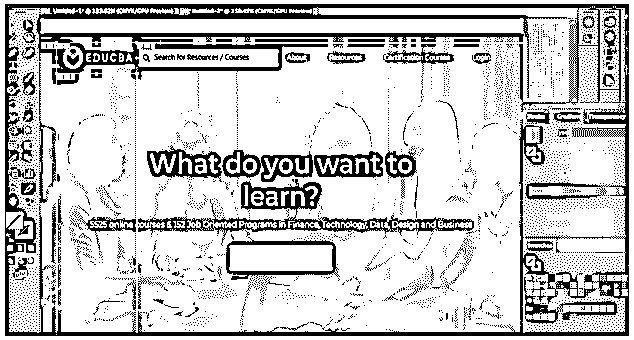

*   当您使用 Illustrator 切片工具时，该软件无疑会对元素周围的任何图像和对象进行切片。所有切片或片段都是在表格单元格布局中生成的，因此它们针对 web 得到了增强。

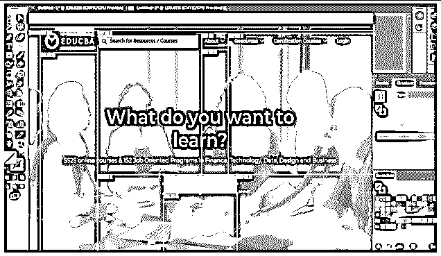

*   一旦你对你需要的元素进行了切片，要选择一个切片，在工具栏面板上点击切片选择工具，它看起来就像切片工具，但是上面有一个小的类似鼠标的光标。然后，选择切片。如果您想要选择多个切片，只需按住 Shift 键并逐个单击切片。

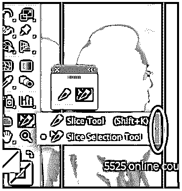

*   您可以通过单击上图中突出显示的外部箭头，从工具栏中调出切片工具选项，这样可以更方便有效地使用该工具。
*   当您对切片的位置感到满意并希望避免意外更改时，您可以通过单击切片的编辑列前进到图层面板来保护或锁定切片。若要立即保护所有切片，请从顶部的菜单栏中选取“显示”>“锁定切片”。

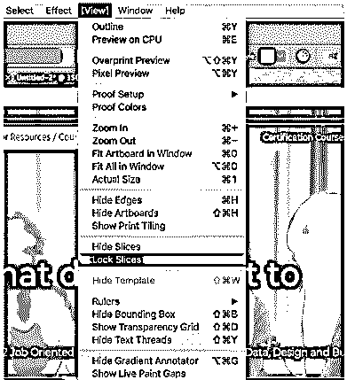

*   现在，要保存您所做的选择，请单击文件>保存为 web 格式；你会看到一个如下所示的窗口。

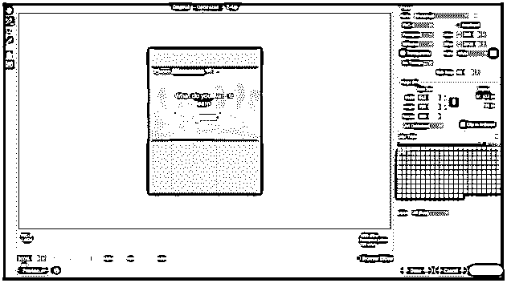

*   使用切片选择工具，您可以选择已切片的单个元素，并将它们分别保存为 JPEG、PNG 或 GIF。徽标可以保存为 SVG 格式。
*   单击 save 后，您将看到一个弹出窗口来保存您的选择，如下所示。

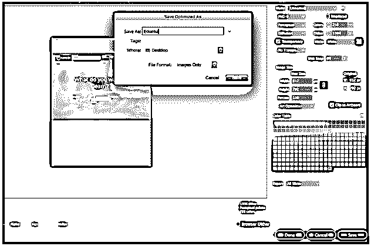

*   创建切片的另一种方法是通过参考线。我们将使用与上面相同的例子，并使用指南来分割单个元素。对于指南，我们需要标尺，我们可以通过在 Mac 上按下 **Command + R** 和在 Windows 上按下 **Ctrl + R** 来启用它。我们将创建如下所示的指南:

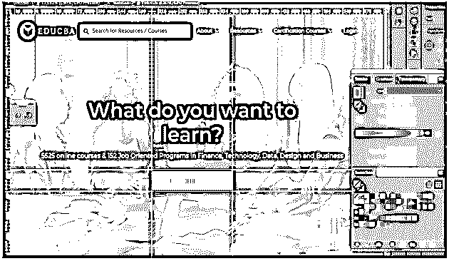

*   一旦创建了参考线，下一步就是通过点击对象>切片>从参考线创建来切片元素。

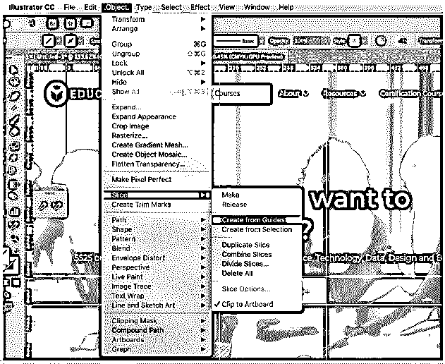

如您所见，元素现在已被切片。

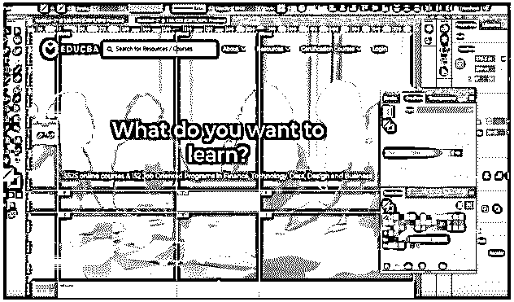

*   要删除切片，请使用切片选择工具选择它，然后按 delete 键。如果您希望消除工作中的每个切片并重新开始，请转到“对象”>“切片”>“全部删除”。
*   移除切片也将移除连接的图稿，因此如果您希望完好无损地保留图稿，您应该释放切片。要实现这一点，请选择您需要的切片，然后转到“对象>切片>释放”。
*   最终，隐藏切片的表格单元格和类似的徽标而不从作品中删除切片是可行的。为此，请选择“视图”>“隐藏切片”。

### 结论

基本上，您可以利用“切片”工具在要从布局中裁剪的对象区域上勾画出矩形路径。这是切片的唯一目标，将插图雕刻成布局文件中的矩形切片。Illustrator 将单个插图分成几个图像。它生成一个 HTML 表格，表格中的每个单元格都由这些图像片段组成。这样，当你在浏览器中注册网页时，所有被切片的图像会同时出现，就像拼图一样。最重要的是，切片保存在文件中，这意味着您已经将它保存为文档。可以在 Illustrator 中创建切片层，并在该层下包含所有切片路径。这使得查找切片路径变得更加容易，并允许您保存在第一个实例中从文件中剪切出来的所有插图的精确尺寸。

### 推荐文章

这是 Illustrator 中切片工具的指南。这里我们用几个插图一步一步的讨论如何使用 Illustrator 中的切片工具。您也可以阅读以下文章，了解更多信息——

1.  [安装 Adobe Illustrator](https://www.educba.com/install-adobe-illustrator/)
2.  [Illustrator 中的 3D 效果](https://www.educba.com/3d-effects-in-illustrator/)
3.  [Photoshop 中的橡皮擦工具](https://www.educba.com/eraser-tool-in-photoshop/)
4.  [Photoshop 中的矩形工具](https://www.educba.com/rectangle-tool-in-photoshop/)
5.  [适用于 Windows 8 的 Adobe Illustrator】](https://www.educba.com/adobe-illustrator-for-windows-8/)
6.  [后期效果中的 3D 效果](https://www.educba.com/3d-effects-in-after-effects/)
7.  [安装 Adobe Creative Cloud](https://www.educba.com/install-adobe-creative-cloud/)
8.  [Photoshop 中的橡皮擦工具](https://www.educba.com/eraser-tool-in-photoshop/)
9.  [Illustrator 中的平滑工具概述](https://www.educba.com/smooth-tool-in-illustrator/)

