# Illustrator 中的效果

> 原文：<https://www.educba.com/effects-in-illustrator/>

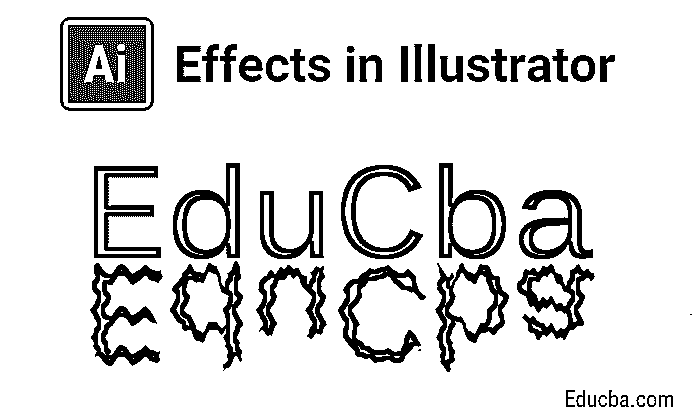

## Illustrator 中的效果介绍

Adobe Illustrator 被许多创作者、设计师、VFX 艺术家等使用。使用 Illustrator 中的各种效果(如剪纸效果、水反射效果和艺术线条效果)来创建基于矢量的图形(如表情符号、徽标、网页等),并且该软件中有无数的效果可以根据用户的视觉标准来改善用户体验，所有这些都有助于将用户开发的概念直接设计为用于杂志、徽标、宣传册和网站的数字媒体。

### 如何在 Illustrator 中应用效果？

由于所有的软件工具都有智能的工作流程和制作效果的快捷方式，我们将一个接一个地详细介绍它们。

<small>3D 动画、建模、仿真、游戏开发&其他</small>

#### 1.剪纸效果

**第一步:**打开 [Adobe Illustrator](https://www.educba.com/what-is-adobe-illustrator/) ，打开一个新文件。[选择钢笔工具键盘上的快捷键](https://www.educba.com/pen-tool-in-illustrator/)是字母“P”。根据需要开始绘制最外面的形状，并关闭循环。在绘制的结构中重复相同的操作两次，如下图所示。

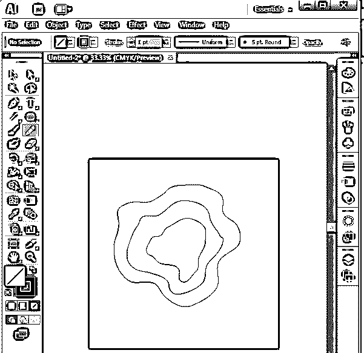

**第二步:**为完整的图像创建矩形外或方形外；我们也可以使用完整的画板或文件大小来更好地可视化效果。“M”是热键，或者从应用程序左侧窗格的工具栏中选择形状。

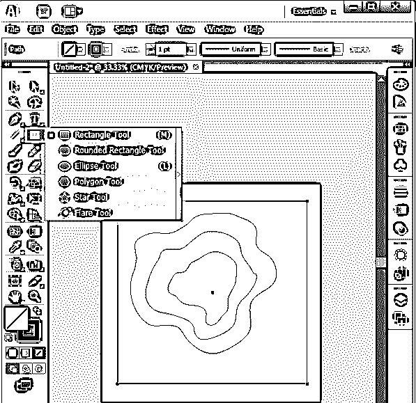

**第三步:**翻转颜色面板控件，这样我们可以清楚地看到所选区域，以便对效果进行进一步处理。选择形状构建工具“Shift + M”来选择精确的区域。

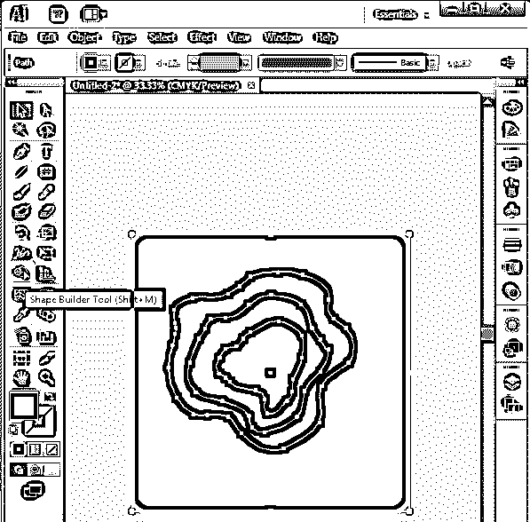

选择工具后，选择[画板](https://www.educba.com/artboard-in-photoshop/)的任意部分；我们可以看到特定区域被精确地选中，排除了其他区域，如下图所示。

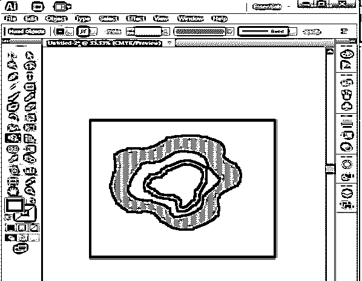

**步骤 4:** 现在，选择要填充到设计为定期观察的部分中的颜色，最佳做法是选择相同的颜色，随着图像中所选颜色的加深，RGB 值会有所不同，以提供更真实的视觉效果。

我们也可以根据需要选择多种不同的颜色。

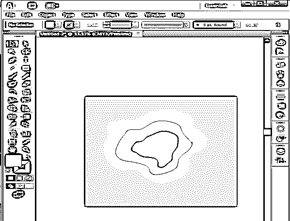

**第五步:**这是一些设置，通过将艺术部分以不同的排列方式放置来获得深度剪纸效果。选择最内层，从菜单栏转到“对象”，转到“排列”，然后选择“置于底层”。

**对象- >排列- >发送到后面**

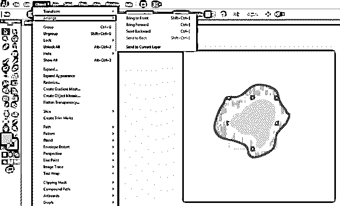

**步骤 6** :逐个选择剩余的组件，并设置它们的排列，使其单独显示在最前面。

**选择物体- >排列- >带到前方**

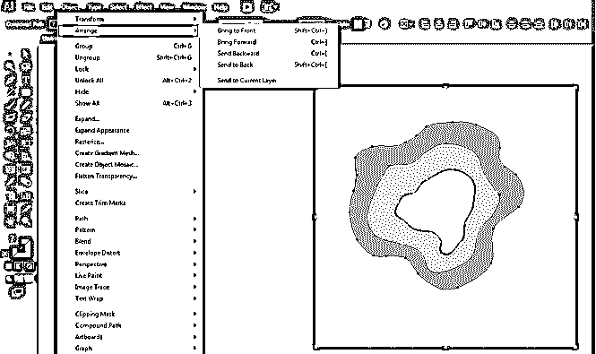

第七步:给作品带来生命的主要步骤是给组件添加阴影。选择设计的所有 3 个组成部分，点击效果，去造型，选择阴影。“投影细节”窗口打开。

**特效- >造型- >阴影**

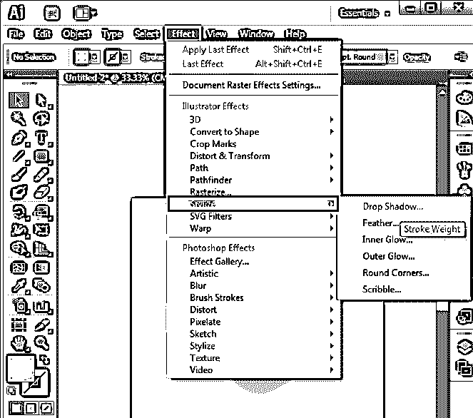

**第八步:**配置如下的投影细节，这是标准的；如果需要，我们甚至可以根据外观、感觉和需求来更改这些值。

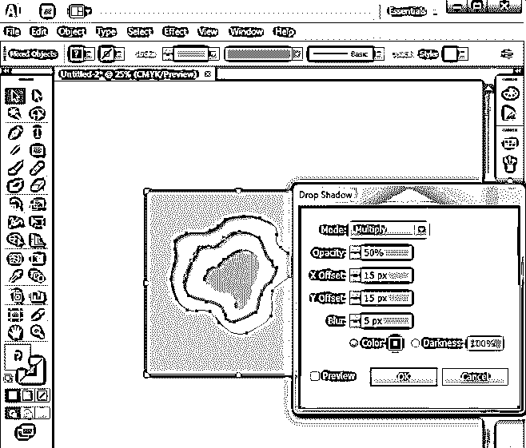

**步骤 9:** 将画板放在应用程序或屏幕的中央，并检查是否还需要重复或更改。如果一切正常，我们可以将文件导出为图像格式并保存。

**

** 

#### 2.水反射效应

**第一步:**打开一个矩形的新画板，创建需要反射的对象；我们可以用不同的形状和物体来反映。使用形状、钢笔、画笔和其他工具创建文本。

**Note:** Text can be reflected as the anchor points are null

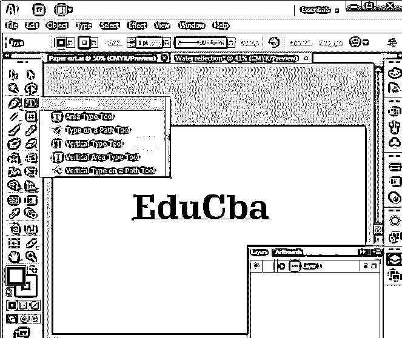

**第二步:**选择创建好的设计，从键盘上点击“O”启用倒影，按住 Alt 键，选择锚点，将物体向各自的方向倒影。双击下面显示的反射工具打开窗口来配置值。由于水的反射是在底部自然观察到的，从窗口中选择水平，然后点击复制来创建一个反射副本。

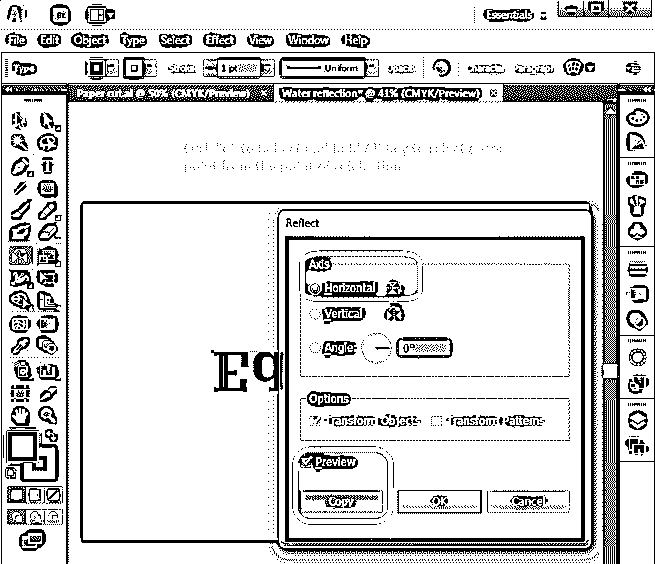

**步骤 3:** 创建反射副本集；选择反射副本并单击向下箭头按钮，在原始对象和反射对象之间创建间隙。

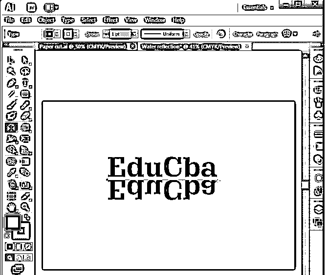

**第四步:**全选，按 Ctrl + G，将所有内容分组到一个文件中。按 Shift + F7 或 windows - >对齐打开对齐选项。

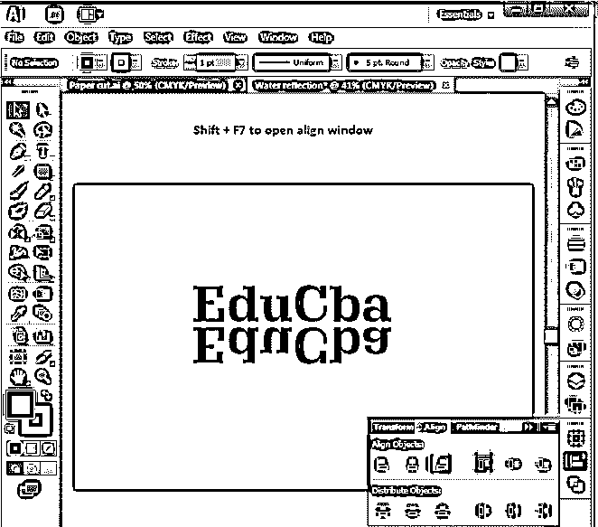

单击“与画板对齐”,这会将内容与“水平居中对齐”和“垂直居中对齐”对齐，以使组件框架正好位于框架的中心。

**第五步:**选择[选择工具](https://www.educba.com/selection-tool-in-illustrator/)拖拽选择所有组件，右键选择解组选项。这将分离对象以供选择。

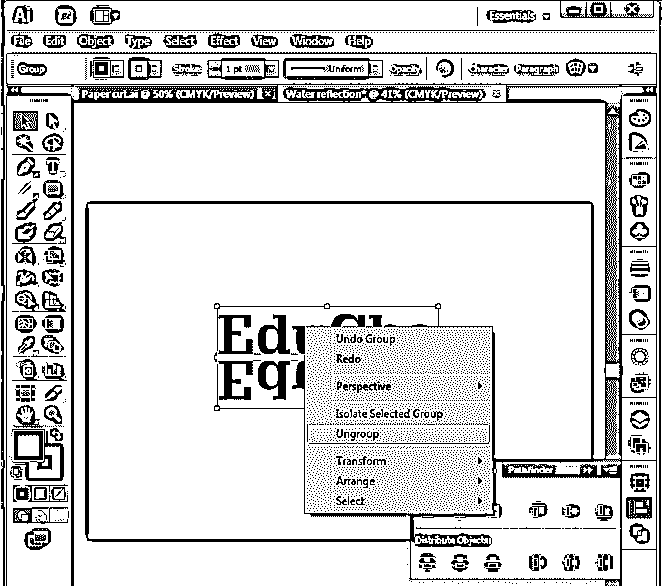

**第六步:**双击工具栏上的扭曲工具。“包裹配置”窗口打开，将包裹的设置配置为给定值，以创建对角线扭曲工具。

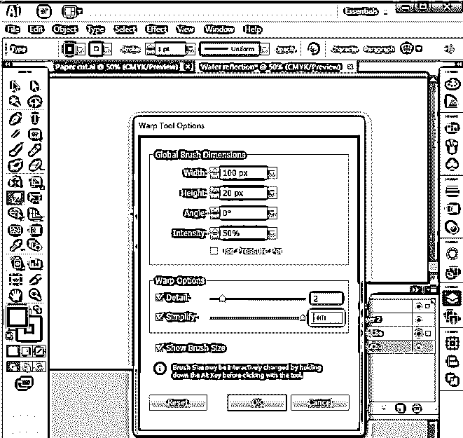

**步骤 7:** 选择必须创建为波浪的对象，沿着它们移动扭曲工具，创建一个如图所示的波浪效果。对每个对象重复此操作。

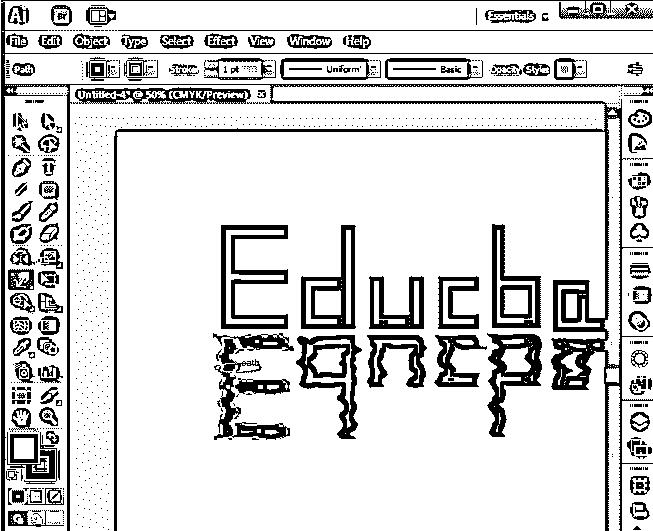

**步骤 8:** 完成设计上的扭曲移动后，如果需要在曲线上进行细节和造型，我们可以添加和删除更多的锚点，并重复扭曲工具移动以获得形状。最后，我们得到了如下所示的结果，或者基于实践得到了更好的结果。通过这个，我们可以添加一个水[反射效果到设计](https://www.educba.com/reflection-effect-in-photoshop/)内容中。

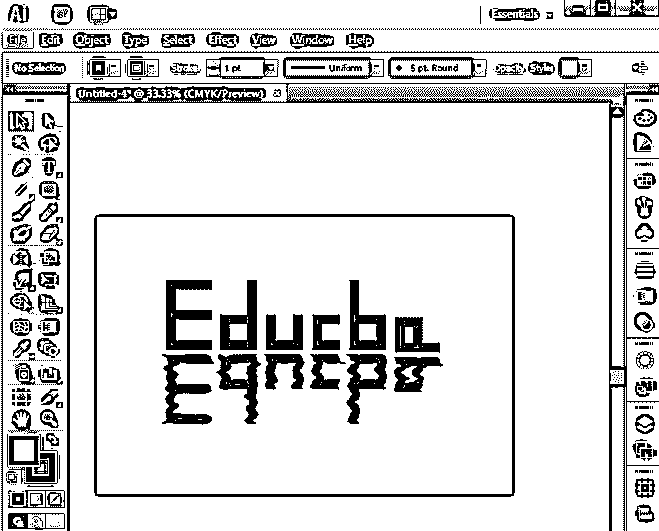

#### 3.艺术线条效果

这是另一个最简单易行的效果。

**第一步:**导入或创建形状，必须创建线条，新建一个图层，名称为线条。

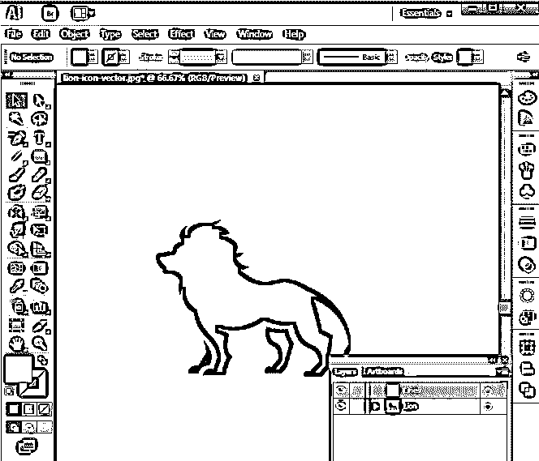

**第二步:**从工具栏选择线条，根据需要用笔画和配置画出 2 条线。放置在设计的起点和终点，如下所示。

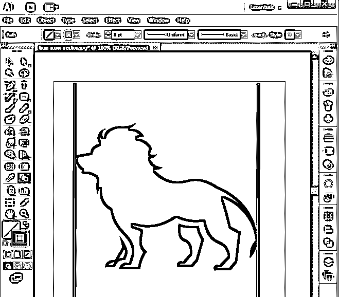

**第三步:**选择混合工具，选择两条线，点击回车，用中间的线填充空隙。

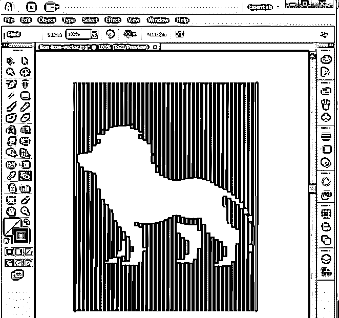

**第四步:**双击混合工具打开混合窗口选项，配置选项保持开口均匀。

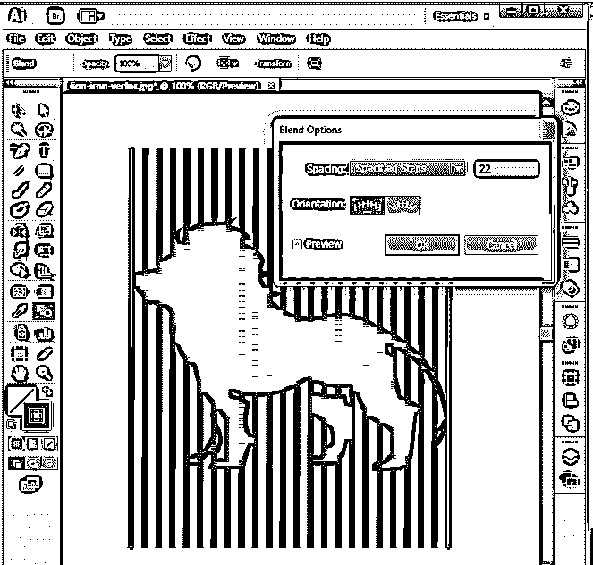

**步骤 5:** 选择线条层，从菜单栏转到对象，选择展开。

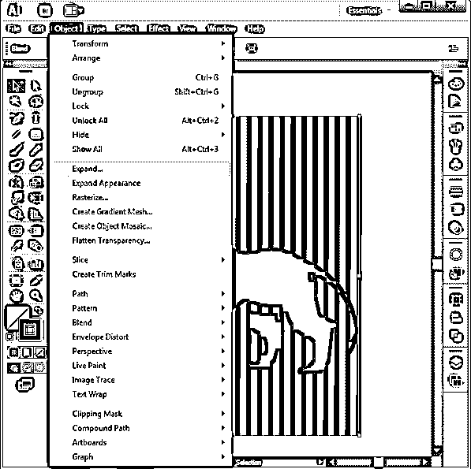

**步骤 6:** 展开窗口打开，配置窗口选项，点击确定。

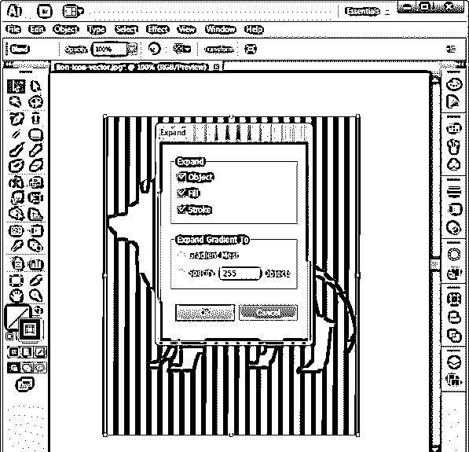

**第七步:**线条和物体都必须在共享同一区域的不同图层中。

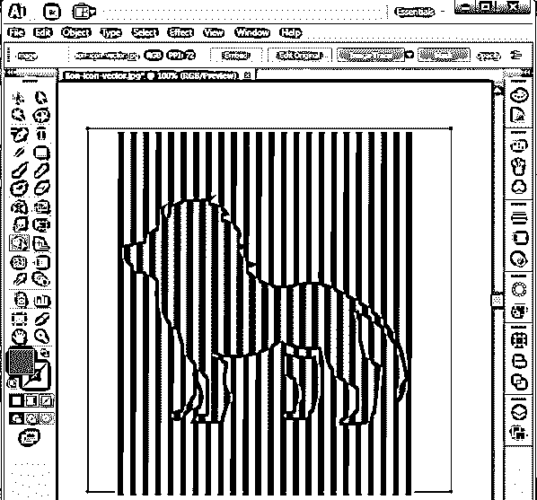

**第八步:**点击对象图层(狮子)选择线条图层选择锐利构建工具按住 Shift + Alt，拖动边角到不在对象(狮子)上的线条上自动删除。

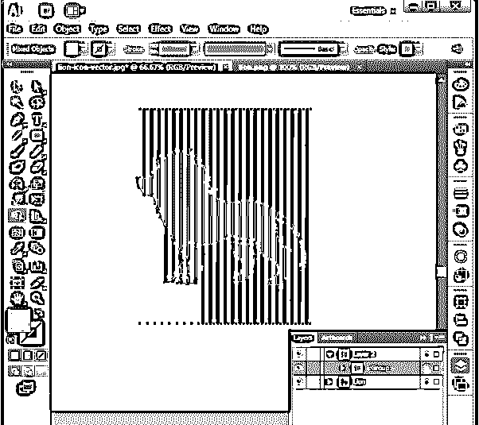

**第九步:**现在去掉对象层；现在我们可以看到一条线留在物体的形状中，它被用作参考。这就是我们如何从 Illustrator 中获得线条艺术效果。

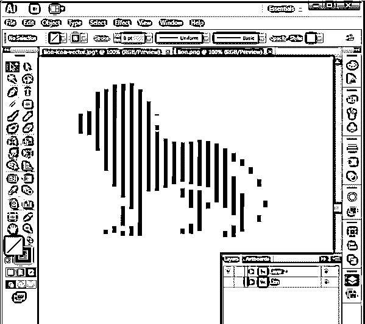

### 结论

我们已经看到了如何通过 Illustrator 创建一些有趣的效果。这是为各种角色的平面设计师设计的快速艺术作品、效果和有趣的东西的工具，如 VFX 、网页设计、艺术、纸张编辑、杂志制作、标志制作、小册子制作等等。初学者需要理解这个工具，并对它进行足够的练习，以便熟悉它的界面。这个工具被许多工作室使用，为艺术学生提供找工作的机会。Illustrator 是顶级的基于平滑矢量的对象创建工具；许多即将出现的图标和表情符号都是通过这个工具开发的。

### 推荐文章

这是 Illustrator 中的效果指南。这里我们讨论如何在 Illustrator 中使用图层和不同的选项来创建不同的效果。您也可以阅读以下文章，了解更多信息——

1.  [顶级插画插件](https://www.educba.com/illustrator-plugins/)
2.  [后期效果中的 3D 效果](https://www.educba.com/3d-effects-in-after-effects/)
3.  [Illustrator 中 3D 效果的类型](https://www.educba.com/3d-effects-in-illustrator/)
4.  [Illustrator 中的图章效果](https://www.educba.com/stamp-effect-in-illustrator/)

