# 在 Illustrator 中插入图像

> 原文：<https://www.educba.com/insert-image-in-illustrator/>

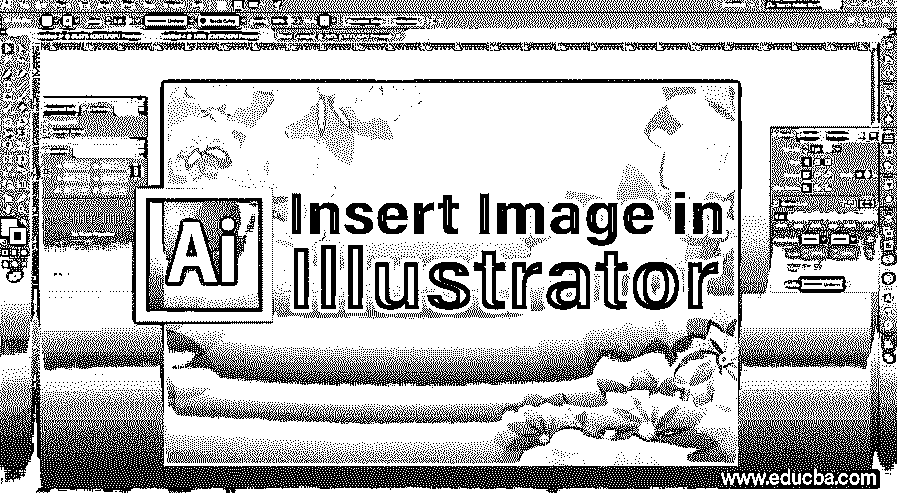

## 在 Illustrator 中插入/导入图像

在 Adobe Illustrator 的插入图像中创建图稿时，图像可能很重要。一旦您知道如何将图像导入到 Illustrator 文档中，使用它们创建令人惊叹的视觉效果就变得非常容易。无论图像是 PNG 还是 JPEG 格式，您都可以毫不费力地将其放入文档中。

### 如何在 Illustrator 中插入图像？

**步骤 1:** 打开现有的或新的 Adobe Illustrator 文件。如果您已经创建了一个文件，那么您需要向其中添加一个图像；然后，在打开保存的文档后，您可以继续在文档中添加新图像。另外，如果您想尝试创建一个新文档，并尝试查看如何在 Illustrator 中添加图像，那么相应地，您可以选择桌面上的 Illustrator 图标，或者直接从搜索菜单打开 Illustrator 并启动该程序。

<small>3D 动画、建模、仿真、游戏开发&其他</small>

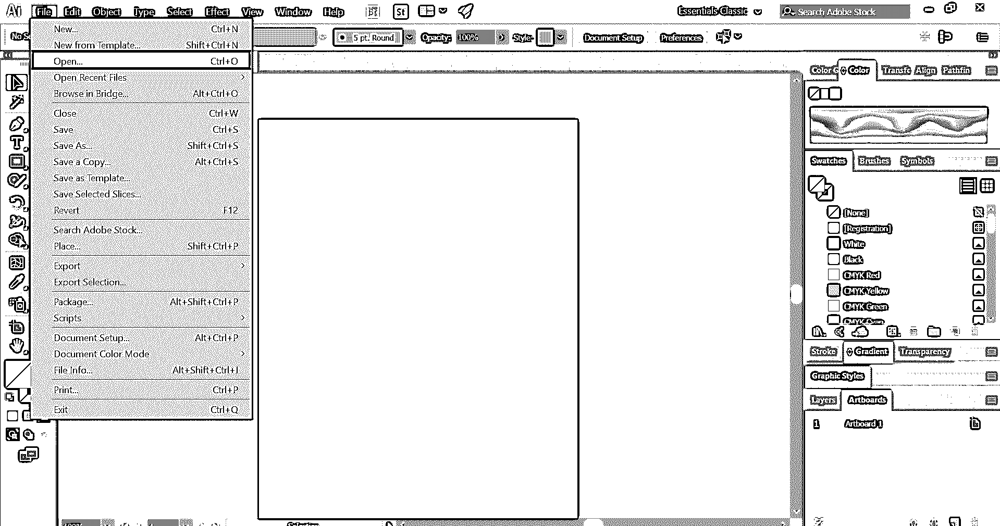

**第二步:**如果您已经有一个保存的文件，您可以从文件菜单中访问它。使用文件菜单，选择打开并选择保存在硬盘上的文件。同样的快捷键是 **Ctrl+O** 。如果文件是最近打开的，您也可以通过打开最近的文件选项来访问它。

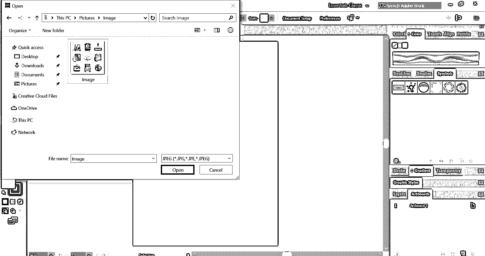

**步骤 3:** 文档打开后，从文件菜单，转到置入选项。这个地方的快捷键是 **Shift + Ctrl + P** 。

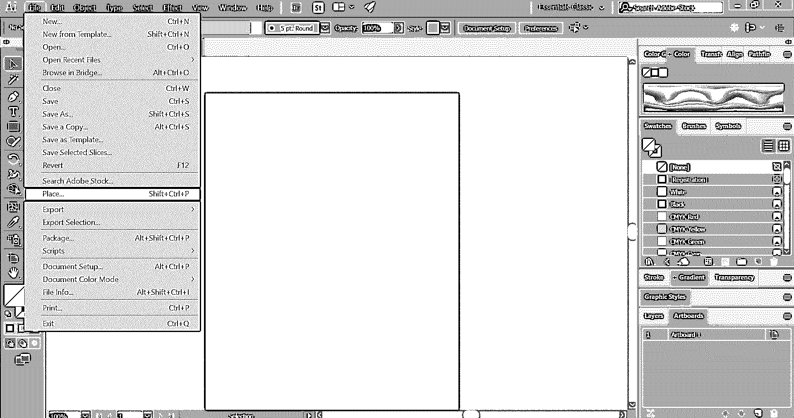

**步骤 4:** 这将打开一个对话框，您可以从中选择要添加到文档中的图像。选择正确的一个，您将可以选择借助鼠标光标将其放置在文档的任何位置。根据您的喜好拖动鼠标光标，图像将按比例放置在鼠标光标的路径上。

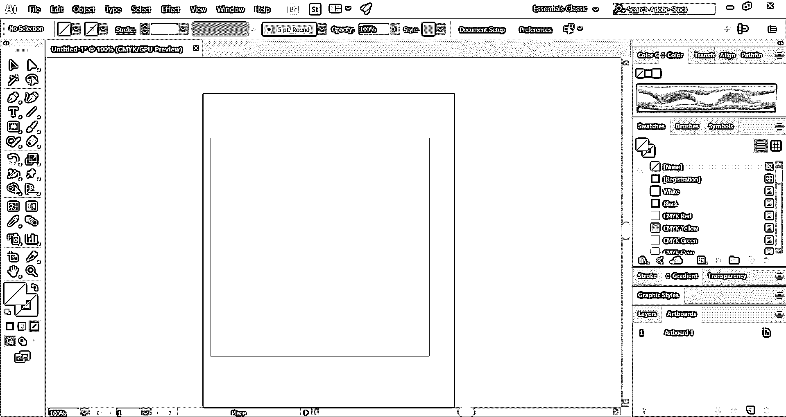

**第五步:**放置好图像后，您可以进一步调整图像的大小或位置。为此，使用图像边界框上的锚点。当您想要调整图像大小时，拖动它。拖动时最好按住 shift 键，以便在调整图像大小时获得均匀的结果。

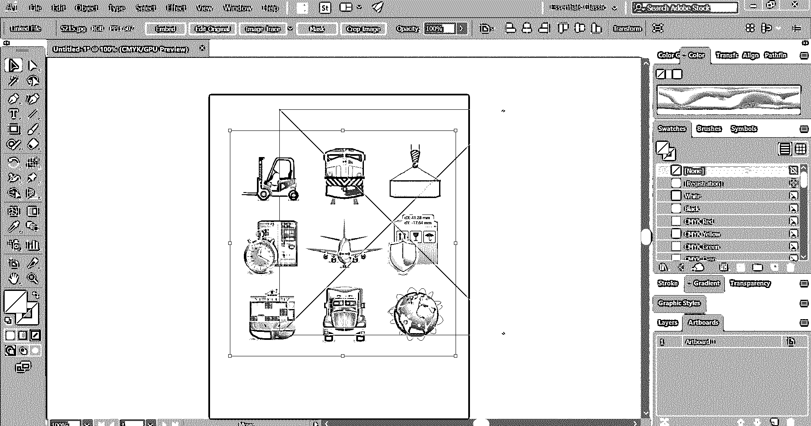

要移动图像，您可以使用鼠标光标或键盘导航键拖动照片。使用键盘箭头键时，如果您同时使用 shift 键，它将比使用普通箭头键移动更长的距离。

**第六步:**如果您想裁剪图像，只需点击图像，进入文档顶部的裁剪图像选项。之后，使用鼠标，根据需要裁剪图像。一旦裁剪完全符合您的需要，请按 Enter 键确认。

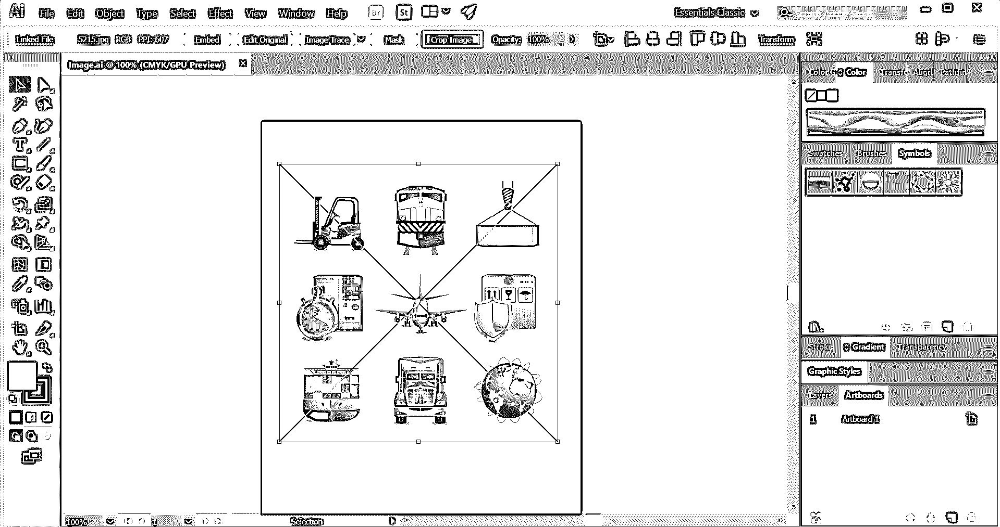

**步骤 7:** 用于变换图像，以应用各种选项，如移动、旋转、反射、缩放、剪切等。，使用变换工具。要打开变换工具，右键单击图像并选择变换。接下来，胡佛到相应的选项面板如下图所示。该面板包含上述所有选项，从旋转到缩放。

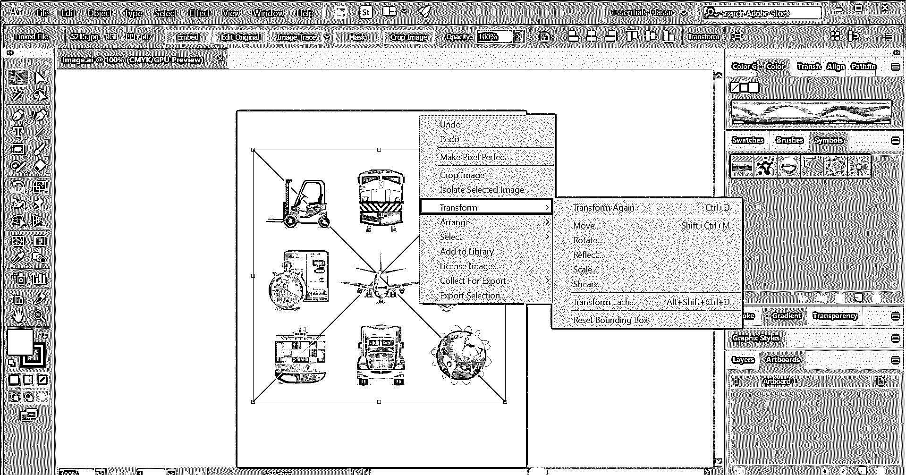

### Illustrator 中的图像描摹

在接下来的过程中，您将学习如何将光栅图像转换为矢量图像格式。Adobe illustrator 中有一个应用描摹功能的选项，可以将图像转换为矢量格式。这很有用，尤其是当你想以高质量打印你的作品时。如果图像是光栅类型的，当试图放大时，它将失去质量。一旦图像被转换成矢量格式，它可以无限缩放，而不会影响清晰度。为此，您需要使用窗口菜单中的图像跟踪。

*   在 Illustrator 中打开图像后，转到 Windows 并选择“图像描摹”选项。它会打开图像跟踪面板。

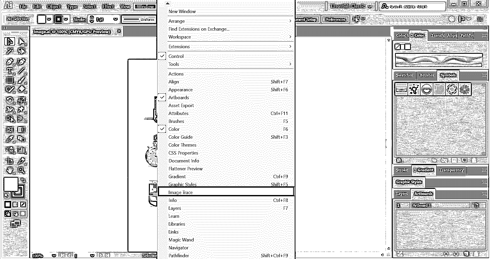

*   在第一行中，您会在框的顶部找到自动颜色、高颜色、低颜色、灰度、黑白和轮廓等选项。您可以通过更改值并以您认为最好的方式应用结果来尝试它们。
*   颜色模式允许您设置跟踪图像的最大颜色量。灰度可用于设置从 0 到 200 的精度范围。任何比阈值暗的像素都会自动变成黑色。在那下面，你会发现诸如预置、视图和模式的选项。

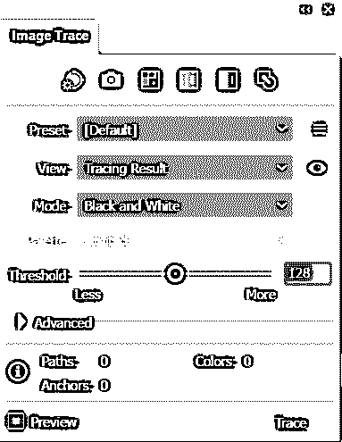

*   如果您希望在选择不同的值和效果时看到图像的实时效果，请单击预览框。
*   再往下，有一个高级菜单选项，它给你更多的工具和选项来操作图像。这个部分有选项来改变路径，角落，噪音和更多的设置。

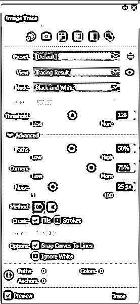

*   路径可以从低到高设置，角落可以从少到多设置，噪波可以从 1 到 100 像素设置。

### 在 Illustrator 中插入图像中的图像保存选项

在图像中应用各种效果和设置后，最后，您需要将创建的图像保存到您的硬盘上。以下是以你喜欢的格式保存你的作品的方法。

*   您可以将图像保存为多种格式，如 Adobe Illustrator、PDF、EPS、SVG 等。要选择格式，请转到文件>另存为选项。

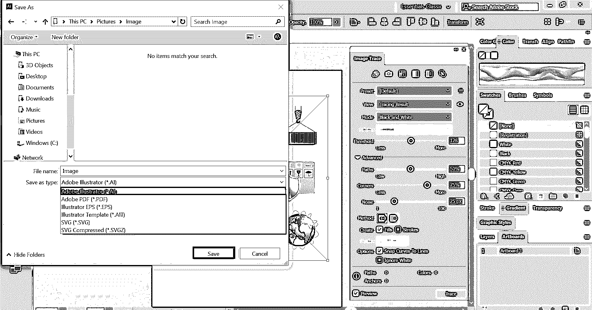

*   如果您希望以图像格式导出您的作品，请转到文件>导出。可以看到很多导出类型如 AutoCAD 绘图、PNG、Photoshop、Targa 等。你现在可以选择 JPEG。

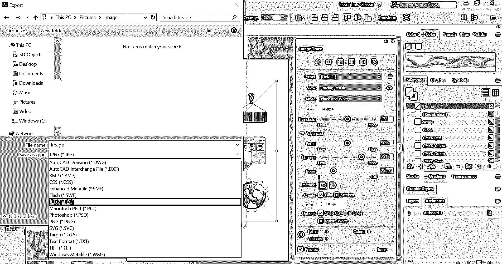

*   勾选[使用画板选项](https://www.educba.com/artboard-in-photoshop/)，仅导出画板内的内容。

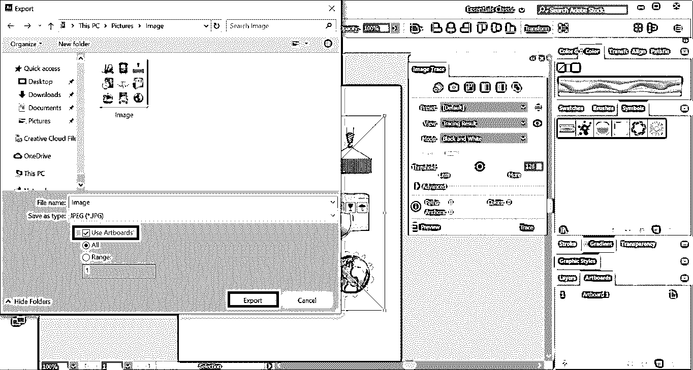

*   最后，你会发现一个 JPEG 选项面板。它包含图像的附加细节，如颜色模式、分辨率等。根据您的需求进行适当选择，然后单击“确定”。

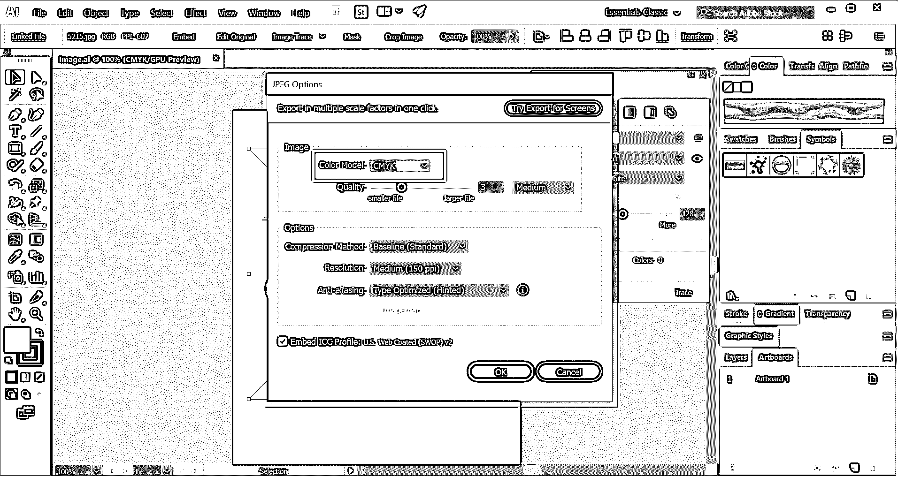

### 结论

使用上述步骤，您可以轻松地将图像插入到文档中。您也可以尝试探索 Illustrator 中提供的各种选项，以更好地定位或对齐图像并赋予图像效果。您可以在各种材料中使用这些图像，如海报、手册、书籍封面、传单、网站设计等。尝试利用 Illustrator 中的图像创建新的设计，增强您的创造力。

### 推荐文章

这是在 Illustrator 中插入图像的指南。这里我们讨论在 illustrator 中插入图像、跟踪图像和在 Illustrator 中保存选项的步骤。您也可以浏览我们的其他相关文章，了解更多信息——

1.  [Illustrator 中的图形样式](https://www.educba.com/graphic-styles-in-illustrator/)
2.  [Illustrator 中的 3D 效果](https://www.educba.com/3d-effects-in-illustrator/)
3.  [Illustrator 中的效果](https://www.educba.com/effects-in-illustrator/)
4.  [Illustrator 中的平滑工具](https://www.educba.com/smooth-tool-in-illustrator/)

