# 在 Illustrator 中裁剪

> 原文：<https://www.educba.com/crop-in-illustrator/>

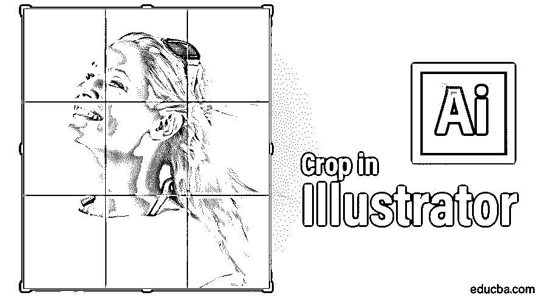

## Adobe Illustrator 中的裁剪图像

Adobe Illustrator 被用作创建绘图、艺术品、插图等的软件。它是在 1987 年开发的，现在由 Adobe 系统维护。它是 [Adobe Creative Cloud](https://www.educba.com/what-is-adobe-creative-cloud/) 在当下的一部分，被专业插画师广泛使用；Illustrator 中的裁剪被网页设计师和图形设计师广泛使用，使他们的工作变得非常简单和有效。 [Adobe Illustrator](https://www.educba.com/what-is-adobe-illustrator/) 中有多种类型的绘图工具，用于制作插图、艺术品等。Illustrator 中的裁剪是 Adobe Illustrator 的基本工具，用于根据我们的要求裁剪图像。

### 在 Adobe Illustrator 中裁剪图像的步骤

在 adobe illustrator 中，裁剪是一项有趣的[工作。让我们以循序渐进的方式，用几个例子来看看在 Adobe Illustrator 中裁剪图像。](https://www.educba.com/adobe-illustrator-for-windows-8/)

<small>3D 动画、建模、仿真、游戏开发&其他</small>

**第一步:**开始之前，我们会看到一些 Adobe Illustrator 的基础知识。这是 Adobe Illustrator 的用户界面。

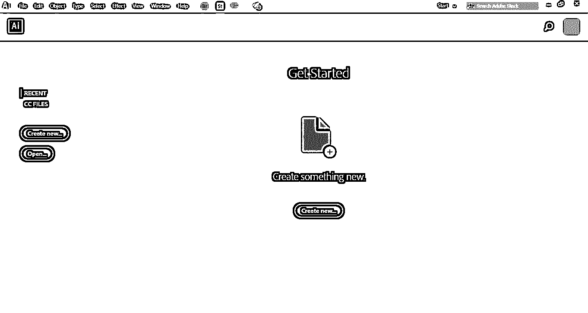

**第二步:**在这里，您可以创建一个**新文档**或者通过点击该界面的打开页签打开您的预绘图对象。当你点击创建时，一个**对话框**将会打开。您可以在这里设置页面的高度、宽度、方向和其他参数。并点击创建该对话框的一个**标签**。

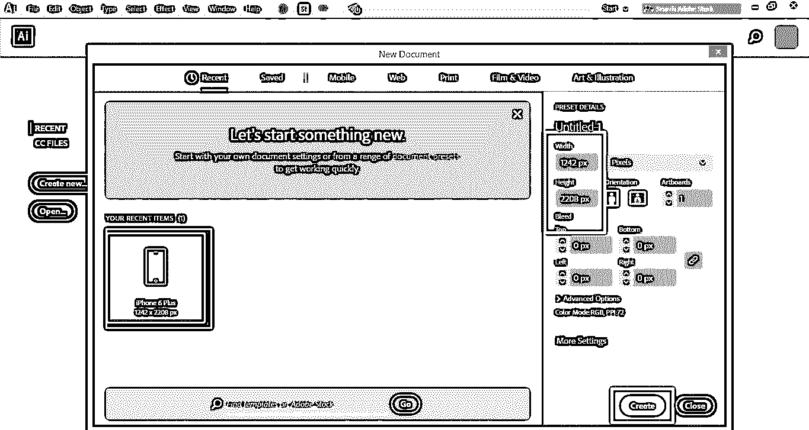

**第三步:**这里，我们在 Adobe Illustrator 工作区的左侧有**工具面板**。

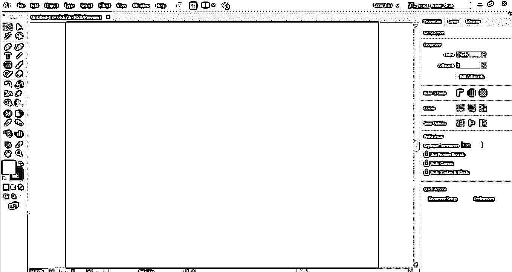

**第四步:**在右边，我们有**属性和图层标签**。在属性中，我们可以看到所选对象的属性，在层中，我们可以看到我们的项目中已经使用的层数；你可以从我们不同的教程中学到所有这些东西。

**第五步:**这里我们将导入或放置一张图片到工作区；您可以一次导入多个想要导入的图像。我们有两种在 Adobe Illustrator 中导入图像的方法。首先，进入文件菜单，点击它；将会打开一个下拉列表。现在点击**位置**选项，将图像导入到您的工作区。

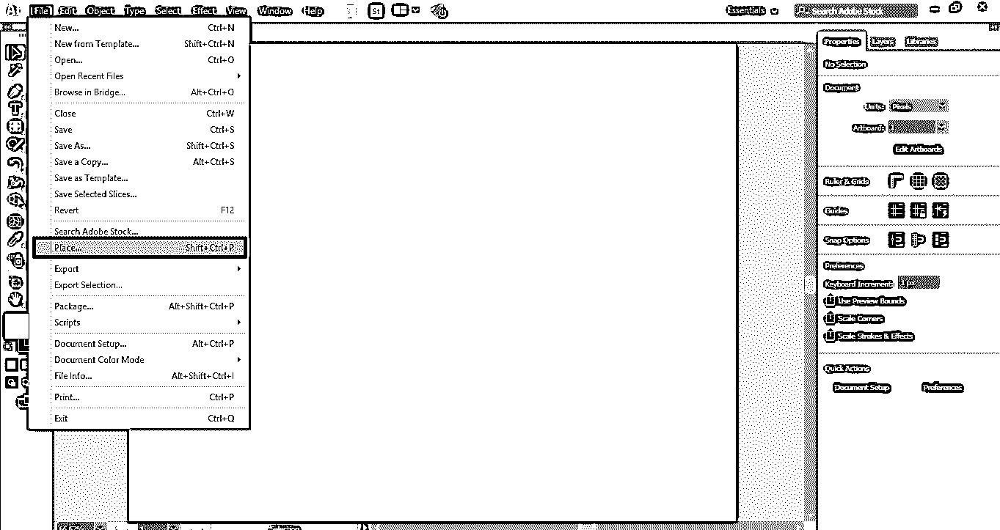

**第六步:**或者第二步是捷径法。快捷方式是按键盘上的 **Shift + Ctrl + P** 按钮。将会打开一个对话框。转到您 PC 中保存您要裁剪的图像的文件夹。您可以裁剪从互联网上下载的图像或通过相机或其他电子媒体拍摄的个人图像。

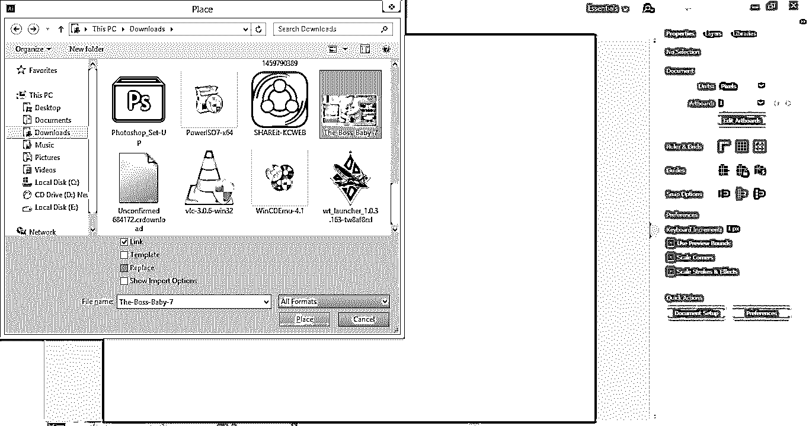

**第七步:**这里，当你导入任何图像时，你在这个对话框中有一些参数。这里是链接选项；我们必须取消链接选项，因为当我们在其他 PC 上使用这个编辑过的图像时，带有**链接选项**的图像将不会显示。

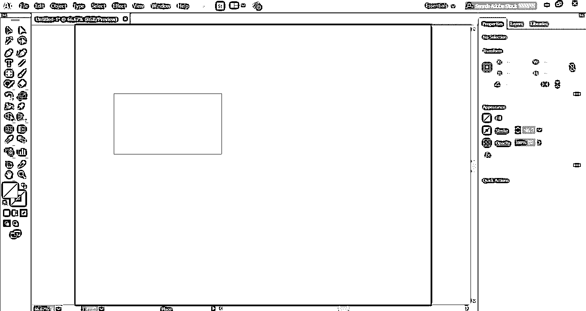

**步骤 8:** 现在点击这个对话框的“放置”标签，将图像放入您的工作区。图像的图标将会打开。单击工作区中的任意位置并拖动鼠标指针，以放置具有所需形状和大小的图像。

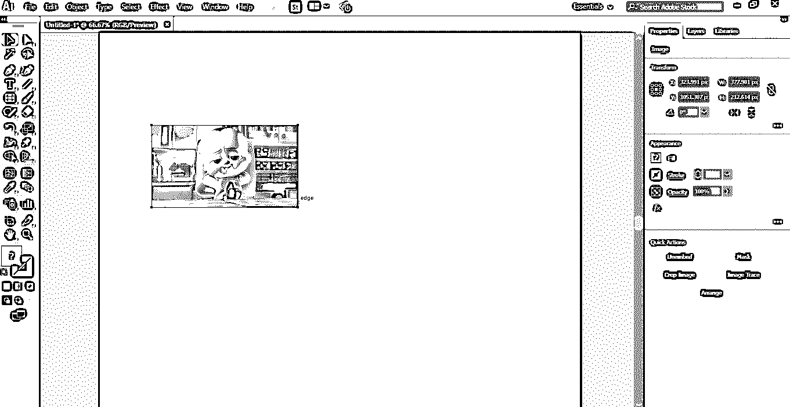

**第九步:**当您导入带有链接选项的图像时，图像会显示一个带有**的十字框**。

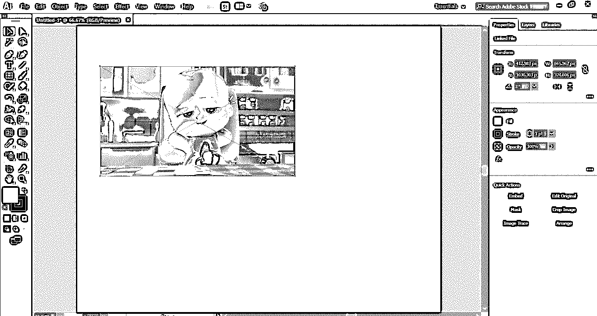

**第十步:**不勾选链接选项，没有十字框的图像会表示图像没有链接。裁剪链接图像和非链接图像时有一个主要区别。我们将一个接一个地看他们两个。

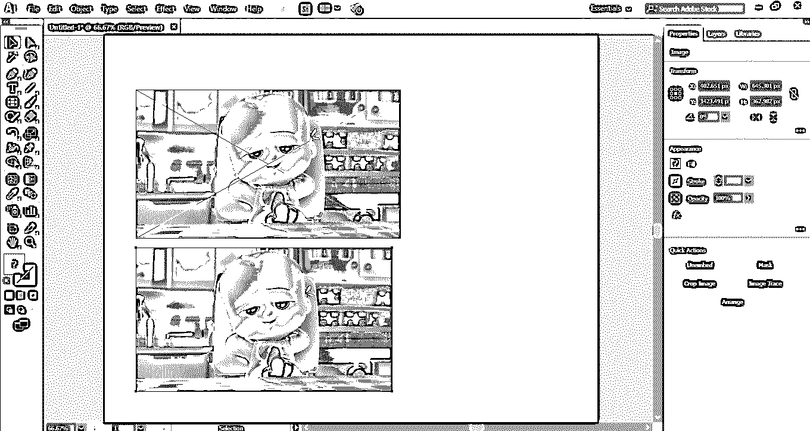

**步骤 11:** 首先，我们会看到未链接图像中的裁剪。这是 Adobe Illustrator 工作区右上角的裁剪图像选项。

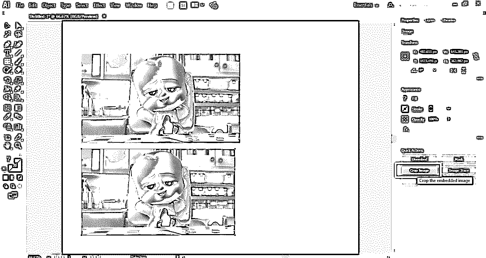

**步骤 12:** 要裁剪图像，点击选择图像，然后点击裁剪图像选项卡——所选图像周围将创建一个虚线矩形。

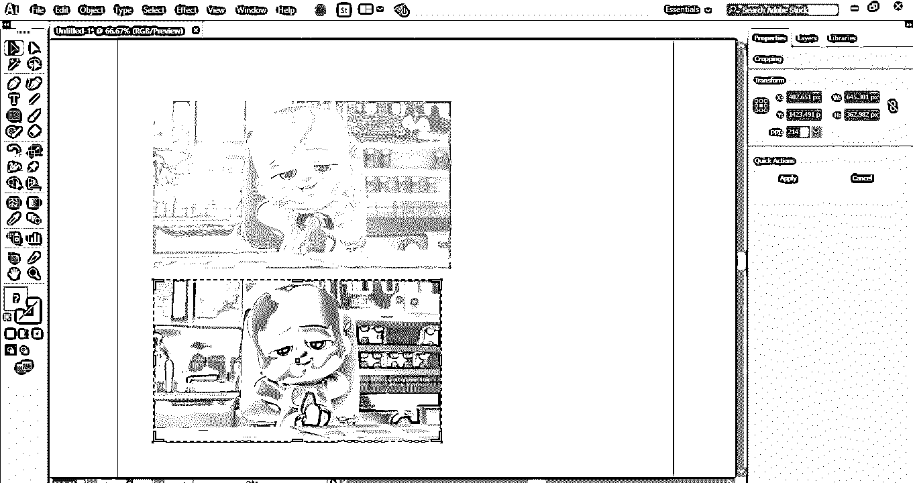

**第十三步:**您可以从右上角的裁剪参数中给**自定义参数**进行裁剪。

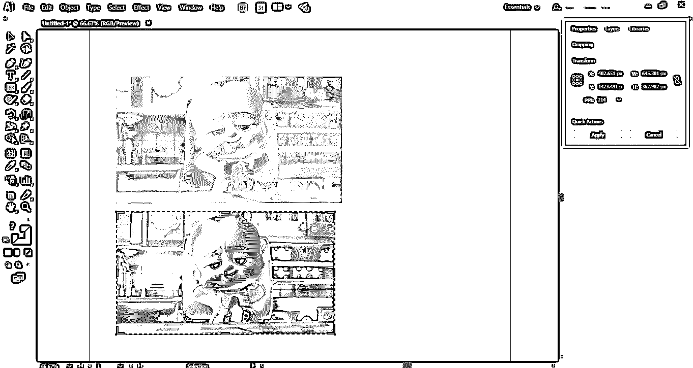

**步骤 14:** 将鼠标光标放在边界区域，你会看到一个**拖拽指针**会生成。按住鼠标左键拖动此指针以裁剪图像。

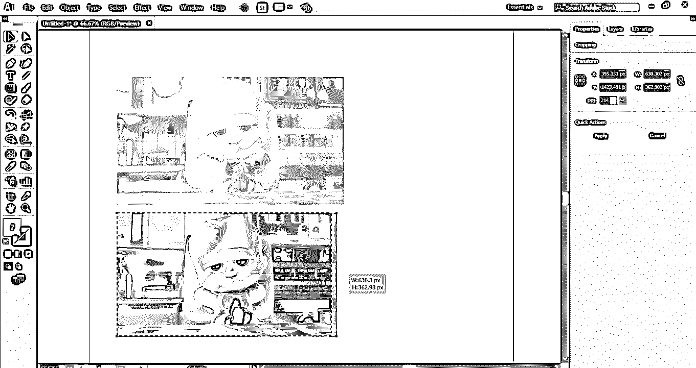

**第十五步:**您可以根据自己的要求，在图像的纵向或横向或两个方向进行裁剪。

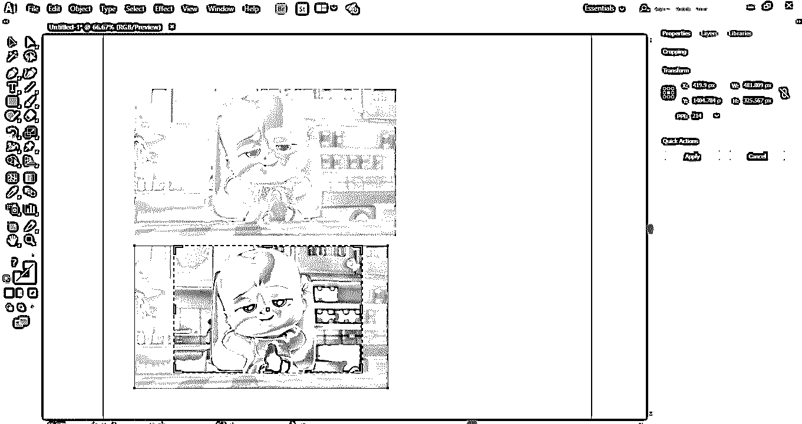

**Step 16:** Now click on the Apply tab button, which is present on the top right corner of the cropping section of the work area of Adobe Illustrator or press the Enter key on the keyboard to crop the selected image.

### 在链接图像中裁剪

您可以按照以下步骤轻松地裁剪链接的图像。

**第一步:**对于**裁剪链接图像，**点击选择链接图像。然后单击 Adobe Illustrator 工作区右上角的“裁剪”选项卡。将打开一个对话框；单击确定选项卡。此对话框显示当您裁剪此图像时，此图像的原始文件不会受到影响，更改将仅保留在裁剪后的图像中。

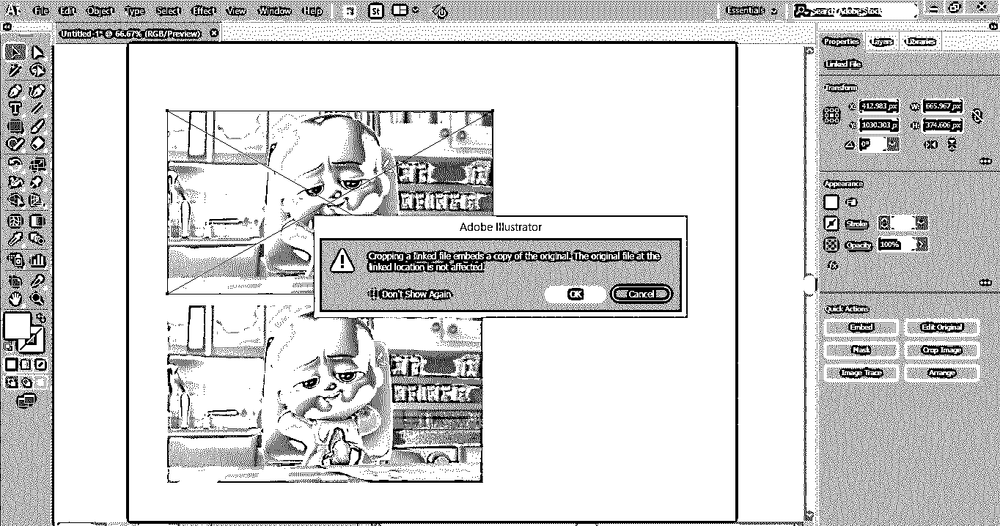

**第二步:**再次将鼠标光标放在边界区域，你会看到一个拖动指针会产生，现在按住鼠标左键拖动这个指针来裁剪图像。

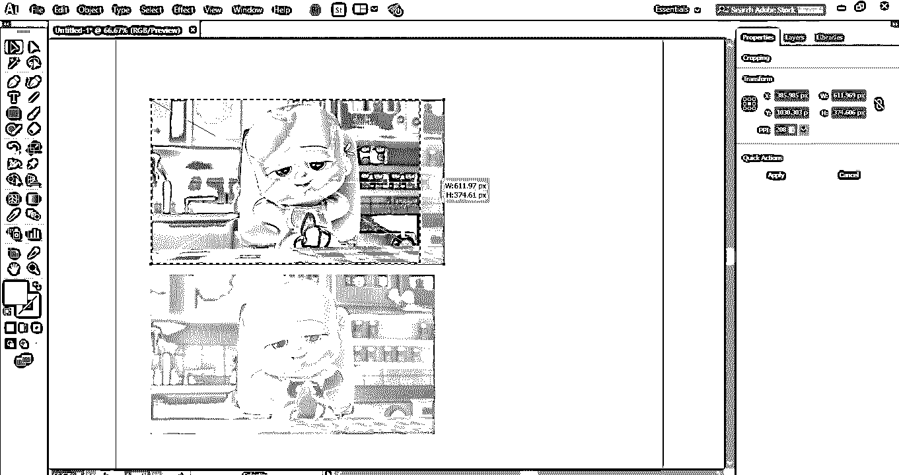

**第三步:**再次，您可以根据自己的要求，在图像的纵向或横向或两个方向进行裁剪。

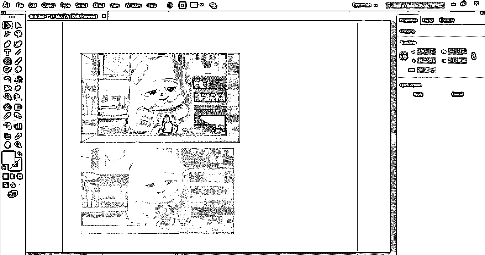

**第四步:**现在点击 Adobe Illustrator 工作区裁剪部分右上角的应用选项卡按钮，或者按键盘上的回车键裁剪选中的链接图像。

用这种简单易行的方法，你可以为你的插画作品裁剪任何图像，让你的插画越来越有效果。

### 结论–在 Illustrator 中裁剪

这里你可以看到我们如何在 adobe illustrator 中裁剪图像。学习如何在 Adobe Illustrator 中裁剪图像或在 Illustrator 中裁剪图像后，您可以轻松地将图像嵌入到绘图中，并使其对查看者更有效。这将有助于您为项目工作拍摄图像的任何部分。

### 推荐文章

这是 Illustrator 中的裁剪指南。在这里，我们一步一步地讨论了在 Adobe Illustrator 中裁剪图像的说明。您也可以浏览我们的其他相关文章，了解更多信息-

1.  [安装 Adobe Illustrator](https://www.educba.com/install-adobe-illustrator/)
2.  [Illustrator 中的效果](https://www.educba.com/effects-in-illustrator/)
3.  [安装 Adobe Creative Cloud](https://www.educba.com/install-adobe-creative-cloud/)
4.  [Illustrator 中的平滑工具](https://www.educba.com/smooth-tool-in-illustrator/)

