# 在 Illustrator 中移除背景

> 原文：<https://www.educba.com/remove-background-in-illustrator/>

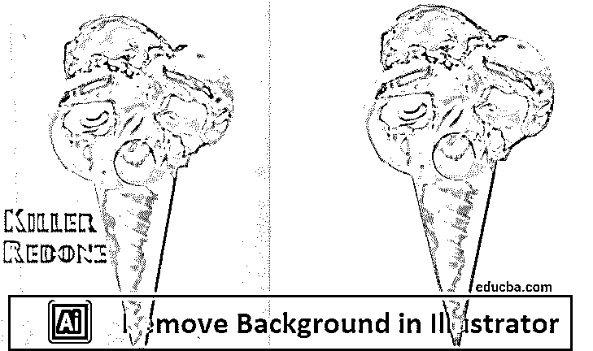

## Illustrator 中移除背景概述

Adobe Illustrator 可以定义为在 Mac 和 Windows 平台上都能流畅运行的素描和图形设计软件。在矢量插图方面，Illustrator 是计算机行业的顶级软件。在 Illustrator 的帮助下，您可以制作从简单图标到多层图表的任何东西。您也可以在 Illustrator 中处理图像。有时您需要从图像中移除背景，这在 Illustrator 中是可行的。要在 Adobe Illustrator 中消除[图片的背景，您可以使用魔棒或钢笔工具来形成 forefront 对象。然后，通过右击图片并选择](https://www.educba.com/what-is-adobe-illustrator/)[制作剪贴蒙版](https://www.educba.com/clipping-mask-in-photoshop/)。一旦你点击它，很容易消除背景，并把你的图片放入网站或其他创意项目。

### 如何在 Illustrator 中去除背景？

在 Illustrator 中移除背景的步骤。

<small>3D 动画、建模、仿真、游戏开发&其他</small>

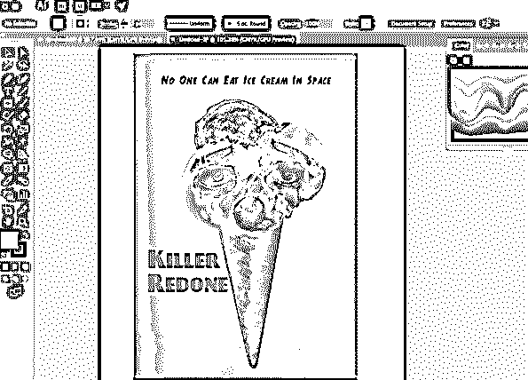

#### 1.使用钢笔工具

我们将以上面的图像为例。在这个图像中，我们将只保留冰淇淋，并删除背景。

**第一步:**启动一个新项目，把图片拖到剪贴板上。要消除照片中图片的背景，您必须在要保留的照片区域周围制作一个精确的形状。通过使用缩放工具，最好能达到这种精确度。可以按 Z 键，也可以从工具栏中选择工具。

**第二步:**现在[从工具栏中选择钢笔工具](https://www.educba.com/pen-tool-in-illustrator/)。此工具允许您通过一系列点击产生轮廓来选择对象。每次单击都将帮助您创建一个锚点。由于额外的锚点被删除，将出现一条线，将新点连接到其前身。要产生第一个锚点，请在 forefront 对象的边缘上单击一次。最终，您希望创建一个轮廓，围绕由这些锚点构成的 forefront 对象。

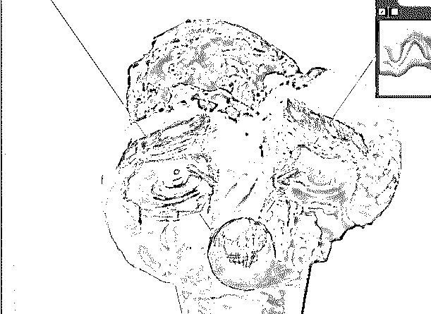

**第三步:**在物体边缘附近点击产生轮廓，直到到达第一个锚点。沿着 forefront 对象的完整轮廓单击，直到返回到开始的位置。如果您尽可能地靠近边缘，Illustrator 将帮助您纠正您的点击以提高精确度。

您可以再次单击第一个锚点来完成轮廓。现在一个虚线轮廓围绕着这个物体。

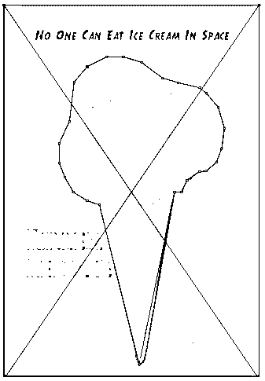

**第四步:**要显示所有对象，可以点击选择工具。你所勾勒的画面区域现在被视为一个独立的物体。新选择的对象和它的背景现在将有轮廓被选中并包围它们。

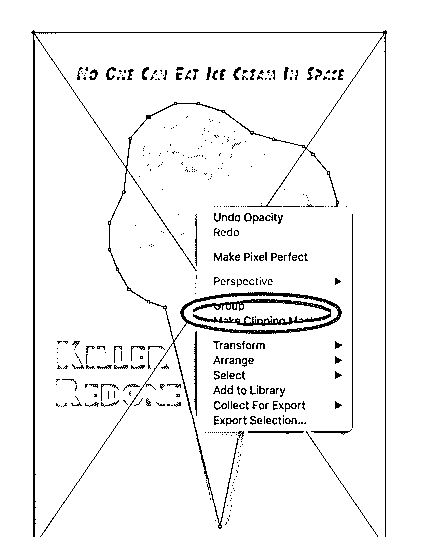

**第五步:**单击一次 forefront 对象，然后按住 shift 的同时单击背景。这有助于同时选择两个对象。

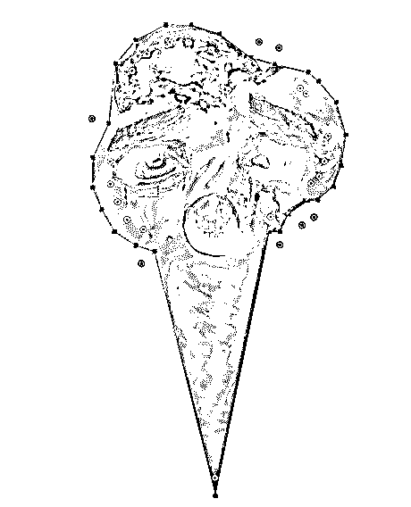

**第六步:**现在右键单击 forefront 对象，然后选择制作剪贴蒙版。这将使背景变白。现在，您用钢笔工具勾画的 forefront 对象与背景分离。然后，我们将得到没有背景的最终图像。

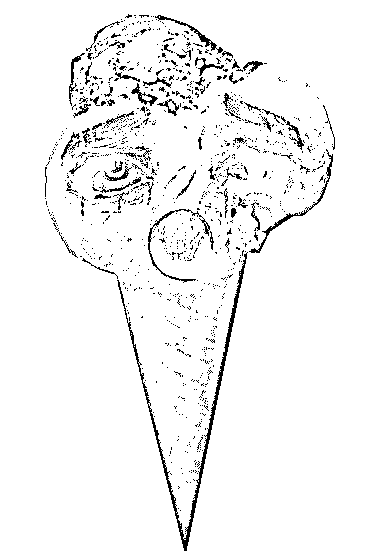

#### 2.使用魔棒工具

如果要分离的对象是纯色，那么可以选择填充颜色。选择这个选项后，如果你用[魔棒工具](https://www.educba.com/magic-wand-tool-in-photoshop/)点击一个对象，它会选择你图片中所有符合被点击填充颜色的东西。

如果您要选择的对象周围有特定的颜色线，那么您可以选择一种描边颜色。描边颜色是指对象周围线条的颜色，而填充颜色是线条内部的区域。如果使用描边颜色作为标准，您将单击对象周围的线条来描述颜色，而不是对象的内部。当您在选择了此标准的特定颜色线上单击魔棒工具时，将选择周围具有该线条颜色的所有对象。

当您选择“描边颜色”或“填充颜色”时，“容差”框允许您输入一个以像素为单位的数值，对于 CMYK，该数值范围为 0-100；对于 RGB，该数值范围为 0-255。您在“容差”框中输入的数字会影响当您单击魔棒工具时该区域的所有颜色都匹配时工具的柔韧性。

默认值是 32px，这意味着单击一种颜色将选择与该颜色匹配的所有内容。如果对象有渐变，您可以将容差扩展到要选择的额外颜色。对于大多数对象来说，缺省值就可以了。

要选择具有相似粗细的任何颜色的线条，可以选择“描边粗细”。这将选择与您选择的线条具有相似粗细的所有线条。笔画粗细的公差框允许 0-1000 像素范围内的数字。底数规定了更精确的匹配。默认值为 5px，这对于较细的线条来说可能不够具体。

第一步:我们将再次使用相同的图像。从工具栏中选择魔棒工具。

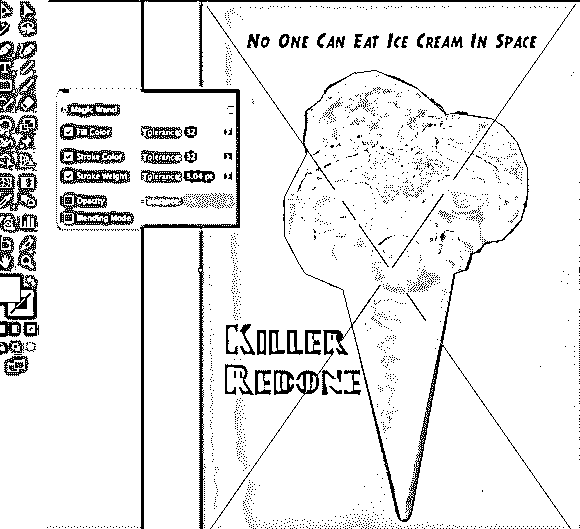

**第二步:**点击图片上您想要保留的对象。单击一次 forefront 对象，根据魔棒工具设置中定义的标准选择它。一旦你点击它，一个虚线轮廓将围绕所选择的对象出现。

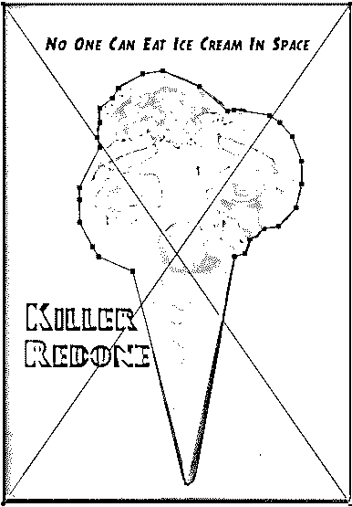

**第三步:**要同时选择背景和最前面的对象，可以按住 shift 键并单击背景。
右击最前面的图片，然后选择制作一个剪贴蒙版。

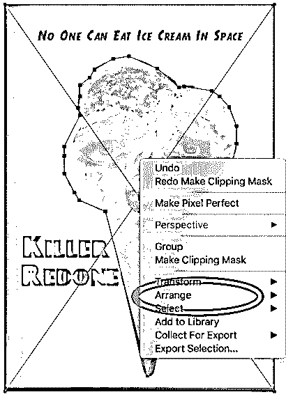

**第四步:**这样会消除背景，只留下最前面的图片和白色背景。然后，你会看到最终的图像。

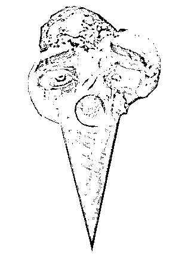

### 推荐文章

这是在 Illustrator 中移除背景的指南。在这里，我们讨论了如何删除 Illustrator 背景的概念，并逐步解释。您也可以浏览我们推荐的其他文章，了解更多信息——

1.  [Photoshop 中的锐化工具](https://www.educba.com/sharpen-tool-in-photoshop/)
2.  [Photoshop 中的自定义形状工具](https://www.educba.com/custom-shape-tool-in-photoshop/)
3.  [Adobe Photoshop 工具](https://www.educba.com/adobe-photoshop-tools/)
4.  [移除 Illustrator 中的白色背景](https://www.educba.com/remove-white-background-in-illustrator/)

