# Illustrator 中的形状

> 原文：<https://www.educba.com/shapes-in-illustrator/>

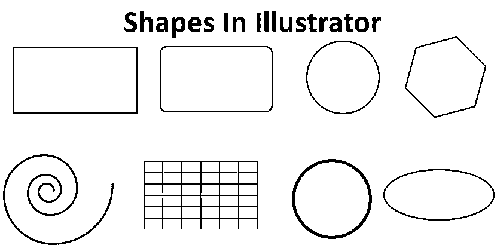

## Illustrator 中的形状简介

Illustrator 包含一组有用的主要矢量绘制工具。图形设计师最常见的做法是使用基本的形式进行绘图，如椭圆和矩形，这样他们就可以提出一个结构；同样，你当然可以尝试在 Illustrator 中用矢量形式绘制草图的类似技巧。你可以想象如何以各种方式连接简单的形状，以产生更复杂的形状，作为绘制复杂形状的替代方案。Illustrator 中的主要绘制工具分为生成开放路径矢量对象的工具和生成封闭路径矢量对象的工具。除此之外，这些工具在某种程度上是相互的，您可以在绘制形状时定义或命令明确的设置。

### 如何在 illustrator 中绘制形状？

Illustrator 中的形状列表如下:

<small>3D 动画、建模、仿真、游戏开发&其他</small>

#### 1.闭合路径形状工具

Illustrator 中的闭合路径工具包括矩形、圆角矩形、椭圆、多边形、星形工具和扩口工具，它们都组装在工具栏面板中。要生成任何形状，请选择所需的工具，单击画板，然后向外拖动。拖动指针时，可以追加命令以交互方式改变表单。

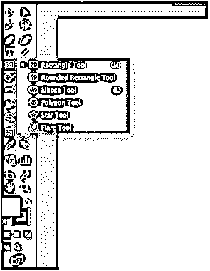

#### 2.矩形工具

从左侧的工具栏中选择矩形工具。确保填充为白色，描边为黑色。单击画板并向外拖动。

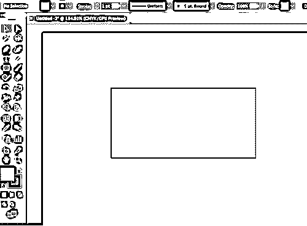

#### 3.圆角矩形

从左侧的工具栏中选择圆角矩形工具。确保填充为白色，描边为黑色。点击画板上的[并向外拖动。](https://www.educba.com/artboard-in-photoshop/)

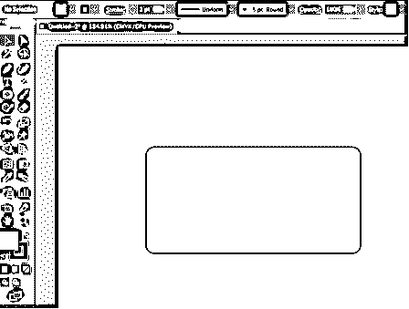

#### 4.椭圆工具

从左侧的工具栏中选择椭圆工具。确保填充为白色，描边为黑色。单击画板并向外拖动。你可以用这个工具画圆或椭圆。

**形状椭圆:**

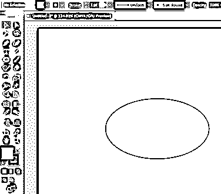

**形状圆:**

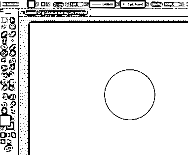

#### 5.多边形工具

从左侧的工具栏中选择多边形工具。确保填充为白色，描边为黑色。单击画板并向外拖动。

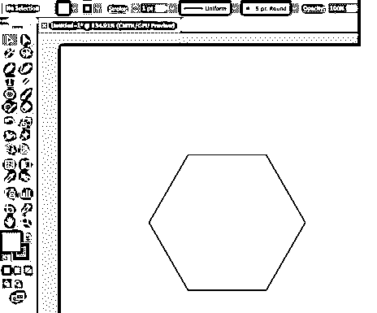

#### 6.星形工具

从左侧的工具栏中选择星形工具。确保填充为白色，描边为黑色。单击画板并向外拖动。

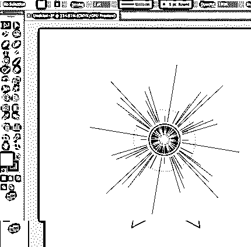

#### 7.扩口工具

从左侧的工具栏中选择“光斑”工具。确保填充为白色，描边为黑色。单击画板并向外拖动。

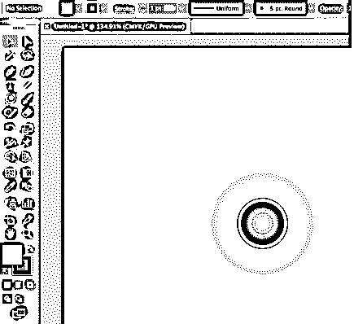

#### 8.开放路径形状工具

Illustrator 中的开放路径工具包括线段、圆弧、螺旋、矩形网格和极坐标网格工具，它们都组装在工具栏面板中。要生成这些形状中的任何一个，请选择所需的工具，单击画板，然后向外拖动。拖动指针时，可以追加命令以交互方式改变表单。

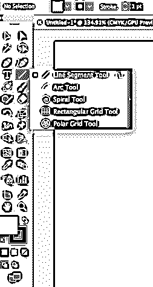

#### 9.线段

从左侧的工具栏中选择线段工具。确保填充为白色，或者不填充，描边为黑色。单击画板并向外拖动。

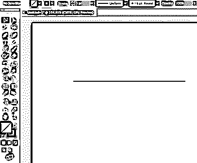

#### 10.螺旋工具

从左侧的工具栏中选择螺旋工具。确保填充为白色，或者不填充，描边为黑色。单击画板并向外拖动。

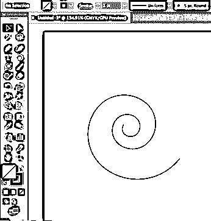

#### 11.矩形网格工具

从左侧的工具栏中选择矩形网格工具。确保填充为白色，或者不填充，描边为黑色。单击画板并向外拖动。

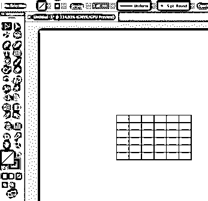

#### 12.极坐标网格工具

从左侧的工具栏中选择极坐标网格工具。确保填充为白色，或者不填充，描边为黑色。单击画板并向外拖动。

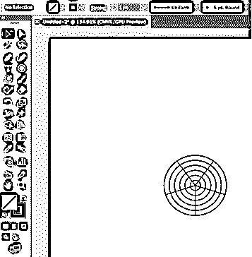

### 形状生成器工具

您可以使用形状构建器工具创建形状。在 Adobe Illustrator 中制作引人注目的独特形状比以往任何时候都简单。只需点击和拖动，您就可以从另一个形状中添加、平分或删除一个形状。生成要连接的形状，在需要的地方聚合它们，然后选择要连接的所有形状。

**举例:**

我们将使用形状生成器工具和其他形状如矩形、椭圆形等绘制一个杯子。

**第一步:**首先从工具栏中选择矩形工具。确保填充为白色，或者不填充，描边为黑色。

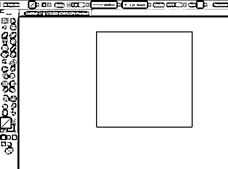

**第二步:**接下来，在矩形顶部画两个椭圆，如下图所示。您可以从工具栏中选择椭圆。

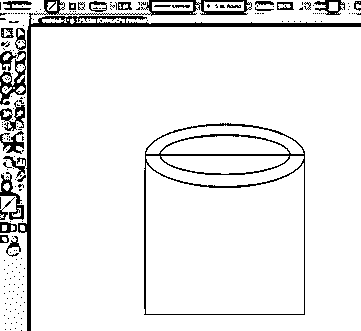

**第三步:**现在，在矩形的底部画一个椭圆。

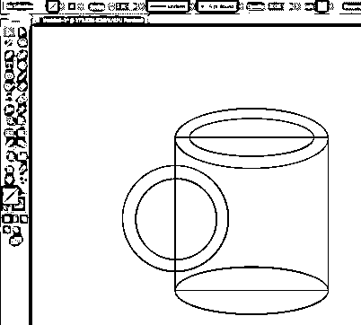

**第四步:**接下来，在矩形的左手边画两个圆。

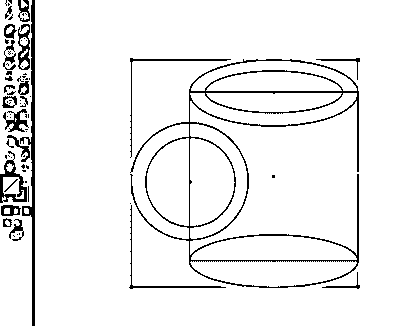

**第五步:**首先，从工具栏中选择我们使用选择工具创建的完整对象，然后选择形状构建工具，开始移除线段以创建杯子。默认情况下，该工具设置为合并模式，允许您连接区域或路径。要切换到擦除模式，您可以按住 alt 键(mac 和 windows)并移除不需要的区域或边缘。

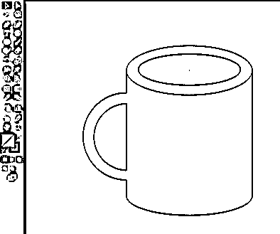

我们已经使用形状生成器工具创建了杯子的最终图像。

### 结论

借助 Illustrator 中提供的各种形状工具，您可以创建许多形状。根据您的需要，您可以选择闭合路径形状工具或开放路径形状工具。[使用形状构建工具](https://www.educba.com/shape-builder-tool-in-illustrator/)，你可以覆盖许多形状，当选择这些形状时，你可以连接、消除、平分路径或区域。它在简单和复杂的路径上运行。您可以在画板上以直观的方式编辑、连接和着色形状。

### 推荐文章

这是 Illustrator 中的形状指南。这里我们讨论如何使用 Illustrator 中的形状工具创建不同的形状，以及如何使用形状生成器工具。您也可以阅读以下文章，了解更多信息——

1.  [Illustrator 自由变换工具](https://www.educba.com/illustrator-free-transform-tool/)
2.  [在 Illustrator 中移除背景](https://www.educba.com/remove-background-in-illustrator/)
3.  [Illustrator 中的图章效果](https://www.educba.com/stamp-effect-in-illustrator/)
4.  [Illustrator 中的金属效果](https://www.educba.com/metal-effect-in-illustrator/)

