# Illustrator 中的混合模式

> 原文：<https://www.educba.com/blending-modes-in-illustrator/>

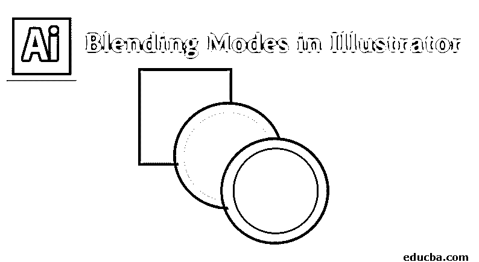

## Illustrator 中混合模式介绍

混合模式对于通过向所选对象添加混合效果和颜色来更改对象的颜色非常有用。混合模式的工作方式取决于对象在图层或群组上的位置。我们将详细讨论 Adobe Illustrator 中所有可用的混合模式。在此之前，在尝试理解各种混合模式时，很容易记住一些术语:

1.  所有组中所选对象的原始颜色称为**混合颜色。**
2.  **基色**指的是艺术书籍下面的颜色。
3.  应用混合后产生的颜色称为**结果颜色。**

### 在 Illustrator 中应用混合模式

应用混合模式并不困难；让我们通过下面的步骤来理解这一点。

<small>3D 动画、建模、仿真、游戏开发&其他</small>

第一步:首先进入窗口菜单，选择**透明。**

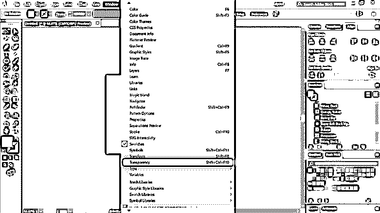

**步骤 2:** 在这里，你已经注意到弹出了一个小窗口，如下图所示。这是你应用大多数混合模式的地方。

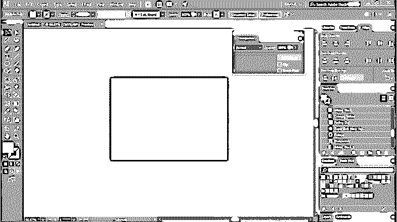

第三步:使用形状工具，创建**两个圆**，如下图所示放置。

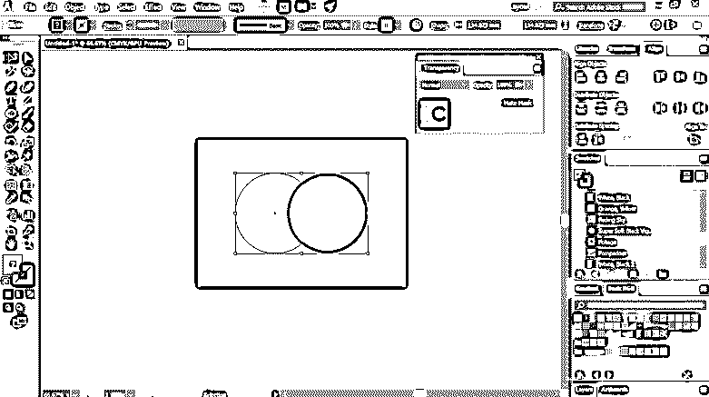

步骤 4: 现在，我们将在创建的圆形上应用透明模式中提供的所有混合模式，看看结果。

**第五步:**默认模式为正常。它什么也不做，只是保持你选择的基色不变。

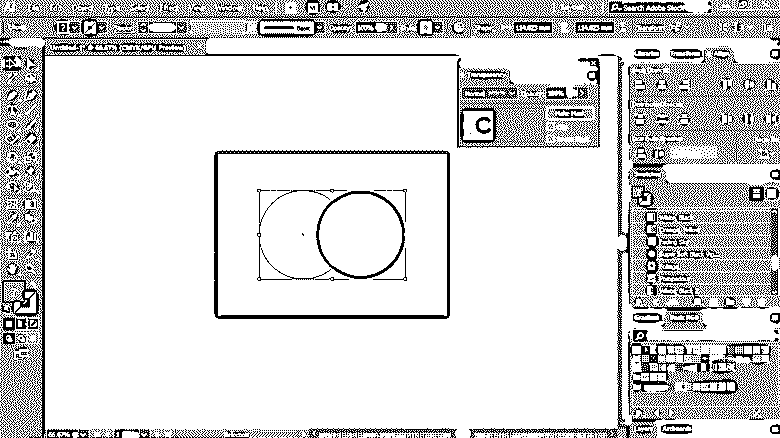

**第六步:**当应用变暗时，你会注意到形状的重叠部分变暗了。它根据暗度选择基色或混合色。比混合颜色亮的部分会改变，而较暗的区域保持不变。

**第七步:**将混合色与基色相乘，形成更暗的结果色。如果你将一种颜色与黑色相乘，它会产生黑色，并与白色树叶相乘；颜色保持不变。

**步骤 8:** 颜色加深使重叠区域变暗，以反映混合的颜色。此外，如果你使用白色混合，它不会产生任何变化。

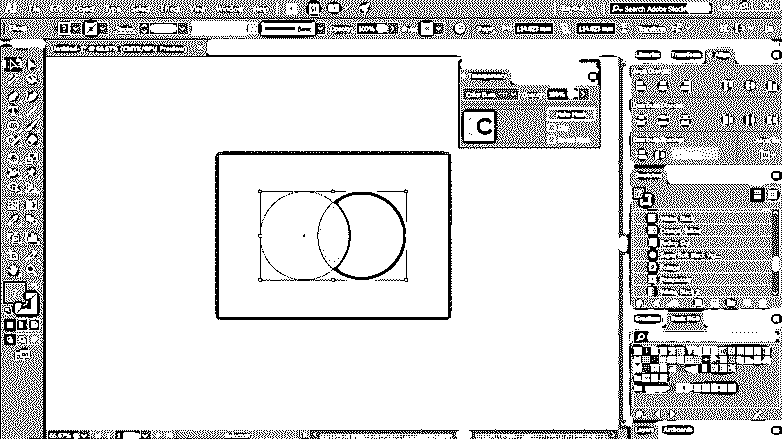

**步骤 9:** 变亮从基色或混合色中选择较亮的颜色。如果某个区域比混合色暗，它将被替换，而比混合色亮的区域将保持不变。

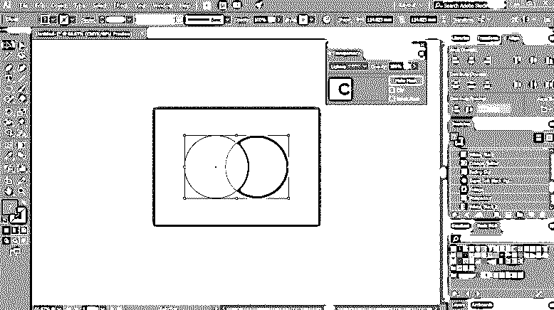

**第十步:**屏幕增加混合色和基色的反色。这会在重叠区域产生较亮的颜色。如果你的屏幕是黑色的，你会发现没有变化，而用白色屏幕会产生白色。

**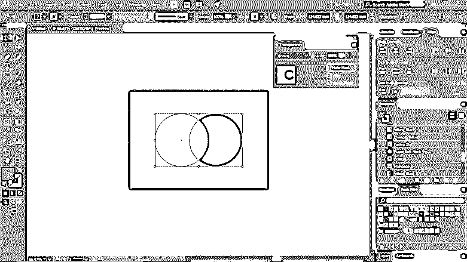

** 

**步骤 11:** 色彩减淡在混合色的基础上增加基色的亮度。当你与黑色混合时，这同样没有效果。

**步骤 12:** 根据底座的颜色，对颜色进行倍增或筛选。当前图稿被颜色或图案覆盖，同时保留基底的高光和阴影。它混合混合颜色以反映源颜色的亮度或暗度。

**步骤 13:** 根据混合色，使颜色变暗或变亮。它为您的作品创建了一个类似于漫射聚光灯的效果。它可以根据混合色使颜色变暗或变亮。如果混合色较亮，则图稿变亮，如果较暗，则图稿变暗。

步骤 14: 强光在你的作品上创造出一种强烈的聚光灯效果，如下图所示。根据混合的颜色，它会放大或屏蔽颜色。如果混合色是亮的，屏幕颜色看起来会很亮，如果是暗的，那么作品就会变暗。这种技术对于为作品添加高光或阴影非常有效。

**步骤 15:** 混合色或基色彼此相减，取决于哪个具有更高的亮度水平。但是，当与白色混合时，它会反转基色，而与黑色混合则没有变化。

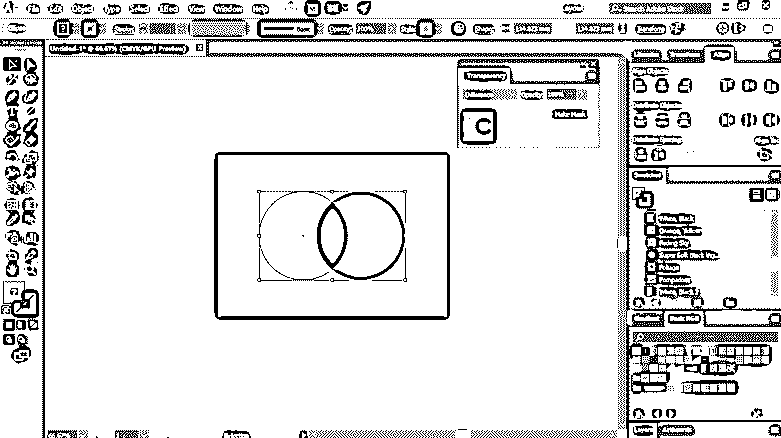

**步骤 16:** 排除产生与差分模式相同的效果；但是效果对比度低。混合白色时，基色会反转。当混合黑色时，你将观察不到任何变化。

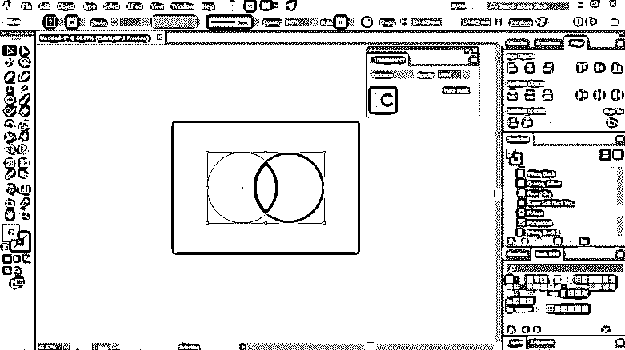

**步骤 17:** 创建结果色时，考虑基色的亮度和饱和度。此外，混合色也采用色调值。

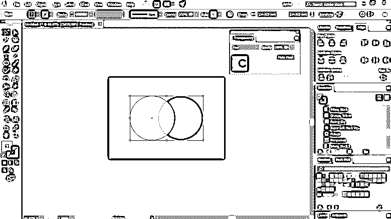

**步骤 18:** 考虑基色的亮度和色调，以生成最终颜色。它还采用混合颜色的饱和度。

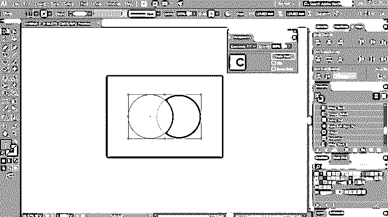

**步骤 19:** 在此模式下，合成色由混合色的色调和饱和度以及基色的亮度组成。这种模式在处理单色艺术作品时非常有用，要求灰度保持不变，并且适用于调色作品。

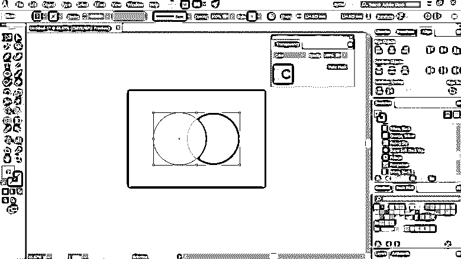

**步骤 20:** 用基色的色调和饱和度以及混合色的亮度创建结果色。此模式创建了与颜色模式相反的效果。使用亮度模式，基色的色调和饱和度以及混合色的亮度结合在一起，形成最终的颜色。它创建了与颜色模式获得的效果相反的效果。参考下图。

### 结论

Adobe Illustrator 是数百万专业人士使用的最有效和最受欢迎的矢量图形编辑器软件之一。它的使用者包括设计师、媒体人、艺术家等。它有很多工具和效果来为你的作品创造惊人的效果。在上面的文章中，我们讨论了 Illustrator 中可用的各种混合模式，以增强您的创作。在基础层面上练习它们，慢慢理解这些效果对你工作的好处和益处。希望在掌握这些技巧后，你们都能成长和提高你们的学习技能。万事如意！

### 推荐文章

这是 Illustrator 中混合模式的指南。这里我们讨论混合模式的概述和在 illustrator 中应用混合模式的步骤。您也可以浏览我们推荐的其他文章，了解更多信息——

1.  [Illustrator 中的效果](https://www.educba.com/effects-in-illustrator/)
2.  [Illustrator 中的形状？](https://www.educba.com/shapes-in-illustrator/)
3.  [Illustrator 中的平滑工具](https://www.educba.com/smooth-tool-in-illustrator/)
4.  [如何在 Illustrator 中制作 Logo？](https://www.educba.com/how-to-make-logo-in-illustrator/)

