# 在 Illustrator 中更改背景颜色

> 原文：<https://www.educba.com/change-background-color-in-illustrator/>

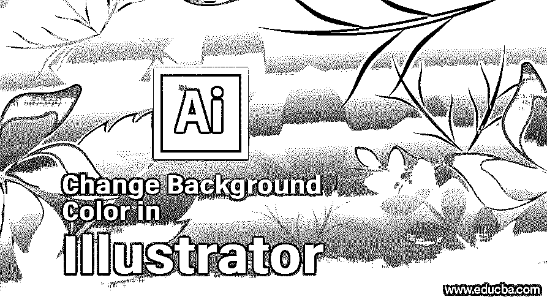

## Illustrator 中更改背景色的介绍

Adobe Illustrator 是一个矢量图形程序，通常是为图形设计师和 2D 艺术家设计和创建的。Adobe Illustrator 的最新[版本是 CC 版本，是](https://www.educba.com/adobe-illustrator-for-windows-8/) [Adobe Creative Cloud](https://www.educba.com/what-is-adobe-creative-cloud/) 套件的一部分。该计划是用来创造视频游戏，标志，印刷材料，广告，促销品和其他 2D 艺术品。程序是一种基于矢量的软件，使用户能够创建高效且独立于分辨率的材料。

[Adobe Illustrator](https://www.educba.com/what-is-adobe-illustrator/) 拥有一套强大的工具和功能，可以帮助用户从其设计模板库(称为 Adobe Stock)中创建艺术作品，该库包含超过 8000 万个视频、模板、图像和用户的其他材料。

<small>3D 动画、建模、仿真、游戏开发&其他</small>

该软件是一个巨大的程序，允许和默认他们的项目和演示图书馆的预置。在本文档中，我们将学习如何在 Illustrator 中更改任何文档的背景色。任何特定文件的背景都是制作物品和艺术品过程中非常重要的一部分。基本上，这是任何设计师在程序上创建图形艺术品的第一步。

### 背景色怎么改？

以下是在 Illustrator 中更改任何文档的背景色的步骤；有两种主要方法可以达到同样的效果。

#### 方法 1–文档设置选项

在此方法中，我们将从文档设置选项中更改文档的背景颜色。我们将通过下面给出的步骤来更深入地了解这个过程。

**第一步:**启动 Adobe Illustrator。点击文件>新建打开一个文档。

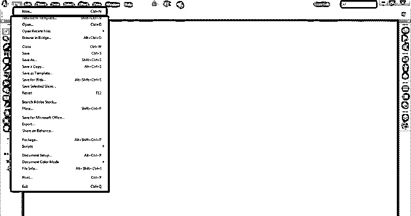

**步骤 2:** 将出现一个对话框，选择有关文档属性的必要详细信息，然后单击确定。

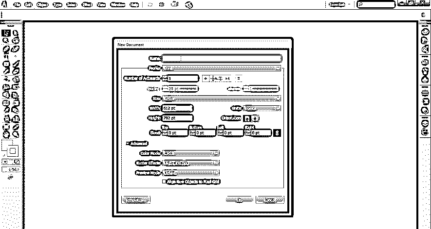

**第三步:**接下来，点击文件>文档设置，打开文档的设置属性。

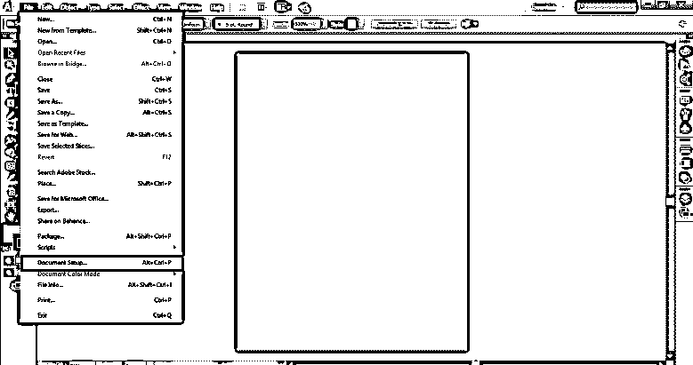

**步骤 4:** 文件设置打开后，点击透明和叠印选项中的模拟彩色纸张选项。此选项将使我们能够看到文档本身的背景颜色。

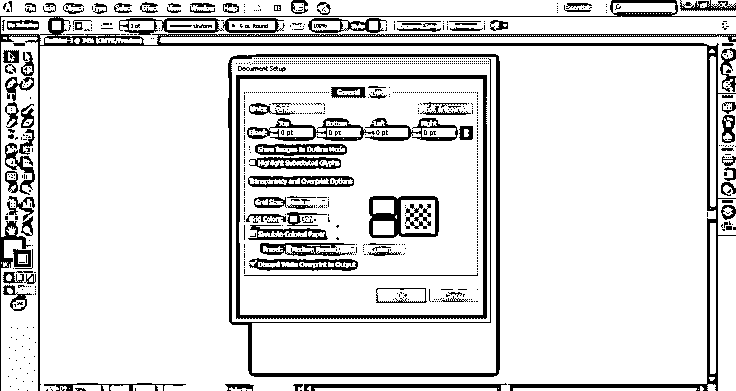

**第五步:**这之后，点击下图所示的方框。

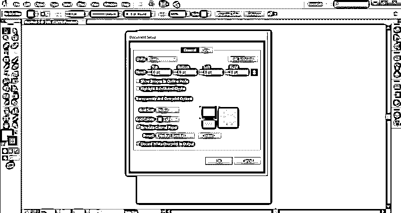

**第六步:**盒子会打开调色板使用。显示调色板后，选择任何颜色作为背景色。单击确定。

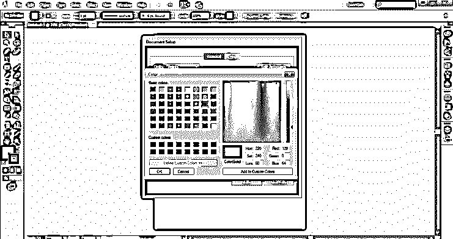

**步骤 7:** 之后，在文件设置对话框中再次点击确定。

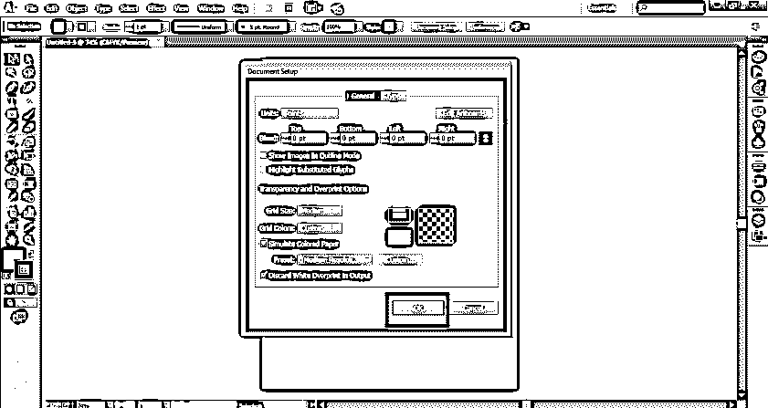

**注意:**本文件适用于 CMYK(青色、洋红色、黄色和原色)色彩模式。这意味着在此文档上创建的插图将用于打印目的。当用户使用 CMYK 模型创建文档时，该文档用于打印，并且必须是硬拷贝。然而，当以 RGB(红、绿、蓝)模式创建作品时，它被用于网页和网站。

**步骤 8:** 使用文件颜色模式选项，可从文件菜单中修改文件的颜色模式。

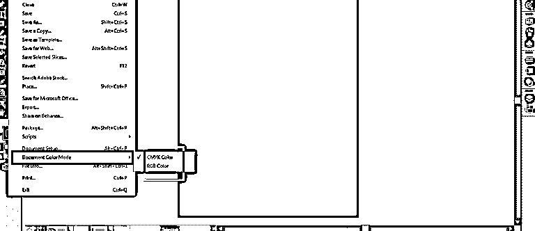

#### 方法 2–创建矩形

在这个方法中，我们将简单地创建一个文档大小的矩形，并对其应用颜色。这不会改变背景颜色，但我们仍然可以使用这种方法快速使用。然后可以锁定该层，使其在处理文档时不会被编辑或修改。下面给出了相同的步骤。

**第一步:**启动 Adobe Illustrator。从“文件”菜单创建新文档。

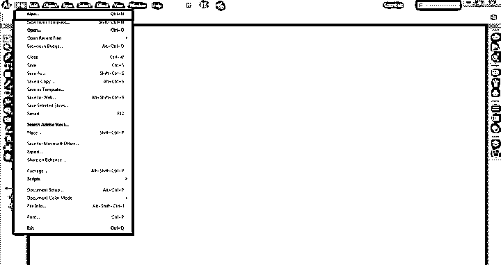

**步骤 2:** 在属性面板中指定文档、其属性和属性。

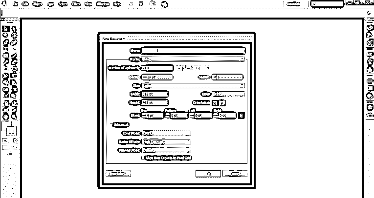

**第三步:**点击矩形工具，拖动光标，创建一个与文档大小相同的矩形。

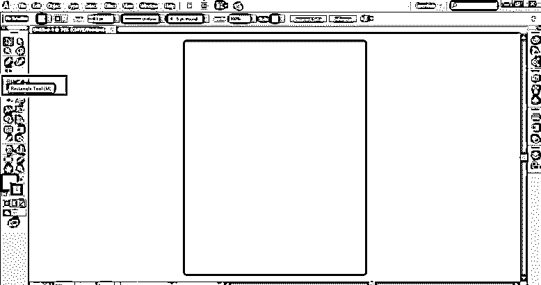

**第四步:**选择自己喜欢的颜色。

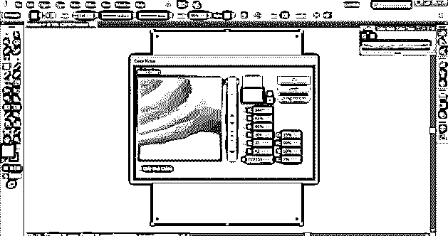

**第五步:**给这个矩形一个颜色。

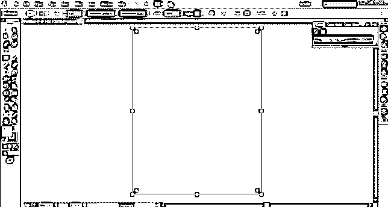

第六步:现在，去窗口，然后图层。这将打开图层面板，以查看不同的可用图层。

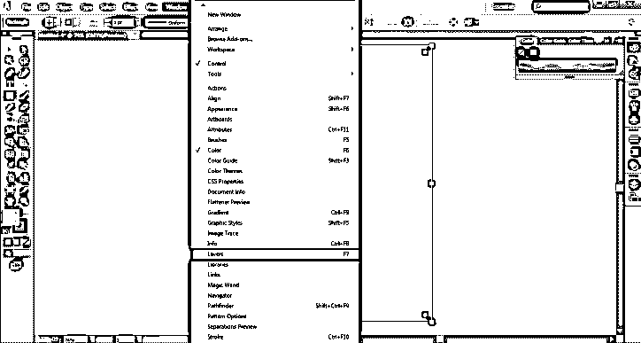

**第七步:**第一个 st 图层为矩形图层，双击图层图标，会看到如图所示的对话框。

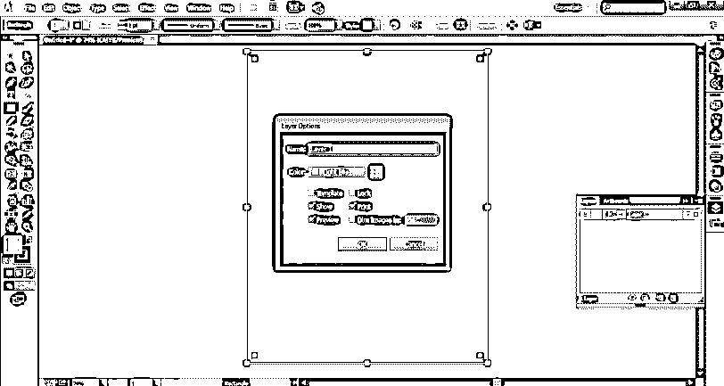

**第 8 步:**在对话框中，勾选未勾选的锁定按钮。此选项将锁定图层。

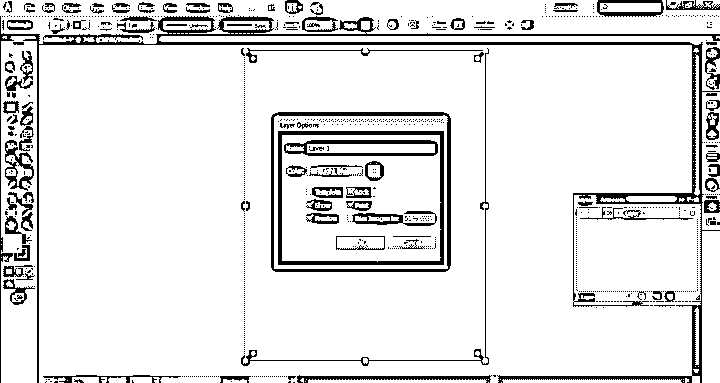

**步骤 9:** 这将为用户提供一个好处，因为该层被锁定，不移动或不修改任何更改。

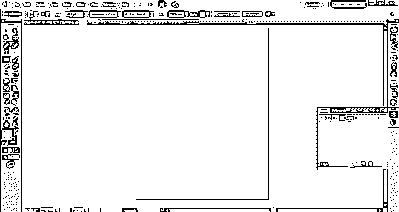

要解锁图层，双击图层并取消锁定选项。

### 结论

在 Illustrator 中，更改背景颜色是一项简单的任务，但与 Photoshop 相比有点棘手。而在 Photoshop 中，用户只需要使用背景色和前景色的快捷键；Adobe Illustrator 的情况并非如此。在 Illustrator 中，当[切换到背景色](https://www.educba.com/background-in-after-effects/)时，用户有时可能会感到困惑，那些早先使用 Photoshop 的人。

在这份文件中，我们学习了两种简单的方法来改变背景颜色，没有任何混淆或使用工具。只是用户应该知道特定的选项和该选项的功能。虽然没有快捷键来改变背景颜色，但是用户可以使用选项和功能来改变背景颜色。

### 推荐文章

这是一个在 Illustrator 中改变背景颜色的指南。这里我们讨论两种不同的改变背景颜色的方法，并附有一些插图。您也可以浏览我们的其他相关文章，了解更多信息-

1.  [Illustrator 中的图层](https://www.educba.com/layers-in-illustrator/)
2.  [Illustrator 中的 3D 效果](https://www.educba.com/3d-effects-in-illustrator/)
3.  [Illustrator 中的混合模式](https://www.educba.com/blending-modes-in-illustrator/)
4.  [Illustrator 中的标志设计](https://www.educba.com/logo-design-in-illustrator/)

