# Illustrator 中的图形样式

> 原文：<https://www.educba.com/graphic-styles-in-illustrator/>

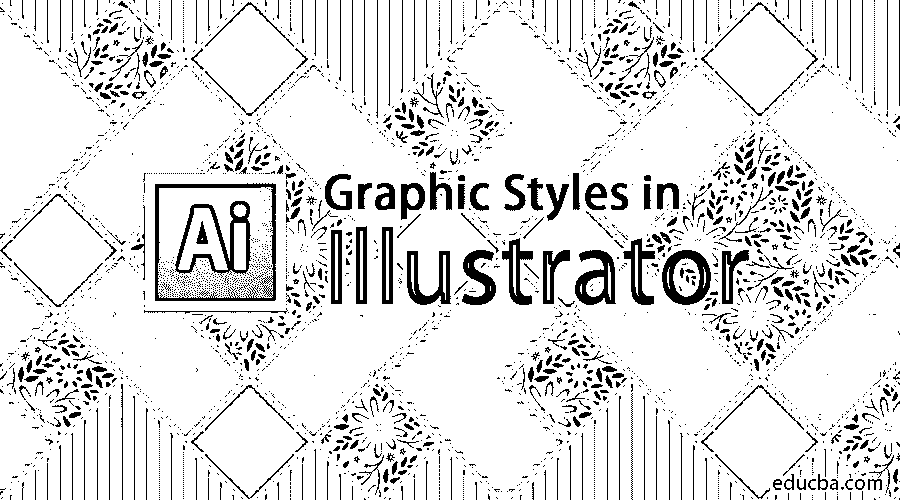

## Adobe Illustrator 中图形样式的介绍

Adobe Illustrator 被认为是效果和编辑风格的发电站。该程序被大多数编辑和图形设计师广泛使用。一般来说，所有从事 2D 项目和艺术品的设计师都使用 Adobe Illustrator。这个程序是同类矢量图形软件中的一个，它装载了一个健壮的工具集和巨大的功能。作为一名设计师，需要大量的耐心和时间来创造理想的项目和成果。在本主题中，我们将学习 Illustrator 中的图形样式。

设计师总是在寻找一种替代方式来创作任何艺术品或设计，既能节省时间，又能给出高效的结果。Adobe Illustrator 是一个完美的程序，可以尝试不同的风格和替代方案来获得想要的结果。Adobe Illustrator 中的一个功能就是在程序中使用图形样式。这些图形样式可以由用户创建，也可以预先安装在软件中。图形样式的基本用途是节省用户的时间，并且可以节省大量的手工工作。

<small>3D 动画、建模、仿真、游戏开发&其他</small>

图形样式一旦创建，用户就可以在任何文本或对象上使用无数次。图形样式是一组可以多次重复使用的属性。这些样式有助于只需单击一下鼠标，即可修改任何文本或对象的外观和物理因素。这些图形风格被证明是有用的，节省了设计师的时间和精力。

### 如何创建图形样式？

下面是帮助我们创建新的 Adobe Illustrator 图形风格的一步一步的步骤。

打开一个 A4 大小的新文档

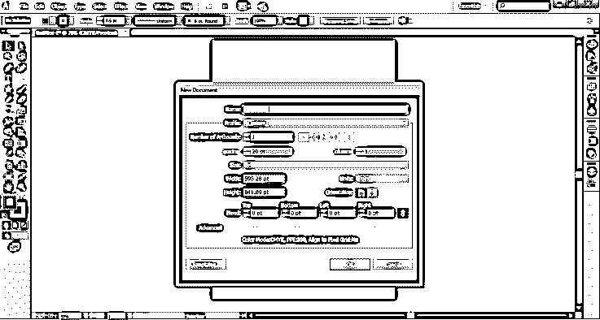

转到窗口面板，点击图形样式来查看对话框。

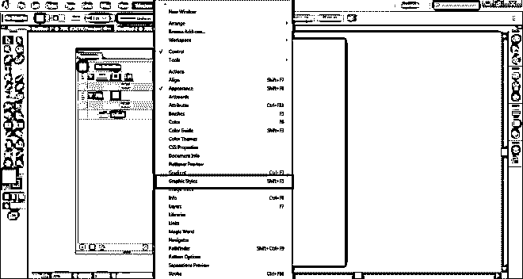

接下来，转到窗口面板，点击外观看到对话框。

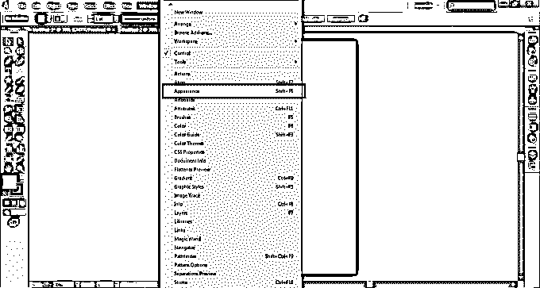

当我们创建图形样式时，会在“外观”面板中创建和修改该样式，同时将其保存在“图形样式”面板中。现在，使用文本工具，在页面上写教育。

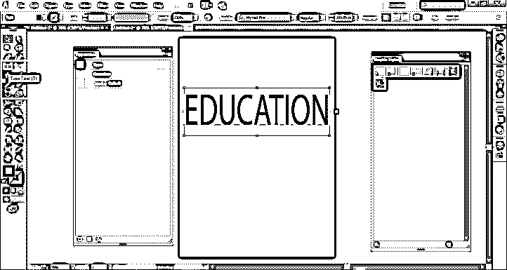

默认情况下，文本的填充颜色是黑色。将填充颜色设置为无，如图所示。

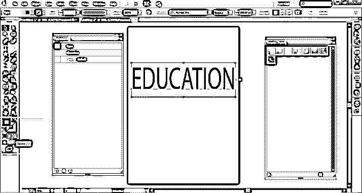

您将看到下面的结果。

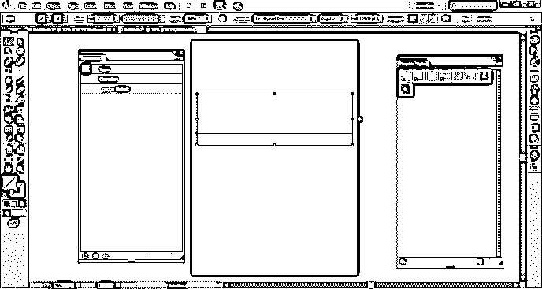

进入外观面板，点击新建填充，如图所示。

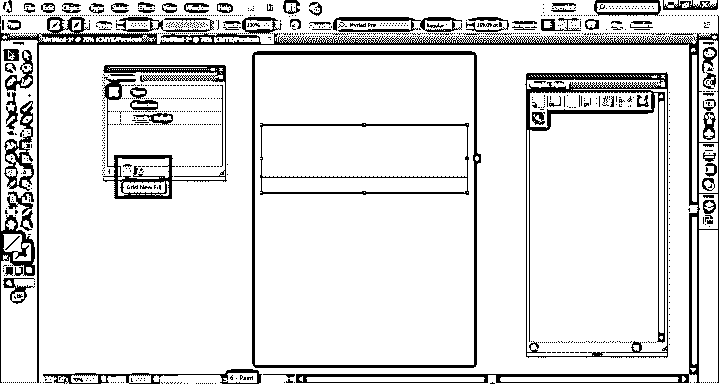

填充颜色为蓝色，描边颜色为黄色，描边粗细为 2 磅。

现在，为了给这个样式添加更多的效果，在外观面板中点击添加新效果选项。

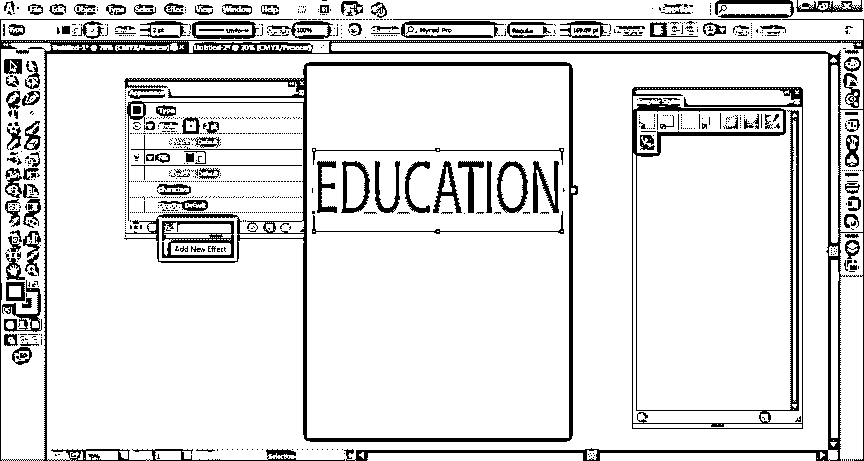

从扭曲和变换选项中选择变换。此选项将创建同一文本的多个副本。

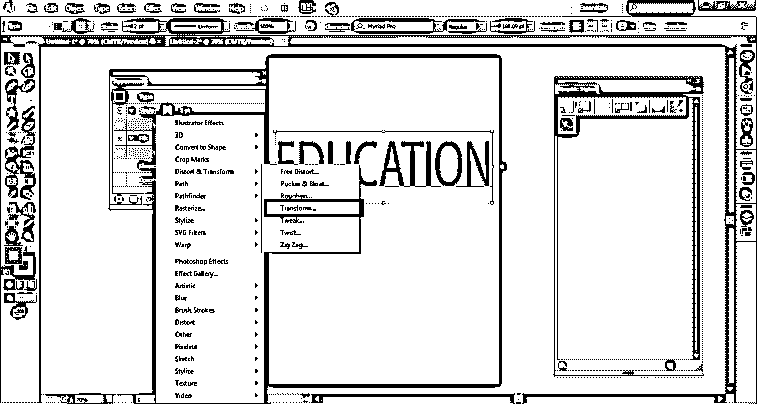

将出现一个对话框；在移动选项中，写入 0.5 水平和 0.5 垂直，并将副本数设置为 10。点击预览，如下图所示。

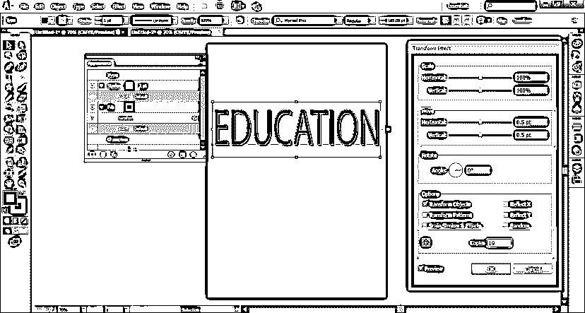

同样，任何效果都可以添加到文本中。

现在，只需将文本拖动到图形样式面板中，就可以将该文本制作成图形样式，如图所示。

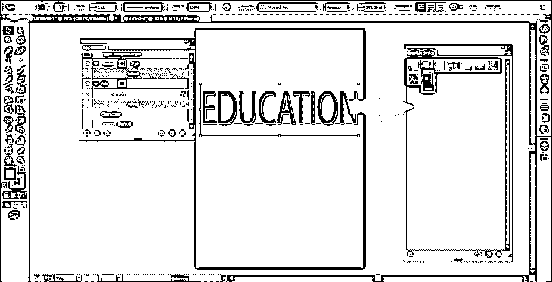

要检查图形样式，请创建另一个文本并删除旧的文本。这次在纸上写下你好。

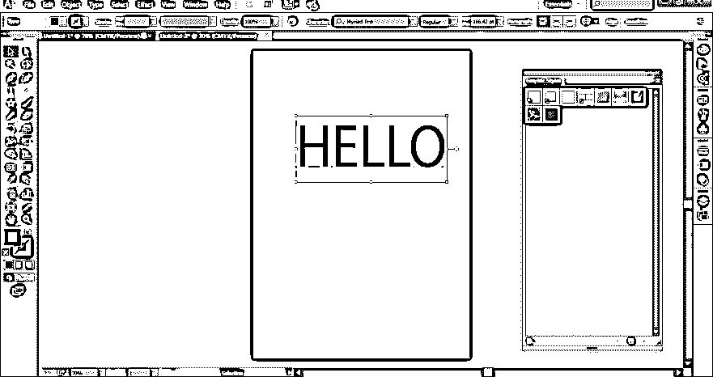

从“图形样式”菜单中，将最近创建的样式拖到该文本上。您将看到 HELLO 文本已被修改，就像教育文本一样。

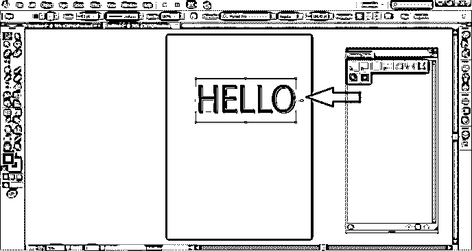

如果您对任何文本或类型使用图形样式，您可以单击图形样式菜单的角按钮，然后选择使用文本进行预览，如图所示。

### 将图形样式应用于对象的示例

1.  创建新文档。

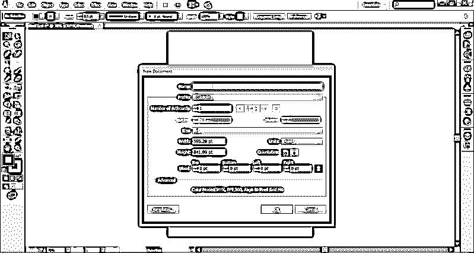

2.  在页面上，使用星形工具创建一个星形。

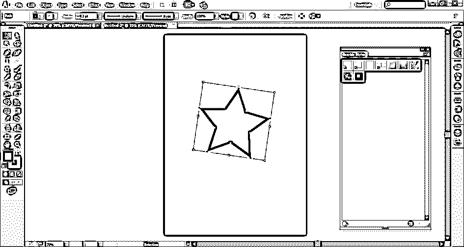

3.  从图形风格面板，点击纹理，如下图所示。

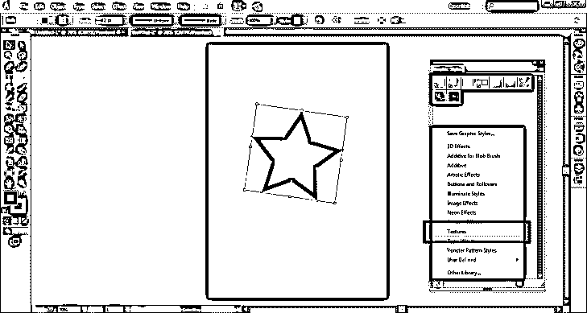

4.  通过将任何效果拖到星星上，在星星上使用该效果。如图所示。

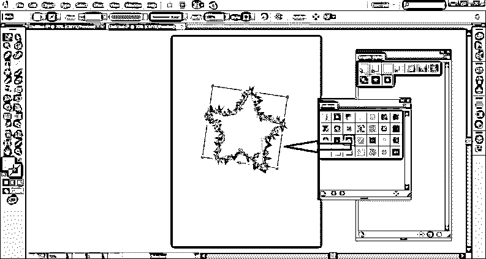

5.  如图所示，您可以随时从“外观”面板中修改填充颜色、描边或任何其他属性。只需选择对象并对其进行修改。

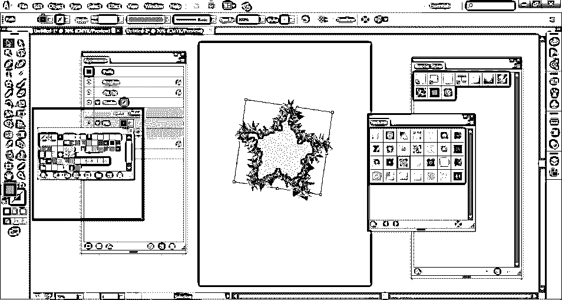

### 结论

这些是用户可以创建图形样式并将其应用于任何对象的一些方法。用户也可以删除任何图形样式，就像添加样式一样。这些图形样式也可以应用于组或层。如果图形样式应用于任何层，则该层中的所有对象都将具有相同的图形样式。而如果您将对象移动到该层之外，它将不再具有图形样式属性，并将保持独立于它自己的属性。

图形风格非常易于使用和理解，同时也使程序工作变得更加容易。我们还可以将我们的库导入图形风格，并创建令人惊叹的艺术作品和效果。

### 推荐文章

这是 Illustrator 中的图形样式指南。在这里，我们讨论如何创建一个图形风格的帮助下，一步一步的程序。您也可以阅读以下文章，了解更多信息——

1.  [Illustrator 中的 3D 效果](https://www.educba.com/3d-effects-in-illustrator/)
2.  [后期效果中的 3D 效果](https://www.educba.com/3d-effects-in-after-effects/)
3.  [Illustrator 中的平滑工具](https://www.educba.com/smooth-tool-in-illustrator/)
4.  Illustrator 中的[滤镜](https://www.educba.com/filters-in-illustrator/)

