# 如何在 Illustrator 中更改画板大小？

> 原文：<https://www.educba.com/how-to-change-artboard-size-in-illustrator/>

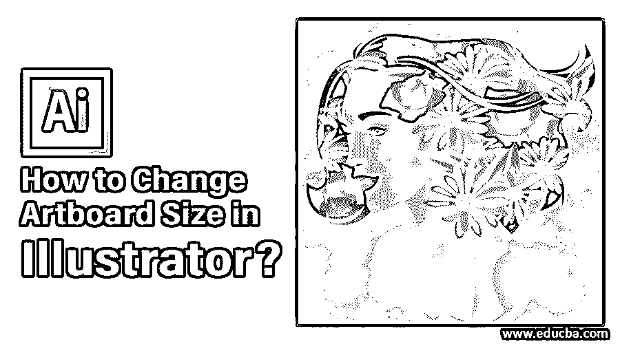

## Adobe Illustrator 中的画板是什么？

Adobe Illustrator 中的画板是用户创建主要设计元素的空白区域。画板中包含的设计对象或图稿是以您选择的各种格式导出的。如果您想要创建多个设计元素，可以使用多个画板轻松组织它们。之后，您可以选择将其打印或导出为单个资产。用户可以根据自己的需要[创建一个画板](https://www.educba.com/artboard-in-photoshop/),之后可以根据作品调整大小。

本文将向您介绍调整画板尺寸和属性的各种方法。

<small>3D 动画、建模、仿真、游戏开发&其他</small>

### 如何更改画板大小？

在创建工作文档之前，默认情况下，Illustrator 会要求您输入与您的工作相匹配的画板大小。请参考下面附上的图片。

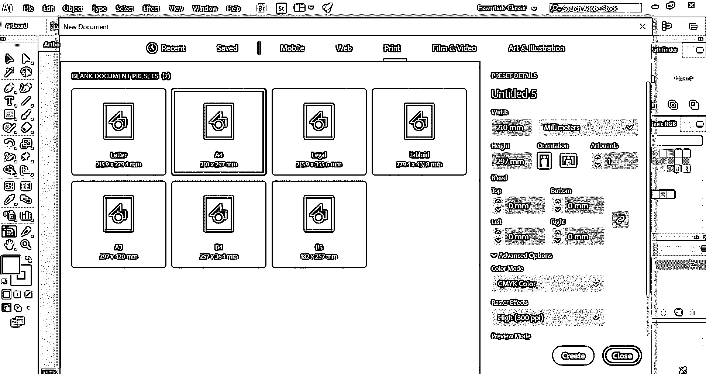

最初，您可以输入最符合您工作目的的值。随着设计的进展，在某个阶段，如果您想改变画板的大小，可以使用 Adobe Illustrator 提供的各种方法轻松实现。

### 在 Illustrator 中更改画板大小的方法

下面列出了在 illustrator 中更改画板大小的方法，并详细讨论了这些方法:

#### 方法 1–使用画板工具手动调整大小

**步骤 1:** 您需要打开一个 Illustrator 项目，在其中您需要更改画板大小。您会注意到画布上最初创建的画板。

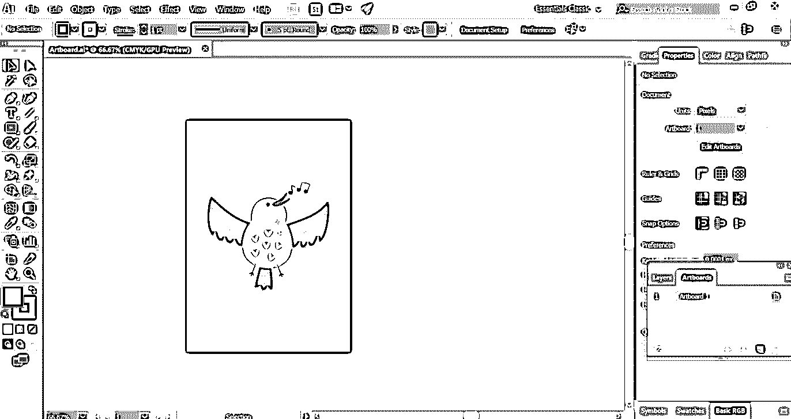

**步骤 2:** 从文档左侧的工具栏面板中选择“画板工具”图标。它是一个在页面顶部带有“+”号的符号。

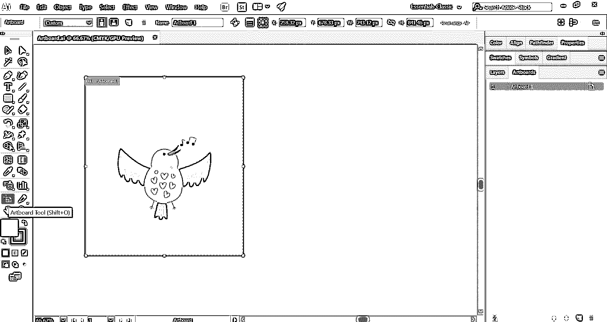

您也可以在 Windows 中使用快捷键 **Shift + O** 或在 Mac 中使用快捷键 **Command + O** 来选择画板工具。这很容易激活工具。

**第 3 步:**您会注意到一个蓝色的边界框围绕着带有锚点的画板。将鼠标光标悬停在边界框的任意点上，然后手动拖动它。

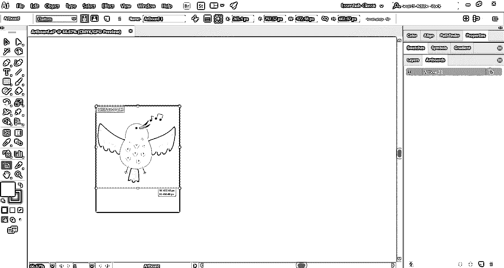

继续这个过程，直到画板看起来适合您的设计。

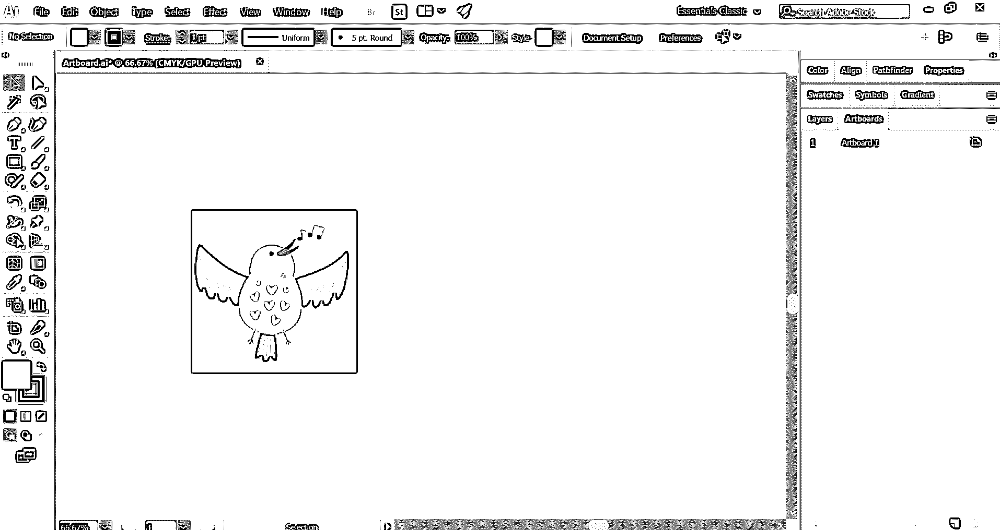

**步骤 4:** 如果您的工作区中有多个画板，您可以使用画板工具选择需要调整大小的画板。之后，只需按照上面的步骤。

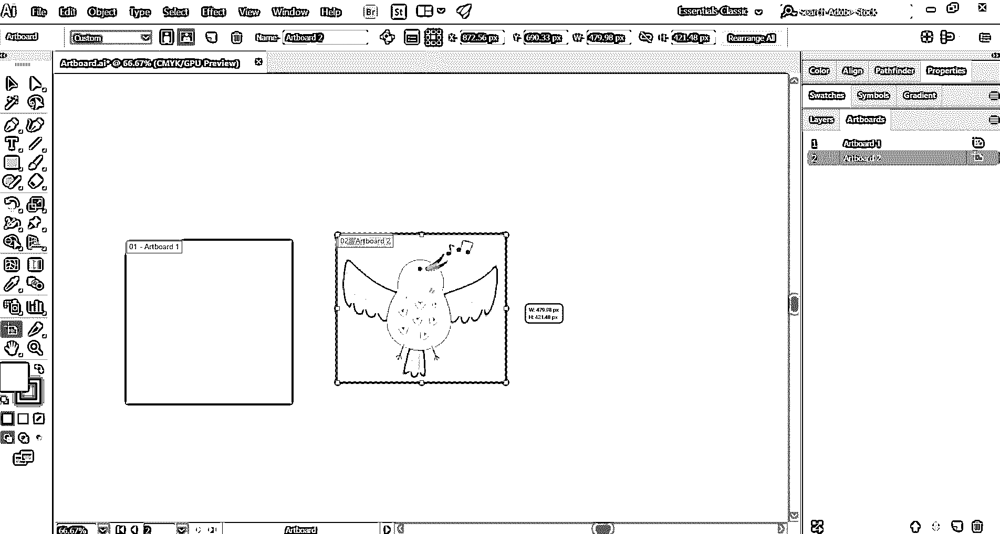

**Note:** You can also make a clone of an existing artboard using the artboard tool. For doing that, simply select the tool and press Alt (Windows) or Option (Mac) while dragging the selected artboard. This will create an exact duplicate copy of the artboard along with all the design elements. This is helpful to create variations of design with a new color and pattern.

#### 方法 2–使用画板面板调整大小

**第一步:**打开 illustrator 项目；您需要调整画板的大小。

**步骤 2:** 在文档右侧的画板面板中，您将找到您在项目中使用的所有画板的列表。

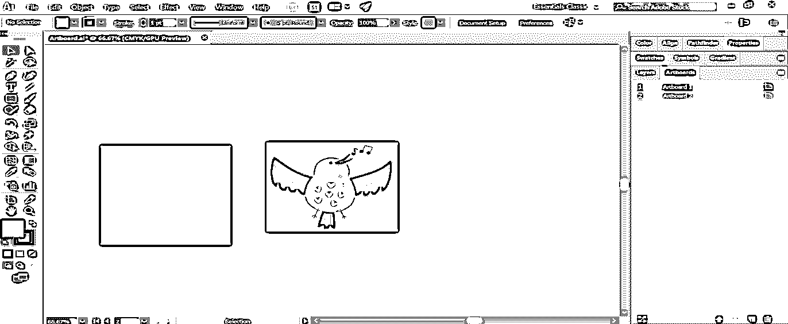

**步骤 3:** 如果您的文档中缺少画板面板，请从顶部选择“窗口”菜单将其激活。接下来，从下拉列表中选择“画板”选项。

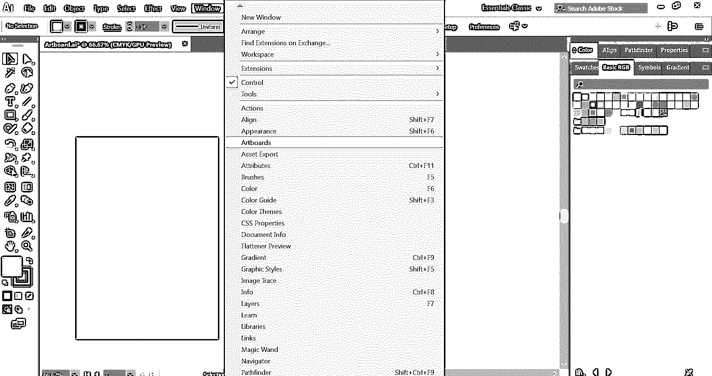

**步骤 4:** 按住 shift (Windows)或 Command (Mac)键选择多个项目，选择要调整大小的画板。

**步骤 5:** 这将打开尺寸值，包括窗口顶部的尺寸和位置。您可以更改“宽”和“高”文本框的值。这将相应地改变所选画板的大小。

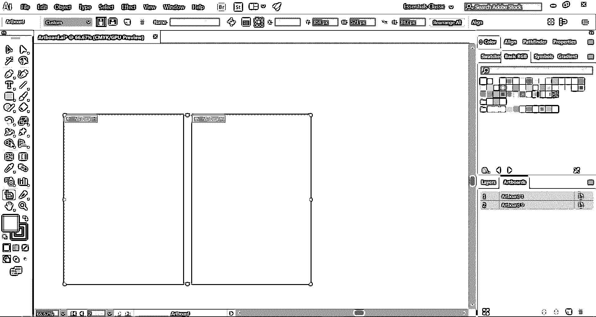

*   获得所需的画板大小后，您可能需要调整每个画板中对象的大小或位置。为此，只需选择对象并变换它们的大小和位置。

#### 方法 3–使用画板选项调整大小

**第一步:**打开 illustrator 项目；您需要调整画板的大小。

**步骤 2:** 从画板面板中选择要调整大小的画板。

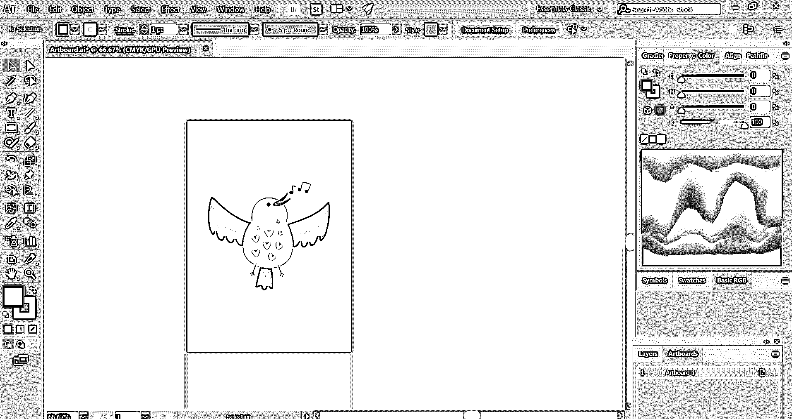

**第三步:**点击画板名称旁边的图标，如图所示。这将显示画板选项的弹出窗口。

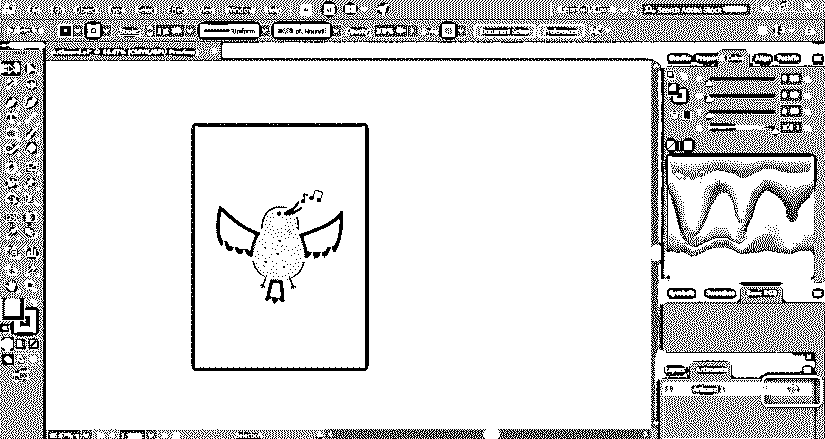

**步骤 4:** 在这里，您将找到输入画板宽度和高度值的区域。

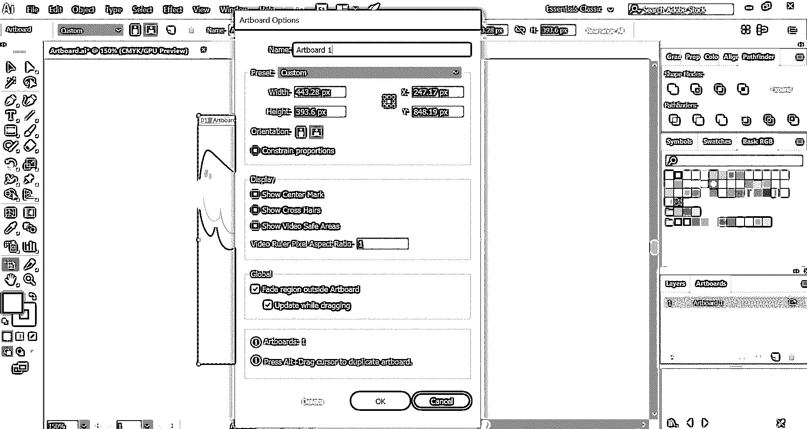

您也可以从纵向和横向更改画板方向。

**第五步:**完成所有更改后，按 OK。

#### 方法# 4–通过使画板适合艺术来调整大小

**第一步:**打开 illustrator 项目；您需要调整画板的大小。

**步骤 2:** 从 Windows 顶部的 Illustrator 窗口或 Mac 屏幕顶部，选择“对象”菜单。接下来，将打开一个下拉菜单。

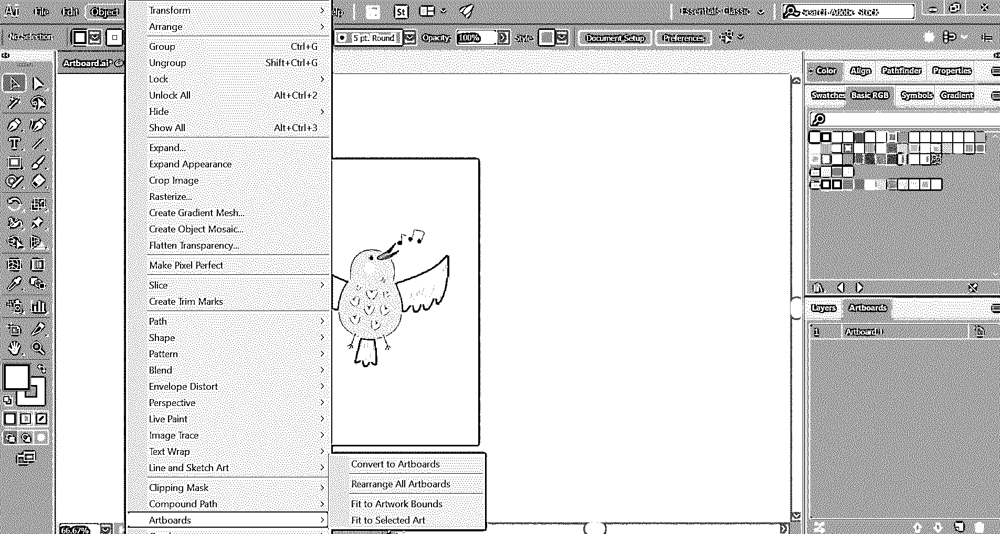

**步骤 3:** 在下拉列表的底部选择画板。它进一步导致一个最终的弹出框。

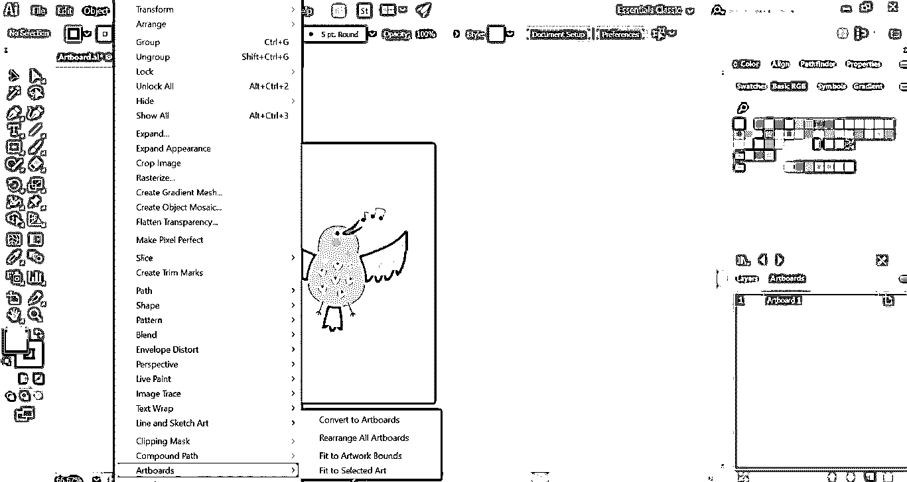

**步骤 4:** 接下来，您必须选择“适合作品边界”选项。现在，您的画板将在图稿中被调整大小。

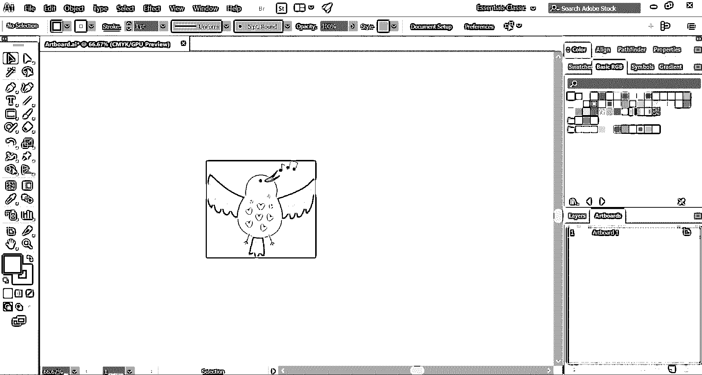

**额外提示:**有时，人们会混淆画板和工作空间，可能会互换使用。这里要注意的是，工作区或画布是 Illustrator 中容纳所有组件(包括画板)的整个可用空间。

### 结论

画板是 Adobe Illustrator 中的主要舞台，图形艺术家在这里工作并保存他们的作品。通常，用户会创建一个特定大小的艺术品，并继续设计过程。但是，最终他们可能需要更改画板的尺寸和属性，以适应他们的工作流程。使用上面讨论的各种方法，您可以轻松地调整画板尺寸。根据你的工作性质和情况，选择一种对你最有帮助的方法。

### 推荐文章

这是一个如何在 Illustrator 中改变画板大小的指南？在这里，我们讨论了在 illustrator 中更改画板大小的介绍和四大方法。您也可以阅读以下文章，了解更多信息——

1.  [在 Illustrator 中应用效果的步骤](https://www.educba.com/effects-in-illustrator/)
2.  [如何使用 Excel VBA Me 功能？](https://www.educba.com/vba-me/)
3.  [8 大 Adobe Illustrator 工具](https://www.educba.com/adobe-illustrator-tool/)
4.  [如何使用 Illustrator 中的切片工具？](https://www.educba.com/slice-tool-in-illustrator/)
5.  [Illustrator 中的平滑工具指南](https://www.educba.com/smooth-tool-in-illustrator/)

