# Illustrator 中的标志设计

> 原文：<https://www.educba.com/logo-design-in-illustrator/>

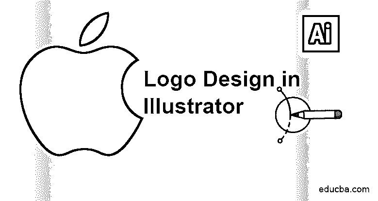

## Illustrator 中的标志设计介绍

在 Adobe Illustrator 中创建徽标设计是著名且流行的图形编辑程序之一，在世界范围内被图形设计师、编辑、艺术家和 web 艺术家广泛使用。Adobe Illustrator 为所有艺术家提供了一个平台，将他们的想象力转化为数字平台。

Adobe Illustrator 拥有一套强大而独特的工具，使初学者和专业人士使用该程序更容易、更简单。在这篇文章中，我们将学习如何在 Adobe Illustrator 中创建一个标志。让我们来学习如何在 Illustrator 上创建一个简单的著名苹果公司的标志。

<small>3D 动画、建模、仿真、游戏开发&其他</small>

### 如何在 Adobe Illustrator 中创建 Logo？

以下是在 Adobe Illustrator 中创建简单徽标的步骤。

**步骤#1:** 在程序中新建一个 A4 大小的文件。

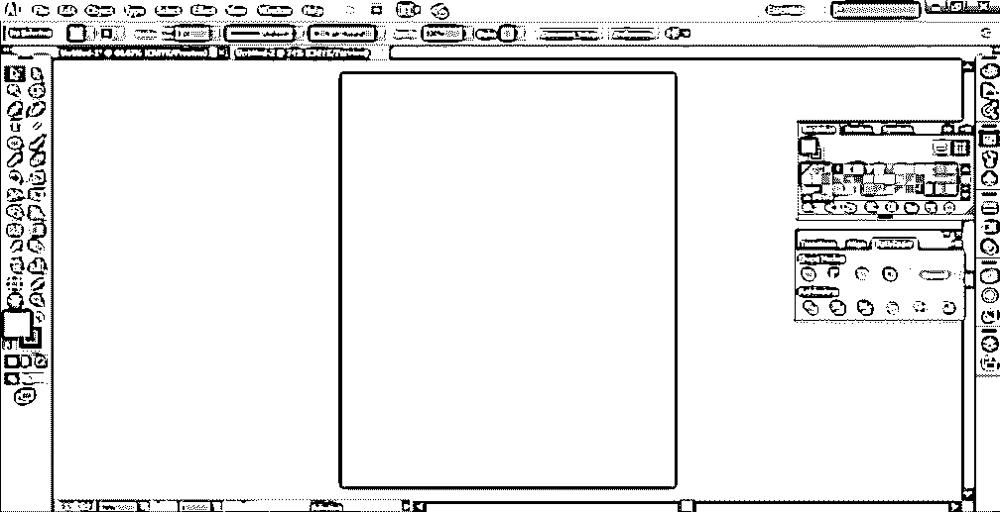

第二步:使用椭圆工具，在页面上创建一个椭圆。

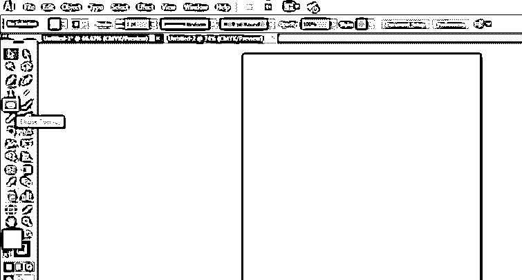

**步骤#3:** 确保智能导轨已打开。该选项在“视图”下可用。

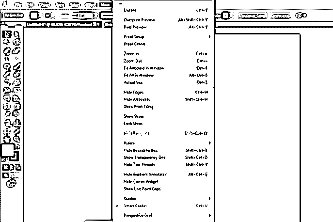

**步骤#4:** 如下图所示复制圆。

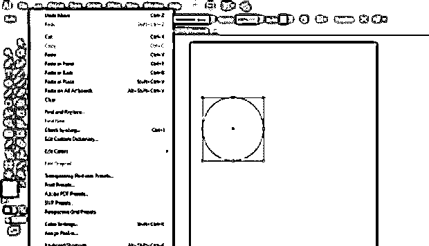

**步骤#5:** 如下图所示粘贴圆形。这需要非常耐心和干净利落地完成。

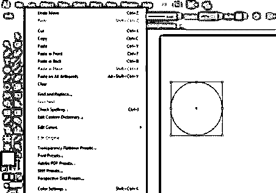

**步骤#6:** 接下来，如图所示放置第二个和第二个圆。

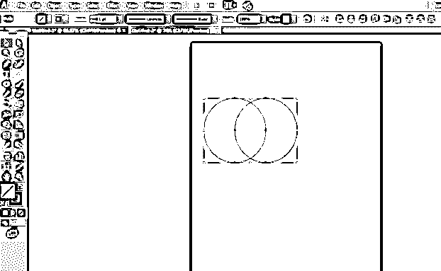

**步骤#7:** 选择两个圆，并转到路径查找器面板。Windows 面板上提供了路径查找器工具箱。路径查找工具允许使用一些特殊的模式和选项来合并多个对象。我们甚至可以使用探路者工具编辑新创建的组合[。路径查找工具包括联合、相交、相减、减回、分割、修剪、合并、裁剪、轮廓、硬混合、软混合和陷印等选项。每个工具执行不同的功能，帮助用户以更简单的方式创建各种对象和设计。单击“路径查找器”面板上的第一个按钮“联合”按钮。](https://www.educba.com/pathfinder-tool-in-illustrator/)

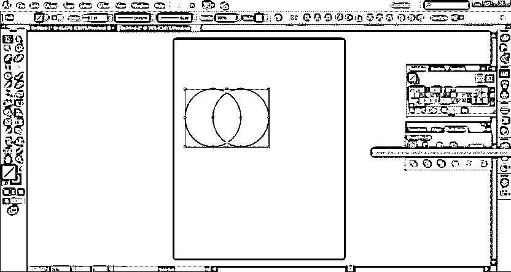

**步骤#8:** 在直接选择工具的帮助下，通过编辑形状的锚点来制作一个形状。直接选择工具也是 Illustrator 中非常有用的工具，可以帮助用户重新设计或修改任何形状或对象。它作用于可以使用此工具编辑的形状的锚点。

第 9 步:最终的形状看起来像，如下图所示。

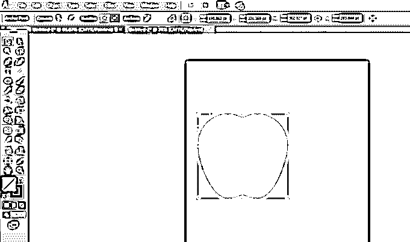

步骤#10: 接下来，在同一个页面上创建另一个椭圆，如图所示。

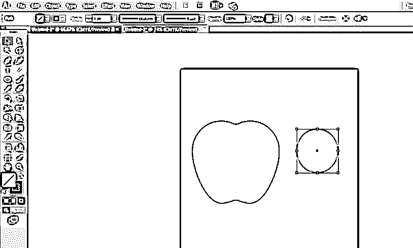

**步骤#11:** 拖动圆圈，放在已经创建好的苹果的右上角。

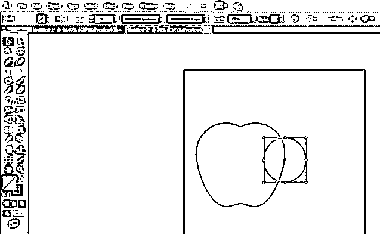

**步骤#12:** 选择两个形状，即圆形和苹果。现在，再次使用 pathfinder 面板，这次点击减号选项。结果如下图所示。

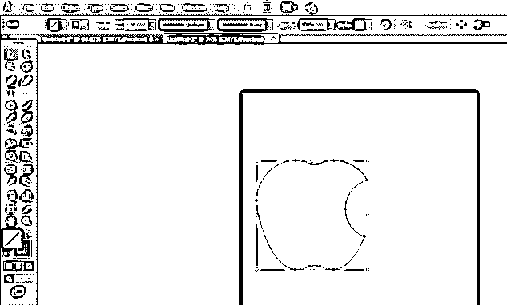

**步骤#13:** 接下来，在同一个页面上再创建一个圆。

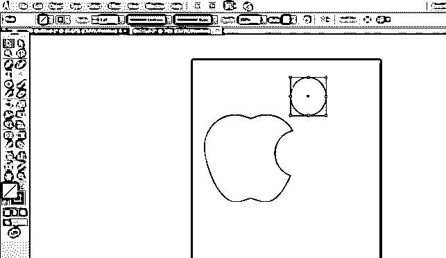

**步骤#14:** 选择圆形，复制一个圆形，然后放置第二个圆形，如图所示。

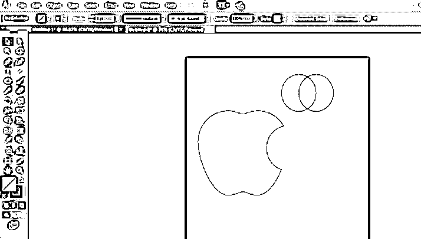

**步骤#15:** 选择两个圆，再次使用寻路器面板，点击相交选项。最终结果如下图所示。

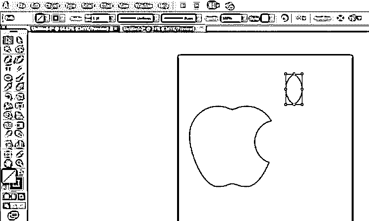

**步骤#16:** 接下来，调整叶子的大小并旋转，如下图所示放置。

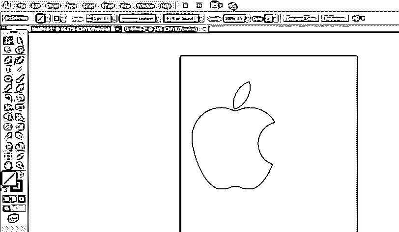

**步骤#17:** 使用黑色，当两个形状都被选中时，点击颜色工具箱中的黑色。

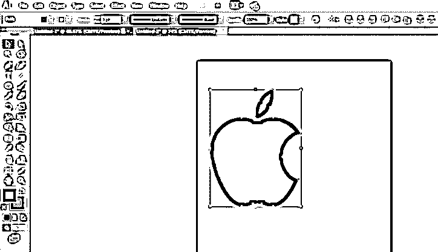

**步骤#18:** 最终结果如下图所示。

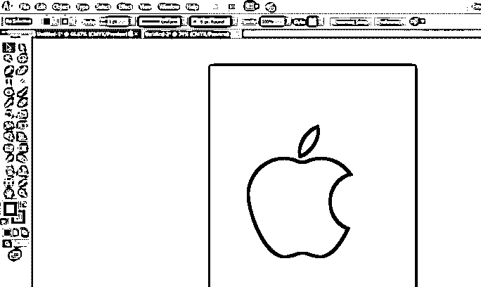

### 结论

这是一个如何在 Adobe Illustrator 中设计或创建简单徽标的小例子。我们可以使用简单而强大的软件工具在程序中设计更复杂的标志。另一种创建相同徽标的方法是使用钢笔工具，按原样描摹徽标。探路者工具是一种简单的方法来创建涉及基本形状和线条的对象和设计。如果我们需要设计标志或任何其他艺术品，我们需要使用钢笔工具。上面例子中的主要工具是 Pathfinder 工具，它帮助用户使用各种交互模式创建多个对象。

### 推荐文章

这是 Illustrator 中的标志设计指南。这里我们讨论 Illustrator 中标志设计的介绍和设计标志的步骤。您也可以浏览我们推荐的其他文章，了解更多信息——

1.  [Illustrator 中的形状生成器工具](https://www.educba.com/shape-builder-tool-in-illustrator/)
2.  [在 Illustrator 中移除背景](https://www.educba.com/remove-background-in-illustrator/)
3.  [Illustrator 中的选择工具](https://www.educba.com/selection-tool-in-illustrator/)
4.  [如何在 Illustrator 中制作 Logo？](https://www.educba.com/how-to-make-logo-in-illustrator/)

