# 在 Adobe Illustrator 中调整图像大小

> 原文：<https://www.educba.com/resize-image-in-adobe-illustrator/>

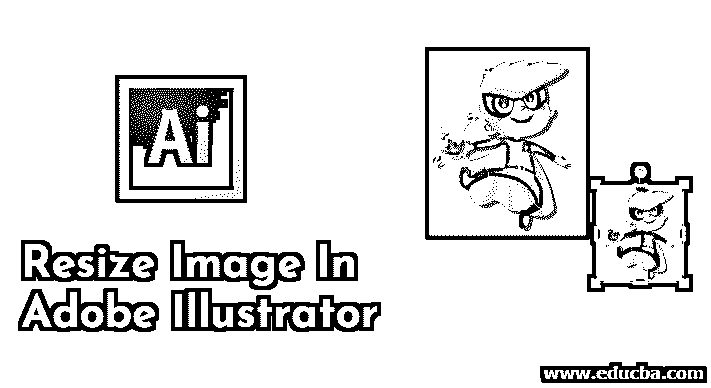

## Adobe Illustrator 中调整图像大小的介绍

Adobe Illustrator 是一个巨大而强大的软件，它加载了一组工具和功能，用于使用户的工作更容易、更简单。程序中的工具和功能是以这样一种方式设计的，即用户可以使用一种工具实现多种功能。在 Adobe Illustrator 中，我们也可以编辑和修改图像。与其他图形程序相比，使用 Adobe Illustrator 调整图像大小和编辑图像的方法和技术是独一无二的。要在 Adobe Illustrator 中调整图像大小，我们可以使用多种工具来实现不同的目的。我们也可以使用缩放工具、边界框或变换面板。我们也可以使用剪切和扭曲工具来调整和编辑 Illustrator 中的图像。

### 什么是 Illustrator 中的调整图像大小？

调整图像大小的方法是大多数其他图形软件所独有的。Illustrator 的缩放选项协同工作，以保持最终图像的完整性。您可以调整插图的大小，而不会使其看起来模糊或像素化。

<small>3D 动画、建模、仿真、游戏开发&其他</small>

### 如何在 Adobe Illustrator 中调整图像大小？

*   在 Adobe Illustrator 中缩放图像可以通过不同的方法来完成，例如简单地使用“缩放”工具，或者将“边框”工具与“选区”和“自由变换”工具结合使用，或者相对于高度和宽度缩放对象，或者同时缩放多个对象。
*   剪切工具可用于投射阴影和编辑图像的情况。当用户想要在图像上添加或创建旋转、褶皱或皱纹时，使用扭曲。用户还可以使用缩放工具参照文本和图形来变换和缩放笔画和效果。
*   我们也可以使用选择工具来调整图像的大小；选择工具对于编辑对象的锚点很有用。我们可以使用选择工具编辑所选图像或对象的每个锚点。
*   我们有另一个工具“变换每个”命令，它使我们能够在多个选择中编辑和调整每个对象的大小。我们可以单独编辑每个项目，而不是完全转换选择。
*   最后，我们有变换面板，它通过输入用户要求输入的精确值来帮助我们编辑所选对象的高度和宽度。

### 在 Adobe Illustrator 中调整图像大小的步骤

在下面的教程中，您将学习在 illustrator 中调整图像或图形大小的步骤。

**第一步:**在 Adobe Illustrator 中创建新文件。

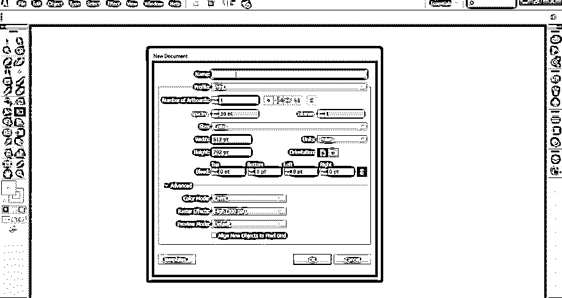

**第二步:**在页面上画一个矩形，一个椭圆，一个星形。

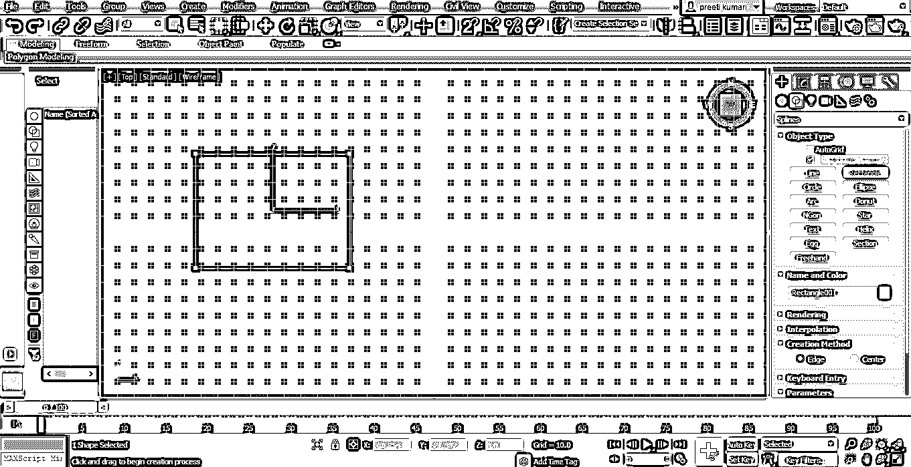

**第三步:**选择矩形，使用选择工具调整对象大小。

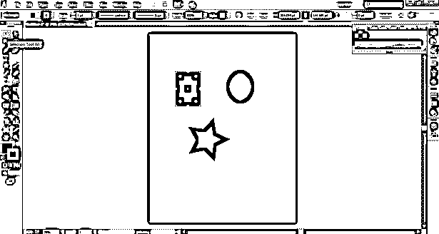

**第四步:**要调整整个对象的大小，使其宽度和高度一致，使用如下图所示的缩放工具。

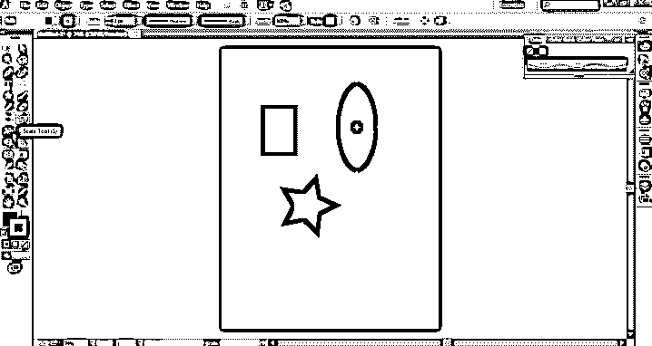

**第五步:**使用工具箱中的自由变形工具。使用这个工具，我们可以使用自由扭曲、扭曲透视、自由变换和约束选项来编辑和调整图像大小。“扭曲”选项可以自由地或以透视方式修改对象。而约束选项根据对象的角度和均匀性旋转对象。

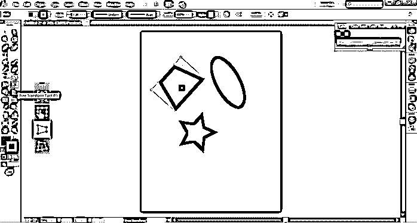

**第六步:**转到对象，选择变换选项。我们可以使用选项菜单中的“转换每个”选项，并选择编辑对象所需的必要设置。

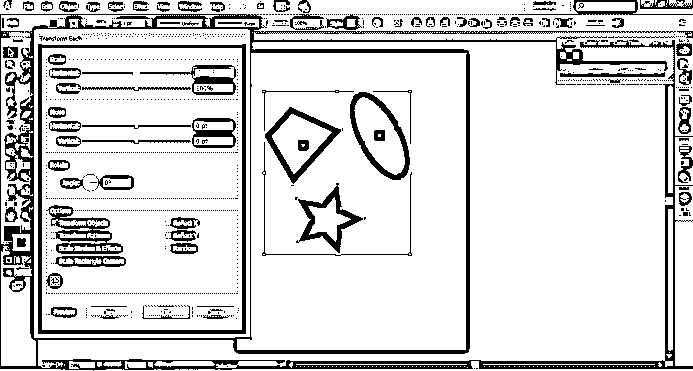

**第七步:**同样，进入选项，选择剪切，给物体投下阴影，调整大小。

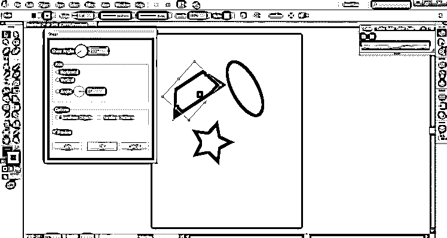

**步骤 8** :我们也有“重置边界框”的选项，这有助于编辑对象的边界框并调整其大小。

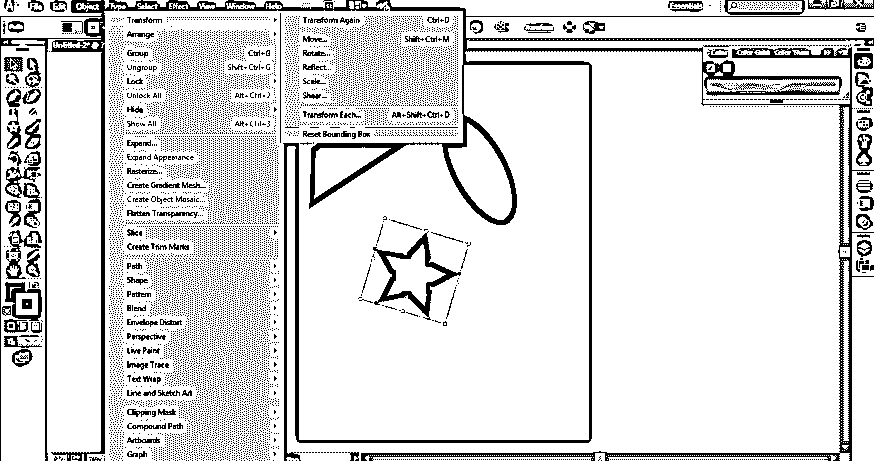

**第九步:**进入选项，选择封套扭曲选项，以弧线、旗帜、波浪、挤压等形式编辑修改对象。

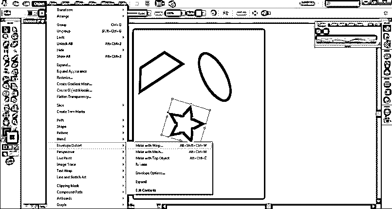

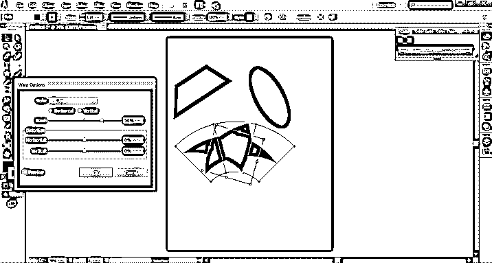

### 在 Adobe Illustrator 中调整图像大小的独特和惊人的效果

这些是 Adobe Illustrator 中用于调整图像大小的一些选项。虽然 Adobe Illustrator 是矢量软件，并且与图像的像素和分辨率无关，但我们可以在程序中编辑图像和对象，而不会对分辨率或图像质量造成任何损害。

Adobe Illustrator 具有一组独特而令人惊叹的效果，可以帮助用户以不同的形状调整对象或图像的大小。其中一个效果是使用“效果”菜单中的“扭曲”和“变换”选项。我们可以使用这种具有扭曲、曲折、折叠、膨胀和粗糙效果的效果。这些是一些独特的效果，为对象添加了一些样式。

### 结论

在 Adobe Illustrator 中调整图像大小和编辑图像非常简单。这是任何艺术家或平面设计师在创作合适的艺术品时使用的最基本的功能。虽然有许多用于变换和缩放对象的选项、工具、效果和命令，但 adobe Illustrator 强调每个命令和工具都比其他工具更高级或更升级。但是，仍然有命令和工具在对象上执行相同的功能和相同的效果。每个艺术家都知道这些调整对象大小和编辑对象的基本工具，因为它们是程序中最主要和最常用的工具和命令。要掌握在 adobe illustrator 上创建和编辑艺术品的艺术，必须了解该程序的所有基本工具和功能。

### 推荐文章

这是一个在 Adobe Illustrator 中调整图像大小的指南。在这里，我们讨论了什么是调整图像大小，以及在 Adobe Illustrator 中调整图像大小的步骤，并附有一些插图。您也可以阅读以下文章，了解更多信息——

1.  [如何安装 Adobe Illustrator？](https://www.educba.com/install-adobe-illustrator/)
2.  [安装 Adobe Illustrator for Windows 8 的步骤](https://www.educba.com/adobe-illustrator-for-windows-8/)
3.  [Adobe Flash 设置概述](https://www.educba.com/adobe-flash-settings/)
4.  [在 Illustrator 中使用水彩笔](https://www.educba.com/watercolor-brushes-illustrator/)
5.  [Illustrator 中的笔刷|创建自定义笔刷](https://www.educba.com/brushes-in-illustrator/)
6.  [Photoshop 中的水彩笔刷指南](https://www.educba.com/watercolor-brushes-in-photoshop/)

