# Illustrator 中的 3D 效果

> 原文：<https://www.educba.com/3d-effects-in-illustrator/>

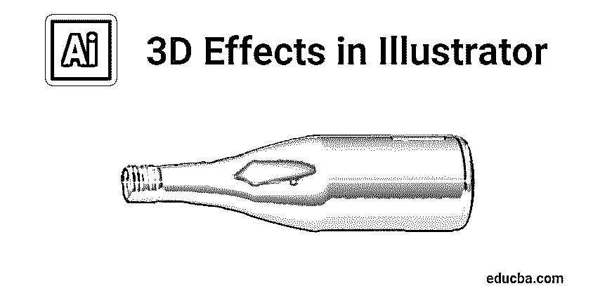

## Illustrator 中的 3D 效果是什么？

Adobe Illustrator 是由 Adobe Inc .开发和拥有的矢量图形编辑器软件，用于制作各种用途的绘图、插图、艺术品和 3D 对象。这个软件最初是在 1987 年发布的，它的版本是 1。Windows 和 Mac 操作系统都支持 Illustrator。Illustrator 更新频繁，最新版本发布于 2019 年 4 月。现在 illustrator 是 Adobe creative cloud 的[部分。Adobe Illustrator 被不同的专业人士使用，如网页设计师、建筑师、视觉艺术家等。它在全世界非常流行和普遍。它被用来制作动画人物、卡通、标志、海报、图表&等。此外，它允许用户上传图像，并在各种可用工具的帮助下进行编辑。今天我们将讨论 Adobe illustrator 中可用的 3D 效果或 3D 工具。](https://www.educba.com/what-is-adobe-creative-cloud/)

### Illustrator 中 3D 效果的类型

Illustrator 中的 3D 效果主要分为两个过程，

<small>3D 动画、建模、仿真、游戏开发&其他</small>

1.  挤压出
2.  旋转

#### 1.挤压出

拉伸是通过沿 Z 轴展开，在 X-Y 平面上赋予 2D 特征厚度的过程。或者是通过增加一定高度将 2D 草图转换为 3D 的过程。这是制作 3D 物体最简单有效的方法。使用 Illustrator 中的挤出工具可以挤出任何复杂的形状或尺寸。我们可以定制长度或厚度来挤压。

为了更好地了解挤压工具，今天，我们将看到一个挤压 Adobe Illustrator 文本的例子。

第一步:在你的电脑上打开 [Adobe Illustrator，开始一个新项目。选择任何可用的页面尺寸。将在您的软件中打开一个白色空白页，如下所示。](https://www.educba.com/what-is-adobe-illustrator/)

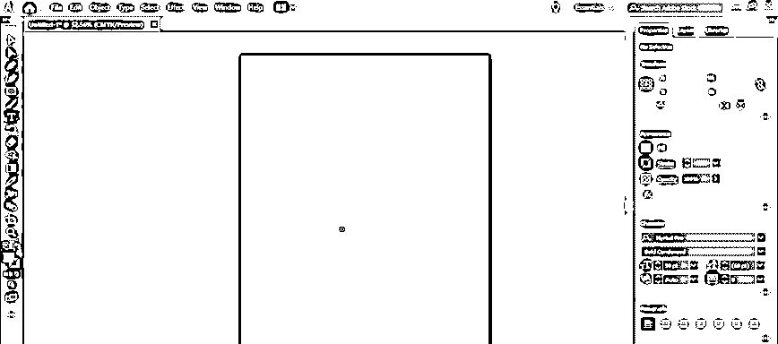

**第二步:**下一步是添加你要挤出的文字。您可以在 illustrator 的左端看到一个垂直工具栏。工具箱里有各种效果的工具。请参见下图所示的工具箱。

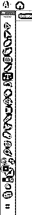

**第三步:**文字工具(T)用于在 illustrator 中添加文本。从工具栏中选择“文字工具”,在画板上单击并拖动一个框来书写文本。你可以根据需要写任何东西。例如，在这里，我使用了“ILLUSTRATOR”这个词来进行挤压。见下图，

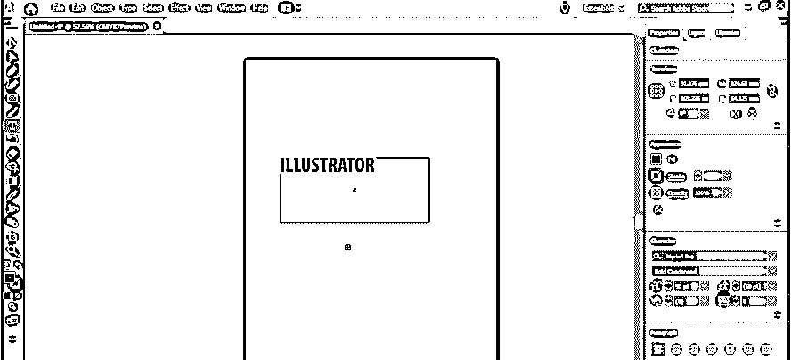

**第四步:**你也可以根据自己的需要选择任何字体。您可以从“字符”面板中编辑文本的大小。从窗口选项，你会得到一个对话框来改变文本的大小。(窗口>类型>字符)

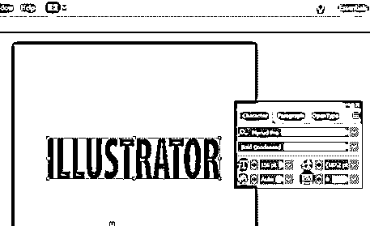

**第五步:**要挤压文本，你得把文本转换成形状，这样你才能轻松地挤压形状。为此，使用选择工具(V)选择你的文本，然后键入>创建轮廓。

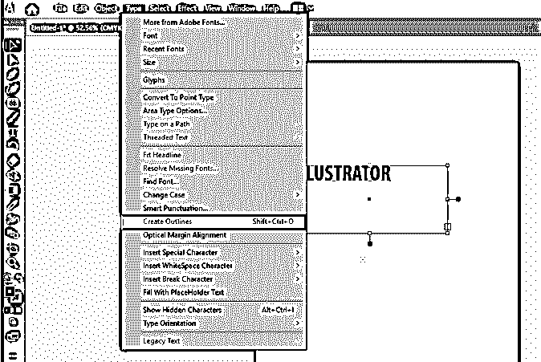

第六步:然后，围绕你的文本创建一个轮廓。这表明您的文本被转换为形状。见下图，

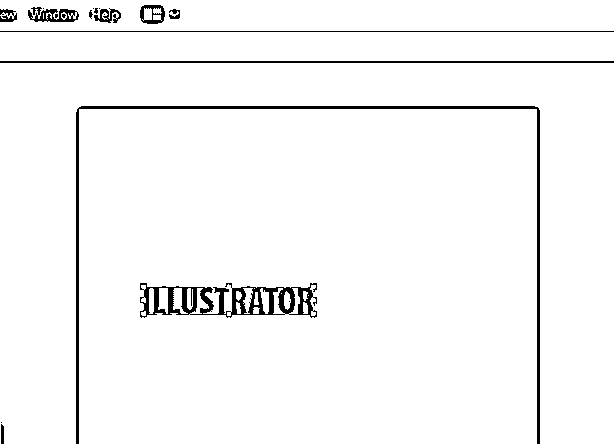

第七步:你可以给文字添加的另一个效果是给文字上色。您可以从列表中选择任何颜色，并将其添加到文本中。从一个窗口中打开颜色面板，选择如下所示的任何颜色，(窗口>颜色)

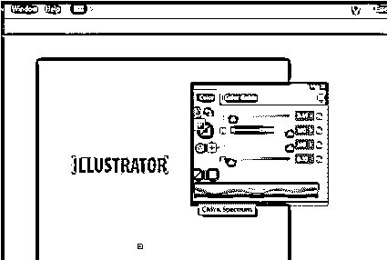

**第八步:**在把文字转换成 3D 之前，先把这个做成一个组。因此，即使在应用效果后，字母仍然保持为一个形状，通过选择对象>组合来组合文本。

**步骤 9:** 应用 3D 效果，选择你的文本，进入效果> 3D >挤压和倒角，会打开一个对话框。它包含各种选项来编辑挤出，包括挤出深度、位置、透视、斜角等。在对话框中，您可以看到一个用于输入拉伸深度的框。键入所需的深度值，如下图所示。

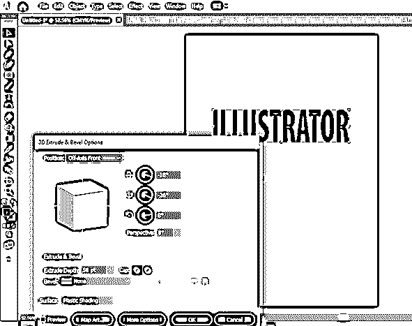

**第十步:**在 3D 对话框中，点击预览按钮，可以看到你的文字挤压后的样子。见下图，

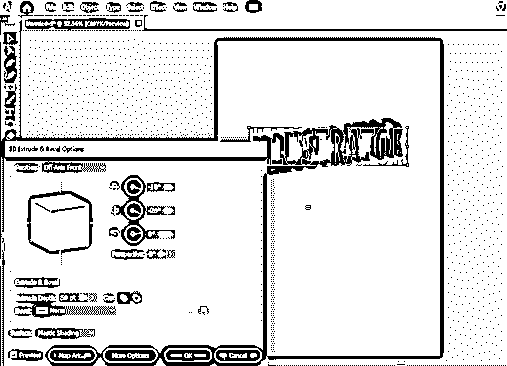

当您查看挤出的文本时，可以看到它不在透视范围内。要解决此问题，可以从“拉伸”对话框中更改“透视”的值。

#### 2.旋转

设计中的革命是通过围绕轴旋转 2D 草图来创建 3D 对象的过程。或者是通过围绕中心轴旋转草图来赋予 2D 草图厚度的过程。旋转工具也和挤压一样重要。在 illustrator 中，大多数圆柱形和空心对象都是使用旋转工具创建的。

今天我们将通过制作一个瓶子来学习如何使用旋转工具。

**第一步:**打开 Adobe Illustrator，选择新页面进行设计。该过程的第一步是绘制要旋转的瓶子的轮廓。为此，你必须用钢笔工具画出瓶子的一半。选择钢笔工具，并绘制如下所示的一半轮廓，

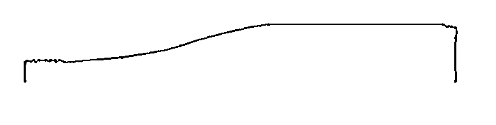

**第二步:**第一步之后，你要确定旋转轴。您必须选择要旋转的平面和边。使用如下所示的选择工具选择此[，](https://www.educba.com/selection-tool-in-illustrator/)

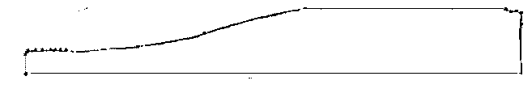

**第三步:**完成绘图后，选择绘图，从效果菜单进入旋转选项。特效> 3D >旋转。然后将打开一个对话框，其中有旋转图形的各种选项。它是 3D 旋转选项；利用这个；您可以更改 revolve 的各种参数。通过点击预览选项，您可以在屏幕上看到旋转的瓶子，如下所示。

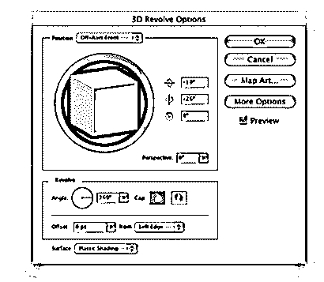

**步骤 4:** 在这里，使用这些旋转选项，你可以固定旋转的角度、厚度、偏移等。此外，通过旋转立方体，您可以看到 3D 对象的不同视图。

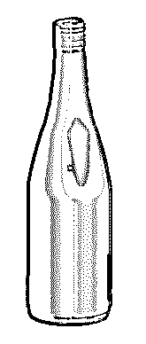

### 结论

Adobe Illustrator 是设计师、媒体人、插图画家等最常用的矢量图形编辑器。我们可以使用这个软件来创建数字图形，三维渲染，插图，印刷等。这是一个简单有效的软件，可以学得很快。即使是初学者也能很容易理解他们的工作方法。这里我们讨论了 illustrator 中的基本 3D 效果。这些只是这个软件的基础部分，一旦你接触了这个软件，你会学到很多更多的效果和工具。该软件的可能性是无限的，Adobe 为其用户提供了许多工具和功能。

### 推荐文章

这是 Illustrator 中 3D 效果的指南。在这里，我们讨论如何在 Illustrator 中使用 3D 效果的概念和一步一步的解释。您也可以浏览我们推荐的其他文章，了解更多信息——

1.  [Illustrator 中的图章效果](https://www.educba.com/stamp-effect-in-illustrator/)
2.  [后期效果中的 3D 效果](https://www.educba.com/3d-effects-in-after-effects/)
3.  [Illustrator 中的平滑工具](https://www.educba.com/smooth-tool-in-illustrator/)
4.  [Illustrator 中的金属效果](https://www.educba.com/metal-effect-in-illustrator/)

