# Illustrator 中的 3D 文本

> 原文：<https://www.educba.com/3d-text-in-illustrator/>

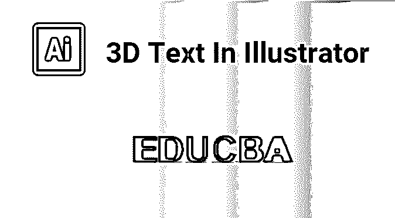

## Illustrator 中的 3D 文本简介

Adobe Illustrator 中的 3D 文本是该应用程序最重要的组成部分之一。两个独特的程序可以制作 3D 内容–主要策略包括使用 3D 工具。同时，在第二个系统中，我们试图在不使用 3D 工具的情况下制作 3D 内容；Illustrator 的效果将在您的内容上快速再现 3D 外观。您还可以在投影中包含渐变，以创建光线焦点，这在很大程度上可以在 3D 形状中找到，并且 Illustrator 不需要 3D 渲染器来查看 3D 内容图片。

### 创建 3D 文本的技术

基本上，我们有两种技术来创建 3D 测试。

<small>3D 动画、建模、仿真、游戏开发&其他</small>

#### 技巧 1——使用 3D 工具

**第一步:**打开一张空白单据**。**

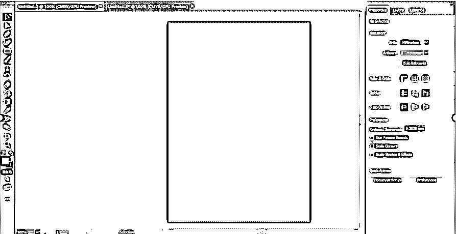

**第二步:**在 Illustrator 中键入文字制作 3D 文字。

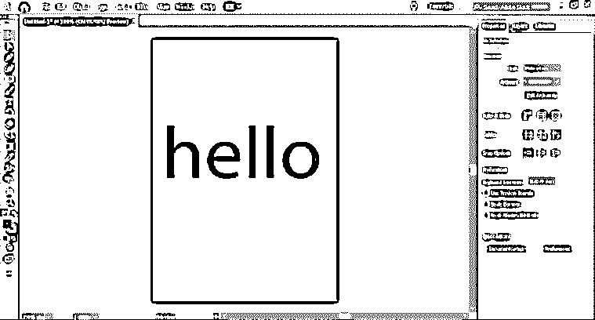

**第三步:**选择填充字母的颜色。

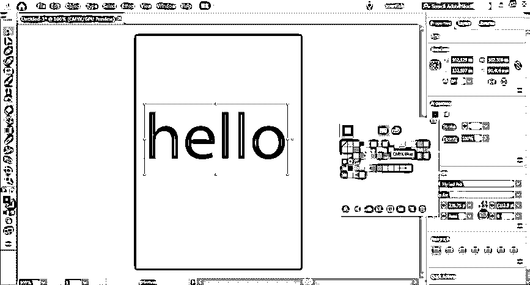

**第四步:**从对话框中选择一个全局选项。接下来，进入 3D 效果——挤压和倒角。

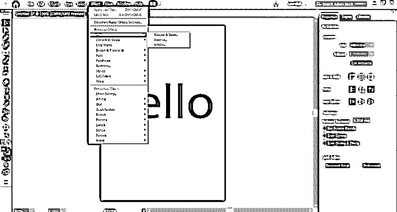

**第五步:**屏幕上会出现一个对话框，进行更多的设置。

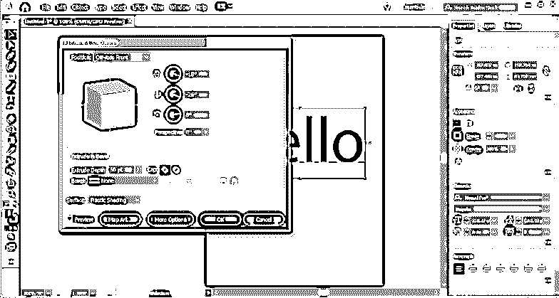

**步骤 6:** 使用挤压选项应用深度。

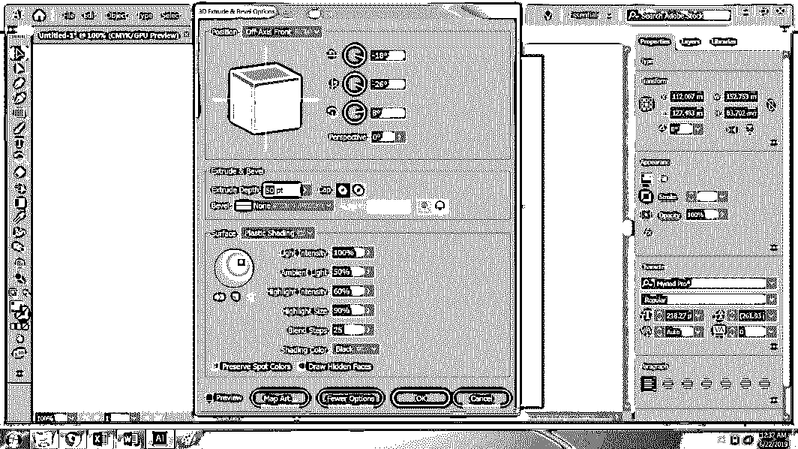

**步骤 7:** 点击更多选项查看详细设置，然后点击编辑并在设置中注明混合步骤的数量。

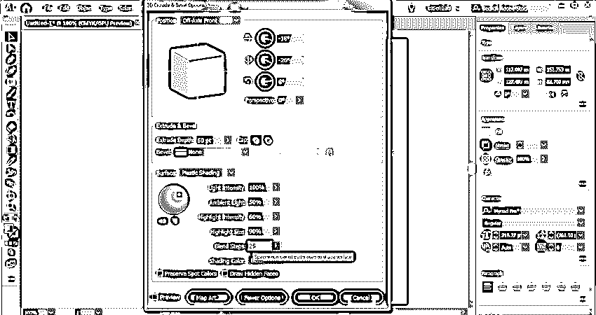

**第八步:**3D 文字已经可以使用了。

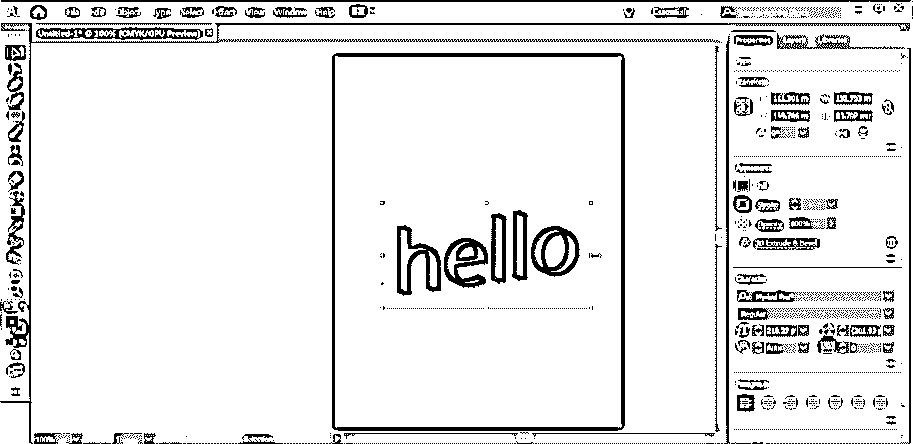

#### 技巧 2——不使用 3D 工具

**第一步:**新建一个文件。

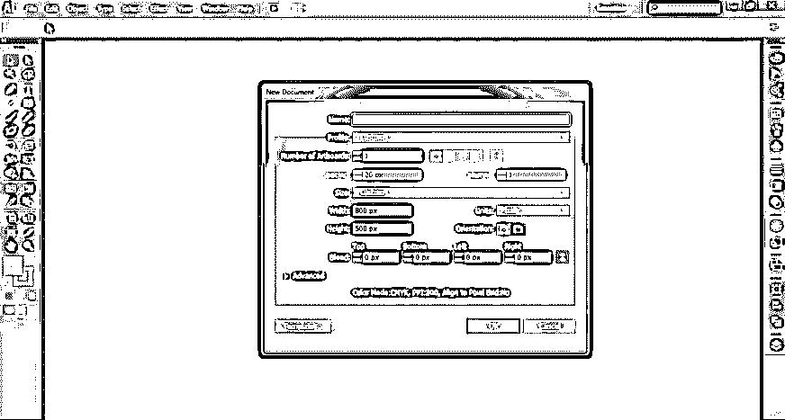

**第二步:**使用文字工具和冲击字体键入文字。

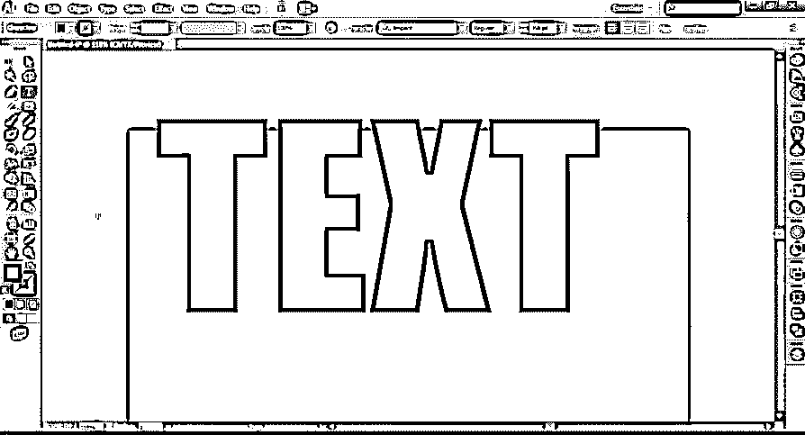

**第三步:**增加文字间距。

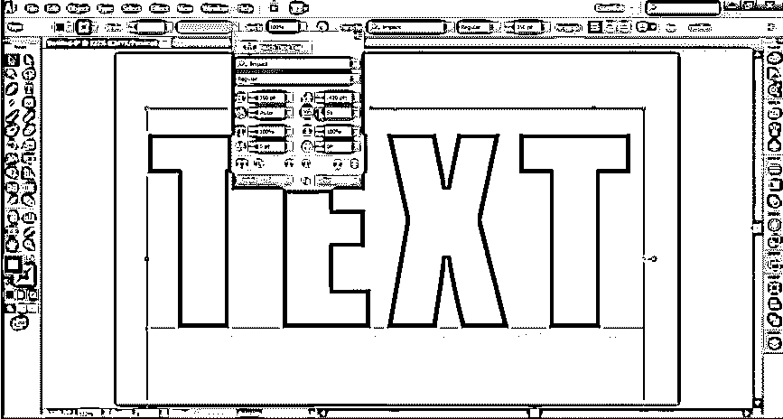

**第四步:**按住 Alt 键和鼠标复制文本并改变其颜色。

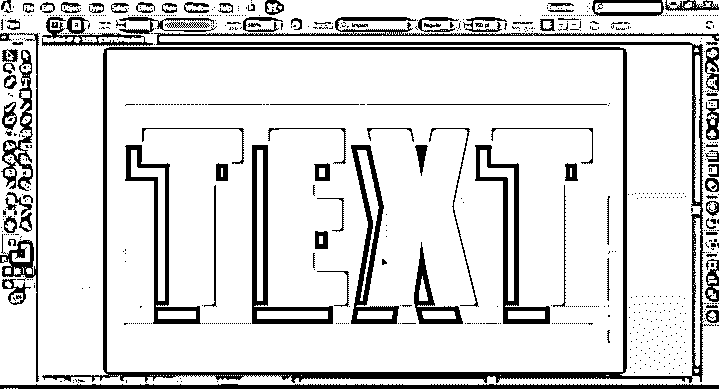

**第五步:**从颜色框中选择钢笔工具和较浅色调的颜色。

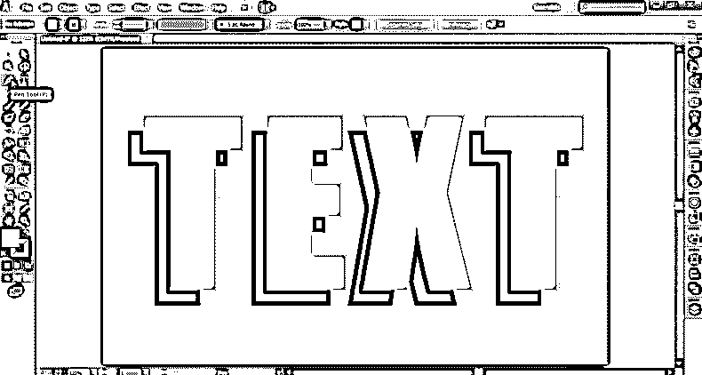

第六步:使用钢笔工具，连接两个物体的两个角。

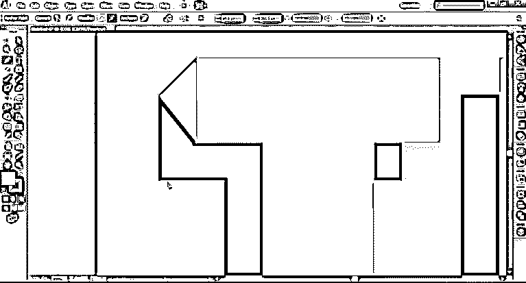

**第七步:**用钢笔工具做一个连接桥。

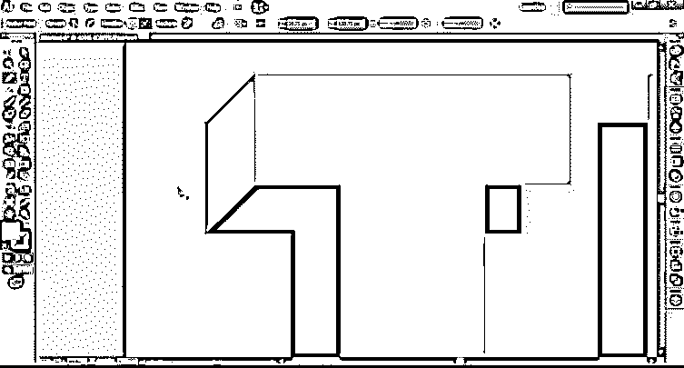

**第八步:**继续用钢笔工具做出[形状。在生成的图像上添加阴影效果。](https://www.educba.com/pen-tool-in-illustrator/)

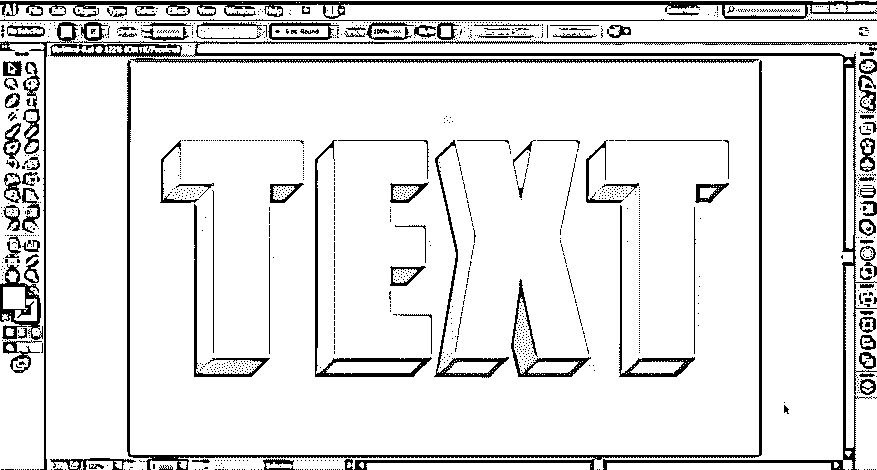

**步骤 9:** 选择顶部对象，使用 Alt+鼠标键创建一个文本副本。为新创建的文本添加黑色。

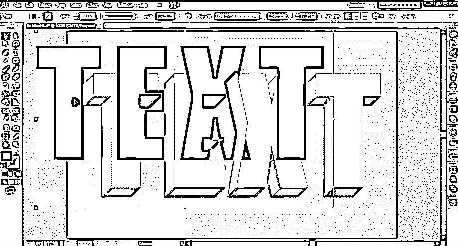

**步骤 10:** 将此文字放在 3D 创建的文字后面。

**步骤 11:** 放置黑色文本后，从效果菜单中选择高斯模糊。最后，选择高斯模糊的半径。

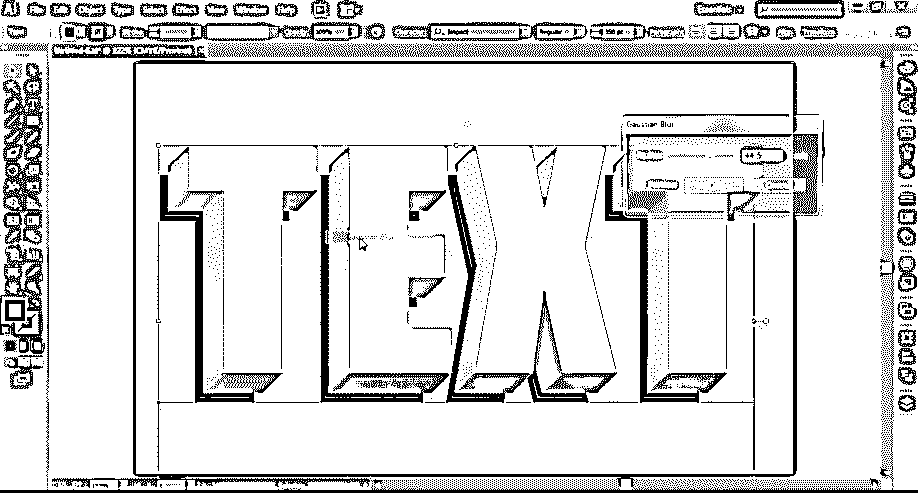

**步骤 12:**3D 文本定稿。

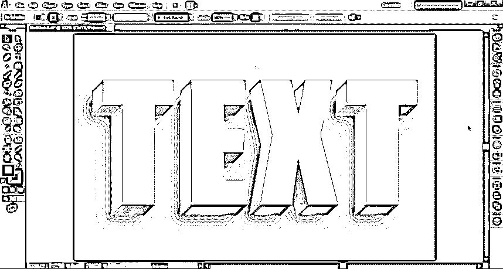

在过去几年中，Adobe Illustrator 已经成为一个要求很高的程序，几乎所有的平面设计师和艺术家都在使用它。此外，目前，Illustrator 也已经在教育机构和学校进行基于技能的教学。从小学习 Illustrator 或 Photoshop 等软件将帮助学生实现他们的目标，并让他们掌握设计的各个方面。

不仅如此，创建 3d 文本有两种方法。Illustrator 可以使用两种以上的方法来实现许多其他效果和修改。只是用户应该知道应用程序的工具和技术以及它的各种功能。有了所需的技能，用户可以用 Illustrator 创作出令人惊叹的东西。

### 结论

图形设计人员有多种选择来创建 3D 文本。在 vector 软件上创造任何东西都不局限于一种技术。用户可以通过使用不同的工具和效果来利用尽可能多的技术，并创造出令人惊叹的作品。在不使用 3D 工具的情况下创建 3D 文本最有用的工具是钢笔工具。

### 推荐文章

这是 Illustrator 中 3D 文本的指南。这里我们讨论不同类型的概念以及如何在 Illustrator 中制作 3D 文本。您也可以浏览我们推荐的其他文章，了解更多信息——

1.  [Illustrator 中的 3D 效果](https://www.educba.com/3d-effects-in-illustrator/)
2.  [Illustrator 自由变换工具](https://www.educba.com/illustrator-free-transform-tool/)
3.  [在 Illustrator 中移除背景](https://www.educba.com/remove-background-in-illustrator/)
4.  [Illustrator 中的效果](https://www.educba.com/effects-in-illustrator/)

