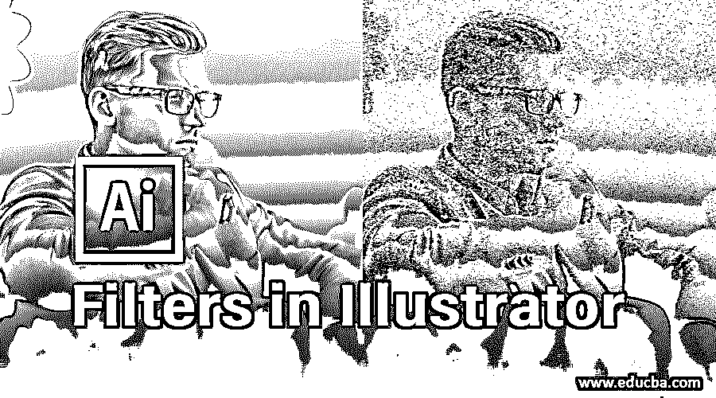
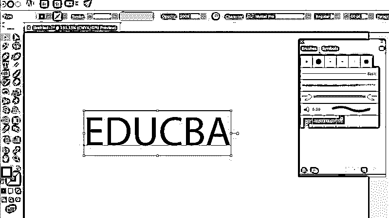
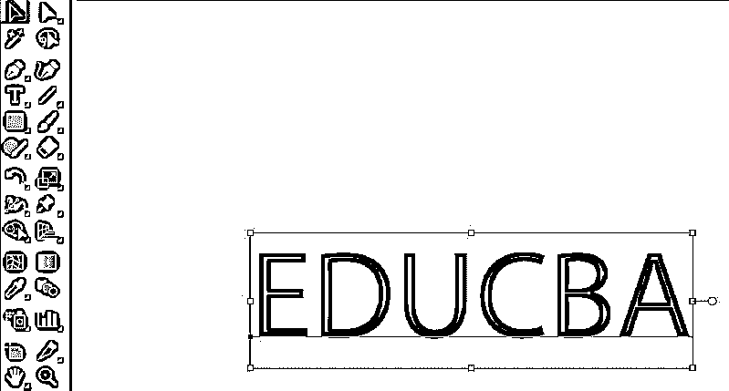
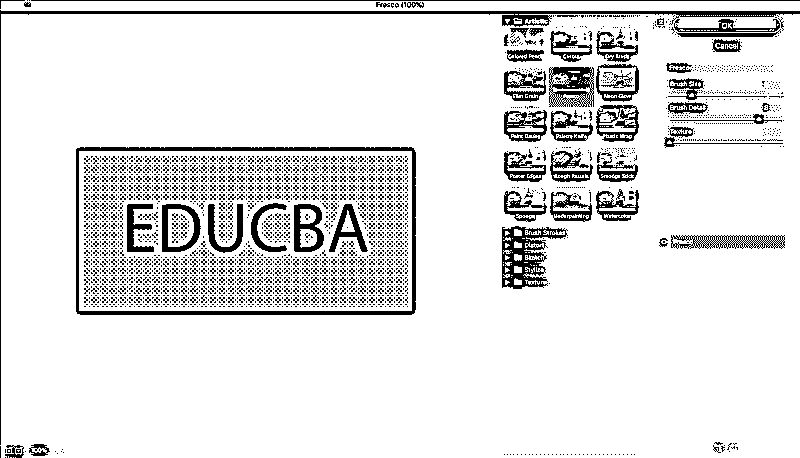
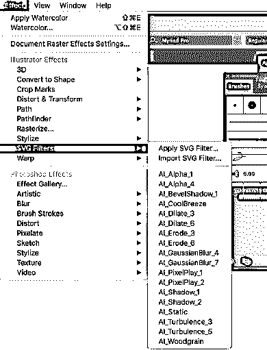
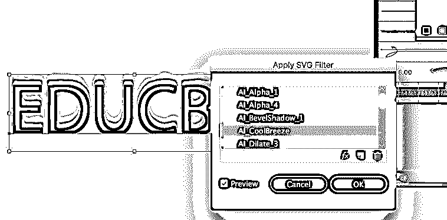
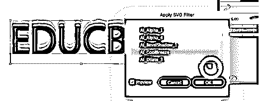
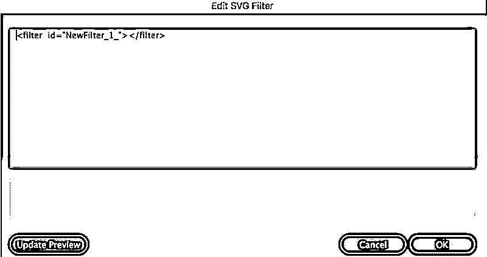

# Illustrator 中的滤镜

> 原文：<https://www.educba.com/filters-in-illustrator/>

## Illustrator 中的滤镜介绍

Adobe Illustrator 利用滤镜和效果在设计层中产生和隔离变更。与摄影滤镜相比，它们是相似的，你可以将图片风格化，使其看起来经典或像插图。虽然 [Illustrator 效果和滤镜](https://www.educba.com/effects-in-illustrator/)是相似的，并且经常使用相同的措辞，但滤镜是对设计的一种持久的改变，它会自动修改设计形式。过滤器涉及追加海报极端，壁画，胶片颗粒和更多。Illustrator 已经将“滤镜”菜单转移到“效果”菜单，现在所有的功能都与外观面板上的效果组合在一起。过滤器记录工艺的持久变化；它们是破坏性的改变，因为当你保存和关闭文件时，你不能撤销结果。

### 如何在 Illustrator 中应用滤镜？

**步骤 1:** 在您的系统上启动 Adobe Illustrator。在仪表板上画点什么或写点什么。这里我们将举一个文本的例子。

<small>3D 动画、建模、仿真、游戏开发&其他</small>

**步骤 2:** 使用选择工具点击您希望添加过滤器的对象或对象集合。选择工具位于左侧的工具面板中。

**第三步:**最新版本的 Illustrator 现在所有的滤镜都生效了。点击效果，然后选择你的过滤器。

Adobe Illustrator 应用程序版本中经常使用的滤镜包括彩色铅笔、壁画、胶片颗粒、风格化、模糊、发光边缘和水彩。

**第 4 步:**为您的过滤器放置替代品。这可能包括从 100 个百分比中选择您希望使用的过滤器数量。例如，如果您选择使用锐化滤镜，您将选择希望 Illustrator 增强图片、插图或文本各部分对比度的百分比。

如果您使用的 Adobe Illustrator 版本中有预览选项，请使用该选项检查应用了新滤镜的对象。点击确定对你的对象进行修改。虽然你可能希望用渐变来测试，但与效果相比，一旦保留了滤镜，图像就会被修改，并且不能撤销。

### 什么是 SVG 滤镜？

可缩放矢量图形(SVG)可以定义为一种基于矢量的文件格式，可用于在网络和便携式小工具上展示插图。您可以在以 SVG 格式保留的插图上注册特定效果。它们实际上是基于 XML 的命令，是在查看器或 web 浏览器中显示 SVG 插图时注册的。

Illustrator 提供了 18 种 SVG 滤镜效果，但是如果您具有编码知识，那么您可以创建自己的 SVG 滤镜。您可以点击“新建 SVG 滤镜”按钮，从头开始创建一个新的 SVG 滤镜效果。此外，您还可以通过使用“应用 SVF 过滤器”对话框中的“删除”图标来消除选定的过滤器。

在 Adobe Illustrator 中，滤镜目前作为效果提供，分为 Illustrator 效果和 Photoshop 效果。这些 photoshop 滤镜只能注册到光栅图像。有一种叫做智能过滤器的东西，它被注册到一个智能对象。智能滤镜的重要性在于，你可以以非破坏性的方式修改设置、隐藏甚至消除它们。

### 创建 SVG 滤镜

您也可以创建在 Adobe Illustrator 中可用的 SVG 滤镜。步骤如下所示:

**第一步:**打开 Adobe Illustrator，打开我们上面用过的同一个例子。

**步骤 2:** 使用选择工具点击您希望添加过滤器的对象或对象集合。选择工具位于左侧的工具面板中。

**第三步:**点击菜单栏中的效果，选择 SVG 滤镜。

**第四步:**接下来，你可以点击应用 SVG 过滤器，然后你会得到一个弹出窗口。

您可以选择您想要的任何滤镜，在“预览”复选框可用的情况下，您可以决定哪个滤镜最适合文本。您也可以创建自己的 SVG 过滤器。单击新的 SVG 过滤器选项，如下所示。

一旦你点击一个新的 SVG 过滤器，你会得到一个窗口，你可以张贴你的过滤器代码和创建一个新的 SVG 过滤器。

Adobe Illustrator 也可以选择导入 SVG 滤镜。你只需要选择效果> SVG 滤镜>导入 SVG 滤镜。然后会出现一个对话框。在对话框中，打开一个具有滤镜效果的 SVG 文件，完成后，Illustrator 会将该滤镜导入到您当前的文件中。

### 结论

滤镜可以用来校正您的图像，注册特殊的艺术滤镜，为您的图片提供绘画或影射的外观，或者利用灯光效果和失真产生独特的修改。第三方开发者提供了一些可作为插件访问的过滤器。对巨大的图片应用滤镜可能会很费时间，但您可以通过在“滤镜”对话框中选择“预览”复选框来检查效果。滤镜库提供了各种特殊效果滤镜的示例。您可以注册多个滤镜，打开或关闭滤镜的效果，重置滤镜的替换选项，以及修改滤镜的注册顺序。当您对预览满意时，您可以将其注册到您的图片中。Adobe Illustrator 还附带了特殊效果滤镜，您可以将这些滤镜注册到浸入式位图图片中，以获得各种效果。

### 推荐文章

这是 Illustrator 中的滤镜指南。在这里，我们讨论了如何在 Illustrator 中应用滤镜以及创建 SVG 滤镜的步骤。您也可以阅读以下文章，了解更多信息——

1.  [水彩画笔面板插画](https://www.educba.com/watercolor-brushes-illustrator/)
2.  [如何在 Illustrator 中插入图片？](https://www.educba.com/insert-image-in-illustrator/)
3.  [Illustrator 中的直接选择工具是什么？](https://www.educba.com/direct-selection-tool-illustrator/)
4.  [在 Illustrator 中使用切片工具](https://www.educba.com/slice-tool-in-illustrator/)
5.  [Photoshop 中的滤镜|使用滤镜](https://www.educba.com/filters-in-photoshop/)
6.  [插图类型指南](https://www.educba.com/types-of-illustration/)
7.  [制作霓虹灯效果的形状和文字](https://www.educba.com/neon-effect-in-illustrator/)

