# Illustrator 中的倒影

> 原文：<https://www.educba.com/reflection-in-illustrator/>

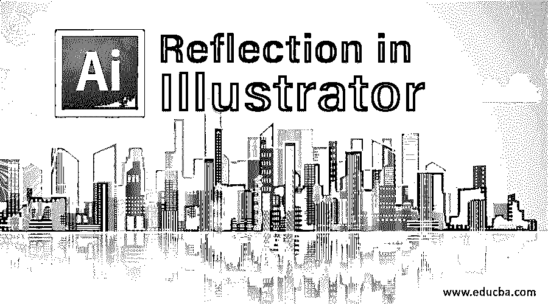

## Illustrator 中的反射介绍

Adobe Illustrator 是用于创建和编辑 2D 艺术品和图形的主要软件之一。它是几乎所有图形设计师、2D 艺术家、3D 艺术家和图像编辑操作的最精确使用的矢量图形程序之一。该程序由 Adobe 公司在全球范围内广泛销售，是 [Adobe Creative Cloud 版本](https://www.educba.com/what-is-adobe-creative-cloud/)的一部分，该版本使团队和小组之间在网络平台上共享艺术品和图形媒体变得更加容易。

Adobe Illustrator 与许多工具和功能相关联。这些工具和功能帮助用户以更简单的方法和高效的工作流程执行任务和活动。Adobe Illustrator 有许多工具和功能可直接用于获得某种结果，而我们使用的一些方法和技术在程序中没有直接可用的工具。

<small>3D 动画、建模、仿真、游戏开发&其他</small>

### 如何在 Illustrator 中创建反射效果？

Adobe Illustrator 没有任何直接的工具或功能来创建反射的效果。这种效果是通过使用反射工具和遮罩功能创建的。区别只是技术和过程中使用的方法相同。第一种技术可能更容易执行，但它很长，需要努力和时间。使用反射命令时，无需浪费任何时间即可获得结果。下面我们将看几幅插图。

#### 插图# 1–使用复制和粘贴命令

**第一步:**在 Illustrator 中打开一个新文档。

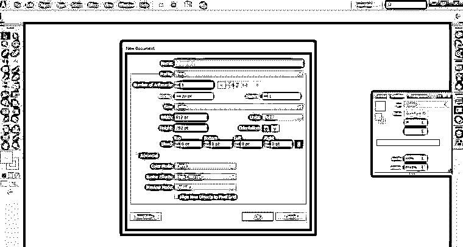

**第二步:**使用文字工具在画板上书写[文本。](https://www.educba.com/artboard-in-photoshop/)

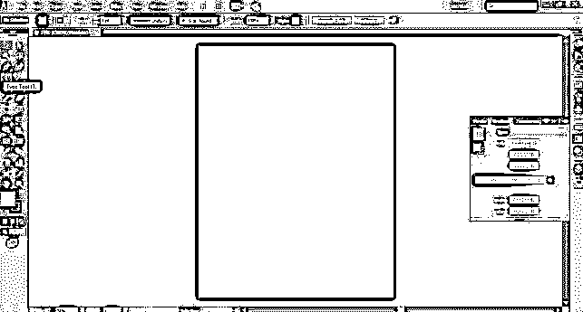

在画板上写下教育内容，如下所述。

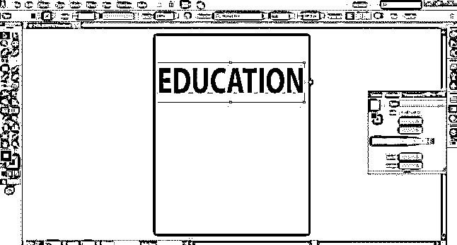

第三步:进入编辑菜单，点击复制命令。

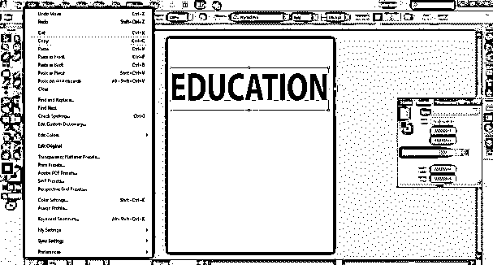

**第四步:**接下来，点击粘贴到位命令。

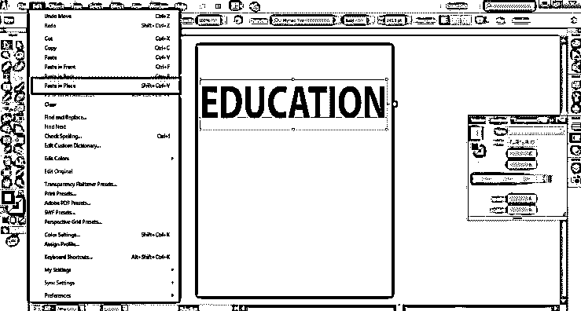

**第五步:**接下来，把复制的文字往下带。如下图所示。

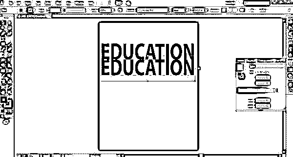

**第六步:**现在使用选区工具，将文字反转，如下图所示。

**第七步:**进入窗口选项，使用透明功能。

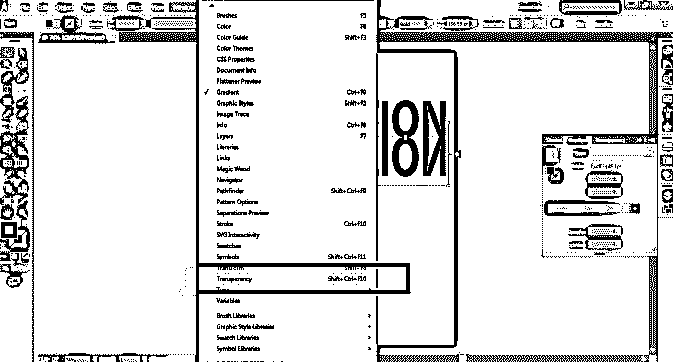

第八步:点击不透明度选项，减少 50%的不透明度。如下图所示。

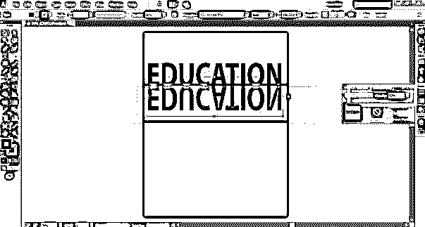

步骤 9: 使用这个简单的方法创建一个反射效果。虽然，结果并不完全是我们所渴望的。但是，它仍然可以用于快速和快速的效果。

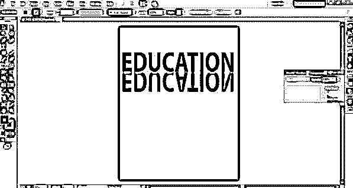

#### 插图# 2–使用反射和旋转命令

**第一步:**在 Illustrator 中打开一个新文档。

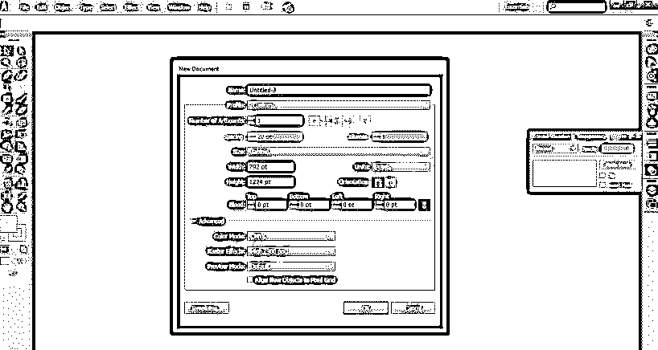

**第二步:**使用文字工具，在页面上写下发展。

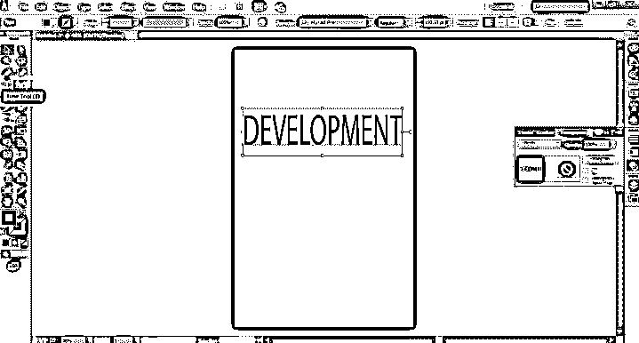

**第三步:**将文字加粗，如下图所示。

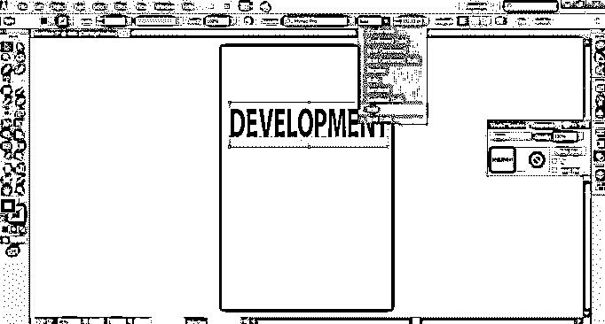

**第四步:**右击文本，进入转换选项。

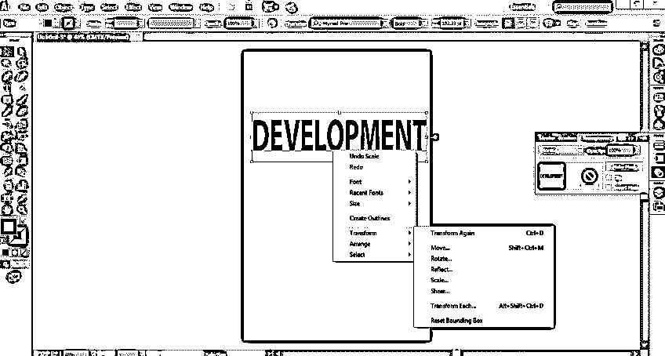

**第五步:**从菜单中选择反射选项。

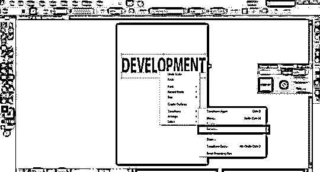

**第六步:**会出现一个对话框。从轴菜单中选择水平选项，并点击复制按钮。

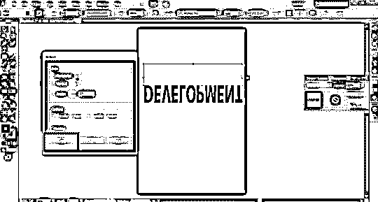

这将创建文本的反射副本，如下图所示。

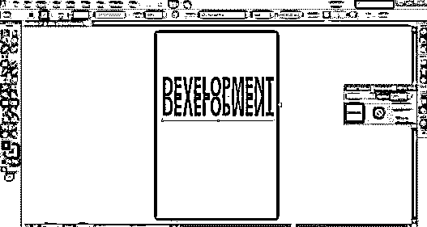

**步骤 7:** 现在，转到窗口选项，点击透明度选项卡。

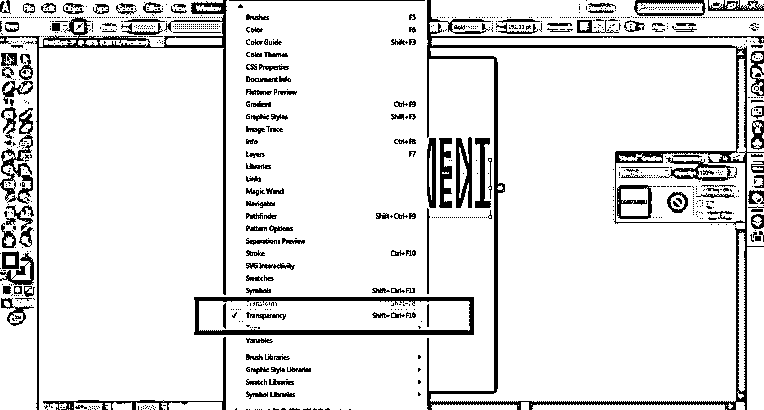

**第八步:**现在，我们将看到制作蒙版的选项。单击该选项。

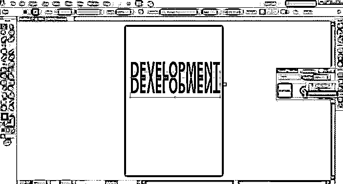

**第九步:**接下来，关闭 clip 选项上的勾号，如下图所示。

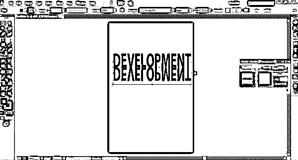

**第十步:**接下来，从菜单中选择蒙版选项。

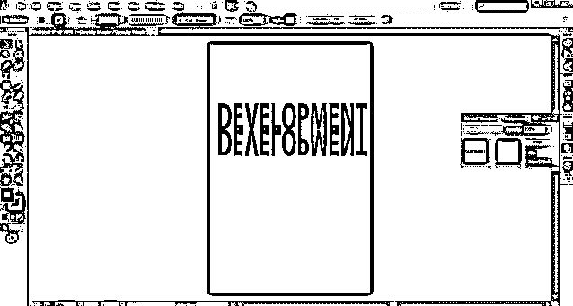

**步骤 11:** 使用工具栏中的矩形工具创建一个矩形，如下图所示。

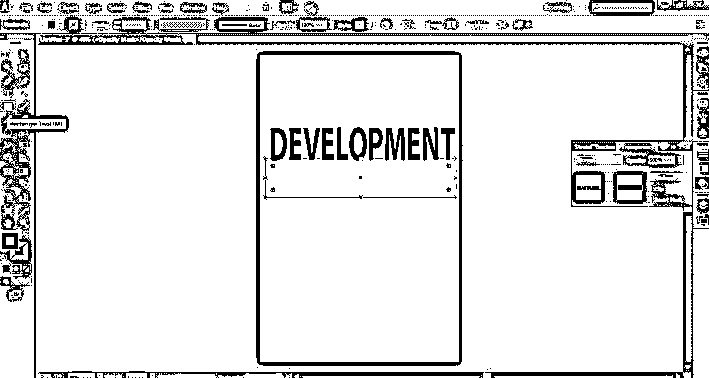

步骤 12: 现在，进入窗口，点击渐变选项。

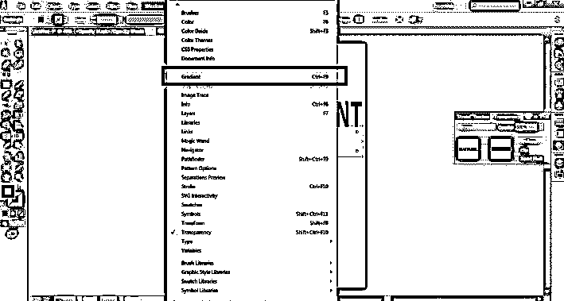

**步骤 13:** 从面板中选择一种渐变颜色，所选文本上已经创建了反射效果。

**步骤 14:** 我们可以随时改变倒影的颜色。此外，我们可以根据需要将渐变类型更改为线性或径向。

**步骤 15:** 最终的反射效果如下图所示。

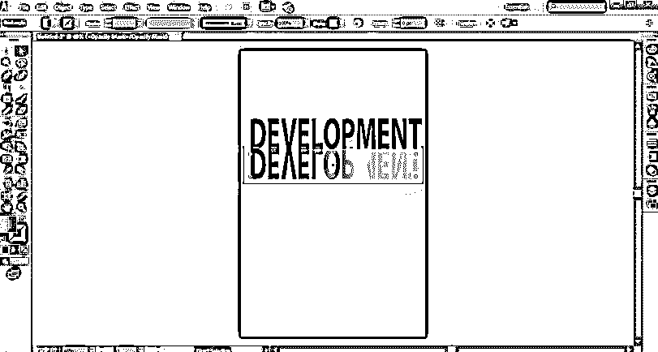

Adobe Illustrator 没有创建反射和阴影的直接工具。我们需要创造一种方法和技术来达到预期的结果。尽管例 1 中所示的练习并不完全符合给予文本反射效果的想法。但是，这是一个更容易和更快的方式来实现同样的目标。而在示例 2 中，我们完全达到了效果，创建的图像似乎给出了完美的反射效果。但是，创造这个结果肯定需要时间和努力。

在使用示例 2 时，我们还需要熟悉遮罩的功能，以及如何同时创建和编辑遮罩。用户在使用这个练习时可能会有点困惑，但这是创建完美反射效果的唯一方法。

### 结论

总之，建议使用示例二中所示的练习，而不是示例一，因为与示例一相比，它将提供完美无瑕的效果。此外，由于 Adobe Illustrator 是矢量软件，并且在 CMYK 模型上工作，因此用户通过使用类似工具和功能的组合来创建如此完美的效果并不困难。当我们没有直接的工具来获得某种效果时，我们总是混合使用工具和功能来获得完美的结果。

### 推荐文章

这是 Illustrator 中的反射指南。这里我们讨论使用复制粘贴，反射和旋转命令在 illustrator 中创建反射的步骤。你也可以看看下面的文章来了解更多-

1.  [如何在 Illustrator 中栅格化对象？](https://www.educba.com/rasterize-in-illustrator/)T3】
2.  [使用直尺工具测量角度](https://www.educba.com/ruler-tool-in-photoshop/)
3.  [在 After Effects 中创建 2D 动画](https://www.educba.com/2d-after-effects-animation/)
4.  [Adobe speed grade 软件的特性](https://www.educba.com/adobe-speedgrade/)
5.  [学习插图的类型](https://www.educba.com/types-of-illustration/)
6.  [在 Illustrator 中创建霓虹灯效果](https://www.educba.com/neon-effect-in-illustrator/)

