# Illustrator 中的霓虹灯效果

> 原文：<https://www.educba.com/neon-effect-in-illustrator/>

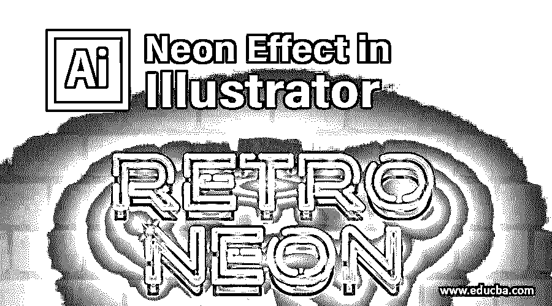

## Illustrator 中的霓虹灯效果介绍

霓虹效果为您在 Illustrator 中创建的任何形状或文本提供一种发光的效果。要使用笔画混合产生霓虹效果，需要产生两个明确的部分。第一部分是霓虹灯管，这可以被认为是好的，但它并没有真正的霓虹灯效果。第二个部分是背景中管子的反射，它通常表现为发光区域。这两种不同的混合物提供了霓虹灯的幻影。

首先，产生霓虹效果只需要创建混合对象的两个副本。前面的复制需要一个混合，顶部对象有一个更轻的笔画粗细和一个更亮的颜色来模仿霓虹灯管的光芒。背面的复制品使用了更宽的笔触，并与背景的深色相结合。当背景非常暗的时候，霓虹灯的效果会更好，尽管一些引人入胜的效果也可以在亮的背景下获得。

<small>3D 动画、建模、仿真、游戏开发&其他</small>

### 如何在 Illustrator 中创建霓虹效果？

下面我们将用两种不同的方法在 illustrator 中创建一个霓虹灯效果；形状效果和文本效果:

#### 使用形状创建发光的霓虹灯效果

**步骤 1:** 使用深色或黑色背景可以有效地显示霓虹灯效果。通过绘制一个矩形并用黑色填充来产生一个黑色背景。使用钢笔工具(同样，如果你想徒手画，画笔或铅笔工具也可以)，画出一个有轮廓的正方形。在这个例子中，我们正在绘制一片树叶。将刚才的笔画设置为白色；此外，确保没有填充。

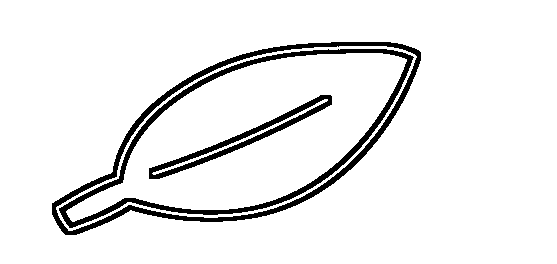

第二步:在选择工具的帮助下，选择你刚刚创建的形状。点击对象>路径>简化，一旦出现简化菜单，点击预览选项。

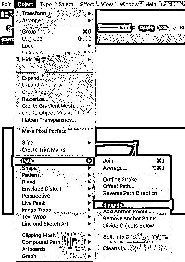

然后使用曲线精度百分比进行评估，直到您决定形状是否平坦，就像霓虹灯管一样。在这种情况下，我们将曲线的精度设置为 65%。

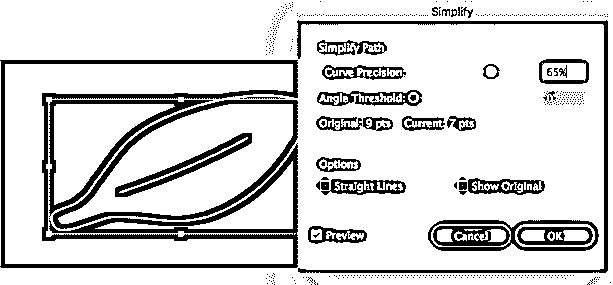

**第三步:**选择图层窗口中的图层，然后点击右上角的小选项，如下图所示。接下来，您将看到一个菜单，您可以在其中选择重复的选项。再次重复这一步，这样你就有了三个不同的图层，每个图层上都有你创建的形状。将这些层标记为一层、两层和三层，其中一层是其下一层的第二层，然后是两层、三层，如下所示。

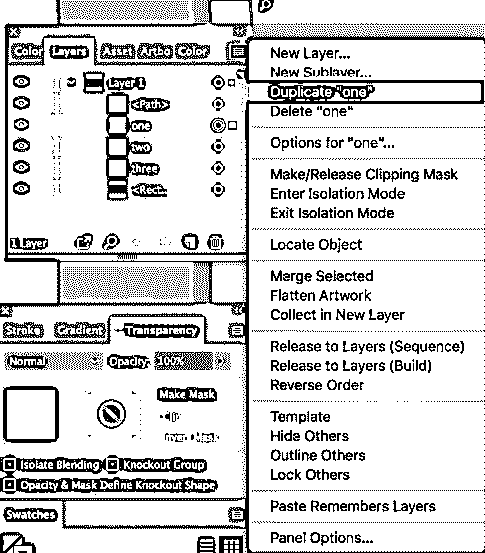

**步骤 4:** 点击图层窗口中与第三层和第二层相对的眼睛图标，可以关闭第三层和第二层的可见性。借助选择工具选择图层一上的形状，并将描边的颜色修改为饱和的深色调。在这种情况下，我们选择暗黄色。您可以将笔画窗口中的笔画宽度提高到 10 磅。你也可以点击>窗口到达那里。

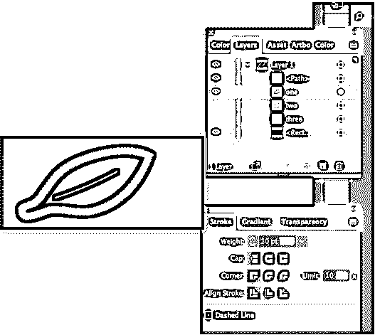

第五步:现在，选择你创建的形状。

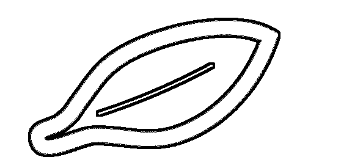

**第六步:**接下来，点击效果，然后模糊和高斯模糊如下图。

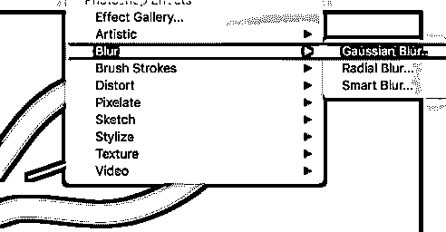

**第七步:**高斯模糊窗口出现，半径设为 3 点，点击 OK。这将赋予你的形状发光的霓虹灯效果。

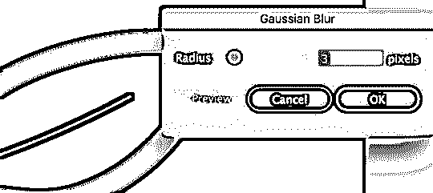

现在，打开第二层的可见性。选择这一层的形状，然后修改它的宽度为 4 磅，并确保颜色是一个你在第 4 步选择的苍白版本。

接下来，打开第三层的可见性。选择这一层的形状，这里你可能需要放大树叶来选择想要的线条。修改笔画的宽度为 1 磅，设置颜色为步骤 4 中选择的颜色的一个更苍白的版本。

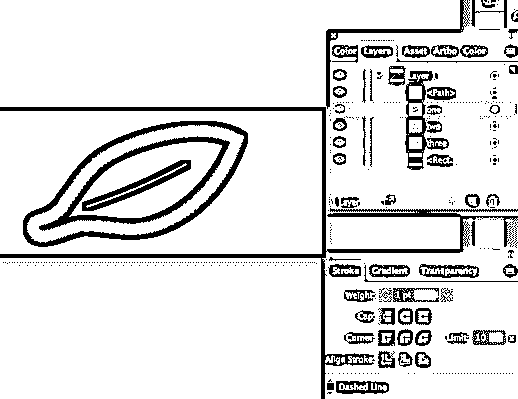

这样，您可以在 Adobe Illustrator 中的形状上产生霓虹灯效果。

#### 在文本上创建霓虹灯效果

**第一步:**画一个长方形，用黑色填充。选择文字工具，写一些文字，并把它放在矩形。确保文本的笔画现在是白色的。

**第二步:**将文字的笔画颜色改为洋红色。

第三步:接下来，选择文本，点击输入并创建轮廓，将文本转换成形状。

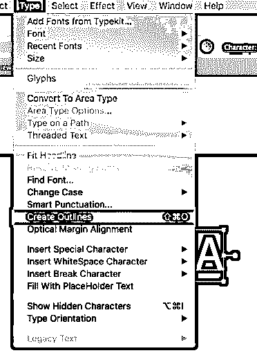

**第四步:**在选择工具的帮助下选择文本，然后点击对象，然后点击路径和偏移路径，设置一个负的偏移值(本例中为-5)，点击 OK。这里的目标是产生一个更好的文本副本，并在原始字母内进行调整。

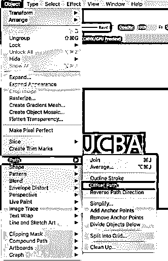

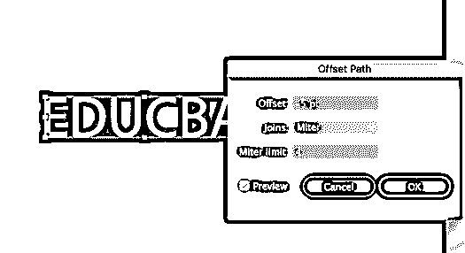

第五步:接下来，选择较暗的洋红色字母，点击效果，然后模糊和高斯模糊，并定义一个值，使每个字母周围的洋红色发光。

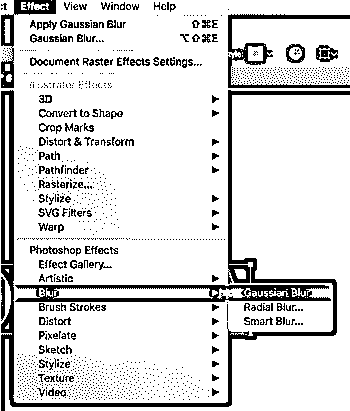

第六步:根据你想要的字母周围的发光效果改变模糊值。

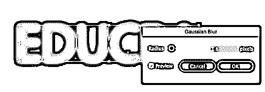

**第七步:**最终图像。

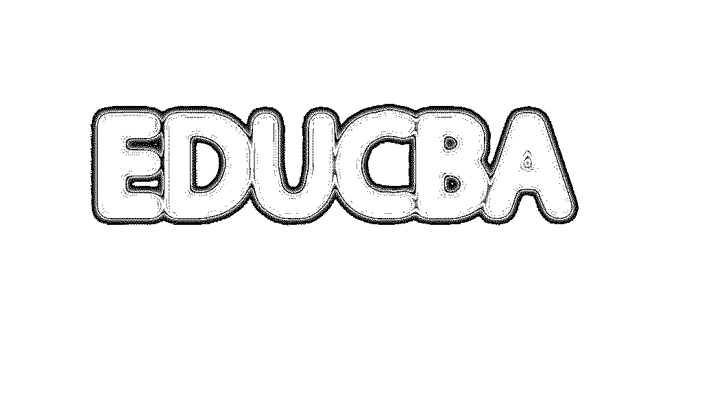

这样，您可以在 Adobe Illustrator 中的文本上产生霓虹灯效果。

### 结论

霓虹灯效果已经退出市场好几年了，但就在几年前，它又重新受到流行文化的欢迎。霓虹色将我们带回到 80 年代，但它们也有明显的现代感。夜晚黑暗的天空下可以看到霓虹效果的标志，所以建议在你的插图中战略性地使用黑色。明亮的颜色会令人眼花缭乱，所以要小心选择。霓虹效果只需要两到三种颜色。霓虹效果的关键是保持简单，所以当你使用霓虹效果时，保持形状简单，因为图像的光泽和丰富。霓虹灯效果产生了自己的宣言，所以不需要过于复杂的构图。利用霓虹灯画的适度也有一个实用的意图；霓虹灯画通常有很大的文件，所以不要用不需要的信息来增加构图的负担。

### 推荐文章

这是 Illustrator 中霓虹灯效果的指南。这里我们讨论如何用两种不同的方法在 illustrator 中创建霓虹灯效果；形状效果和文字效果一步步来。您也可以浏览我们的其他相关文章，了解更多信息——

1.  [如何在 Illustrator 中应用滤镜？](https://www.educba.com/filters-in-illustrator/)
2.  [如何在 Illustrator 中创建透明效果？](https://www.educba.com/transparent-in-illustrator/)
3.  [Adobe Illustrator 的吸管工具](https://www.educba.com/eyedropper-tool-in-illustrator/)
4.  [Illustrator 中的反射效果](https://www.educba.com/reflection-in-illustrator/)

