# 在 Illustrator 中创建表格

> 原文：<https://www.educba.com/create-table-in-illustrator/>

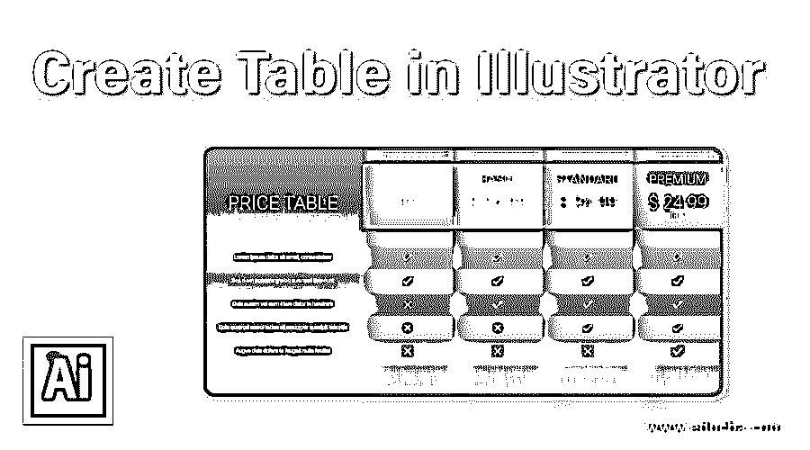

## 在 Illustrator 中创建表格的介绍？

在 adobe illustrator 中创建表格非常简单容易；在处理基于客户的项目时，提供与该特定项目相关的一些重要参数的信息变得很重要。illustrators 中的表格有助于您以有组织的方式管理和呈现特定项目的任何数据。在本文中，我们将分析在 adobe illustrator 中创建表格的不同方法，并介绍表格的重要参数。

### 创建表的方法

为了在 adobe illustrator 中创建表格，我们必须经历一些简单的步骤。让我们开始学习在 adobe illustrator 中创建表格的方法。这里我们将讨论在 illustrator 中创建表格的两种方法。

<small>3D 动画、建模、仿真、游戏开发&其他</small>

#### 方法 1–使用线条工具

**步骤 1:** 首先，从该软件菜单栏部分的“文件”菜单中选择一个“新文档”，该菜单位于工作屏幕的最顶端。

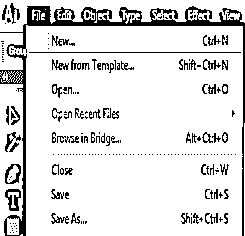

**第二步:**新文件箱将打开。根据您的要求对新文档的参数进行设置，然后单击此框的“创建”选项卡以应用设置。

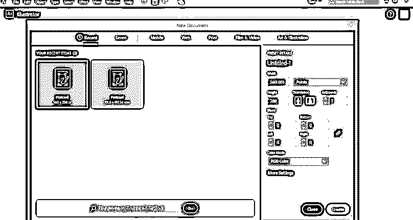

第三步:我们将使用线条工具创建表格。为此，去这个软件的工具面板，从这里选择“线段工具”，或者你可以使用快捷键“\”。

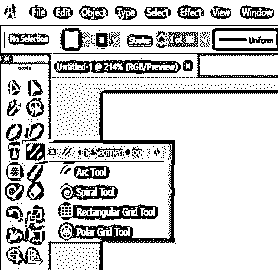

**第四步:**现在，按照我画的画两条平行线。画线时按住键盘上的 Shift 键，这样直线就可以是一个画。

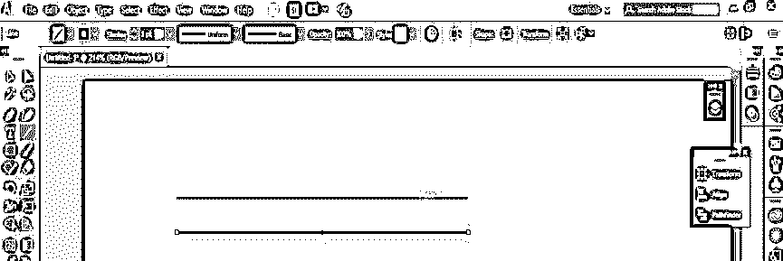

第五步:现在选择两条线。

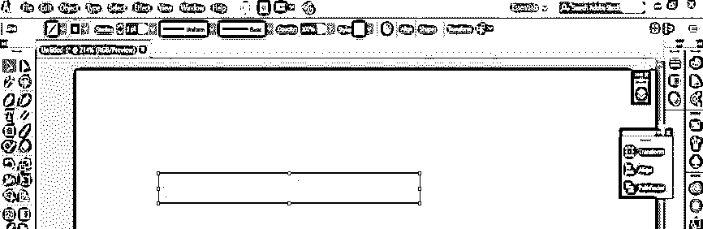

**步骤 6:** 按住 shift 和 Alt 键拖动这些线条，以直线距离复制它们。

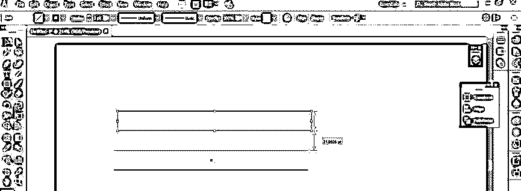

**第七步:**现在按 Ctrl + D 键，将这些线条复制多份。

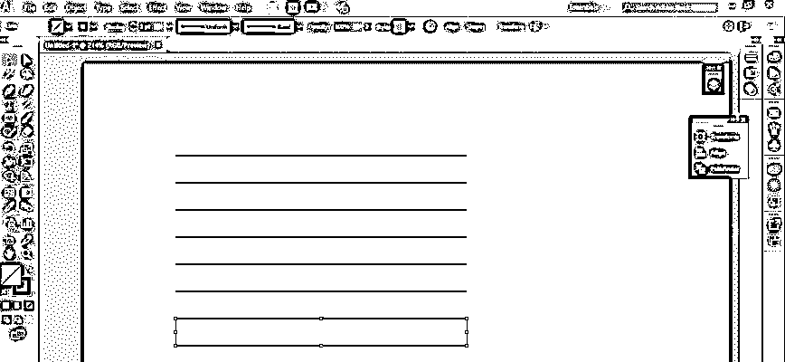

步骤 8: 现在，再次使用线条工具，画一条垂直线，连接水平线的两端，以此制作一个表格。

**第九步:**现在，通过向另一个方向拖动来复制这条线。按住 shift 键进行正确对齐，按住 Alt 键复制该行。

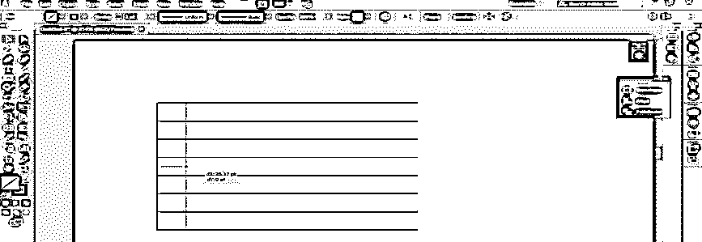

**第十步:**现在按 Ctrl + D，将制作表格的行复制多份。

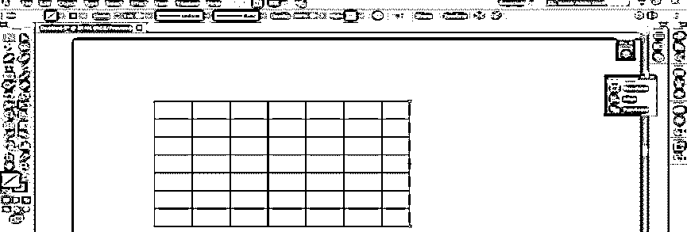

**第十一步:**这样，你就可以利用表格适当的参数来制作表格了。现在从工具面板中选择文字工具。

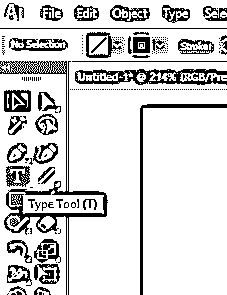

第 12 步:现在，在键盘的帮助下，在这里输入你想要的文本。

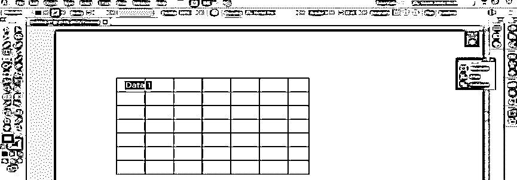

**第十三步:**复制这段文字。要制作副本，选择该文本，按住 shift & Alt 键拖动它

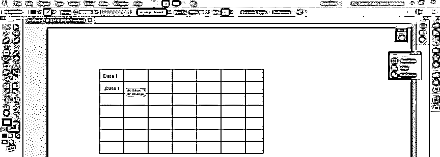

**步骤 14:** 现在按 Ctrl + D 键，将此文本复制多份。

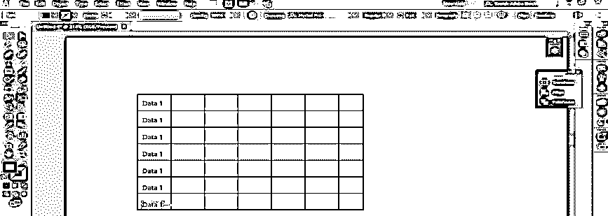

**第十五步:**在表格的水平方向复制数据。

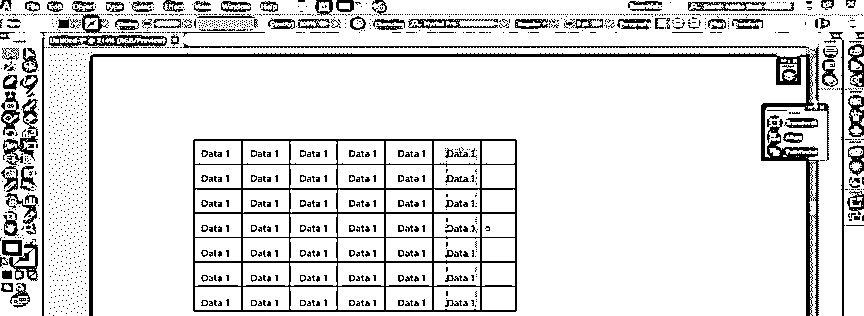

这样，你就可以用这个软件的 Line 工具做一个表格，在文字工具的帮助下把你想要的数据填进去。

#### 方法 2–矩形网格工具

现在，让我们看看在 illustrator 中创建表格的下一个方法。到这个软件的工具面板，从这里选择“矩形网格工具”。

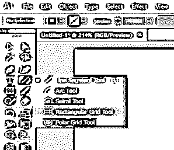

**步骤 2:** 现在点击文档区域的任意位置，给出表格的参数。单击时，将打开“矩形网格工具选项”对话框进行参数设置。在这里，您可以指定表格单元格的大小，通过给定水平分隔线选项的值来指定行数，通过给定垂直分隔线选项框的值来指定列数。

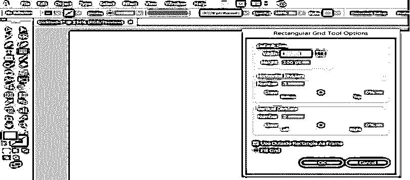

**步骤 3:** 现在按下该对话框的确定按钮，应用设置。

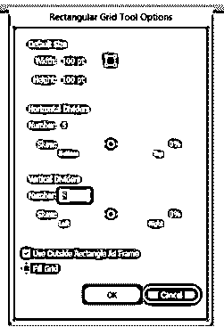

第四步:你的桌子将会是这样的。

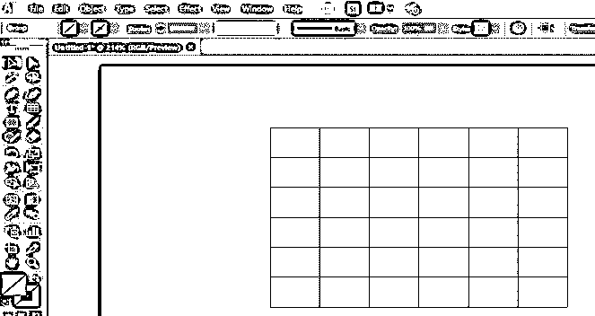

**第五步:**你通过这个网格的笔画选项来增加或减少这个网格的笔画宽度。

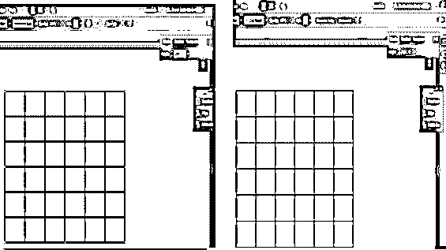

第六步:我将它的宽度设为 1 磅。你可以根据你的情况来拿。

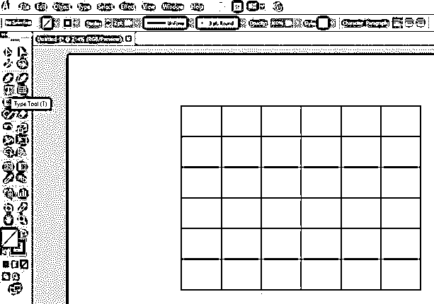

步骤 7: 现在，从工具面板中选择文字工具，输入文字。

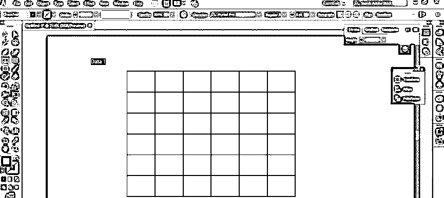

确保你输入的文本在顶层。要在顶层拍摄，请转到菜单栏的对象菜单。将打开一个下拉列表，转到“排列”选项，并从新的下拉列表中选择“置于顶层”选项。

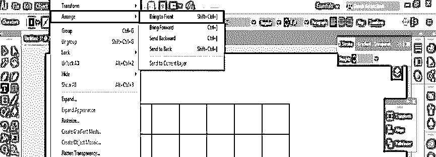

**步骤 9:** 现在，将此文本放到表格的一个单元格中，并在此文本的序列中键入更多文本。

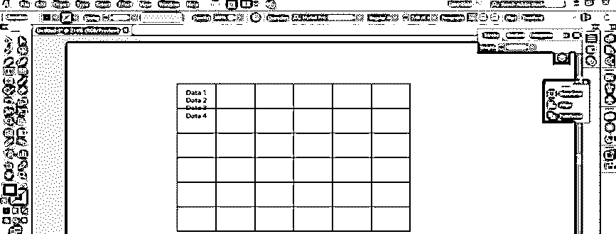

**步骤 10:** 现在选择所有文本，按 Ctrl + T 打开字符属性框。通过增加此特征属性框选项的值来增加文本之间的垂直间距。

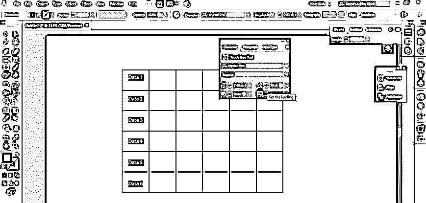

**步骤 11:** 现在横向复制数据。

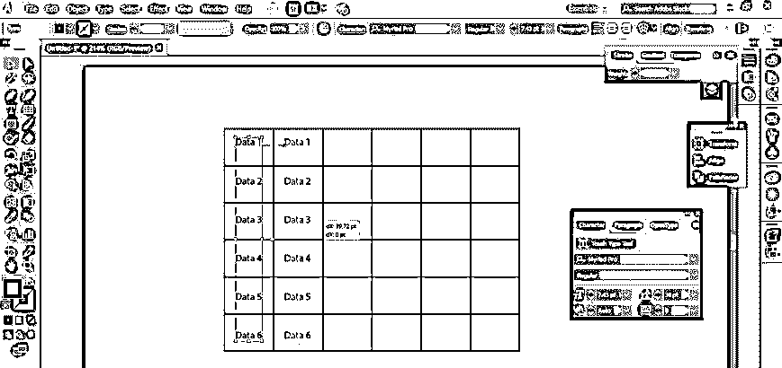

**第 12 步:**按 Ctrl + D 键，用数据填充表格。

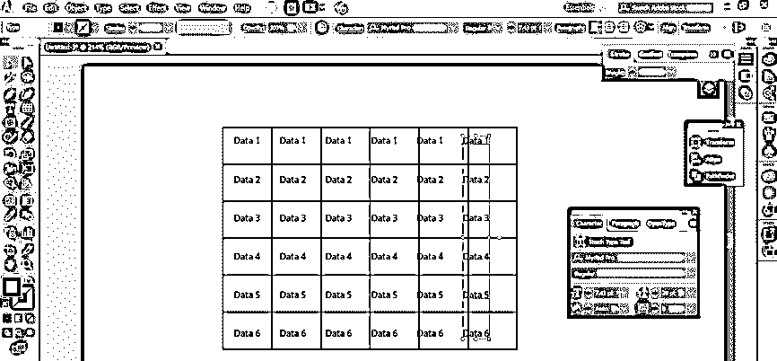

**步骤 13:** 在这里，你可以看到每一列中的数据都不在适当的距离上。那么我们应该做些什么来解决这个问题呢？

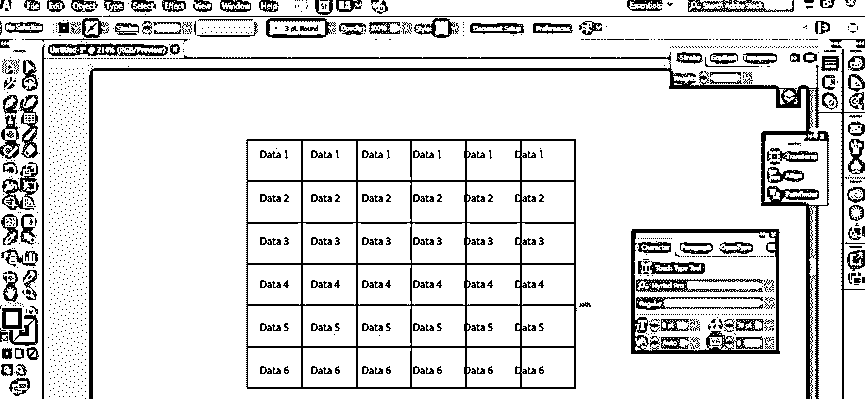

**第十四步:**答案很简单。选择所有数据并打开对齐属性框。从这里选择“水平分布中心”选项。

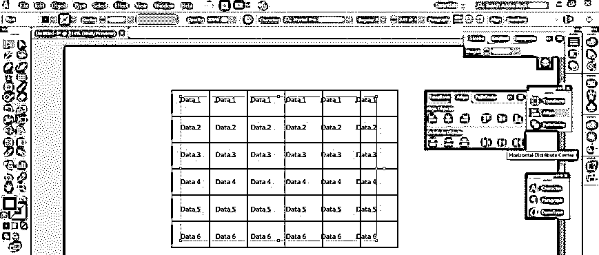

**第 15 步:**你的数据在表格的每一列都会这样对齐。

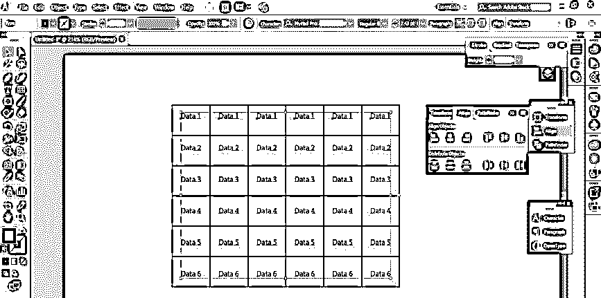

**第 16 步:**现在选择任意数据，用你需要的数据替换。

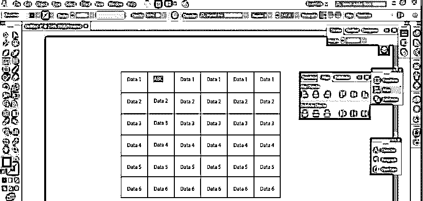

**第十七步:**你可以在这个表格中填充颜色。对于填充颜色，请单击此表格颜色面板的前景色框。将打开一个对话框，从这里选择您想要的颜色。

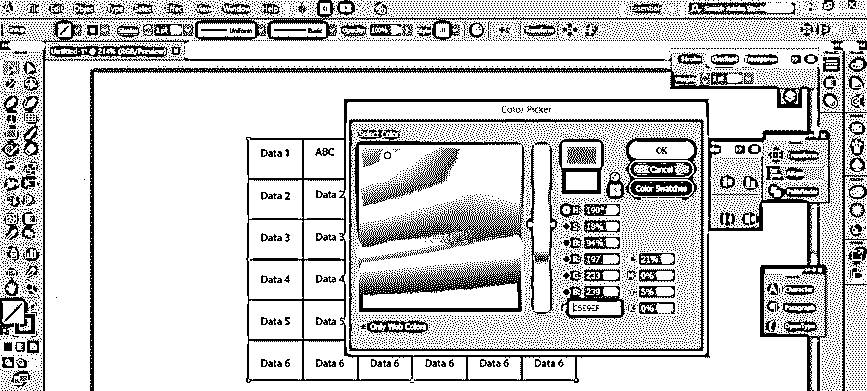

**第 18 步:**按下此框的 Ok 按钮。

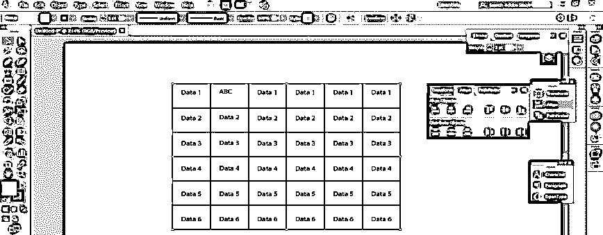

**第十九步:**你还可以改变这个表格的笔画颜色。只需点击颜色面板的笔画颜色框，并从打开的颜色框中选择您想要的颜色。

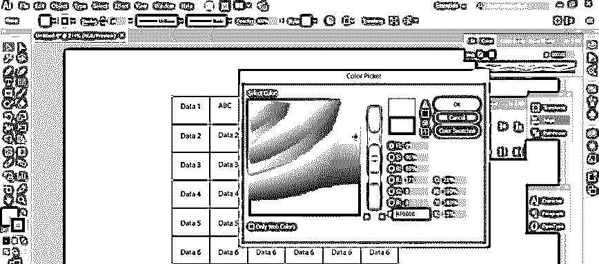

**步骤 20:** 按下此框的 Ok 按钮。

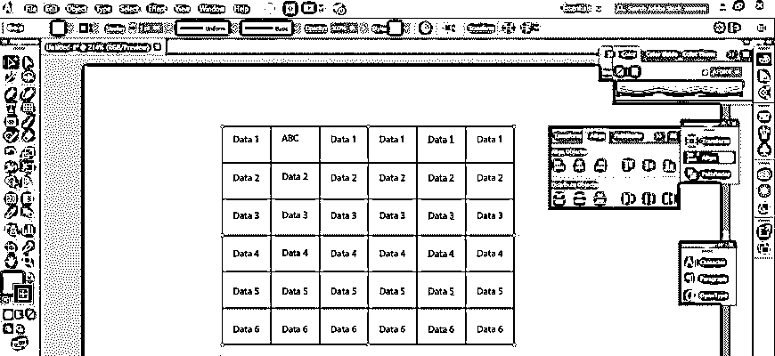

**步骤 21:** 你可以单独改变任何特定单元格的颜色。为此，选择表格并从工具面板中选择“实时油漆桶工具”。

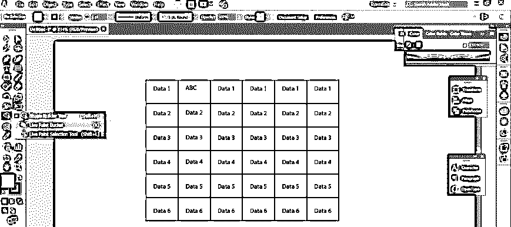

步骤 22: 现在用这个工具点击你想要改变颜色单元格。

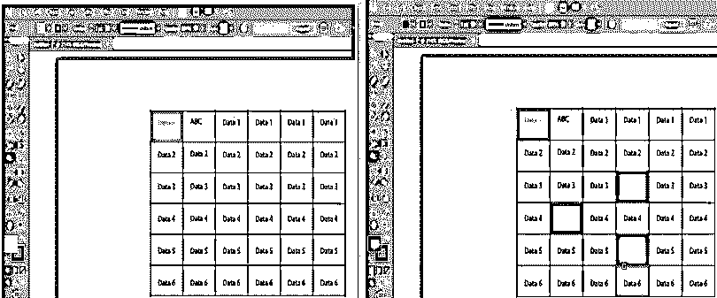

### 结论

阅读完本文后，在 Illustrator 中创建表格对您来说将不再困难，您可以在项目工作中利用这些方法来创建表格，使其更加专业。该表肯定会帮助你在专业项目中管理数据。

### 推荐文章

这是一个在 Illustrator 中创建表格的指南。在这里，我们讨论的基本概念，两种不同的方法来创建一个简单的一步一步的方式在 illustrator 表格。您也可以浏览我们的其他相关文章，了解更多信息——

1.  [Illustrator |中的吸管工具如何使用？](https://www.educba.com/eyedropper-tool-in-illustrator/)
2.  [如何在 Illustrator 中添加纹理？|示例](https://www.educba.com/how-to-add-texture-in-illustrator/)
3.  [在 Illustrator 中创建徽标的教程](https://www.educba.com/how-to-make-logo-in-illustrator/)
4.  [Adobe Illustrator 中的反射效果](https://www.educba.com/reflection-in-illustrator/)

