# Illustrator 中的纸张纹理

> 原文：<https://www.educba.com/paper-texture-in-illustrator/>

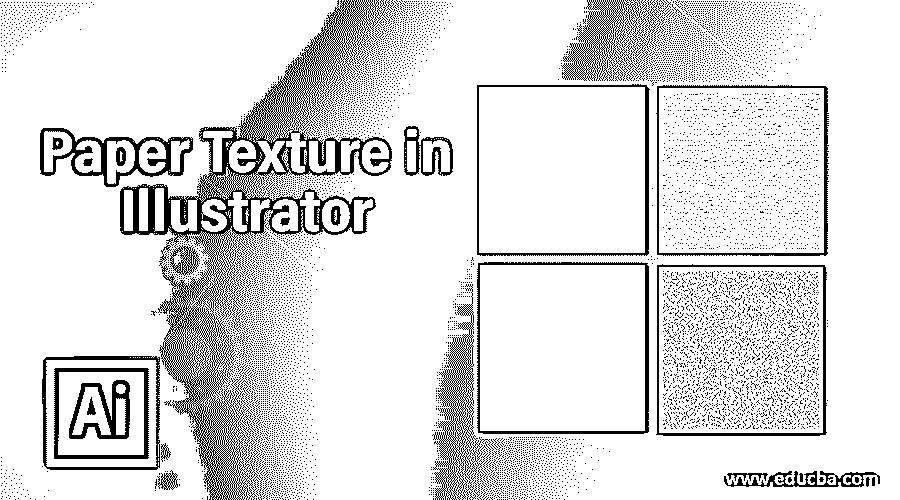

## Illustrator 中的纸张纹理介绍

纸张纹理是它最好的特征之一，这有助于不同类型的平面设计工作。纸张纹理 Illustrator 被称为插图，它使用真实世界纸张效果的自然感觉，并帮助您理解特定插图的目的。使用纸张纹理，您可以制作高度专业的插图作品，并将其用作任何面向主题的图形的基础理念。

在本文中，我们将了解“什么是纸质插画？”并学习“如何在 illustrator 中应用纸张纹理？”用一个非常简单而激动人心的例子。你可以在你的项目工作中使用这种纸张纹理的想法来使你的项目更有效。

<small>3D 动画、建模、仿真、游戏开发&其他</small>

### 如何在 Illustrator 中创建纸张纹理？

这对你来说是个大问题吗？现在不要担心这个问题的答案，在这篇文章之后，你就不会再有问题了。你只要坚持这篇文章，你会在文章的最后找到解决这个问题的简单方法。现在让我们开始学习用几个简单的步骤创造纸纹理。步骤如下。

**第一步:**进入 illustrator 工作屏幕顶部菜单栏的文件菜单。从下拉列表中选择“新建”选项，在该软件中创建“新建”文档。

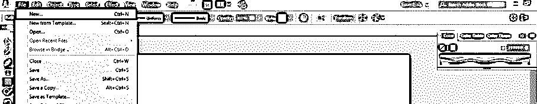

**第二步:**现在转到工具面板部分，在这个软件的工作屏幕的左侧，从工具面板的列表中选择矩形工具。

**第三步:**借助本软件的这个矩形工具制作一个矩形。确保矩形将完全覆盖文档的区域。

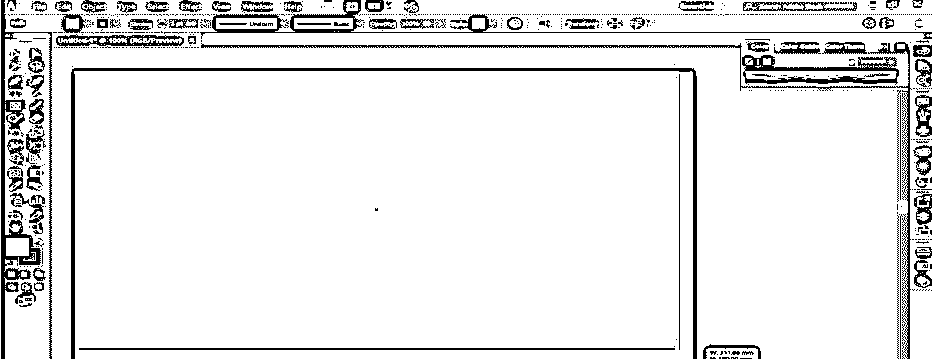

**步骤 4:** 现在点击这个矩形的填充颜色框，它位于工具面板部分的底端。将会打开一个颜色选择器框。选择 2%的黑色搭配浅灰色的白色。你可以选择任何其他颜色的纸张纹理。

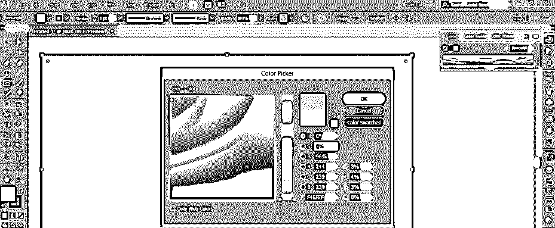

**第五步:**进入菜单栏的效果菜单，在工作区的最上方。将会打开一个下拉列表。转到该列表的纹理选项，并从新建下拉列表中选择纹理选项。

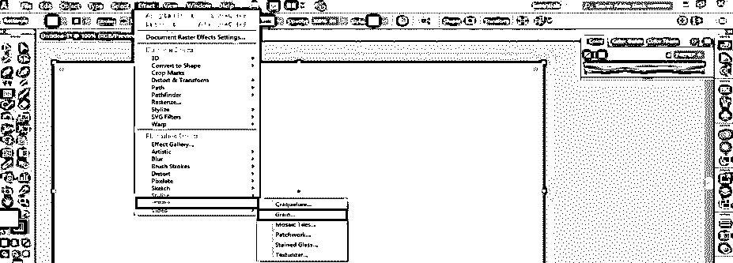

**第六步:**点击下拉列表的纹理选项，纹理选项的纹理框会打开。

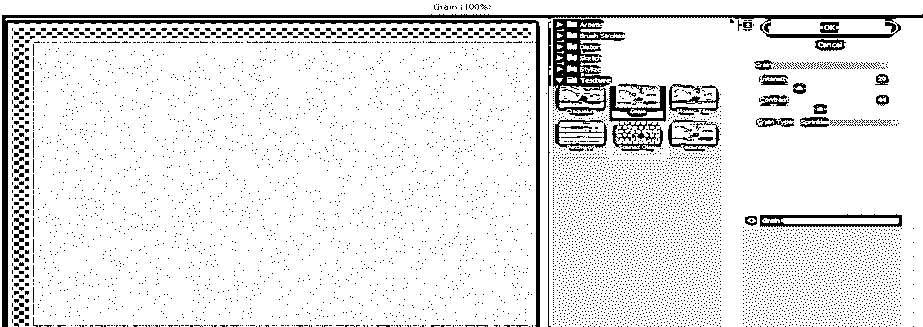

**第七步:**这里在纹理效果的颗粒选项中，我们有很多不同类型的选项。单击颗粒选项的下拉箭头。此处将打开一个下拉列表。通过点击选择“便条纸”样式的纹理效果。

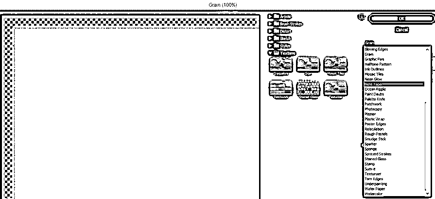

**步骤 8:** 当您选择“便笺纸”选项时，纸张的纹理将出现在您的文档区域。为了增强这个纹理的细节，我们将在这个选项的参数中做一些设置。

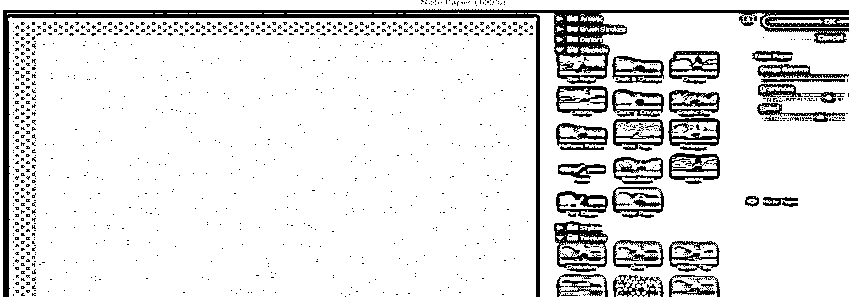

**步骤 9:** 让我们对该选项的参数进行一些更改。将“图像平衡”值设置为 47，以获得纸张纹理的自然效果。

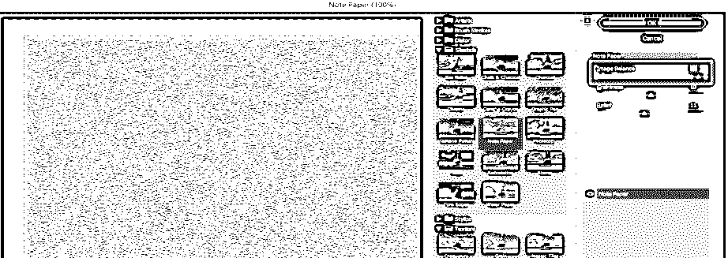

**第十步:**现在把‘颗粒度’的值提高到 6。颗粒度是指任何纹理中颗粒的密度。如果颗粒度的值越小，那么颗粒的密度就越小。

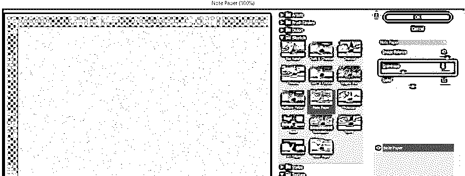

**步骤 11:** 而当你增加这个属性的值时，纹路的密度也会增加，纹理看起来就是这样。你可以根据你来调整颗粒度的数值，适合你想要的纹理。

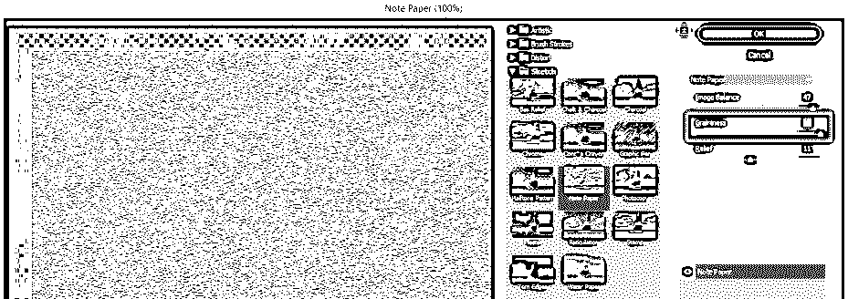

**步骤 12:** 下一个参数是“便笺”样式的浮雕。你可以根据你增加和减少救济的价值。当您增加或减少其值时，浮雕会使纹理结构的细节变亮或变暗。

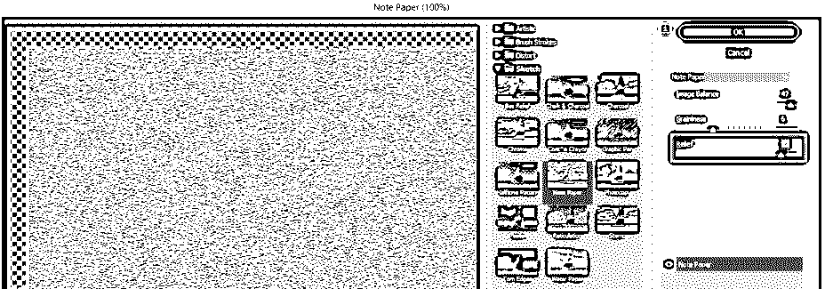

**步骤 13:** 这是便签纸样式的最终纸张纹理。现在你可以在你的插图或图形设计工作中使用这种纸纹理，并利用这些特性制作一个有效的项目。

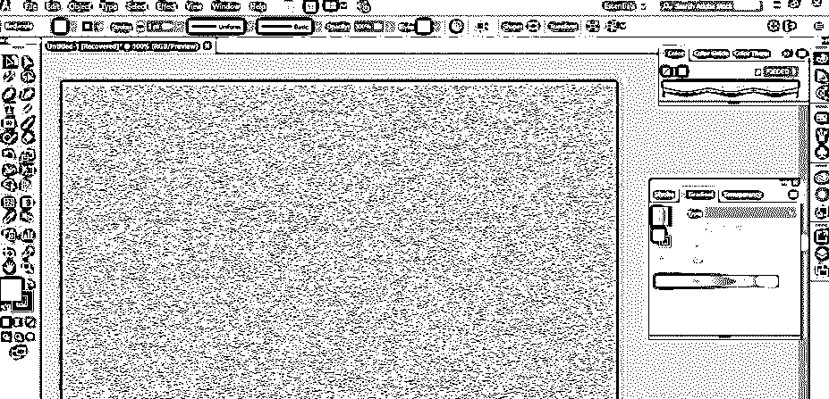

**第 14 步:**现在，我再给你介绍一种纸质纹理风格。你也可以在 adobe illustrator 中使用这种风格作为纸张纹理，水纸风格。同样，对于水纸风格，请转到菜单栏的效果菜单，并转到下拉列表中的纹理。再次选择纹理选项。

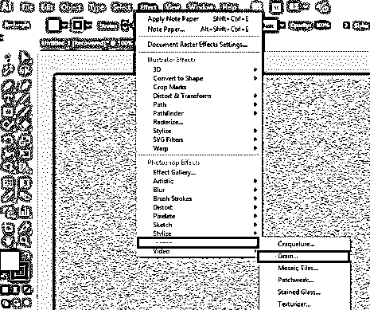

**步骤 15:** 现在点击纹理样式选项的向下箭头键，从下拉列表中选择水印纸样式。

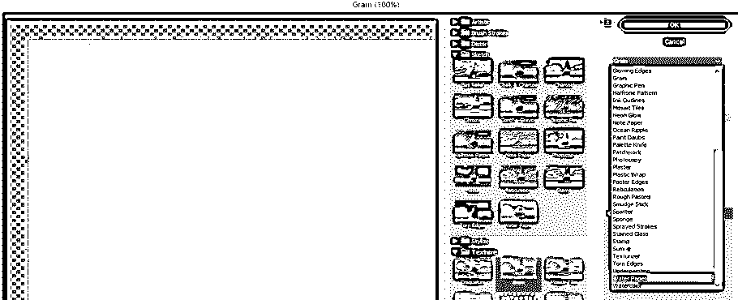

**第十六步:**我们在这个纹理中也有一些参数。纤维长度是这种风格的重要属性之一。当您减小纤维长度的值时，纸张上的纤维标记看起来像是随机排列的。

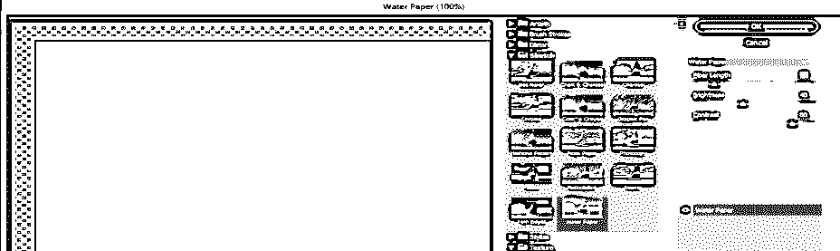

**第 17 步:**当你增加纤维长度的值时，它会给纸张一个光滑的结构，就像这样。

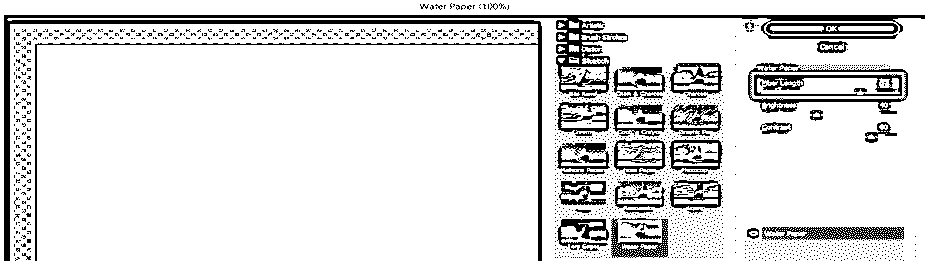

**第 18 步:**你可以根据自己设定这种风格的亮度。当您增加亮度值时，纸张颜色的外观会变浅。

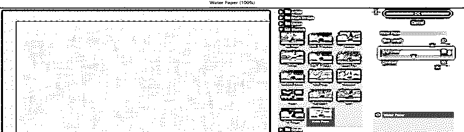

**第 19 步:**当你降低亮度值时，它会给你变暗的外观。

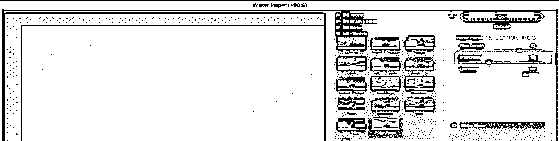

**第二十步:**第三个是对比。对比度增加和减少纸张颜色的平滑度。通过改变对比度的值，您可以根据自己的要求进行调整。

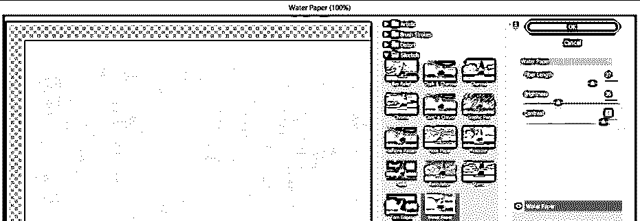

**步骤 21:** 这是最终的水纸纹理。您也可以使用这种纹理作为任何艺术品的基础，并利用其质量来增强您的作品的外观。

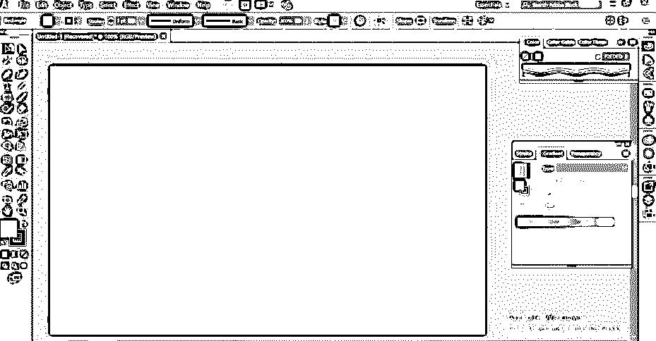

这样，您就可以在 adobe illustrator 软件的图形工作中添加纸张纹理。您可以借助该软件的一些工具和功能制作自己的纸张纹理。通过在你的作品中加入纸张纹理，你可以用自己的想法来操纵它。

### 结论

看完这篇文章后，现在你知道了 Paper Texture illustrator，你可以在你的图形工作中使用它，让你的工作更有效地达到它的真正目的。您可以通过分析 illustrator 的这一功能的各个方面来掌握它。

### 推荐文章

这是 Illustrator 中的纸张纹理指南。在这里，我们讨论了介绍和如何创建纸张纹理在 Illustrator 的方面和特点。您也可以浏览我们的其他相关文章，了解更多信息——

1.  [在 Illustrator 中创建表格](https://www.educba.com/create-table-in-illustrator/)
2.  [如何在 Illustrator 中添加纹理？](https://www.educba.com/how-to-add-texture-in-illustrator/)
3.  [在 Illustrator 中透明](https://www.educba.com/transparent-in-illustrator/)
4.  [Illustrator 中的霓虹灯效果](https://www.educba.com/neon-effect-in-illustrator/)

