# Illustrator 中的图章效果

> 原文：<https://www.educba.com/stamp-effect-in-illustrator/>

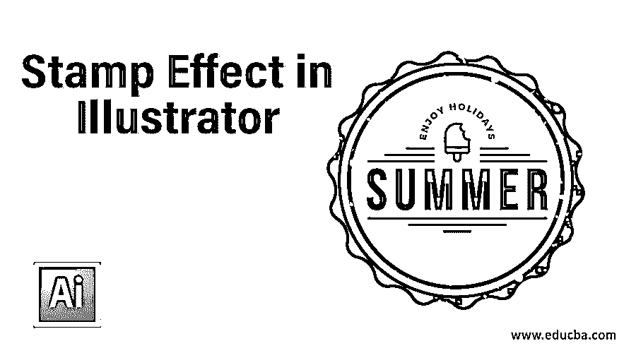

## Illustrator 中的图章效果介绍

图章是 Adobe Illustrator 中的一种有效技术。图章效果可以定义为通过使用 adobe illustrator 的工具、技术和某些功能来制作图章状结构的效果。这种效果可用于标志设计或与任何商业作品相关的特定项目的任何其他对象。

### 如何在 Adobe Illustrator 中创建图章效果？

在本文中，我们将通过一个例子来讨论为任何对象或任何标志制作图章效果的步骤，并了解这种效果的参数，这是理解这种效果所必需的。所以让我们开始这方面的学习吧。

<small>3D 动画、建模、仿真、游戏开发&其他</small>

**第一步:**首先在这个软件里取一个‘新建文档’。转到菜单栏的文件菜单，它位于“新文档”工作屏幕的顶部。将打开一个新的文件箱。在此根据您的要求进行文件设置，然后按下此框中的“确定”按钮应用您所做的设置。

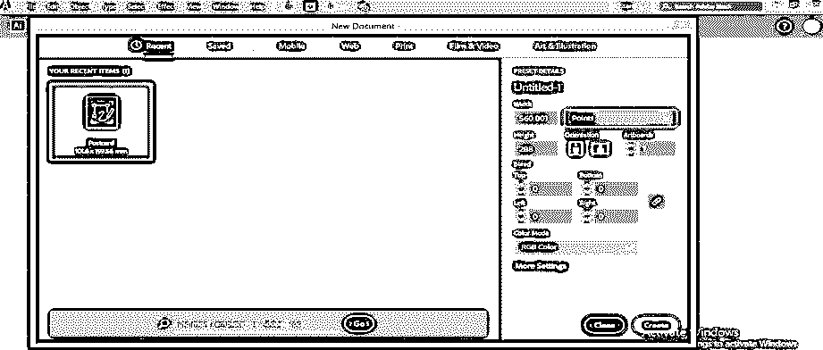

**第二步:**现在从这个软件的工具面板里拿一个椭圆工具，在工作屏幕的左侧，也可以从键盘上按 L 键作为椭圆工具的快捷键来激活它。

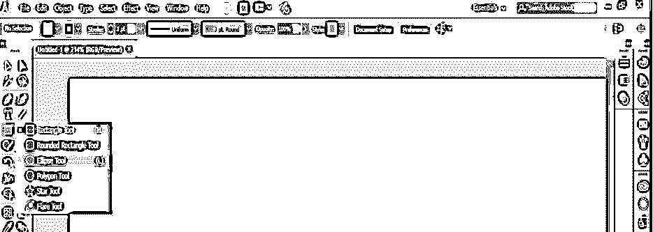

**第三步:**现在，用你想要大小的椭圆工具，画一个圆。按住 Shift 键使用此工具制作一个圆。

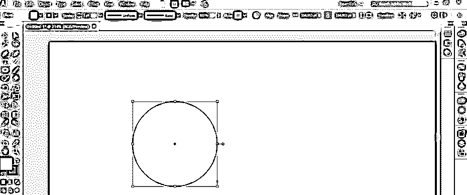

**步骤 4:** 现在用选择工具点击选择这个圆，进入菜单栏的“对象菜单”，它位于工作屏幕的顶部。将会打开一个下拉列表。转到该列表的路径选项，并从新建下拉列表中选择“偏移路径”选项。

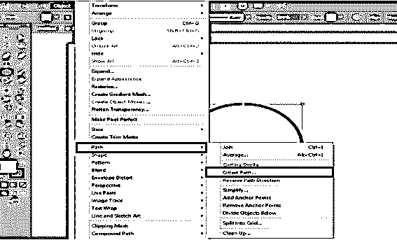

**第五步:**“偏移路径”框将打开。打开这个框的预览，减小偏移值，这样我们就可以在我们画的圆里面画一个小圆，然后点击这个框的 Ok 按钮。

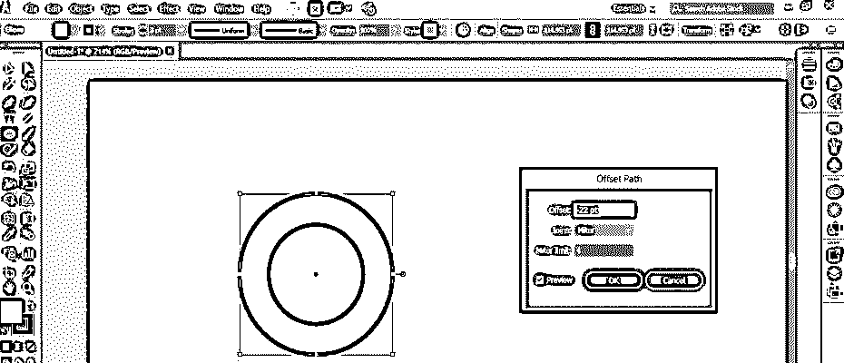

**步骤 6:** 现在再次使用菜单栏“对象菜单”的“路径”选项来偏移路径。

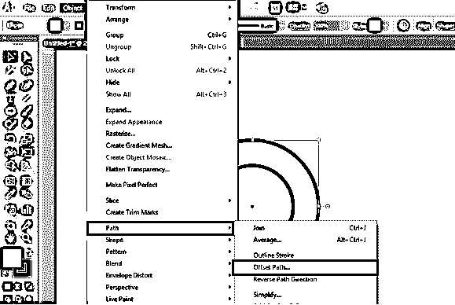

**第 7 步:**在偏置框中设置偏置值，当我在此绘制一个更大的圆时，在该圆旁边画一个圆，然后按下该框的确定按钮。

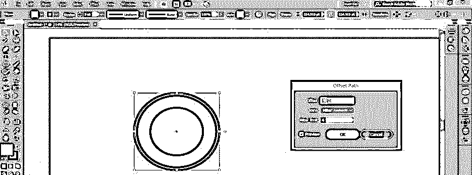

**第八步:**现在，将选中的圆的厚度减少 1 磅。从圆的属性栏。

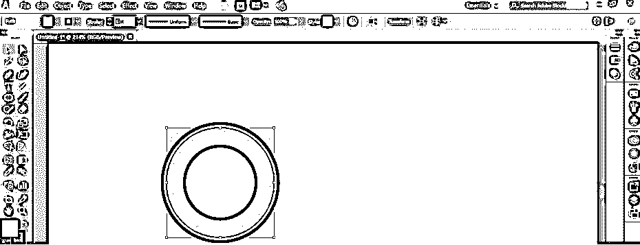

**第九步:**现在选择小圆，从属性中取其厚度值为 2 点。

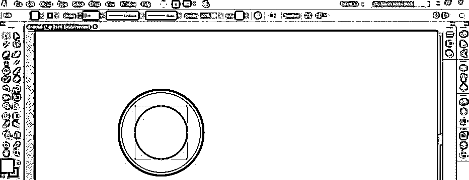

**步骤 10:** 现在，使用工具面板的矩形工具，在一个小圆的中心制作一个矩形。请使用选择工具选择所有形状，并使用工作区顶部的对齐工具将它们对齐小圆的中心。

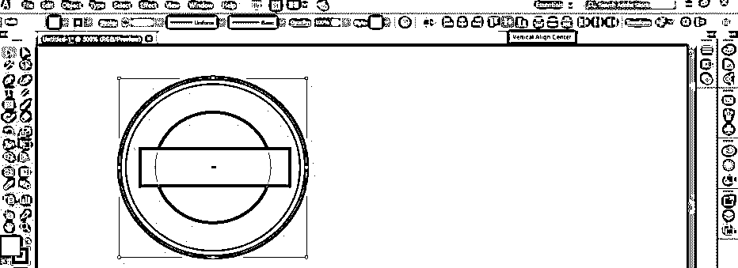

**步骤 11:** 现在从图层框中选择小圆圈图层，点击图层框底部的“创建新图层”选项图标。

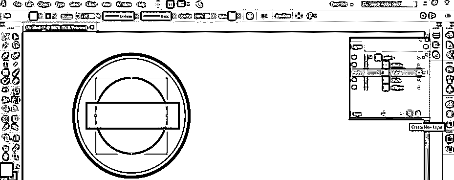

步骤 12: 现在让所有图层的眼睛按钮‘关’留下小圆圈和矩形图层的眼睛按钮。从工具面板中选择剪刀工具，点击矩形的中点，制作小圆的交点。

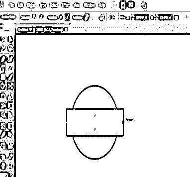

**步骤 13:** 由于小圆的相交部分已经生成，在图层剖面中可以看到两层半圆。

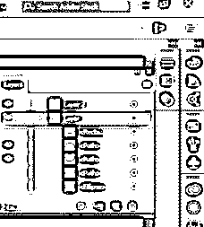

**步骤 14:** 现在选择相交圆的一半，进入工具面板；单击文本工具图标。将会打开一个工具下拉列表。从这里选择“路径键入”工具图标。

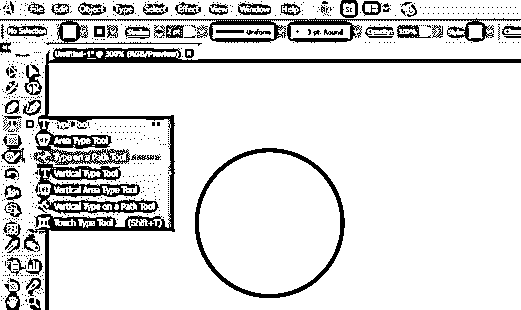

**步骤 15:** 当你点击半圆时，一个路径文本工具会像这样被激活。

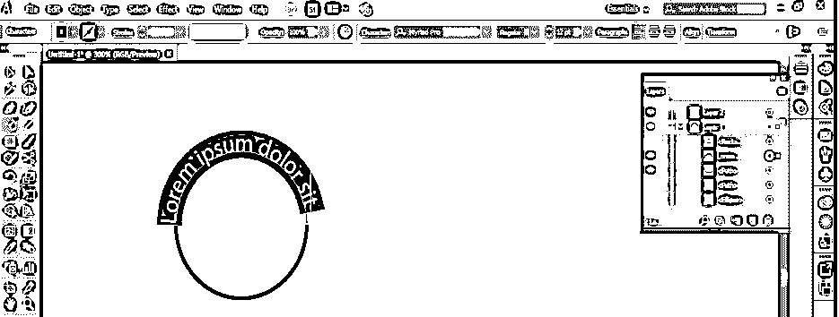

第 16 步:在键盘按钮的帮助下，在此部分键入您想要的文本。

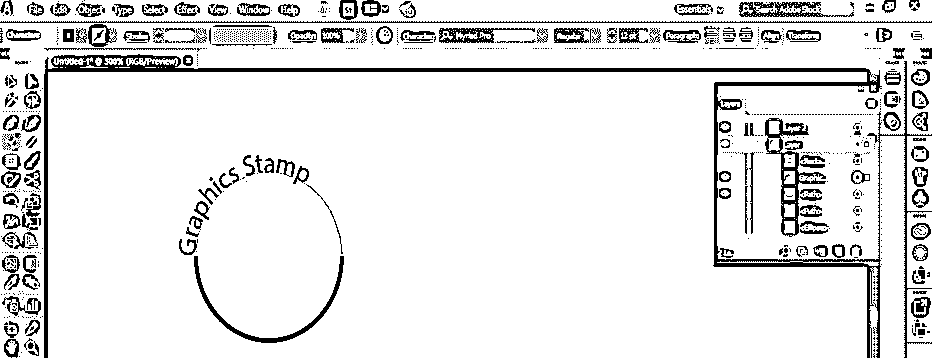

**步骤 17:** 您可以从工作屏幕顶部的文本属性中选择文本字体样式。

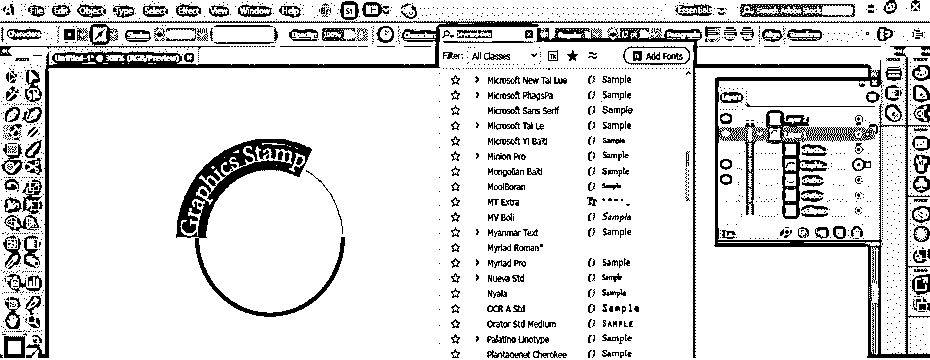

**步骤 18:** 现在，根据你的要求从这里设置字体的粗细。

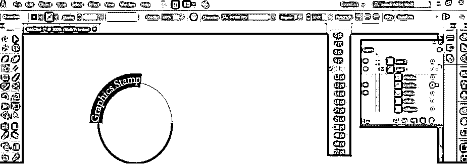

**步骤 19:** 使用 text 属性的居中对齐选项，将该文本居中对齐。

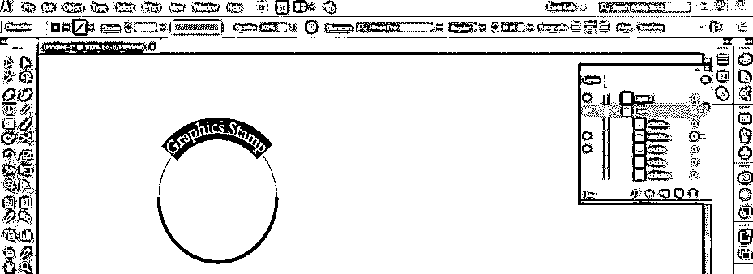

步骤 20: 现在点击图层的眼睛按钮，留下矩形图层，使其他图层可见。

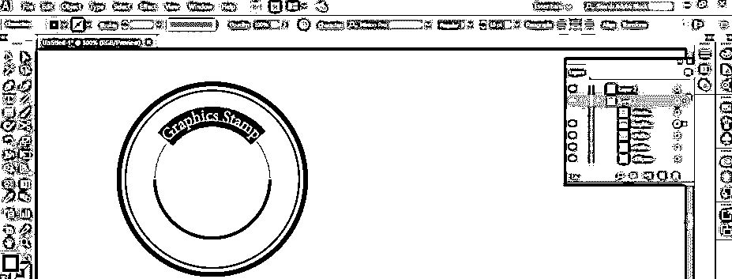

**步骤 21:** 再次，从工具面板中选择“路径工具”并点击相交圆的另一半。在键盘的帮助下，在这个路径上键入文本。

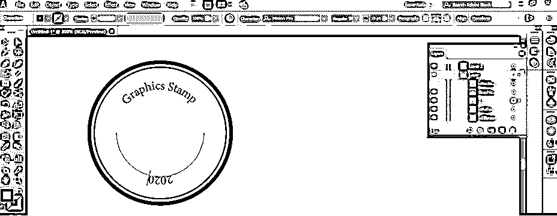

**第 22 步:**现在，从工具面板中选择工具，点击文本“2020”的路径，并向相反方向移动路径的中间垂直线，将该文本放置在正确的格式中。

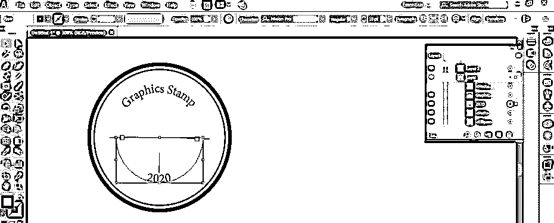

**步骤 23:** 现在，根据较大的圆，通过改变参数来调整两个文本的大小和形状。您可以根据自己的要求调整它们的参数。

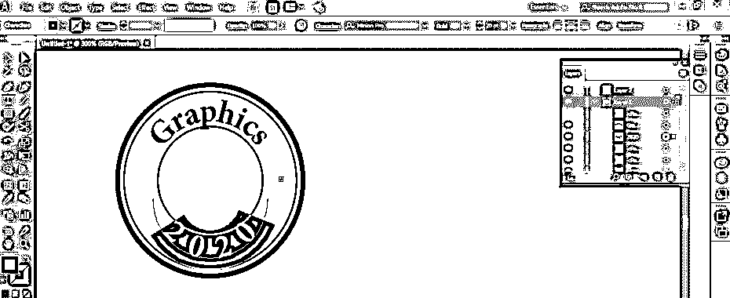

**步骤 24:** 选择文本并增加字母之间的间距。要增加字母之间的间距，请根据您需要的间距反复按键盘的 Alt +右箭头键。

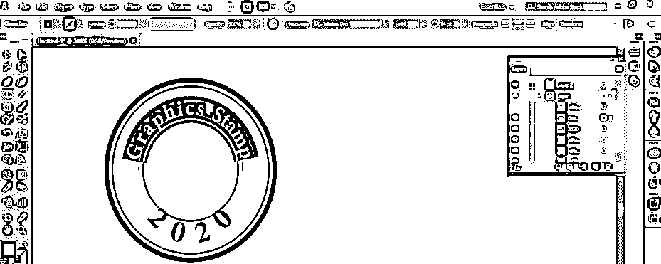

**步骤 25:** 现在使用本软件工具面板的星星工具制作一颗星星。您可以使用任何其他形状给这个对象一个适当的邮票外观。

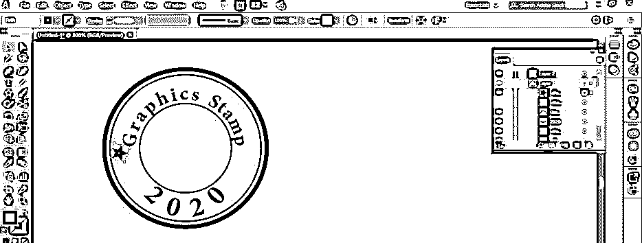

**第 26 步:**复制这个星星，按住键盘的 Alt 键，拖动到其他地方。像这样放置两颗星星。

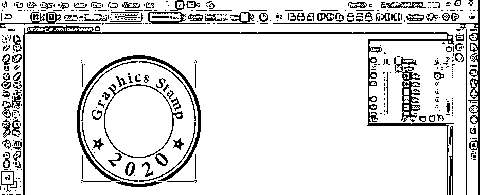

步骤 27: 现在，点击矩形层的眼睛图标，使其可见。通过逐个点击来选择矩形和小圆。按住键盘的 Shift 键，一次选择多个选项。

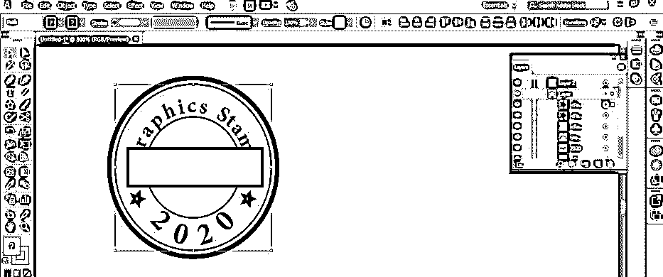

**步骤 28:** 在本软件菜单栏的窗口菜单中选择两个形状后，打开探路者框。

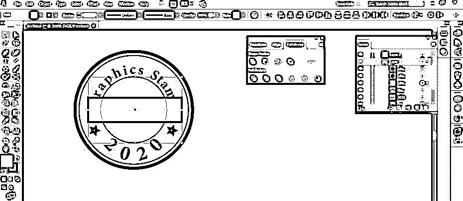

**步骤 29:** 点击此框的“负前”图标，从一个圆中减去一个矩形。

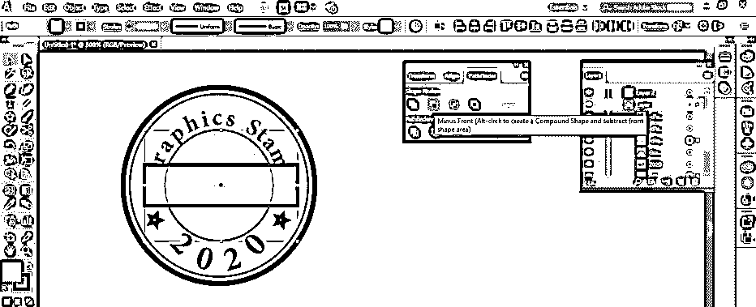

**步骤 30:** 现在你的印章变成这样了。

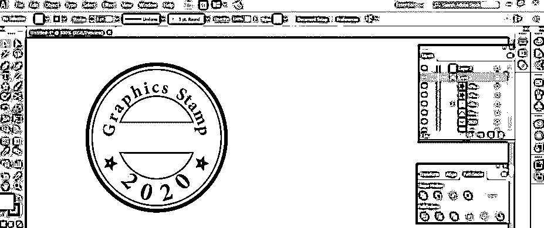

这样，通过遵循本文的步骤，您可以在 adobe illustrator 软件中轻松制作不同用途的图章。

### 结论

本文之后，您可以了解 Illustrator 中的图章效果，并且可以在您的专业工作中使用它来制作不同类型的对象，这些对象将给您带来合乎道德的外观。使用这种有效的技术，你可以做一个非常专业的古董项目。

### 推荐文章

这是 Illustrator 中图章效果的指南。在这里，我们讨论如何一步一步地在 Illustrator 中制作一个简单、容易的图章效果。您也可以浏览我们的其他相关文章，了解更多信息——

1.  [Illustrator 中的霓虹灯效果](https://www.educba.com/neon-effect-in-illustrator/)
2.  [Illustrator 中的倒影](https://www.educba.com/reflection-in-illustrator/)
3.  [在 Illustrator 中创建表格](https://www.educba.com/create-table-in-illustrator/)
4.  [Illustrator 中的平滑工具](https://www.educba.com/smooth-tool-in-illustrator/)

