# 插画中的孙

> 原文：<https://www.educba.com/sun-in-illustrator/>

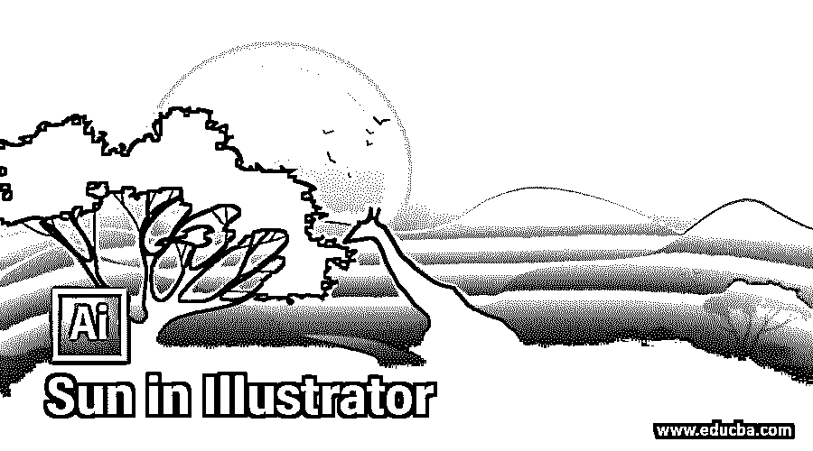

## Illustrator 中的孙简介

Adobe Illustrator 是一款矢量绘图软件，是专业人士最喜欢的矢量艺术图形设计软件包。在本文中，我们将在 adobe illustrator 2020 中创建一个太阳的图形设计，它将强调形状和渐变填充的使用。我们还将使用图层、蒙版和铅笔工具以及许多其他有用的工具，为了设置场景，我们还制作了山和水的效果。

### 如何在 Illustrator 中创建孙？

以下是在 Illustrator 中创建太阳的步骤:

<small>3D 动画、建模、仿真、游戏开发&其他</small>

**步骤 1:** 我们将使用所有标准设置创建一个新文档，并将宽度设置为 800 像素，高度设置为 600 像素。将方向设置为横向，将画板设置为 1。此外，出血是 0 px，颜色模式为 RGB 颜色，还有另一个 CMYK 选项，如果我们使用它来打印，这很有用。但是因为我们不打印，我们把它留在 RGB 模式。此外，设置光栅效果为屏幕，因为我们没有使用任何光栅效果，如投影。

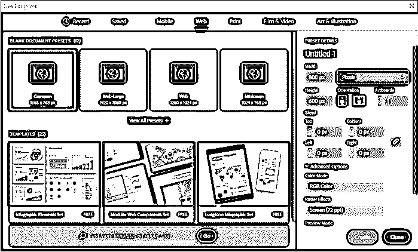

**步骤 2:** 我们将使用以下参考图像作为艺术的基础

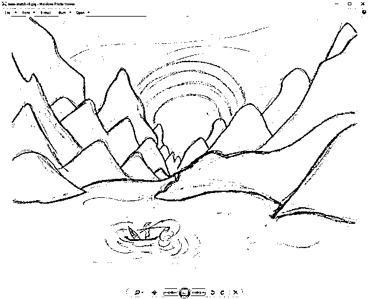

**第三步:**在画板上拖动参考图像，根据画板调整大小，放在图层面板中的素描图层上，点击眼睛图标后的空格将其锁定。为艺术品创建另一个图层，命名为“艺术品”。

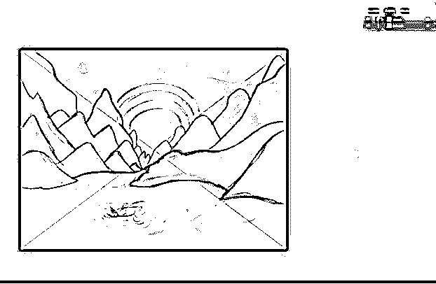

**第四步:**从窗口菜单打开外观面板，为“画板”设置叠加混合模式，因为我们可以在创建作品时看到下面的草图。

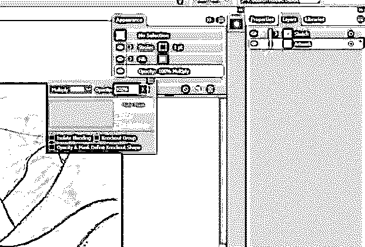

步骤 5: 使用矩形工具，创建一个矩形，从窗口菜单打开渐变面板，应用径向渐变。

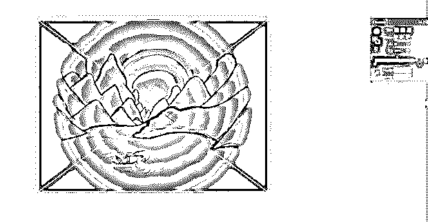

步骤 6: 根据场景创建一个调色板，因为我已经在样本面板中创建了调色板，所以我们可以使用这些颜色。我们已经将白色和黑色改为黄色和红色，如图所示。

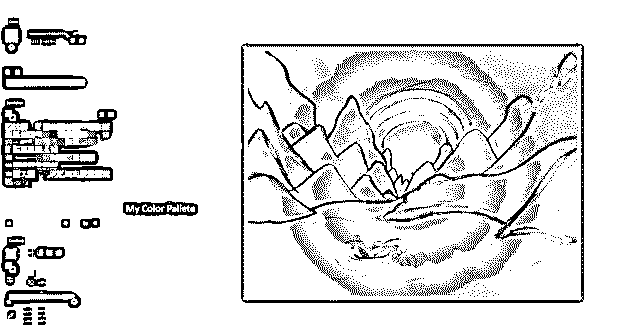

**第七步:**拖动顶部的手柄改变渐变颜色。

**步骤 8:** 使用椭圆工具创建一个圆。按住 shift 键得到一个圆，并用调色板中的颜色填充它。

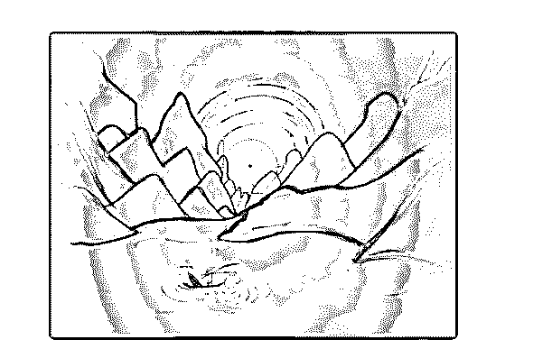

**步骤 9:** 现在，使用偏移路径工具，同时选择圆形，在属性面板的快速动作中创建一个偏移。设置偏移量为 20px，设置不透明度为 80%。

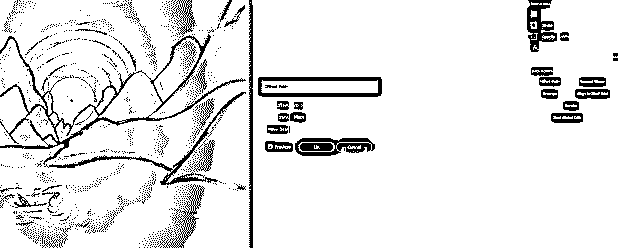

**步骤 10:** 然后再重复以上步骤 5 次，逐渐改变不透明度为 65%、50%、35%、20%、5%。用 CTRL + G 组合键或转到对象菜单和组。将图层面板中的组命名为“Sun”。锁定草图层。

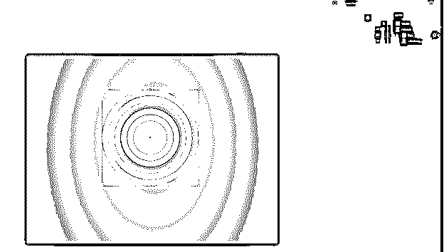

步骤 11: 为了制作云彩或反射阳光，我们使用钢笔工具，创建如图所示的形状。

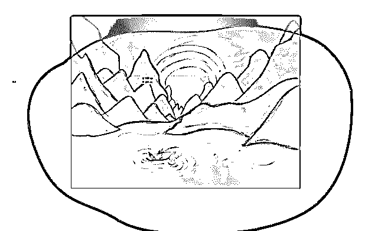

**步骤 12:** 现在用白色到黑色的渐变填充，然后把黑色改为白色，不透明度改为 0，角度改为 90 度，反转渐变，让白色在顶部。如图所示调整滑块，并将白色的不透明度降低到 20%

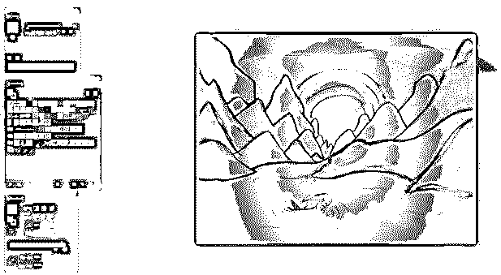

**步骤 13:** 再重复一次同样的步骤，如下图，创建另一个云反射。调整渐变的角度以适应变化。现在隐藏草图层查看预览。

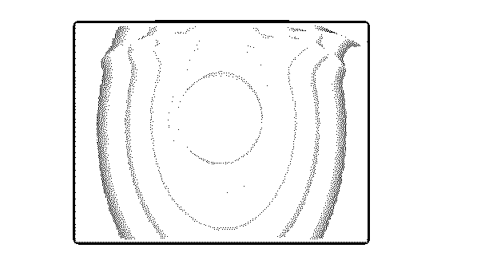

**步骤 14:** 正如我们所看到的，反射出了画板。我已经创建了一个绿色的虚拟形状，并显示它。现在，我们将创建一个仅显示画板的遮罩。从窗口菜单中打开透明面板。选择图稿图层中的所有对象，并创建一个制作蒙版

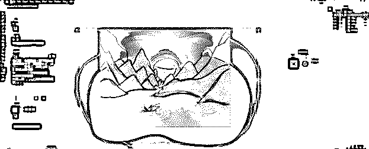

**步骤 15:** 创建一个宽度和高度与画板相同的矩形

**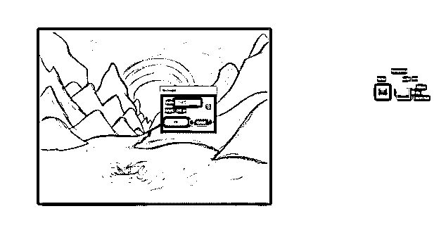

** 

**第十六步:**将颜色改为白色。现在，蒙版外部的区域将被剪切，您可以看到图层名称带有虚线下划线，表示它被蒙版了。

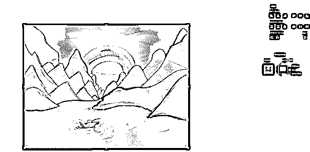

**第 17 步:**删除虚拟绿色物体，现在我们可以开始在山上工作了；为此，我们使用铅笔工具，以下是选项。我们将设置填充新的铅笔笔画，因为我们希望在我们创建一座山后填充。此外，设置保真度在准确的一边，因为我们希望我们的山是锯齿状的边缘。你可以用鼠标创建它，但我用了图形输入板来更好地控制形状。

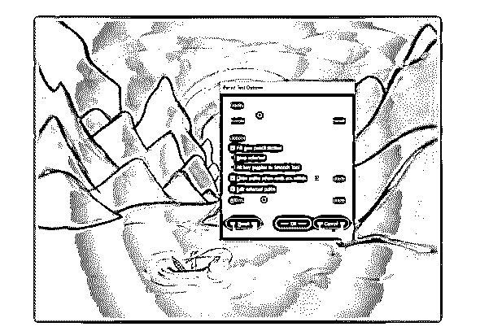

**步骤 18:** 如图所示，我们已经创建了几座山，并选择随机填充，这样我们就可以区分不同的山。

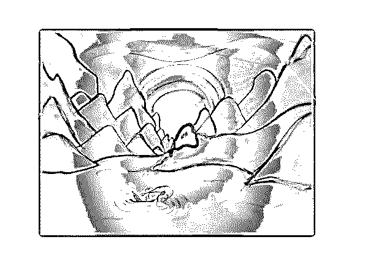

**步骤 19:** 所有的山都做好了，草图层隐藏，以便更好的查看。

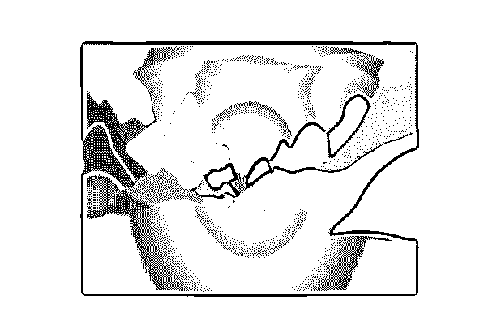

步骤 20: 现在，我们调整山脉的形状，使它们之间没有空隙，如图所示。此外，我们已经改变了山的堆叠顺序，以设置哪些在前面，哪些应该在后面。可以通过前移(CTRL + ])和后移(CTRL + [)来排列。

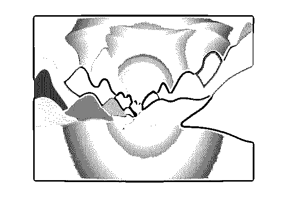

第 21 步:现在，我们已经开始添加调色板中的实际颜色。前面的山是黑暗的，当我们向后移动时，它实际上在阴影中变亮了。

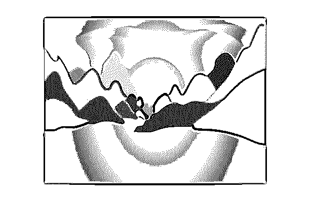

步骤 22: 现在，我们已经用样本中的所有色调完成了山脉。

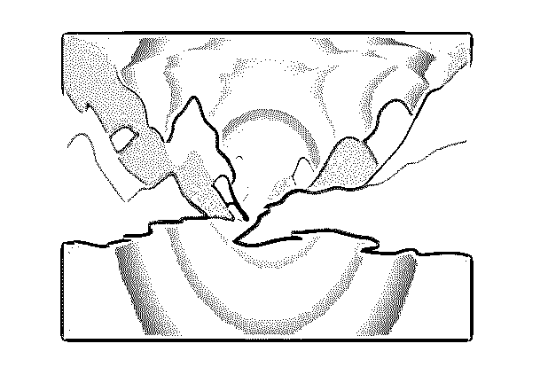

**步骤 23:** 为了创建一个简单的水的效果，我们首先创建一个矩形，没有任何笔画和任何填充。

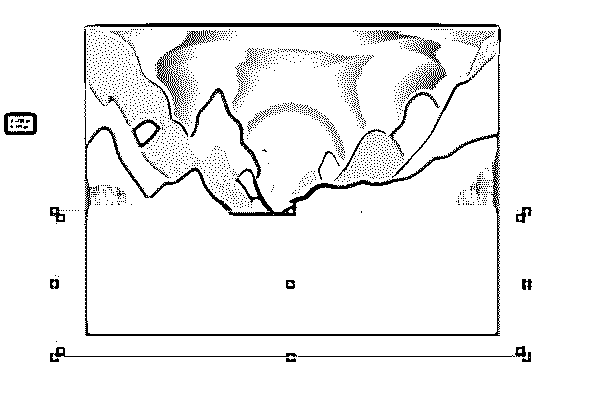

**步骤 24:** 现在设置一个径向渐变，在 25%、50%、75%处再添加 3 个停止点，从色板中选择合适的颜色，如图所示。

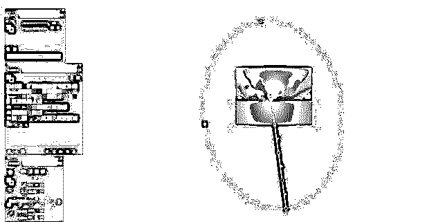

第 25 步:然后把图层倒放在山的后面，太阳的前面。

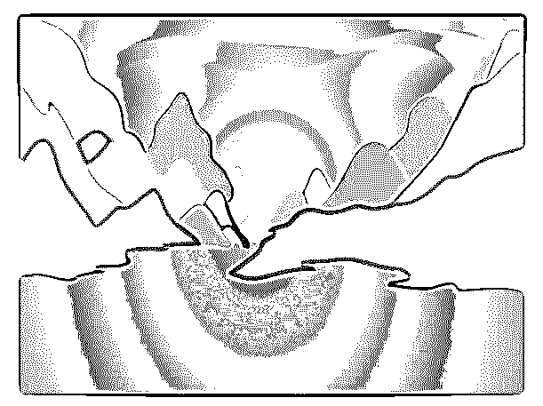

**第 26 步:**现在该导出了；正如我们在下面看到的，我们可以选择画板和位置。此外，我们可以选择要导出的格式。我们选择了 png 和 jpg 100 以及 1 倍和 2 倍的比例，这将是一倍的大小，点击导出。

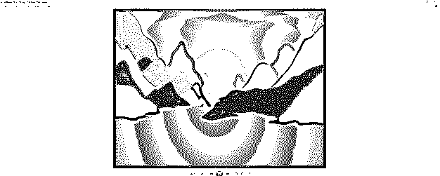

### 结论

在本文中，我们学习了如何在 Adobe illustrator 中创建太阳，还学习了使用各种工具(如图层、蒙版、渐变、铅笔工具和钢笔工具)来创建惊人的艺术作品的技巧，这将丰富您的知识和作品集。

### 推荐文章

这是孙在 Illustrator 中的一个向导。在这里，我们讨论的介绍，如何创建太阳在 Illustrator 的一步一步的方式。您也可以浏览我们的其他相关文章，了解更多信息——

1.  [如何在 Illustrator 中制作 Logo？](https://www.educba.com/how-to-make-logo-in-illustrator/)
2.  [水彩画笔插画师](https://www.educba.com/watercolor-brushes-illustrator/?source=leftnav)
3.  [在 Adobe Illustrator 中调整图像大小](https://www.educba.com/resize-image-in-adobe-illustrator/?source=leftnav)
4.  [如何在 Illustrator 中扭曲文本？](https://www.educba.com/how-to-warp-text-in-illustrator/?source=leftnav)

