# 如何在 Illustrator 中扭曲文本？

> 原文：<https://www.educba.com/how-to-warp-text-in-illustrator/>

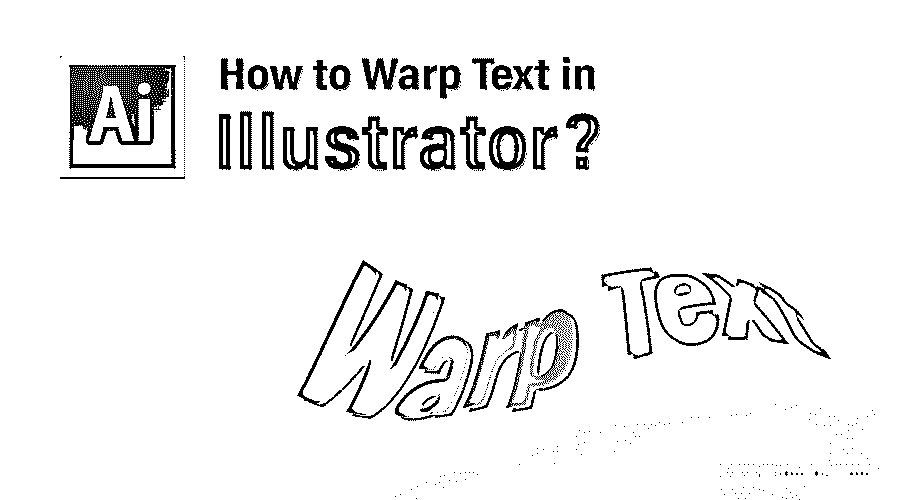

## Illustrator 中扭曲文本的介绍

Adobe 提供了图形专业人员中最受欢迎的矢量图形软件之一 Illustrator。这个软件充满了许多令人兴奋的功能，帮助我们设计图形。在这个软件中，你可以在任何特定的段落中换行。扭曲文本是指在任何文章段落的特定区域调整任何矢量图像或光栅图像或任何文本本身，使其能够清楚地表达该文章的目的。在本文中，我们将学习“如何在 illustrator 中扭曲文本？”并了解扭曲文本特征的一些重要参数。

### 如何在 Illustrator 中扭曲文本？

所以让我们开始学习扭曲文本，并通过一些例子来理解它。

<small>3D 动画、建模、仿真、游戏开发&其他</small>

第一步:你要做的第一件事就是从这个软件菜单栏的文件菜单里拿一个‘新文档’。当你点击“文件”菜单下拉列表中的“新建”选项时，会打开一个对话框。根据您的要求设置“新文档”参数，然后单击此框的创建按钮应用设置。

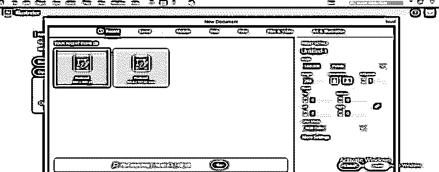

**第二步:**现在，从这个软件的工具面板里拿出文字工具。

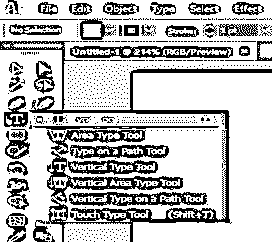

**第三步:**然后拖动文本光标，为我们的学习做一个段落。对于这项工作，你可以自己打印段落。

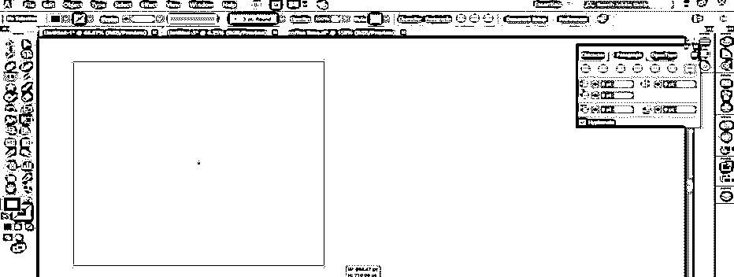

步骤 4: 新版 adobe illustrator 将向您展示段落的虚拟文本格式。在此段落中键入您自己的文本。

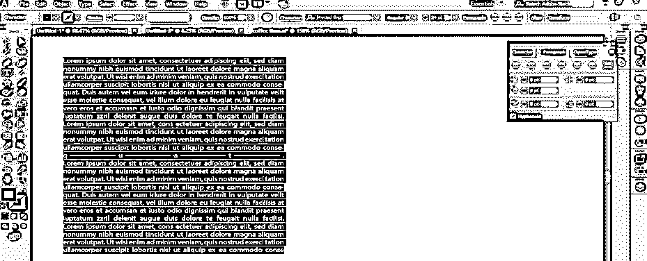

**第五步:**你可以使用矢量图像、光栅图像或任何文本本身将它们扭曲成文本格式。我们将一个接一个地看这三个。让我们首先讨论矢量图像。为此，从 illustrator 的工具面板中选择一个星形工具，绘制一个您想要的颜色和大小的星形。

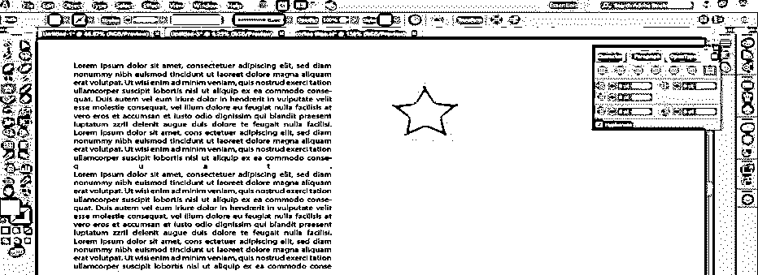

第六步:现在，在选择工具的帮助下移动它，把它放在键入的段落上面。

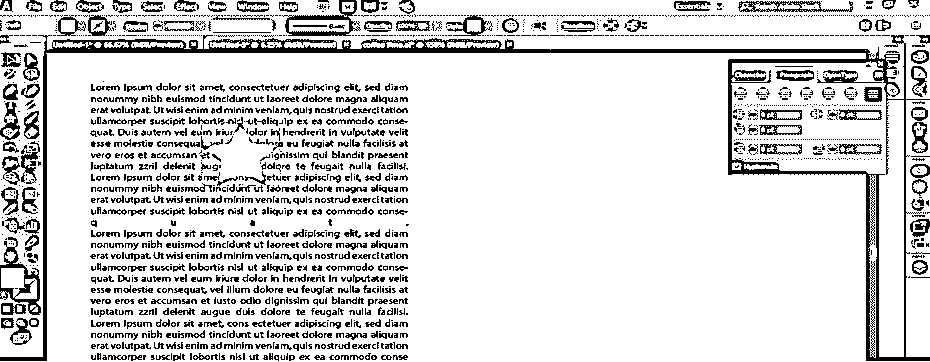

**第七步:**现在选择这个形状，进入这个软件菜单栏的‘对象’菜单。将会打开一个下拉列表。转到此列表中的文本扭曲选项，并单击新下拉列表中的“制作”选项。

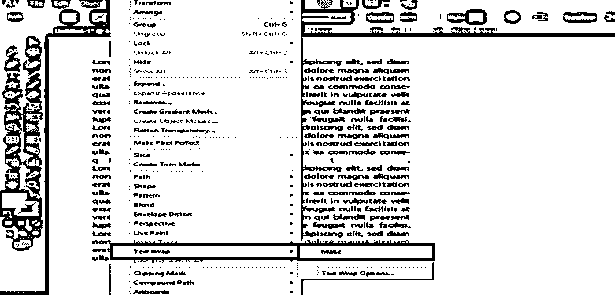

**第八步:**段落的文字会像这样绕一个矢量形状。

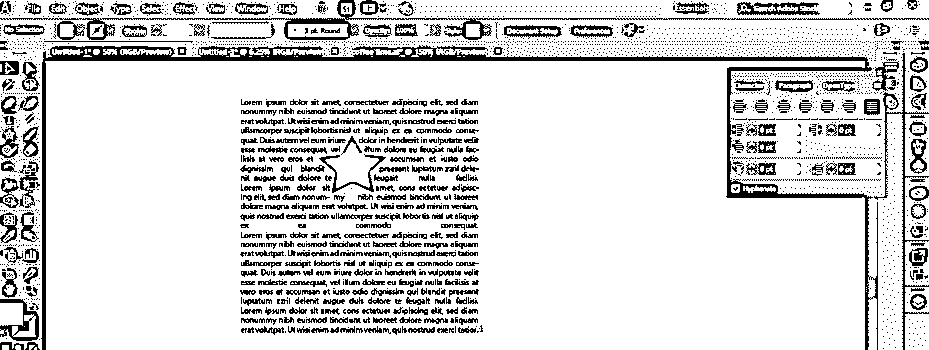

**第 9 步:**应用“文本换行”选项后，您可以随时将换行形状放在段落中的任何位置。

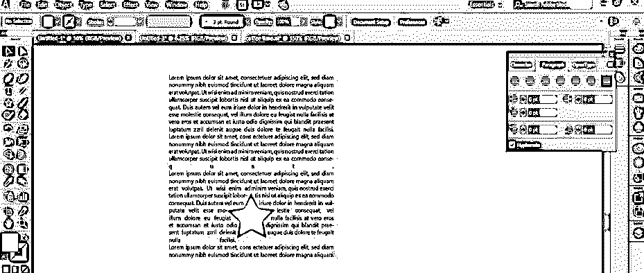

**第十步:**你可以随时增减形状的比例。

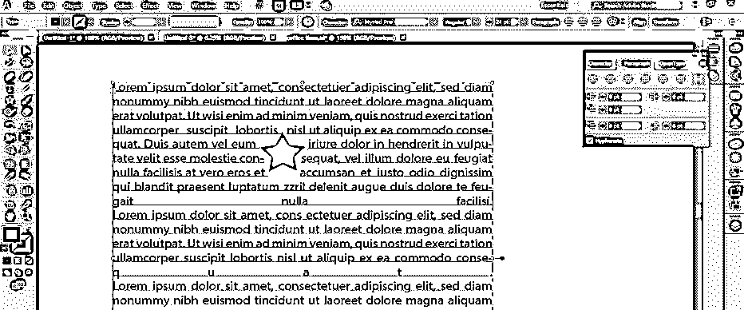

**步骤 11:** 您可以从环绕文本中释放形状。要释放形状，请转到菜单栏的“对象”菜单，并转到“文本换行”选项，然后单击新下拉列表中的“释放”选项。

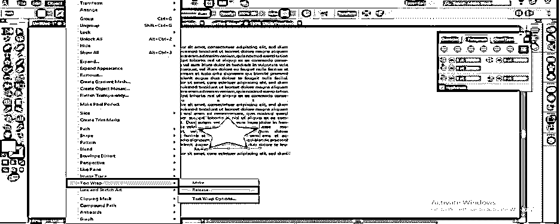

**步骤 12:** 形状会变成这样展开。

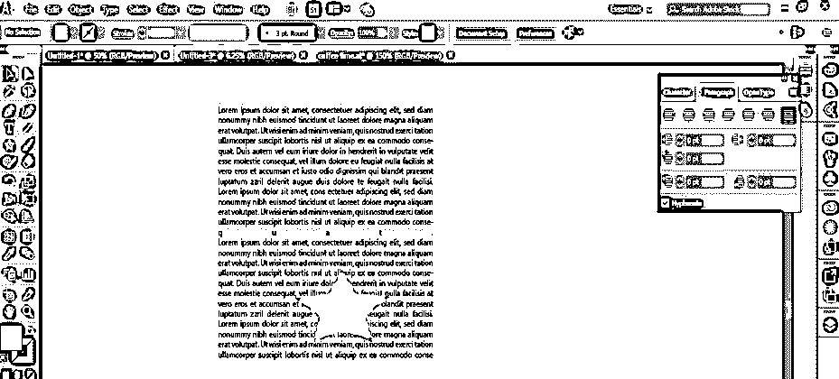

现在，让我们来看看段落中文本的换行。从工具面板中选择文字工具，键入您想要的文本，并相应地调整其大小和颜色。

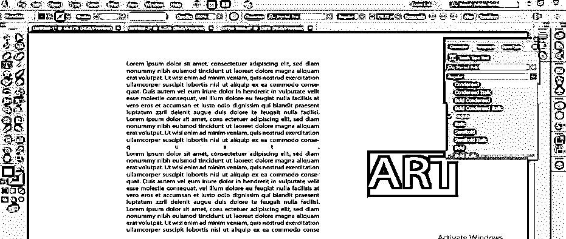

**步骤 14:** 现在，将这段文字放在段落上方，进入对象菜单，进入对象菜单下拉列表的文字换行选项，然后点击“制作”选项。

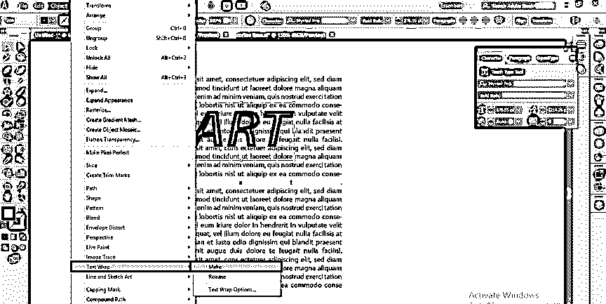

**第 15 步:**现在 illustrator 将显示此消息，用于扭曲此文本。按此对话框中的“确定”按钮，使文字换行。

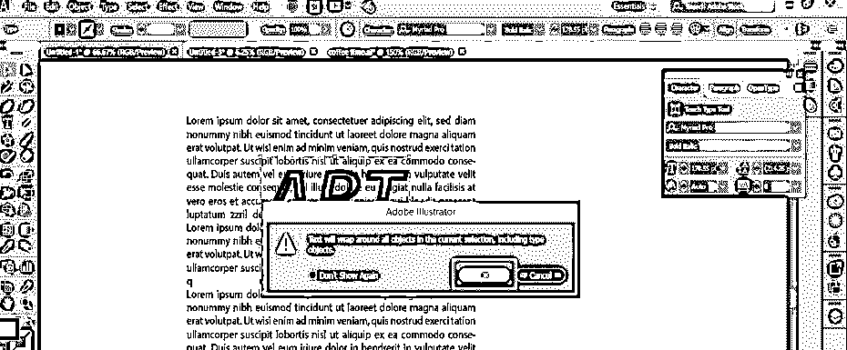

第 16 步:你的文字会是这样的。

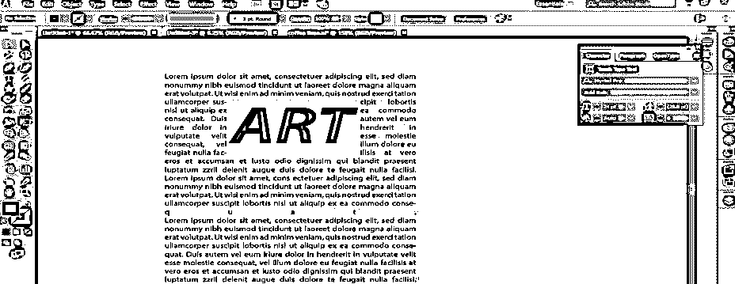

**步骤 17:** 您可以通过该文本颜色面板的前景色框来改变该文本的颜色。从颜色选择器框中选择所需的颜色。

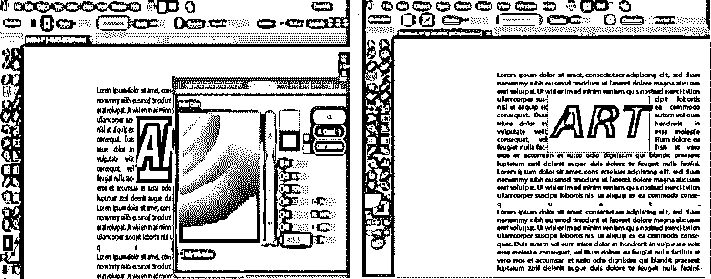

**第十八步:**你可以随时把它放在段落的任何地方。

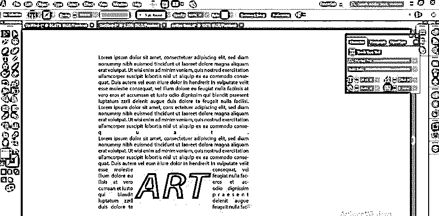

**第 19 步:**你可以随时增大或减小这个键入文本的比例。

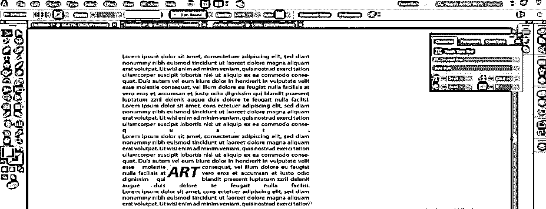

**步骤 20:** 你也可以在一个段落中进行多次‘文字扭曲’。

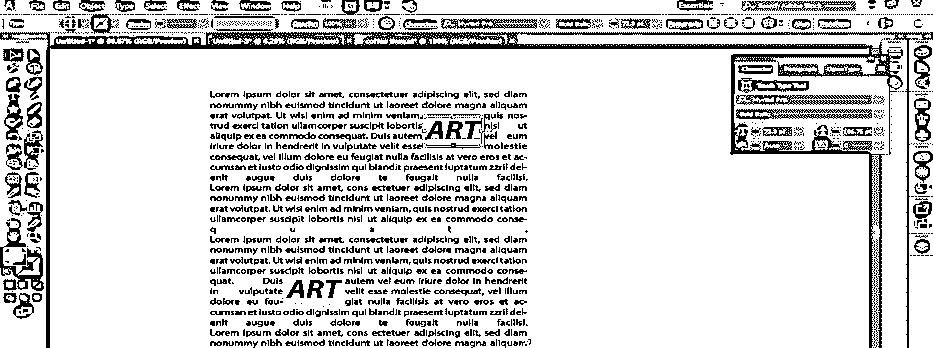

**第 21 步:**现在，让我们移动到下一个正在包裹光栅图像文本的对象。为此，请从您个人计算机的文件夹中放置光栅图像。

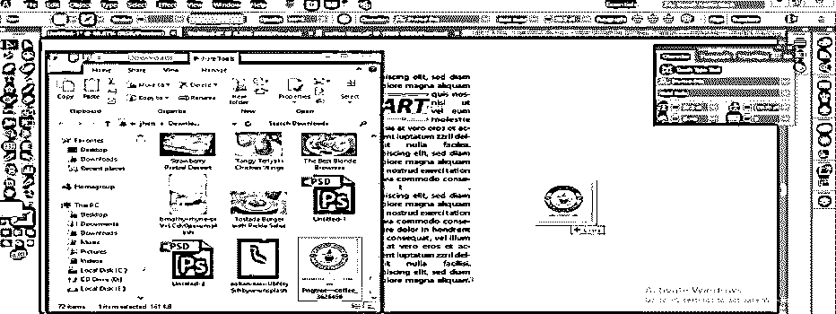

步骤 22: 将这张图片放在段落上方。然后进入对象菜单，进入下拉列表的文本扭曲选项，然后点击新下拉列表的“制作”选项。

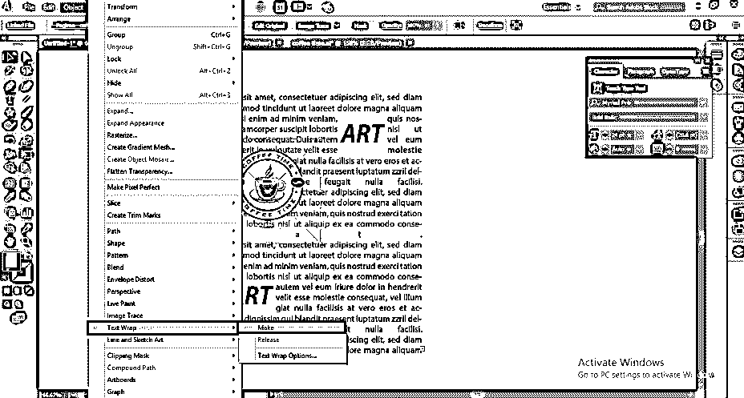

步骤 23: 文本将被这样的光栅图像包裹。

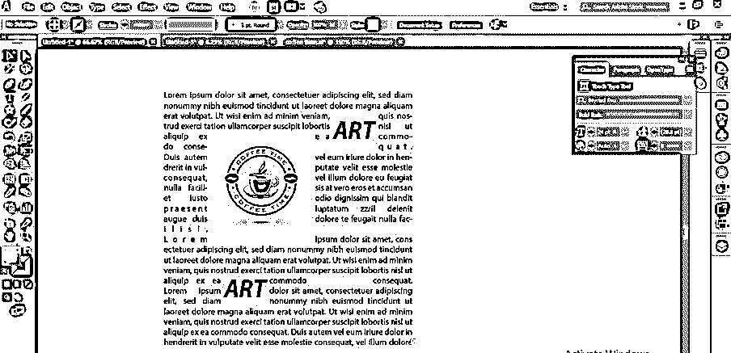

**步骤 24:** 可以去除任何光栅图像的背景；要移除背景，请从文本扭曲选项中释放此图像。

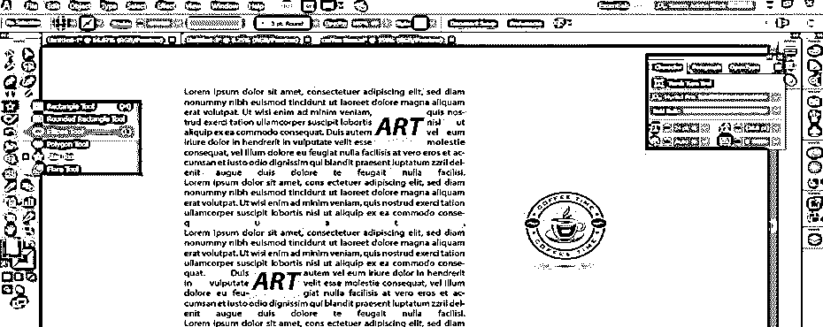

**第 25 步:**然后从这个软件的工具面板里拿出一个椭圆工具，这样按住键盘的 shift 键画一个圆，让它完全覆盖这个光栅图像的圆形部分。

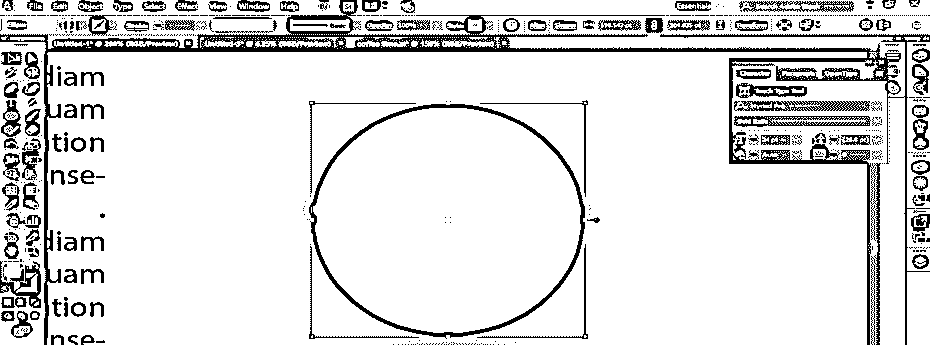

步骤 26: 现在选择图像和圆形。右键单击；将会打开一个下拉列表。点击列表中的“制作剪辑蒙版”选项。

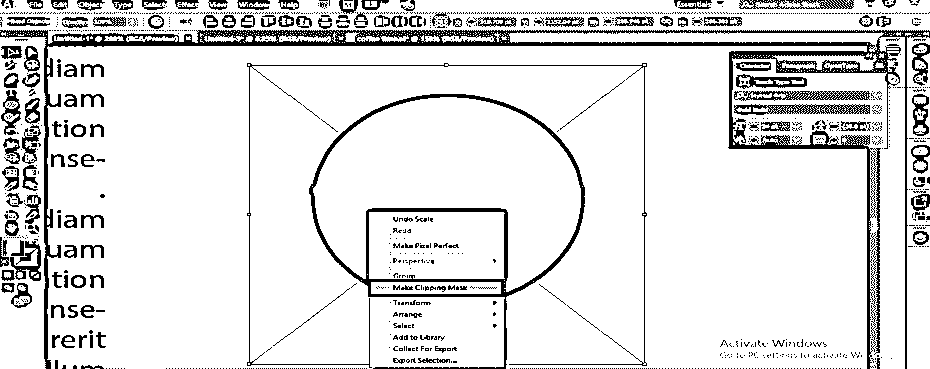

**步骤 27:** 图像的背景将被去除。现在把这个图片放在段落上，进入对象菜单，进入下拉列表中的文字换行选项，点击制作选项。

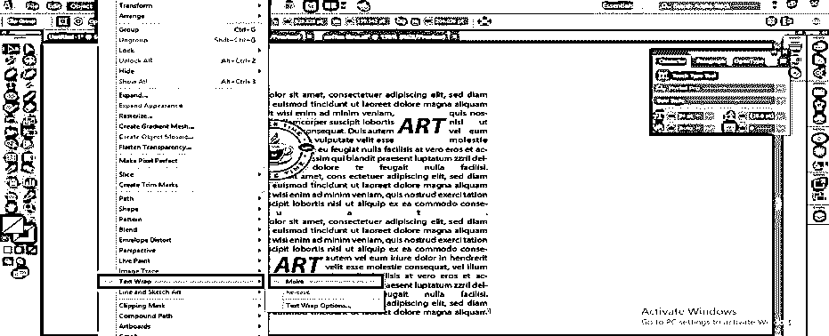

**步骤 28:** 图像会这样翘曲。

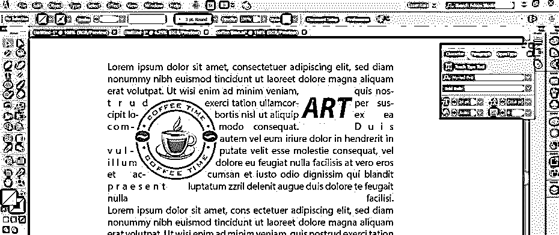

**步骤 29:** 您可以调整环绕图像的文字和图像之间的距离。为此，再次进入对象菜单，进入文字环绕选项，然后点击“文字扭曲选项”。

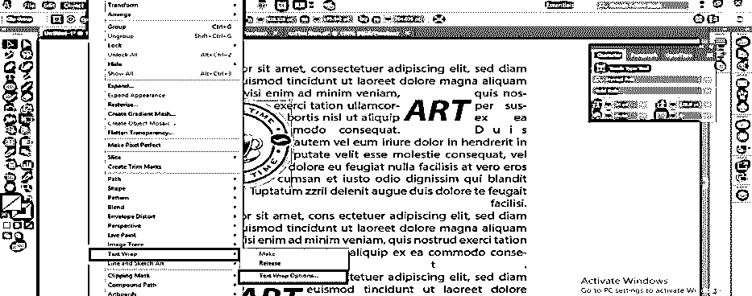

第 30 步:当你点击这个选项时，一个“文本换行选项”的对话框将会打开。增加或减少此框的偏移选项的值。当您增加偏移值时，文本和图像之间的距离会增加，但当您减少偏移值时，文本和图像之间的距离会减少。

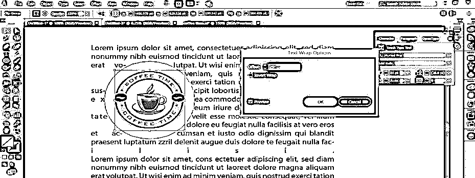

**第 31 步:**这里是这个框中的反绕选项。当您在此选项中勾选“On”时，段落的文本将仅在图像的位置上下弯曲，左右位置将会空出。

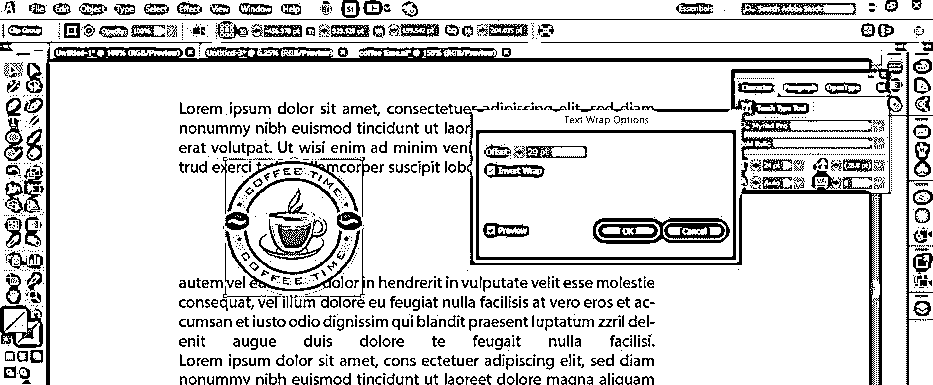

这样，您可以在 illustrator 中扭曲文本，并在项目工作中享受这种效果，使其与图形工作更加相关。

### 结论

现在看完这篇文章后，你可以很容易地理解“什么是换行”和“如何在 illustrator 中换行？”通过使用该软件的一些简单技术和工具。当你使用图形设计的排版技术时，环绕文本是这个软件的一个非常有用的功能。

### 推荐文章

这是一个如何在 Illustrator 中扭曲文本的指南？.在这里，我们讨论了在 Illustrator 中创建扭曲文本的步骤，并附有一些插图。您也可以浏览我们的其他相关文章，了解更多信息——

1.  [如何在 Illustrator 中添加纹理？](https://www.educba.com/how-to-add-texture-in-illustrator/)
2.  [如何在 Illustrator 中制作 Logo？](https://www.educba.com/how-to-make-logo-in-illustrator/)
3.  [如何在 Illustrator 中更改画板尺寸？](https://www.educba.com/how-to-change-artboard-size-in-illustrator/)
4.  [在 Illustrator 中创建表格](https://www.educba.com/create-table-in-illustrator/)

