# Illustrator 金色渐变

> 原文：<https://www.educba.com/illustrator-gold-gradient/>

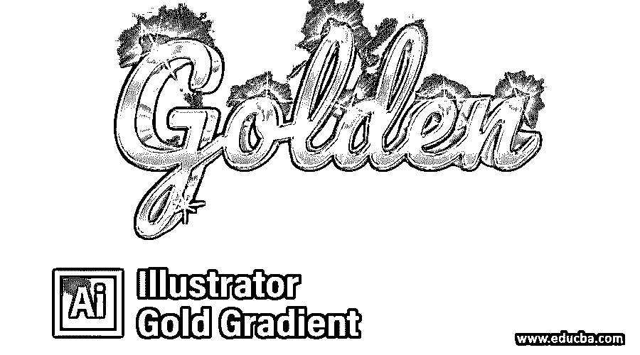

## Illustrator 金色渐变简介

Adobe Illustrator 是一款矢量绘图软件，是专业人士最喜欢的矢量艺术图形设计软件包。在本文中，我们将在 adobe illustrator 2020 中创建一个黄金渐变的图形设计，强调形状和渐变填充的使用。我们还将使用图层，蒙版，钢笔工具和其他有用的工具，并设置场景，我们还用骆驼和月亮和星星的背景做了一个金字塔。

### 黄金渐变怎么入门？

下面是下面提到的步骤:

<small>3D 动画、建模、仿真、游戏开发&其他</small>

#### 第一步

我们将使用所有标准设置创建一个新文档，并将宽度设置为 2560 像素，高度设置为 1440 像素。将方向设置为横向，将画板设置为 1，出血也是 0 像素，颜色模式为 RGB 颜色，还有另一个 CMYK 选项，如果我们使用它来打印，这很有用。但是因为我们不打印，我们把它留在 RGB 模式。此外，设置光栅效果为屏幕，因为我们没有使用任何光栅效果，如投影等。

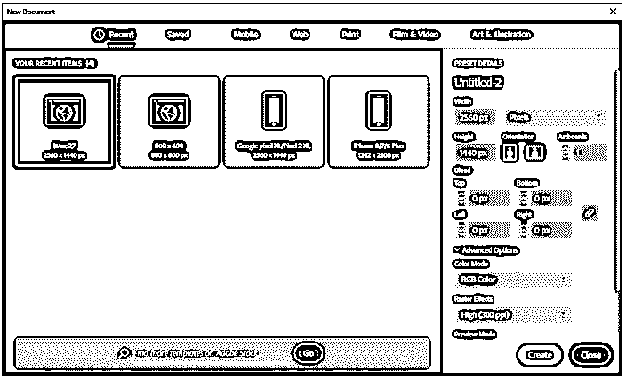

#### 第二步

我们创建一个矩形，如图所示。

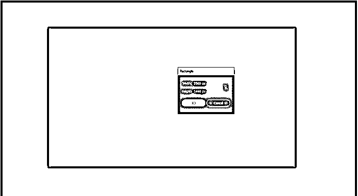

#### 第三步

从“色板”面板中添加白色到黑色的渐变。此外，你可以在下面看到我的作品样本。

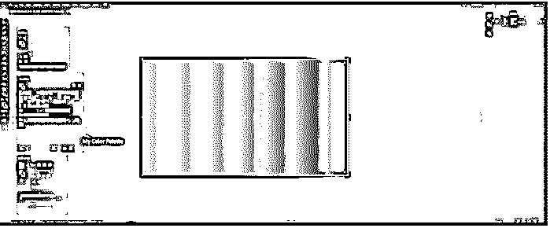

#### 第四步

使用样本创建线性渐变，然后创建一个矩形，如图所示。

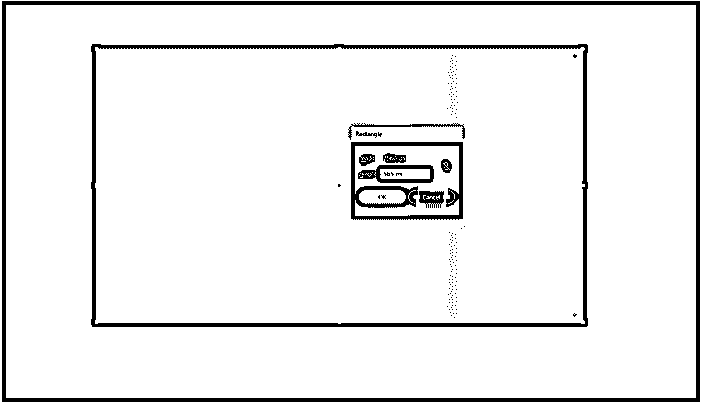

#### 第五步

使用样本创建线性渐变

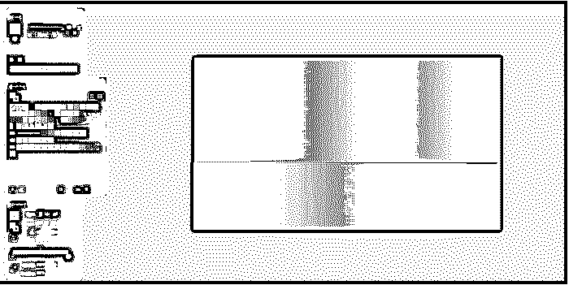

#### 第六步

使用钢笔工具创建以下形状将是我们的沙丘。

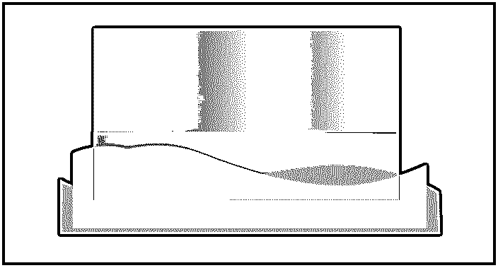

#### 第七步

使用样本创建线性渐变

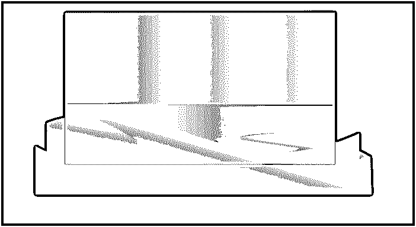

#### 第八步

由于沙丘正在离开画板，我们需要创建一个遮罩。做第一组所有的沙丘。

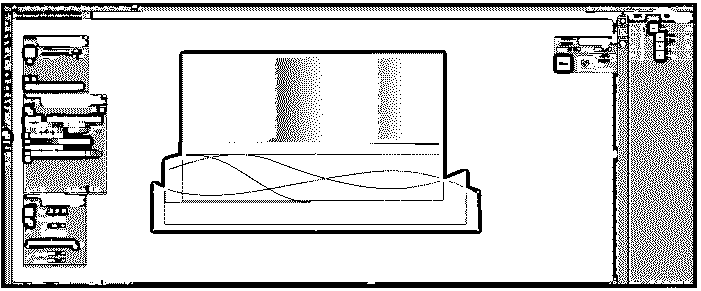

#### 第九步

从“窗口”菜单中打开“透明度”面板，并创建一个蒙版。然后在不透明蒙版模式下创建一个与图稿尺寸相同的矩形。用白色填满它。

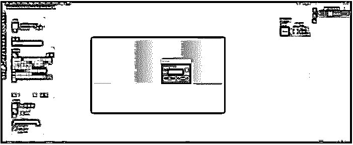

#### 步骤 10

现在只有艺术品会被展示，外面的沙丘会被隐藏。

#### 步骤 11

使用多边形工具创建一个三角形，单击一次并选择点 3。旋转和缩放以获得金字塔的外观。

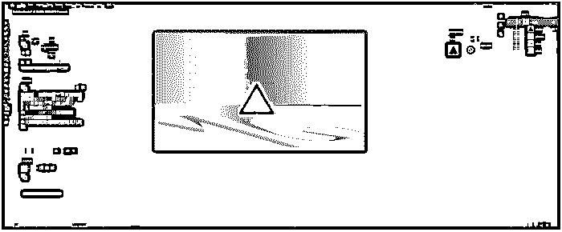

#### 第 12 步

使用钢笔工具在三角形的顶部创建一个三角形来表示金字塔的阴影。

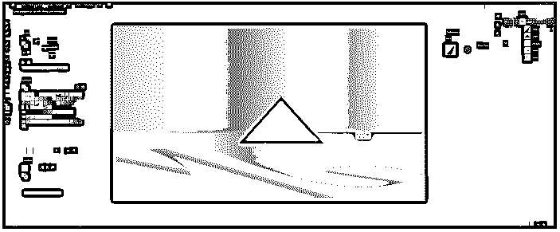

#### 步骤 13

选择三角形和钢笔工具的形状，然后打开窗口菜单中的路径查找工具，做分割。

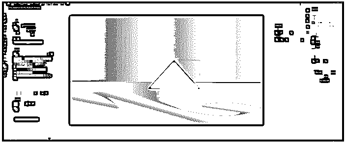

#### 第 14 步

然后取消组合以获得两个独立的部分。如果有任何线路径，则删除。

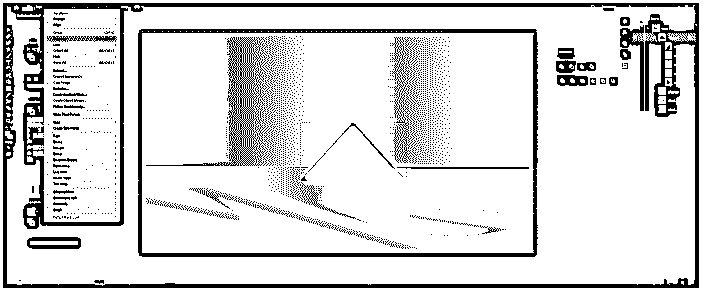

#### 第 15 步

使用样本创建线性渐变。调整渐变的手柄以获得所需的结果。

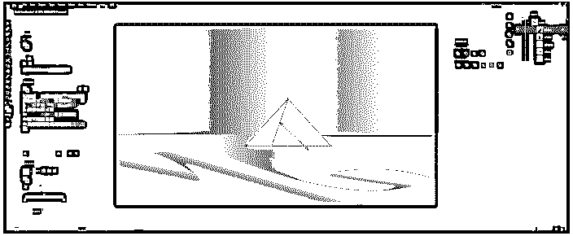

#### 步骤 16

同样，为阴影创建一个线性渐变。

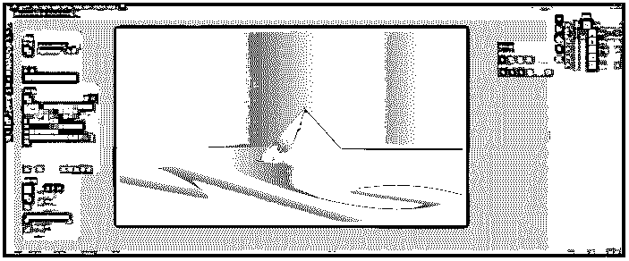

#### 第 17 步

从图层面板中选择两个形状，然后将它们组合在一起。

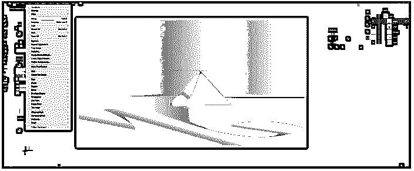

#### 步骤 18

复制选定的对象，然后粘贴在前面或 CTRL + F 三次。

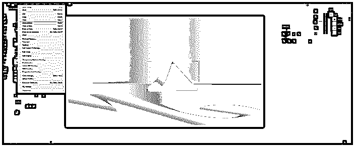

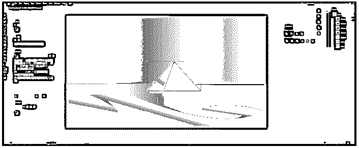

#### 步骤 19

缩放和平移金字塔以获得显示的结果。

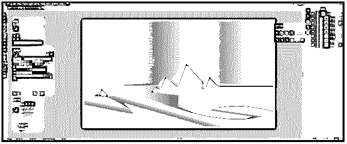

#### 第 20 步

将小金字塔放回层堆栈中，或者使用 CTRL + [

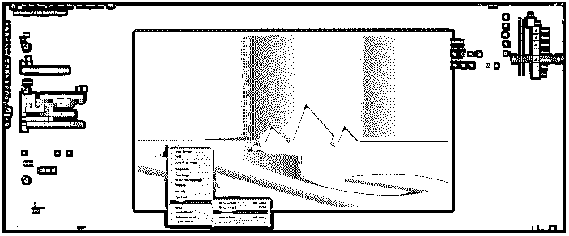

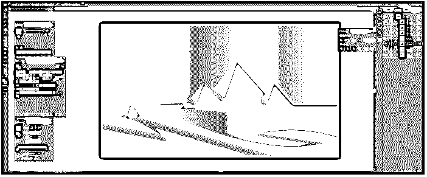

#### 步骤 21

我们将创建一个棕榈树的轮廓。

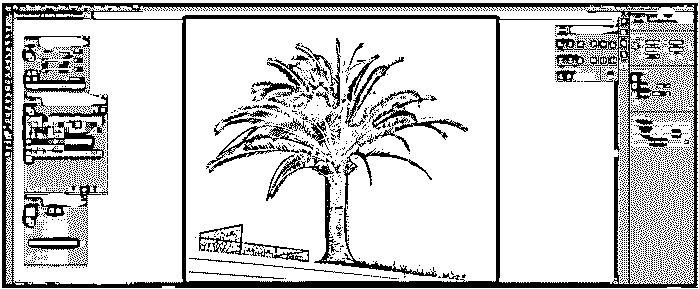

#### 第 22 步

我们将填充所有的形状。

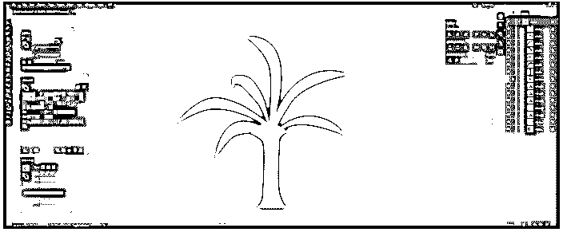

#### 步骤 23

选择所有的棕榈树形状，并使用路径查找工具合并。

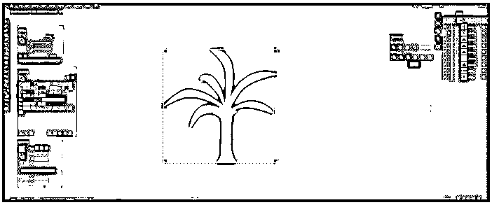

#### 第 24 步

把艺术品里的棕榈树拿来，按照金字塔的比例缩放，按照叠加层摆放。

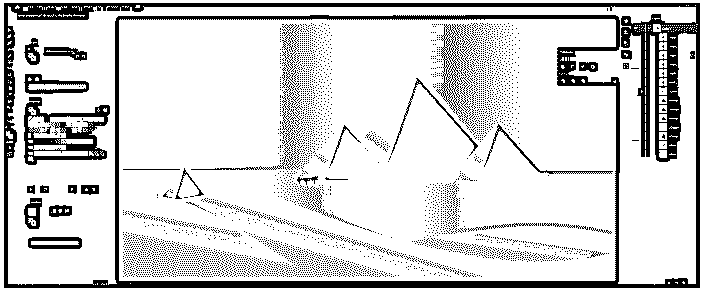

#### 第 25 步

为了显示一个车队，我们使用了一个图像，我们将在属性面板的快速动作部分进行图像跟踪。选择图像跟踪的轮廓类型。

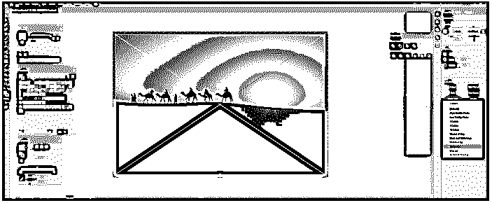

#### 第 26 步

首先，我们没有得到正确的结果，而是将阈值改为 50 来得到输出。

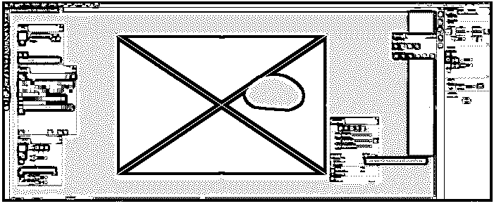

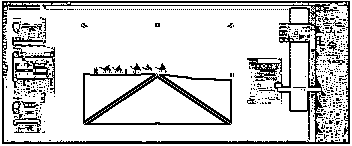

#### 第 27 步

展开形状以创建轮廓。

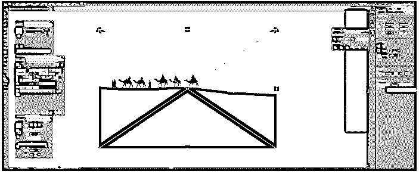

#### 步骤 28

现在，我们必须移除地面，使用钢笔工具创建一个形状，然后使用 pathfinder，通过首先选择大篷车，然后选择形状来减少正面。

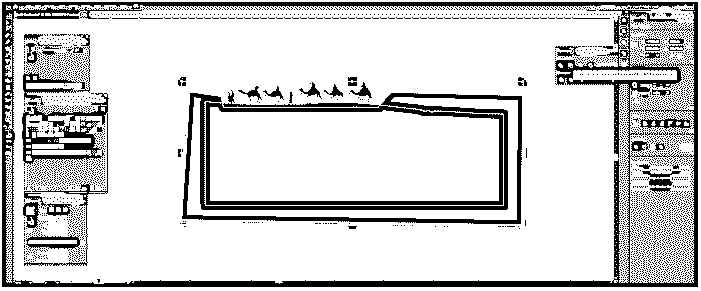

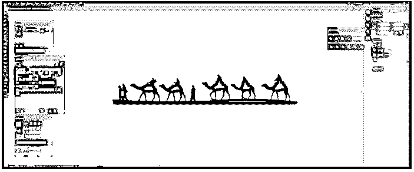

#### 步骤 29

现在，我们必须删除剩余的地面，这样做使用钢笔工具创建一个良好的形状，然后使用探路者和做减去前面，首先选择大篷车，然后形状。

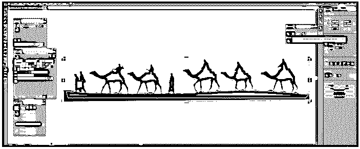

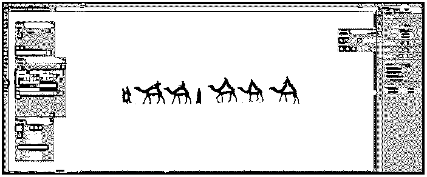

#### 步骤 30

将大篷车带入艺术作品，并应用色板中的颜色。

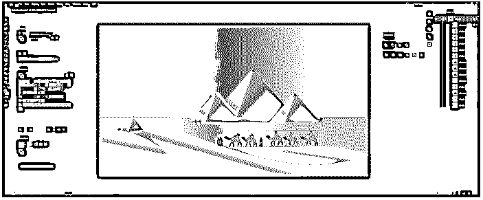

#### 步骤 31

现在双击大篷车进入团队，并删除任何线或剩菜。

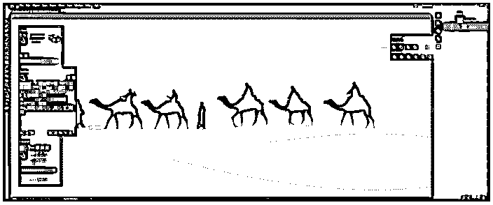

#### 步骤#32

缩放和旋转房车，使其看起来像是在爬沙丘。

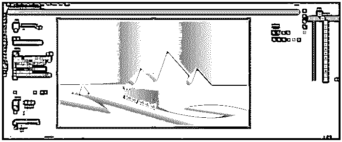

#### 步骤#33

现在我们将创建一个月亮为第一个创建一个圆。

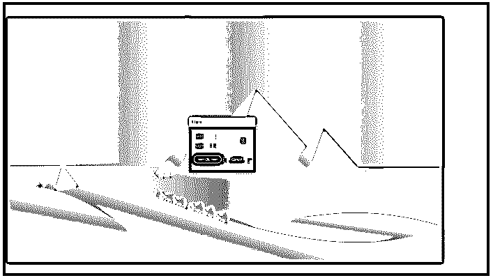

#### 步骤#34

在第一个圆的基础上再创建一个圆，缩小它的尺寸。

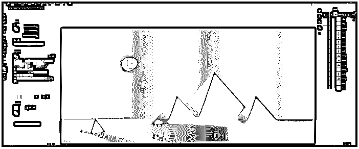

#### 第 35 步

现在选择大圆，然后小圆，并使用探路者工具做负前创建月亮的形状

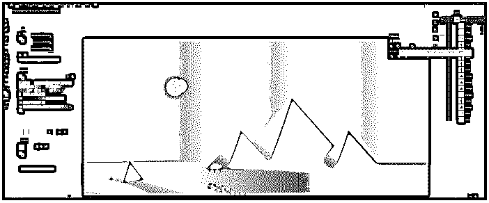

#### 步骤 36

适当旋转一下。

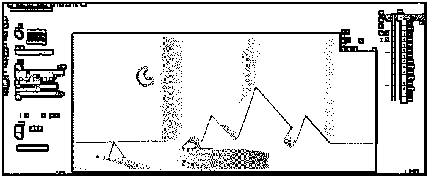

#### 步骤#37

现在用径向渐变填充月亮，我们在两个停止点选择了相同的颜色，只是我们将第二个停止点的不透明度改为 0，并调整渐变注释器以获得月亮的辉光。

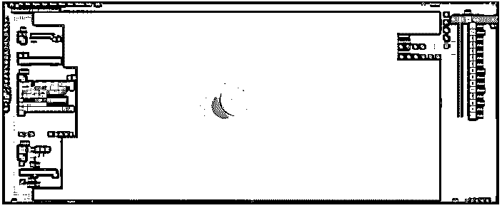

#### 步骤 38

使用相同的径向梯度，我们用宽度和高度为 10px，6px，3px 的椭圆工具创建一些星星。

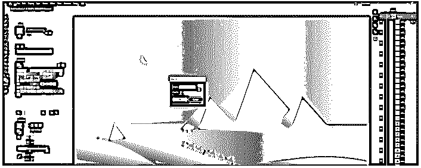

#### 步骤 39

我们已经在 illustrator 中完成了我们的金色渐变艺术作品

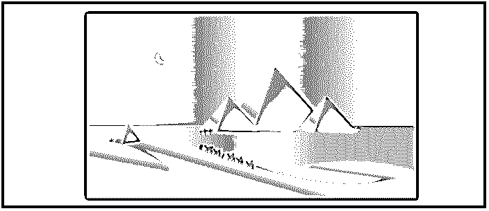

#### 第 40 步

现在是导出屏幕的时候了，如下所示，我们可以选择画板和位置。此外，我们可以选择要导出的格式。我们已经选择了 png 和 jpg 100 以及 1x 和 2x 的比例，这将是两倍的大小，并单击导出。

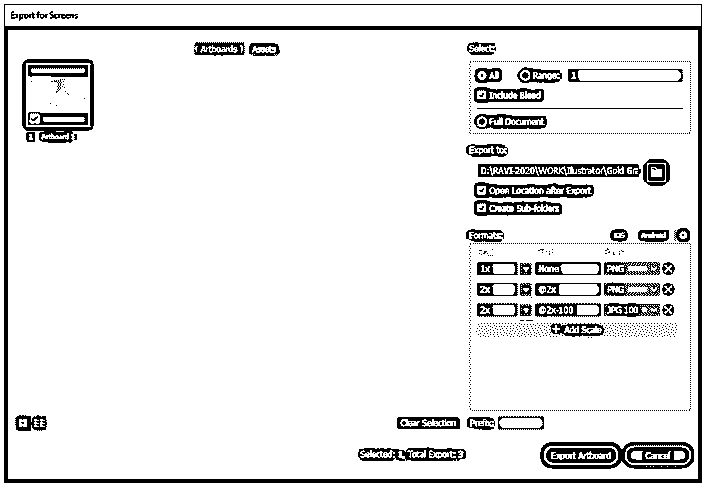

#### 第 41 步

这是最终的渲染。

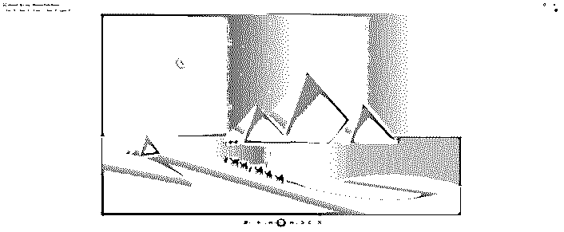

### 结论

在本文中，我们不仅学习了如何在 Adobe illustrator 中创建金色渐变，还学习了使用各种工具(如图层、蒙版、渐变、钢笔工具)来创建惊人的艺术作品的技巧，这将丰富您的知识以及您的作品集。

### 推荐文章

这是一个 Illustrator 黄金渐变的指南。在这里，我们讨论如何开始与黄金梯度随着步骤和各自的截图，以更好地理解。您也可以看看以下文章，了解更多信息–

1.  [在 Illustrator 中创建表格](https://www.educba.com/create-table-in-illustrator/)
2.  [Illustrator 中的霓虹灯效果](https://www.educba.com/neon-effect-in-illustrator/)
3.  Illustrator 中的[滤镜](https://www.educba.com/filters-in-illustrator/)
4.  [Illustrator 中的画笔](https://www.educba.com/brushes-in-illustrator/)

