# 安装 Maya

> 原文：<https://www.educba.com/install-maya/>

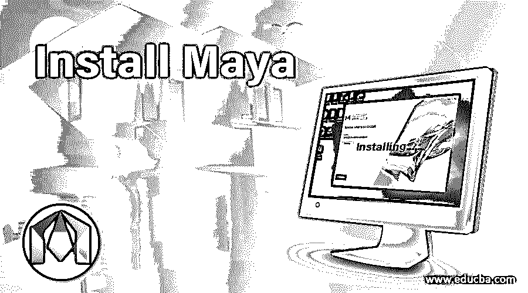

## 什么是 Autodesk Maya？

Autodesk Maya 通常简称为 just Maya，是一种运行在 Windows、macOS 和 Linux 上的 3D 计算机图形应用程序，最初由 Alias Systems Corporation(以前的 Alias|Wavefront)开发，目前由 Autodesk 拥有和开发。它用于为交互式 3D 应用程序(包括视频游戏)、动画电影、电视剧和视觉效果创建资源。

### 安装 Maya 的先决条件

**1。**Maya 的安装可以通过首先从他们的网站下载设置来开始。根据操作系统和语言下载所需版本的产品后，您将获得安装所需的序列号和产品密钥。

<small>3D 动画、建模、仿真、游戏开发&其他</small>

**2。**将向您注册的 AutoDesk 帐户 id 发送一封电子邮件，其中包含所需的产品和许可详细信息。

在安装之前，还要确保您满足如下最低系统要求。

*   **CPU:** 多核内置 AMD 处理器(64 位)。
*   **显卡:**任何 Maya 认证或 Maya 测试卡。
*   **RAM:** 8 GB 的 RAM(建议 16 GB 以上)。
*   **硬盘:** 4 GB 空闲磁盘空间安装。
*   **指点设备:**三键鼠标。

请检查是否有任何其他未挂起的应用程序安装之前的重新启动。它被挂起，然后重新启动计算机。

### 安装类型

以下是四种安装类型:

*   **单一安装:**这种类型的安装需要独立许可证，我们将在本文中讨论这种类型。
*   **单一安装网络:**这种类型的安装需要许可证服务器模型，以便安装在网络中的多台计算机上。在网络许可服务器模型中，根据所使用的服务器数量，也有一个单独的、分布式的和冗余的许可服务器。
*   **虚拟安装:**虚拟安装允许根据单用户访问、多用户访问和网络服务器的订阅在虚拟环境中使用 Maya
*   **试用版:**试用版允许我们运行完整的软件版本，但有一个有限期限的许可证，它可以在一定的天数内使用。您可以订阅试用版或试用版软件。对于学生和教育工作者来说，教育社区网站提供免费软件。

### 如何安装 Maya？

下面我们将逐步了解如何安装 Maya:

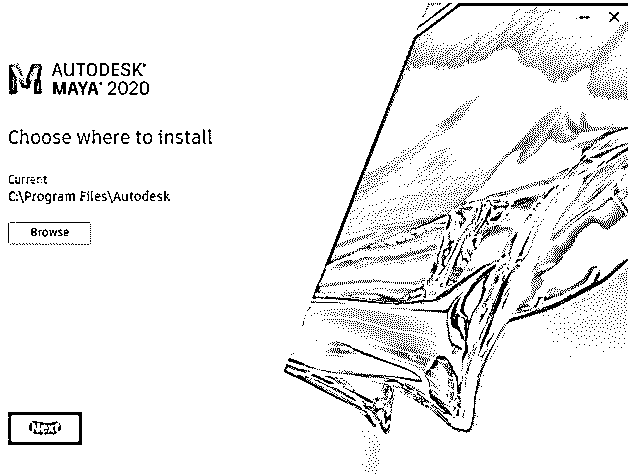

**第一步:**从下载的安装程序开始。准备好安装对话框后，您将看到上面的“选择安装位置”对话框。在这里可以设置安装路径，默认为“C:\Program Files\Autodesk”。假设您安装了任何以前的版本，如 Maya 2019，那么没有必要卸载它，因为您可以并排运行多个版本的 Maya。此外，安装后，您可以选择继续使用以前版本的配置和设置。

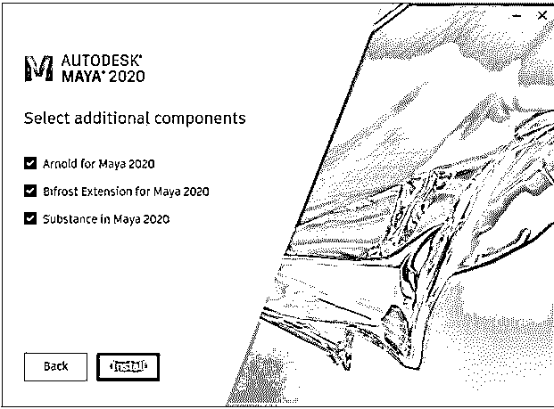

**第二步:**接下来可以选择附加组件，分别是 Arnold 渲染器、Bifrost 扩展、substance。

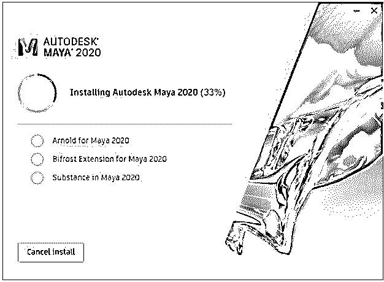

**第三步:**点击安装后，应用程序将随所选组件一起安装。安装需要 10-20 分钟，取决于系统和网络速度。

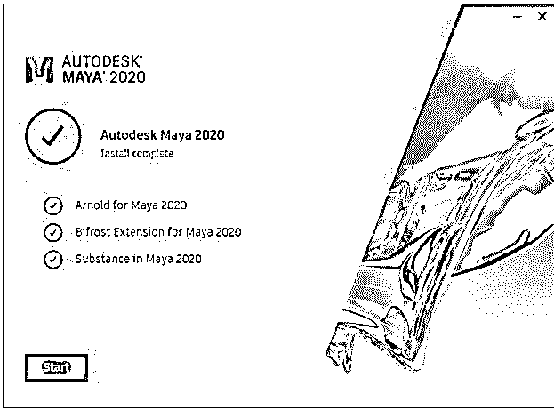

**第四步:**安装成功后，点击开始，会出现选择单用户或多用户的选项。根据所购买的许可证，您可以进行相应的选择。

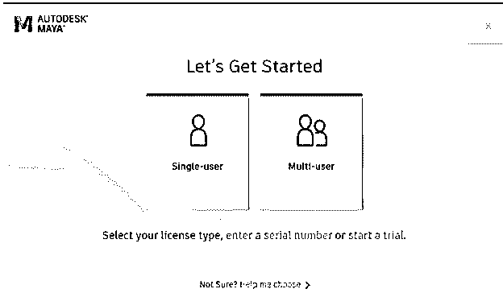

**步骤 5:** 然后，您需要使用 Autodesk 帐户登录。因此，在下一个屏幕中输入您的电子邮件 id 和密码。

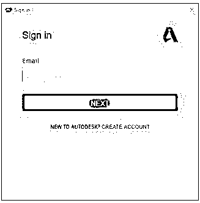

**步骤 6:** 此时，如果您尚未购买许可证，您可以选择开始试用，这将启动该应用程序，但您可以使用 30 天。如果您已经购买了许可证，您可以单击“已经拥有许可证？”

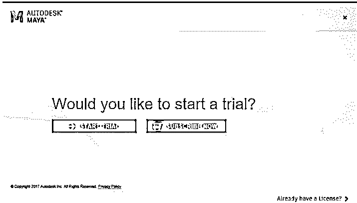

**第 7 步:**接下来，您将看到一份 Autodesk 隐私声明，声明了其条款和条件以及如何使用您的个人信息。

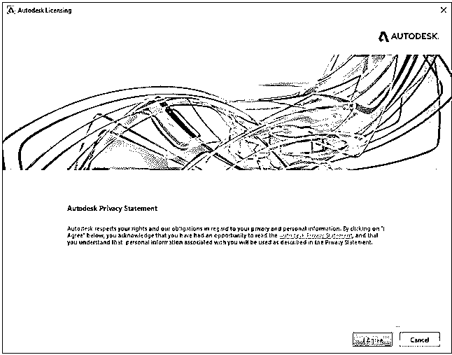

**步骤 8:** 接受 Autodesk 隐私政策后，您有两个选择:

*   **运行:**这种情况下可以使用 Maya 30 天，与试用版相同。
*   **激活:**在这种情况下，您可以使用该软件的完整版本，直到您的许可证到期。

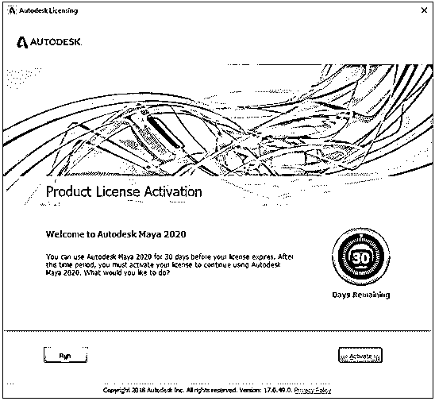

**步骤 9:** 现在，激活时会提示您添加序列号和产品密钥。

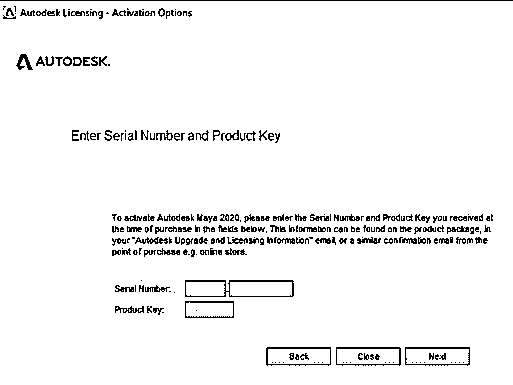

**步骤 10:** 按照您将收到的来自 Autodesk 的电子邮件的格式，其中将包含产品密钥和序列号。

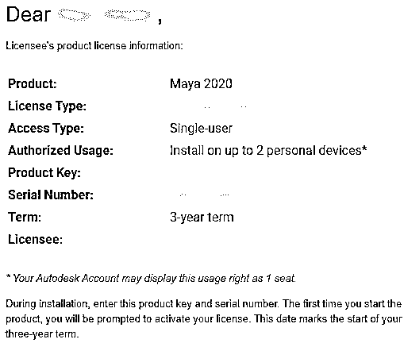

**第十一步:**添加正确信息后，您的激活就成功了。

**第十二步:**激活成功后，会创建一个桌面图标，“Maya 2020”。双击它将打开应用程序，显示以下欢迎屏幕。

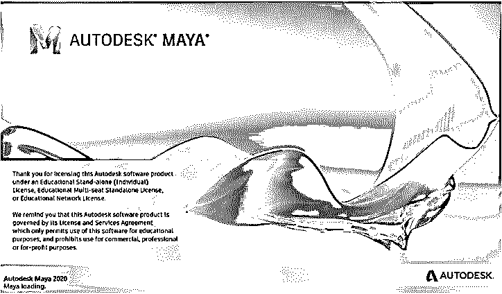

**第十三步:**最后，你会得到你的应用的主界面。祝贺您，您已经成功安装了 Autodesk Maya 2020。

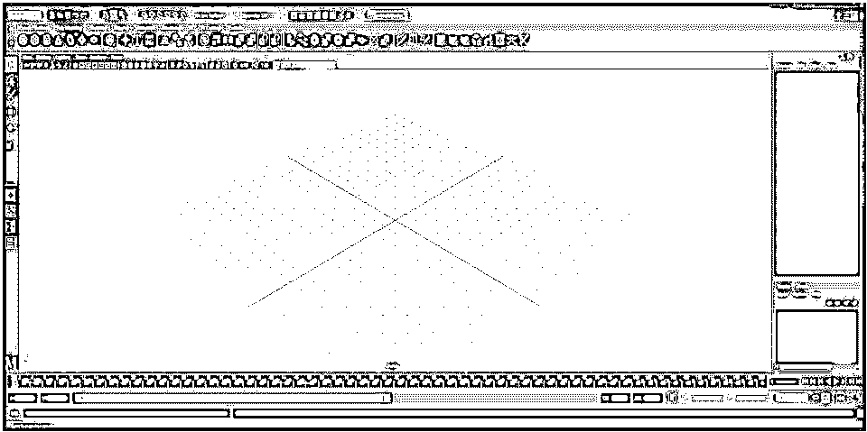

### 安装问题疑难解答

*   AutoCAD for Mac 与 Mac OS X v10.13.x (High Sierra)兼容。
*   错误:“”。尝试安装 Autodesk 2016/2015 或更早版本的产品时,“未安装. NET 4.5”。
*   安装 Autodesk 软件期间出现错误 1603。
*   安装 Autodesk 产品时出现错误 1606。
*   如何移除并重新安装 Microsoft Visual C++运行时库。
*   Revit:未安装模板和族。
*   2016 年或更新的程序安装中 Mac 安装 SSO 错误。
*   下载和安装期间的通信失败消息。
*   错误:“系统无法打开指定的设备或文件”。
*   错误:“产品下载包含多个文件…”。
*   错误:安装程序遇到错误，无法启动 NetSession 客户端。

如果在安装过程中出现上述任何错误，以下是一些故障排除指南:

*   检查您是否安装了兼容的 Mac OS X 版本。
*   需要下载和安装。微软网站的. Net 版本。
*   执行干净卸载以删除任何残留的文件和文件夹。如果以前的应用程序卸载失败，请尝试使用 Microsoft Fixit 工具。

### 激活问题疑难解答

*   不需要序列号–只需登录(Autodesk ID 许可)。
*   激活向导显示错误。
*   错误:“序列号无效”。
*   错误 10:已达到激活限制。
*   由于错误 10，无法激活产品。
*   立即注册(产品激活向导)仅显示两个单选按钮。
*   激活期间的序列号错误。

如果在安装过程中出现上述任何错误，以下是一些故障排除指南。启用对下列域的 HTTP(端口 80)和 https(端口 443)访问:

*   *.virtualearth.net
*   *.cloudfront.net
*   *.google-analytics.com
*   *.akamaiedge.net
*   *.amazonaws.com
*   *.getsatisfaction.com
*   * .autocadws.com 网站
*   *.akamaintechnologies.com
*   *.msecnd.net
*   *.microsoft.com
*   *.google.com
*   *.edgekey.net
*   *.newrelic.com
*   *.velasystems.com
*   *.nr-data.net
*   *.autodesk.com
*   序列号中可能有打印错误，或者序列号不再有效，或者序列号对于此特定产品无效，因为 Autodesk 有多个产品，或者您已超过激活限制。

### 结论–安装 Maya

因此，总结来说，我们已经安装了 Autodesk Maya 2020 以及系统要求、下载和激活程序，并使一切正常运行。因此，玛雅准备创作一些令人惊叹的艺术品、模型和动画。

### 推荐文章

这是安装 Maya 的指南。在这里，我们讨论下载和先决条件的玛雅和步骤安装最新版本的玛雅 2020。您也可以浏览我们的其他相关文章，了解更多信息——

1.  [安装 Adobe Premiere Pro](https://www.educba.com/install-adobe-premiere-pro/)
2.  [安装 Adobe Creative Cloud](https://www.educba.com/install-adobe-creative-cloud/)
3.  [什么是 Autodesk Maya？](https://www.educba.com/what-is-maya/)
4.  [概念和重要的 Maya 插件](https://www.educba.com/maya-plugins/)

