# Maya 工具

> 原文：<https://www.educba.com/maya-tools/>

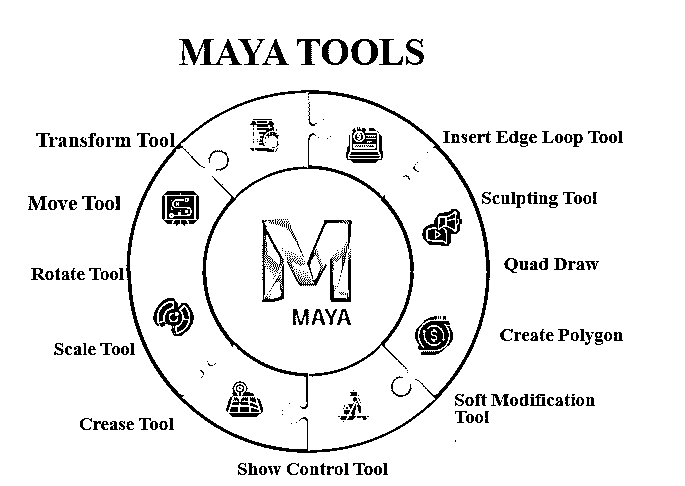

## Maya 工具简介

Autodesk 是业界领先的制作复杂 3D 模型的软件。一旦掌握了 Maya 的工具，设计任何东西都没有限制。本文将讨论用于轻松有效地创建模型的重要 Maya 工具。为了在建模中实现特定的效果，Maya 提供了许多方法。一旦人们习惯了软件，他们会根据自己的技能和舒适度使用不同的工具。然而，作为一个初学者，在进一步提高之前，你需要练习一些基本的工具。在这些基本工具的帮助下，你可以创造出令人惊叹的 3d 模型。

### Maya 工具

以下是 Maya 中的一些顶级工具，可帮助您满足建模需求。

<small>3D 动画、建模、仿真、游戏开发&其他</small>

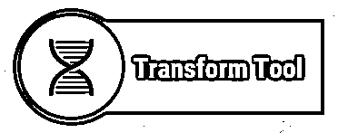

#### 1.变换工具

使用 Maya 时，变换是您需要知道的第一件事。要更改项目的变换，工具箱中可用的工具有选择、移动、旋转和缩放。在移动、旋转或缩放模式下，您可以使用变换工具。它们的热键分别是 w、e 和 r。通过单击并拖动选定的对象，可以自由移动或旋转它们。如果您选择了一个特定的手柄，那么该操作仅限于该轴。可以双击工具箱图标来访问上面的移动、旋转和缩放工具选项。

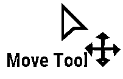

#### 2.移动工具

移动工具位于工具箱中。要使用它，首先选择一个需要移动的对象。选择它后，您将看到一个带有四个手柄的控制器。它们用于沿每个轴移动对象，一个用于沿平面移动。此外，当您选择一个手柄时，颜色会发生变化以指示它处于活动状态。默认情况下，颜色为黄色。

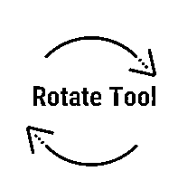

#### 3.旋转工具

旋转工具用于在所有三个轴上旋转对象。选择工具箱中可用的旋转工具，然后选择需要旋转的对象。现在你会注意到四个环的颜色与 XYZ 轴相协调。虚拟球体也与环一起显示。你可以通过颜色的变化来识别所选的戒指。若要执行受约束的旋转，请使用 X，Y，Z 环。为了根据视图旋转，使用外圈。当您开始旋转对象时，应用程序会根据对象的边界框旋转它。如果需要以固定的增量旋转，可以使用“捕捉”选项。例如，如果您将旋转角度设置为 15 度，那么您可以轻松地按照 30 度、45 度、60 度和 90 度的顺序旋转对象，以获得更好的对称性。只能从操纵器的轴控制柄使用捕捉。

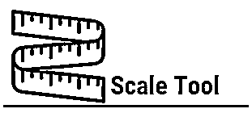

#### 4.缩放工具

利用缩放工具，通过在三个测量值中均匀缩放来改变项目的尺寸。同样，在任何给定时刻，你都可以在一个维度上不均衡地缩放。捕捉工具盒中的缩放工具符号，然后选择需要缩放的项目。Maya 显示了由四个控制柄组成的缩放控制器。

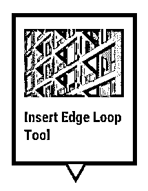

#### 5.插入循环边工具

插入循环边工具是 Maya 中最重要的建模工具之一。使用它，可以在网格中创建连续细分(循环边)，从而提高其分辨率。

#### 6.折痕工具

折痕工具用于通过修改多边形网格来硬化或平滑多边形网格。它的工作原理是对多边形网格的边和顶点进行折痕处理。但是，这对分辨率没有影响。您可以从网格工具转到该选项。“折痕工具”也有一个简单的快捷键:Shift +右键单击对象。

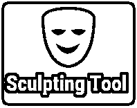

#### 7.雕刻工具

顾名思义，雕刻工具允许您在 3D 中雕刻数字表面，类似于粘土雕刻。过程类似，但只是用多边形代替粘土。网格工具下的雕刻工具选项中有多个雕刻选项。

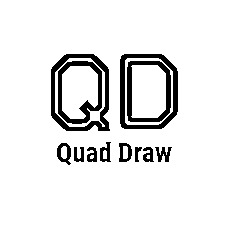

#### 8.四方抽屉

对于创建拓扑网格非常有用，用户可以以自然的方式建模。它提供了一个简化和简单的工作流程。当您手动创建干净的网格时，可以保留参考曲面。

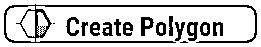

#### 9.创建多边形

如果需要生成单独的多边形，可以利用这个名为的选项来创建多边形。可以通过从场景视图插入顶点来创建新的多边形。

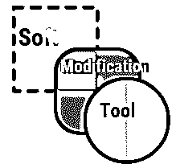

#### 10.软修改工具

该工具允许用户推拉几何图形。默认情况下，标准设置在推/拉的中心具有最大变形量。数量从中心向外递减。根据您的需要，您可以设置变形级别来创建不同类型的效果。该工具可用于多边形，NURBS，拱门，粒子或任何有组件的项目。

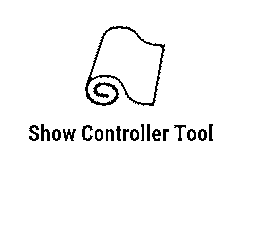

#### 11.显示控制器工具

此工具可用于修改过程的构建历史或对象的属性。它用于了解已创建项的输入节点。一次将有多个操纵器可供使用。这是了解需要处理的特定对象的构建历史的有效方法。

### 结论

本文讨论了 Maya 中用于创建具有所需功能的对象和角色的有用工具。如果你是 Maya 初学者，建议逐个使用每个工具，比较了解它的特性。根据工作的性质，工具的使用会有所不同。选择与创建所需效果和属性最相关的工具。如果需要任何 Maya 工具的更多信息或帮助，还可以参考在线教程和资源。

### 推荐文章

这是玛雅工具的指南。在这里，我们讨论了 Maya 建模所需的概念和一些顶级工具。您也可以浏览我们推荐的其他文章，了解更多信息——

1.  [玛雅自由吗？](https://www.educba.com/is-maya-free/)
2.  [玛雅动画](https://www.educba.com/maya-animation/)
3.  [Maya 中的索具](https://www.educba.com/rigging-in-maya/)
4.  [Maya 渲染设置](https://www.educba.com/maya-render-settings/)

