# 在 Maya 中渲染

> 原文：<https://www.educba.com/rendering-in-maya/>

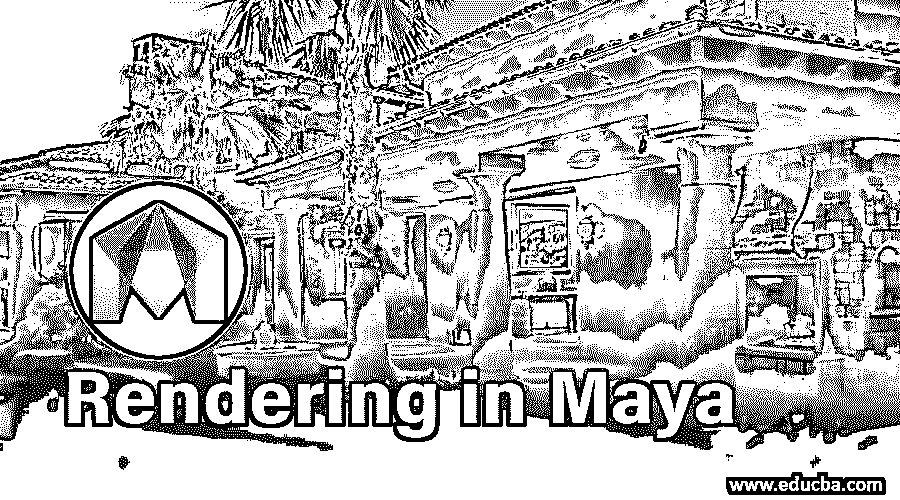

## Maya 中渲染概述

*   在本文中，我们将会看到一个关于 Maya 渲染的概要。Maya 软件是 Autodesk 开发的最流行的动画软件。它帮助一个在动画电影、视频游戏、电视节目、视觉效果等领域工作的专业人士。，创建 3D 模型和动画。用这个软件可以很容易地制作复杂的动画。使用该软件制作的渲染图像看起来像实时图像。建筑使用 Maya 软件创建详细的形状计划和内部组件。
*   该软件的开发始于 1998 年，当时 Alias Wavefront 发布了第一个版本。之后，Maya 于 2005 年被 Autodesk 收购，并更名为“Autodesk Maya”。当它最初发布时，它被用于为电影行业创建图形，并因其在 Rango 和 Hugo 中的工作而获得奥斯卡奖。它还因其视频电影《使命召唤》和《光环》而闻名。在 Maya 嵌入式语言(MEL)和 Python 脚本的帮助下，用户可以通过编程复杂和重复的任务来利用 Maya 开放架构。
*   该软件的基本工具有变换工具、移动工具、旋转工具。缩放工具、插入循环边工具、折痕工具、雕刻工具、四边形绘制、创建多边形、软修改工具、显示控制器工具等。这里我们关心的是如何使用 Maya 软件创建任何渲染[。我们可以使用 Maya 软件](https://www.educba.com/install-maya/)创建对象、场景并渲染这些[。](https://www.educba.com/maya-bonus-tools/)

### 使用 Maya 软件渲染对象

Maya 提供了一个很好的建模系统，叫做 NURBS(非均匀有理 B 样条)。这个系统不是关于一起创建对象。它从曲线和曲面而不是固定的多边形创建对象。为了渲染任何物体，我们需要给任何物体添加颜色、材质、纹理和闪电。为此，请遵循以下步骤。

**步骤 1:** 首先，在 Maya 中导入或设计对象。导入模型后，保持“全部着色”和“着色线框”勾选。

<small>3D 动画、建模、仿真、游戏开发&其他</small>

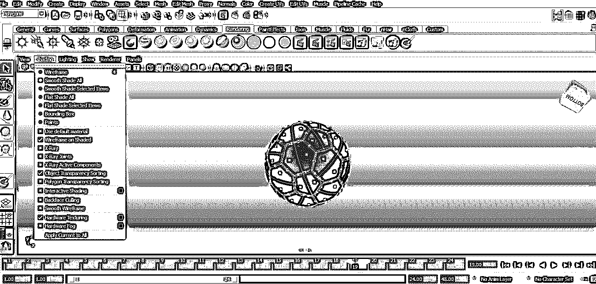

**第二步:**现在，我们要在一个物体上添加素材；为此，右键单击一个对象，将出现一个弹出窗口，从弹出菜单中单击分配新材料。

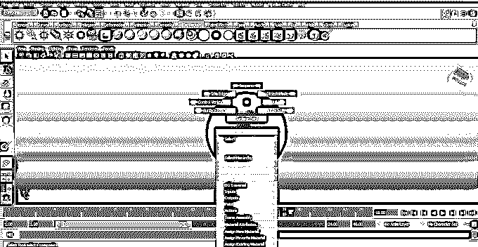

**步骤 3:** 现在从弹出窗口中选择合适的材料。这里我们从列表中选择了 Phong。

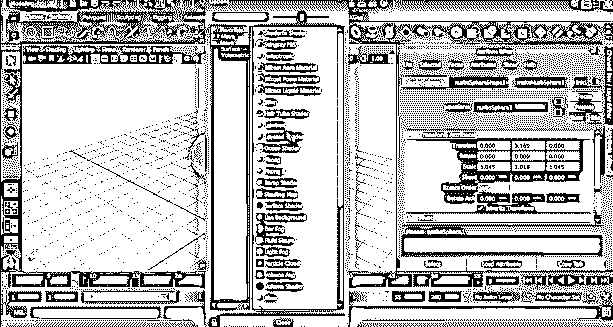

**第四步:**出现属性列表。从列表中选择合适的属性，如颜色、透明度等。

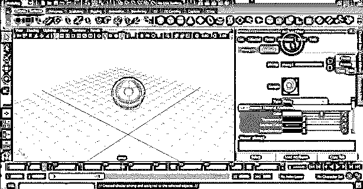

我们将根据需要选择颜色。我们可以根据自己的意愿拖动颜色列表进行更改。

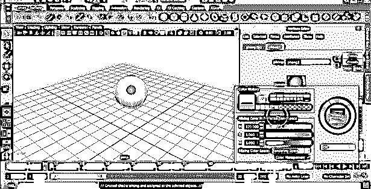

**第五步:**现在，我们可以通过点击颜色框的右侧来给物体添加纹理。

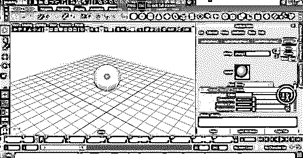

将出现一个弹出窗口，从出现的窗口中选择合适的纹理。

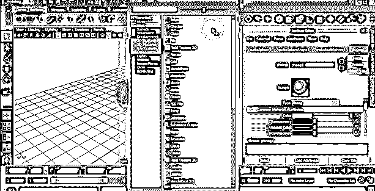

步骤 6: 这里，我们选择了一个格子作为物体的纹理。

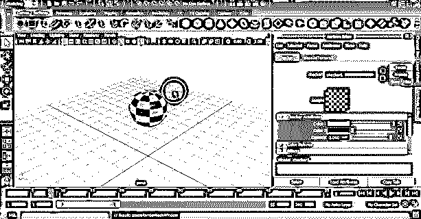

我们也可以通过点击颜色并选择合适的颜色来改变纹理的两种颜色。

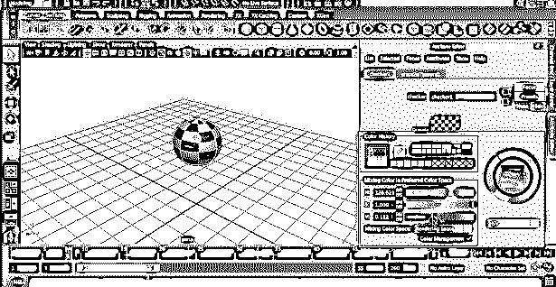

**步骤 7:** 我们也可以从菜单栏上出现的工具栏中为对象选择合适的阴影和光照。

**第八步:**下一步是给物体添加一个摄像头，对其进行光照，以获得一个质量较好的渲染视图。为此，点击创建>相机>相机。

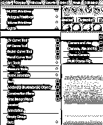

**步骤 9:** 这将自动允许在您的屏幕上打开相机。

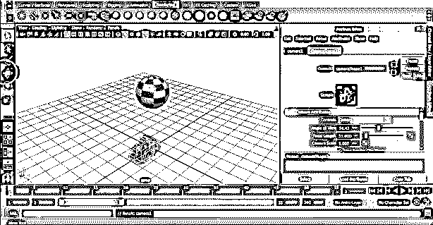

**步骤 10:** 现在，我们可以通过将摄像机平移到 x、y 和 z 轴来选择合适的位置。

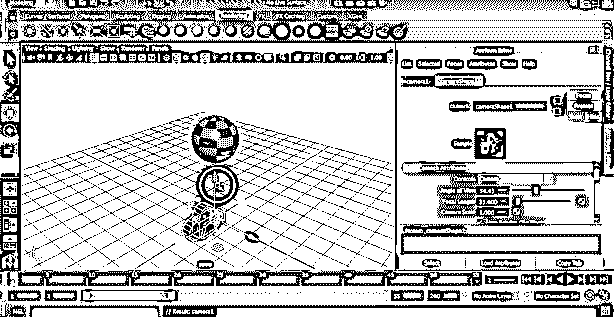

**第 11 步:**我们也可以根据物体位置将其绕 3 轴旋转。

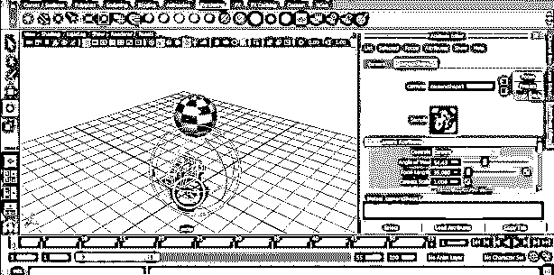

我们也可以调整相机的大小以获得合适的渲染。

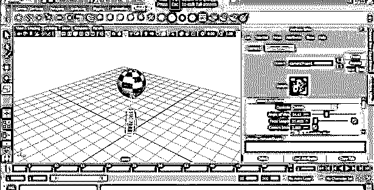

**步骤 12:** 现在，我们将通过点击出现在屏幕顶部的打开渲染视图图标来渲染视图。

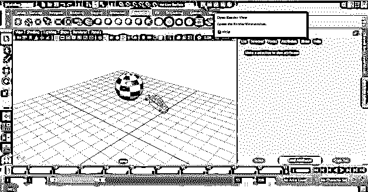

带有对象的渲染窗口将出现在您的屏幕上。

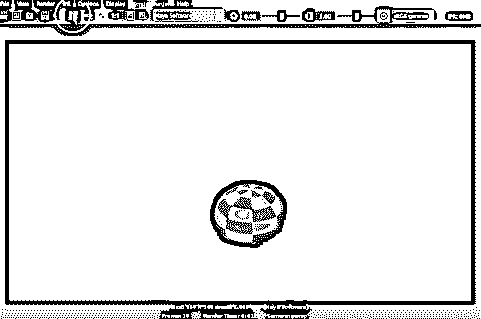

**步骤 13:** 现在，我们将根据我们的要求更改渲染设置。为此，单击渲染窗口中出现的“显示渲染设置”图标。

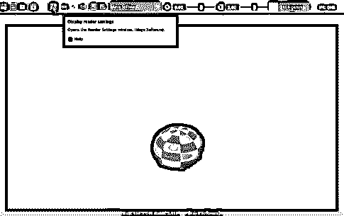

**步骤 14:** 屏幕上会出现渲染弹出窗口，改变渲染设置。

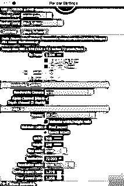

文件保存在正确的位置，相应的图像格式为 jpeg 或任何其他图像格式。

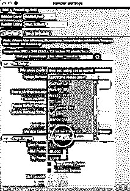

第 15 步:我们还可以改变相机聚焦物体的方式。为此，我们可以更改它的视图，如前视图、俯视图、侧视图和透视图。我们还可以根据像素来改变渲染图像的大小。

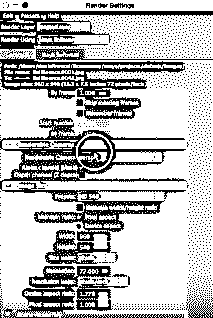

我们也可以用这个软件改变我们需要的图像质量。由于渲染工具需要大量时间，RAM 和内存会生成一个渲染图像，并从出现的窗口中选择合适的图像质量。

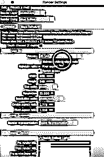

**步骤 16:** 现在，我们将转到出现在常用设置旁边的 Maya 软件。我们可以根据用户要求将质量更改为自定义、预览质量、中间质量、制作质量、自定义敏感质量和 3D 运动模糊制作。

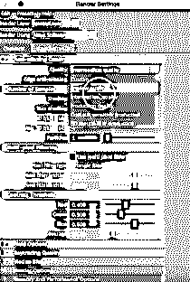

**第十七步:**现在，把流程改成渲染。通过这样做，所有的渲染工具都会出现在你的窗口上。

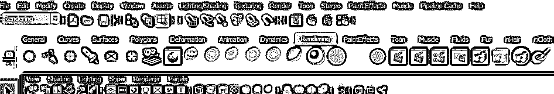

**第 18 步:**最后一步是点击渲染按钮，用上面的设置开始并完成任务。

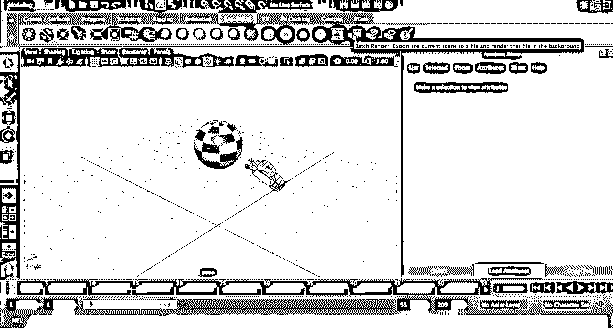

可以从图像的保存位置检查最终渲染的图像。

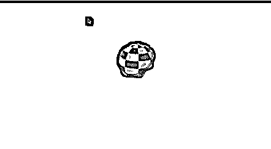

### 结论

上面，我们已经解释了如何使用 Maya 软件创建基本渲染。我们还可以通过控制帧速度来使用渲染图像创建完整的动画。对象的外部环境也起着重要作用，因此选择合适的环境亮度和对比度来创建任何渲染图像。

### 推荐文章

这是在 Maya 中渲染的指南。在这里，我们还讨论了介绍以及使用 Maya 软件渲染任何对象的步骤。您也可以浏览我们的其他相关文章，了解更多信息——

1.  [Maya 中最好的 11 个工具](https://www.educba.com/maya-tools/)
2.  【Maya 的键盘快捷键
3.  [六大重要 Maya 插件](https://www.educba.com/maya-plugins/)
4.  [Maya 2019 有什么新功能？你一定要试试！](https://www.educba.com/new-features-in-maya-2019/)
5.  [3ds Max 软件中样条的教程](https://www.educba.com/spline-in-3ds-max/)
6.  [如何增强 Maya 渲染设置？](https://www.educba.com/maya-render-settings/)

