# Maya 奖励工具

> 原文：<https://www.educba.com/maya-bonus-tools/>

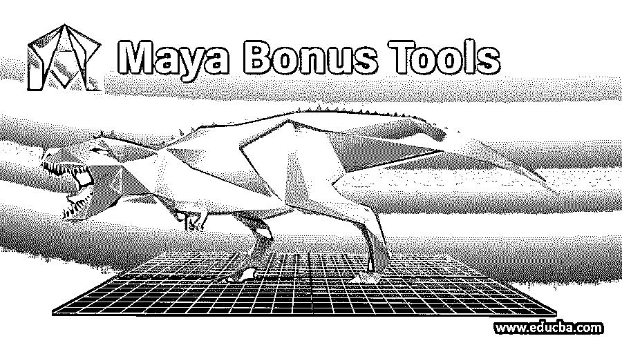

## Maya 奖励工具简介

Maya Bonus Tools 是一个免费的脚本和插件集合。安装奖励工具后，主 Maya 菜单的末尾会出现一个下拉菜单。Maya 奖励工具的设计和组织方式增加了标准 Maya 菜单集。每个菜单都有一个子菜单，可以像标准 Maya 菜单一样分离和浮动。通过选择网格、边、面或顶点并按住 Shift+RMB，您可以在不中断工作流程的情况下获得对建模功能的上下文敏感的访问。

### Autodesk Maya 奖励工具

以下几点详细解释了 Maya 软件中的奖金工具功能:

<small>3D 动画、建模、仿真、游戏开发&其他</small>

#### 编辑

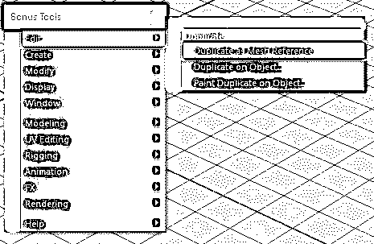

##### 1 个副本作为网格参考

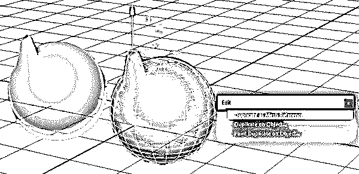

您可以选择一个或多个对象来应用它。将创建一个“单向”实例。因此，对原始对象所做的任何拓扑更改都将传播到副本，因为它是一个网格引用，并且它们是链接的，因为这是单向的，所以对副本所做的更改不会影响原始网格。

##### 2.对象上的重复

该工具可用于在选定对象上选定组件或随机组件的位置创建选定对象的重复实例或副本。

有 3 种方法可以将对象对齐到组件，这将把对象复制到给定的顶点/边/面。

*   **Orient:** 对象将被旋转以与组件的法线对齐。
*   **约束:**对象也将被约束在该点和法线上。
*   **父对象:**对象将成为所选目标组件的变换/对象的父对象。

##### 3.在对象上绘制副本

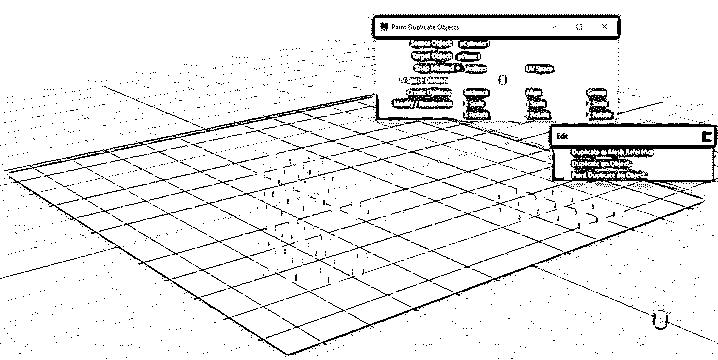

选择源对象和目标对象。现在可以在目标对象上绘制源对象了。例如，源是一片树叶，目标是一棵树。然后可以将源绘制在目标上。修饰键更改工具的行为，因为绘制时 CTRL 将删除现有的重复对象，但仅当工具处于活动状态时。如果该工具退出并再次启动，它将不会删除以前放置的对象。该移动将改变对象的现有副本的旋转或缩放。

放置对象时，可以选择顶点捕捉和 UV 捕捉。顶点捕捉将查看目标对象的顶点。对于更精细的放置，可以使用 UV 空间捕捉，但需要目标对象的干净和均匀的 UV，该模型才能工作。

#### 创造

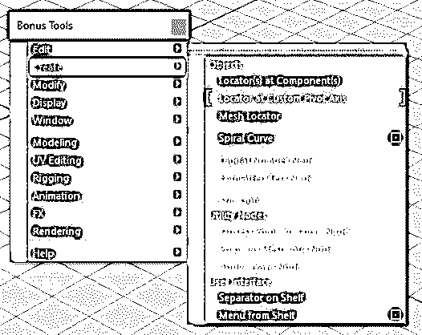

##### 1.组件上的定位器

在所选边、顶点或面的中心点创建一个新定位器。

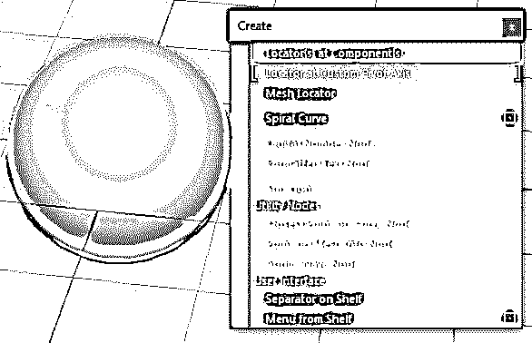

##### 2.自定义枢轴上的定位器(新)

在当前活动轴上创建一个新定位器。如果设置了自定义枢轴，定位器将获得自定义旋转和枢轴位置。

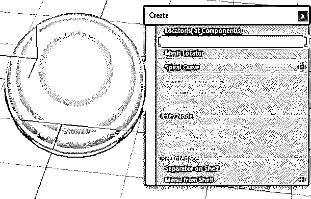

##### 3.网格定位器(已更新)

将创建一个类似于定位器的网格对象。它有一个可以改变和渲染的厚度。它还可以变换、缩放和旋转。最小值的长度和宽度精度为 0.01。

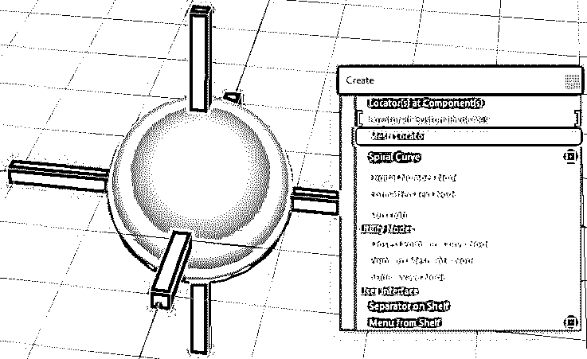

##### 4.螺线

可以创建弹簧形状的曲线。您可以控制高度、半径和圈数。要更改扭曲的方向，请输入一个负数。

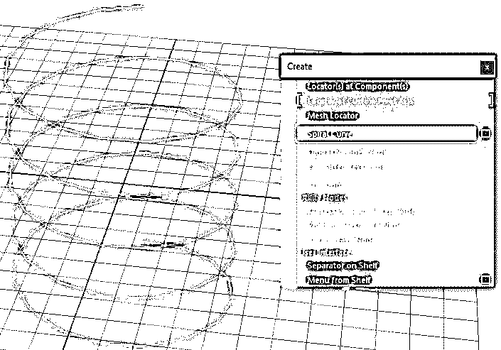

##### 5.数字节点

在视窗中以数字读数的形式显示数值。数字的外观可以使用它们的属性来优化。

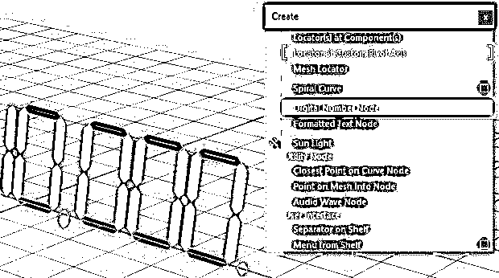

**Note:** For this to work, the PolyTools.mll plug-in needs to be loaded.

##### 6.格式化文本节点

从视口的输入值创建日期或时间格式作为 3d 文本。

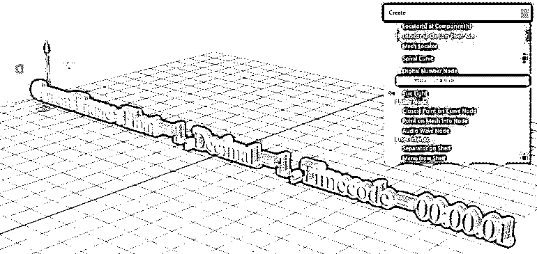

**Note:** For this to work, the stringFormatNode.mll plug-in needs to be loaded.

##### 7.日光

使用附加控制属性(如纬度、经度、一年中的日期和时间)创建类似太阳的平行光，以模拟太阳。

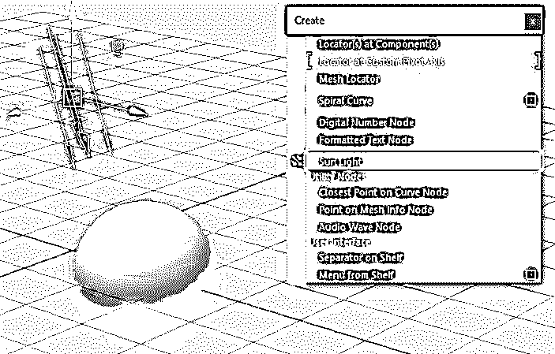

**Note:** For this to work, the sun.mll plug-in needs to be loaded

##### 8.曲线节点上最近的点

该插件从 NURBS 曲线和世界空间位置获取输入，并计算输入曲线上距离输入位置最近的点。除了“法线”，“切线”，“U 参数”和“离输入位置最近距离”也被返回。

**Note:** For this to work, the closestPointOnCurve.mll plug-in needs to be loaded.

##### 9.网格信息节点上的点

它通过输入面索引、U 参数和 V 参数来计算世界空间位置和法线，并返回多边形网格上的一个点。

**Note:** For this to work, the pointOnMeshInfo.mll plug-in needs to be loaded.

##### 10.音频波节点

这将创建一个输出声音节点振幅的节点:

要使用:

首先，将声音文件加载到 Maya 中。转到奖金工具->创建音频波节点

然后输入以下 MEL 命令之一:

*   setAttr audio wave 1 . audio-type " string " " sound file "；
*   connectAttr soundNode.filename audioWave1.audio;

之后，输入以下 MEL 命令:

*   connect attr time 1 . out time audio wave 1 . input；

最后，输入以下 MEL 命令:

*   connect attr audio wave 1 . output object . attribute；

audioWave 节点有两个属性，可让您缩放采样振幅:

*   **样本:**该属性决定计算平均值和计算振幅需要多少样本。这个大的数字需要很大的量来检测振幅的变化。
*   **Scale:** 该属性是结果振幅的比例因子，范围在-1 到+1 之间

##### 11.架子上的分离器

可视分隔符用于组织货架。以前，此功能只能通过 MEL 命令使用。此工具将在当前活动的工具架上创建一个分隔符。您可以根据需要在搁板上创建任意数量的隔板。MMB 可用于在分离器之间移动项目。可以从工具架编辑器中删除它们。

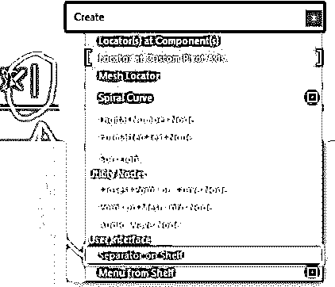

##### 12.货架上的菜单

此选项会将指定的工具架转换为下拉菜单，它将出现在顶部主菜单的末尾。该菜单仅在当前 Maya 会话期间有效，如果 Maya 重新启动，该菜单将会消失。若要删除菜单，必须使用 deleteUI 命令或重新启动 Maya。如果您创建了一个名为 testing self 的菜单，您将执行此 MEL 命令-> deleteUI main _ testing self _ Menu；

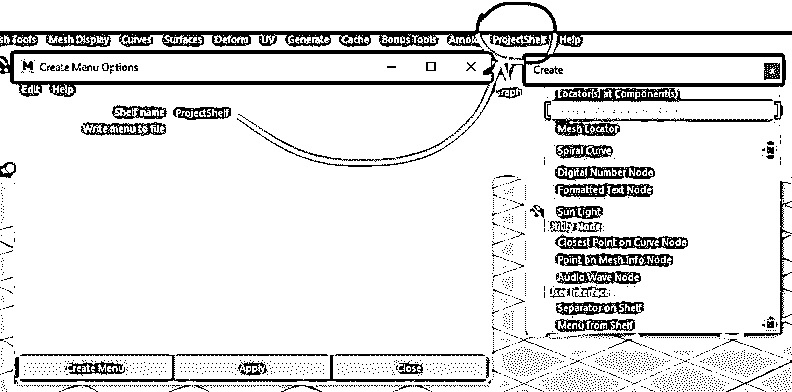

### 推荐文章

这是一个玛雅奖金工具指南。在这里，我们讨论如何在奖金工具中编辑和创建菜单，创建复制对象，并创建定位器和螺旋曲线。您也可以浏览我们的其他相关文章，了解更多信息——

1.  [Maya 的免费替代品](https://www.educba.com/maya-alternatives/)
2.  【Maya 有哪些顶级插件？
3.  [建模所需的 12 大 Maya 工具](https://www.educba.com/maya-tools/)
4.  【Maya 的重要快捷键
5.  [Maya 渲染设置指南](https://www.educba.com/maya-render-settings/)

